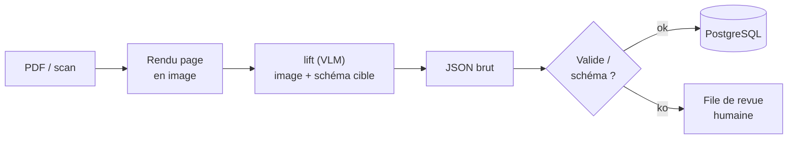

# IA — Détail du dimanche 21 juin 2026

## 1. datalab-to/lift — un VLM open pour extraire du JSON depuis tes PDF

**Source :** Hugging Face — https://hf.co/datalab-to/lift
**Date :** 19 juin 2026

### Contexte

Extraire des champs d'une facture, d'un bon de commande ou d'un relevé reste un cauchemar backend. Le combo classique — OCR (Tesseract) puis regex et heuristiques de position — casse au moindre changement de gabarit. `datalab-to/lift` attaque le problème autrement : un seul **modèle vision-langage** (~9,6 Md de paramètres, base `qwen3_5`, licence OpenRAIL) qui lit la **page rendue en image** et produit directement des **données structurées en JSON**. L'éditeur, datalab, est l'équipe derrière **Marker** (PDF→Markdown) et **Surya** (OCR multilingue) : du vécu en document AI, pas un side-project.

### Comment ça marche

Le pipeline tient en quatre temps. Tu rends chaque page PDF en image (PDF n'est pas du texte fiable : positions et polices mentent). Tu passes l'image **plus un prompt décrivant le schéma cible** au modèle. Le VLM « voit » la mise en page — colonnes, tableaux, libellés — et **génère du texte contraint** au format JSON demandé. Tu **valides** ce JSON contre ton schéma avant de l'écrire en base. La différence clé avec l'OCR : le modèle raisonne sur la **structure visuelle**, donc un tableau désaligné ou un champ déplacé reste correctement rattaché à son libellé.



L'étape `image-text-to-text` est exactement le type de tâche déclaré sur la fiche du modèle : entrée image + texte, sortie texte (ici, du JSON).

### En pratique — exemple de code

Inférence type avec `transformers`, en imposant le schéma directement dans la consigne.

```python
# Extraction d'une facture en JSON structuré avec datalab-to/lift
from transformers import AutoProcessor, AutoModelForVision2Seq
from PIL import Image
import torch, json

model_id = "datalab-to/lift"
processor = AutoProcessor.from_pretrained(model_id, trust_remote_code=True)
model = AutoModelForVision2Seq.from_pretrained(
    model_id, torch_dtype=torch.bfloat16, device_map="auto", trust_remote_code=True
)

page = Image.open("facture_001.png")          # PDF rendu en image au préalable
schema = '{"invoice_no": str, "total_ttc": float, "due_date": "YYYY-MM-DD"}'
prompt = f"Extract the fields as strict JSON matching: {schema}"

inputs = processor(images=page, text=prompt, return_tensors="pt").to(model.device)
out = model.generate(**inputs, max_new_tokens=512)
raw = processor.decode(out[0], skip_special_tokens=True)

data = json.loads(raw)                          # À valider ensuite (pydantic, JSON Schema…)
print(data["invoice_no"], data["total_ttc"])
```

Le point important : **tu ne fais jamais confiance au JSON brut**. Tu le valides (pydantic côté Python, ou un JSON Schema côté .NET) avant insertion.

### Pourquoi ça compte pour toi

Tu peux remplacer un pipeline OCR + regex fragile par un service auto-hébergé qui crache un schéma prêt à mapper sur tes entités .NET ou Doctrine. Pas d'API tierce, pas de coût par page, et tes documents sensibles ne sortent pas de ton infra. Tu gardes la main sur la validation et le fallback humain. Idéal pour un microservice d'ingestion documentaire derrière une file.

### Points de vigilance | Limites

Un VLM **peut halluciner** un champ absent : impose toujours une validation de schéma et une voie de revue humaine sur les cas douteux. 9,6 Md de paramètres demandent un **GPU** (≈ 20 Go en bf16, moins en quantifié) — vérifie la sortie d'un build GGUF si tu vises le CPU. Enfin la licence **OpenRAIL** porte des clauses d'usage : relis-la avant un déploiement commercial.
