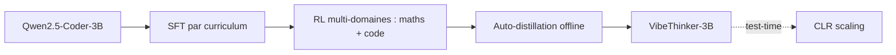
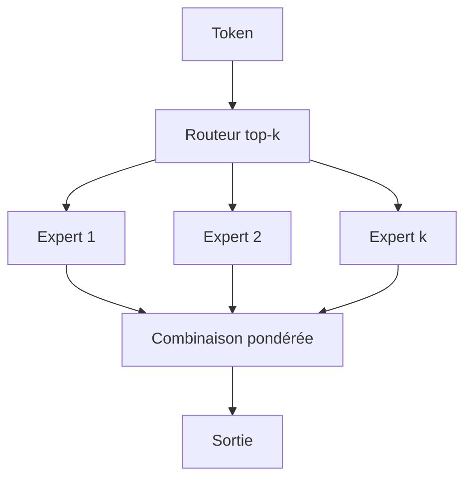
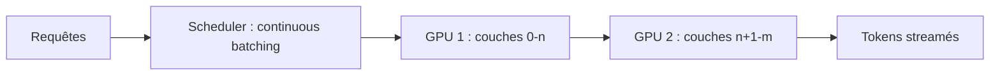

# IA — Détail du lundi 22 juin 2026

## 1. VibeThinker-3B — un 3B dense qui raisonne au niveau des modèles frontières

**Source :** arXiv (Sina Weibo AI) — https://arxiv.org/abs/2606.16140
**Date :** 16 juin 2026

### Contexte

VibeThinker-3B est un modèle dense de 3 milliards de paramètres publié par l'équipe IA de Sina Weibo, dérivé de `Qwen2.5-Coder-3B`. Sa thèse est provocante : un petit modèle peut atteindre le raisonnement de systèmes 100× plus gros si le post-entraînement est bien conçu, pas le pré-entraînement. Le pari se concentre sur les domaines **vérifiables** — mathématiques et code — où une réponse se contrôle automatiquement, donc se récompense proprement en apprentissage par renforcement.

Les chiffres expliquent le bruit communautaire. Le modèle annonce 94,3 sur AIME26, 80,2 Pass@1 sur LiveCodeBench v6, et 76,4 sur IMO-AnswerBench. Cette fourchette frôle DeepSeek V3.2 (671B) et GLM-5 (744B). D'où un débat sain : un 3B peut-il vraiment égaler un 700B, ou les benchmarks saturent-ils ? La réponse nuance l'enthousiasme : la performance est réelle sur tâches vérifiables, moins sur le savoir ouvert.

### Comment ça marche

Le cœur est le paradigme **Spectrum-to-Signal (SSP)**. L'intuition : d'abord maximiser la *diversité* des solutions correctes, ensuite amplifier le *signal* gagnant. On évite ainsi l'effondrement de diversité classique du RLHF, où le modèle se fige sur une seule façon de répondre.

Étape 1 — **SFT par curriculum** : on entraîne sur des problèmes triés du plus simple au plus dur, en gardant volontairement plusieurs chemins de résolution par problème. Le modèle apprend un *spectre* de stratégies, pas une recette unique.

Étape 2 — **RL multi-domaines** : un apprentissage par renforcement sépare maths et code, avec une récompense binaire « réponse vérifiée ». Le signal correct est renforcé sans écraser le spectre appris.

Étape 3 — **auto-distillation offline** : le modèle régénère ses meilleures traces, puis se ré-entraîne dessus. Cela condense le signal dans les 3B de poids.

Au moment de l'inférence, une stratégie nommée **CLR (Claim-Level Reliability)** vérifie chaque affirmation atomique de la réponse et fait remonter le score (94,3 → 97,1 sur AIME26).



### En pratique — exemple de code

Le modèle s'utilise comme un Qwen standard via `transformers`. On garde une température haute pour exploiter le spectre appris, puis on vérifie.

```python
# Inférence VibeThinker-3B sur un problème de maths vérifiable
from transformers import AutoModelForCausalLM, AutoTokenizer

model_id = "WeiboAI/VibeThinker-3B"
tok = AutoTokenizer.from_pretrained(model_id)
model = AutoModelForCausalLM.from_pretrained(model_id, device_map="auto")

prompt = "Combien de diviseurs positifs a 2026 ? Détaille le raisonnement."
ids = tok.apply_chat_template(
    [{"role": "user", "content": prompt}],
    add_generation_prompt=True, return_tensors="pt").to(model.device)

# température haute = on exploite la diversité héritée du SSP
out = model.generate(ids, max_new_tokens=2048, temperature=0.8, top_p=0.95)
print(tok.decode(out[0][ids.shape[1]:], skip_special_tokens=True))
```

### Pourquoi ça compte pour toi

Un raisonneur 3B tient sur un seul GPU modeste, voire en local. Pour toi, ça veut dire un agent maths/code embarquable dans un pipeline .NET ou un microservice, sans facture d'API ni fuite de données. Reste prudent : la force est sur tâches vérifiables, pas sur la connaissance générale. Idéal en validateur ou en sous-agent spécialisé, pas en assistant généraliste.

### Pour aller plus loin

Poids et carte du modèle : https://huggingface.co/WeiboAI/VibeThinker-3B

---

## 2. poolside Laguna M.1 + XS.2 — coding agentique MoE en poids ouverts Apache 2.0

**Source :** poolside — https://poolside.ai/blog/introducing-laguna-xs2-m1
**Date :** juin 2026 (poids ouverts publiés sur Hugging Face)

### Contexte

poolside, startup d'IA pour le code, ouvre ses deux premiers modèles publics. **Laguna M.1** est un Mixture-of-Experts de 225B paramètres totaux dont seulement 23B actifs par token, entraîné *from scratch* sur 30T tokens avec 6 144 GPU NVIDIA Hopper. **Laguna XS.2** est le petit frère taillé pour l'usage réel : 33B totaux, 3B actifs, pensé pour tenir sur un seul GPU. Les deux ciblent le **coding agentique** (résolution de tickets, usage de terminal), pas le chat.

Les scores les situent dans la cour des sérieux : M.1 atteint 46,9 % sur SWE-Bench Pro et 40,7 % sur Terminal-Bench 2.0 ; XS.2 suit de près à 44,5 % et 30,1 %. Le tout sous licence **Apache 2.0**, checkpoints base *et* post-entraînés disponibles. C'est rare pour un modèle de cette ambition.

### Comment ça marche

L'architecture MoE est la clé du rapport coût/capacité. À chaque token, un **routeur** choisit les *k* experts les plus pertinents parmi des dizaines. Seuls ces experts calculent ; les autres restent inertes. Tu paies donc l'inférence d'un 23B (M.1) ou d'un 3B (XS.2), tout en stockant la capacité d'un très gros modèle.

Le caractère « agentique » vient du post-entraînement sur des **trajectoires d'outils** : éditer des fichiers, lancer des commandes, lire la sortie, corriger. Le modèle apprend la boucle observer→agir→vérifier, pas seulement à produire du texte. C'est ce qui fait la différence sur SWE-Bench, où il faut réparer un dépôt réel.



### En pratique — exemple de code

XS.2 (3B actifs) se sert sur un seul GPU 48 Go en FP8, via vLLM, avec une API compatible OpenAI.

```bash
# Servir Laguna XS.2 localement en FP8
vllm serve poolside/Laguna-XS.2 --quantization fp8 --max-model-len 65536
```

```python
# Boucle de coding agentique minimale (API compatible OpenAI)
from openai import OpenAI
client = OpenAI(base_url="http://localhost:8000/v1", api_key="local")

r = client.chat.completions.create(
    model="poolside/Laguna-XS.2",
    messages=[{"role": "user",
               "content": "Refactore ce repo C# en async/await et explique le diff."}],
)
print(r.choices[0].message.content)
```

### Pourquoi ça compte pour toi

Un modèle de code agentique en Apache 2.0 que tu héberges toi-même change la donne : ton code propriétaire ne quitte plus ton réseau. XS.2 tient sur un GPU, donc déployable en CI ou sur un poste dev. Tu gagnes un assistant SWE sans dépendance à une API tierce ni quota. Évalue-le sur ton propre dépôt avant d'y croire.

---

## 3. vLLM 0.23.0 — CUDA 13.0 par défaut, maturité Qwen3.6 et pipeline-parallel

**Source :** vLLM (GitHub Releases) — https://github.com/vllm-project/vllm/releases
**Date :** 13 juin 2026

### Contexte

vLLM est devenu le moteur de référence pour servir des LLM en production, grâce à PagedAttention et au *continuous batching*. La 0.23.0 succède à la 0.22.0 (EAGLE 3.1, couverte le 8 juin). Le changement structurant : les binaires officiels passent à **CUDA 13.0 par défaut**, débloquant les noyaux optimisés pour Blackwell. Au menu aussi : maturité Qwen3.5/3.6, quantification FP8 affinée et améliorations du parallélisme par pipeline.

### Comment ça marche

Deux mécanismes portent le débit. **PagedAttention** gère le cache KV comme la mémoire virtuelle d'un OS : par pages, sans gaspillage, ce qui permet d'empiler beaucoup de requêtes. Le **continuous batching** injecte une nouvelle requête dès qu'une autre libère une place, au lieu d'attendre un lot complet.

Pour les gros modèles, deux découpages coexistent. Le **tensor-parallel** scinde chaque couche entre GPU. Le **pipeline-parallel**, amélioré ici, place des *blocs de couches* sur des GPU différents : le GPU 1 calcule les premières couches, passe l'état au GPU 2, etc. C'est plus efficace quand les GPU sont reliés par un lien plus lent que NVLink.



### En pratique — exemple de code

On met à jour, puis on sert un GLM-5.2 en FP8 réparti sur deux GPU en pipeline.

```bash
pip install -U "vllm==0.23.0"   # binaires CUDA 13.0 par défaut

# GLM-5.2-FP8 sur 2 GPU, découpage par pipeline, contexte long
vllm serve zai-org/GLM-5.2-FP8 \
  --pipeline-parallel-size 2 \
  --max-model-len 200000
```

### Pourquoi ça compte pour toi

Si tu auto-héberges les nouveaux open-weights (GLM-5.2, Laguna, VibeThinker), vLLM 0.23 est ta couche de service. CUDA 13 + FP8 réduisent la VRAM et augmentent le débit sur matériel récent. Le pipeline-parallel te laisse servir un gros modèle sur plusieurs GPU modestes plutôt qu'un seul monstre. Vérifie la compatibilité de tes pilotes CUDA avant la montée de version.

### Points de vigilance

Le saut CUDA 13.0 peut casser des images Docker figées sur CUDA 12. Teste l'image en staging avant prod.
