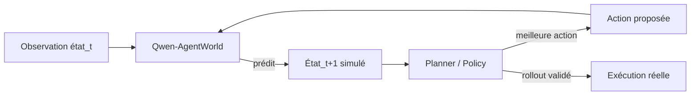
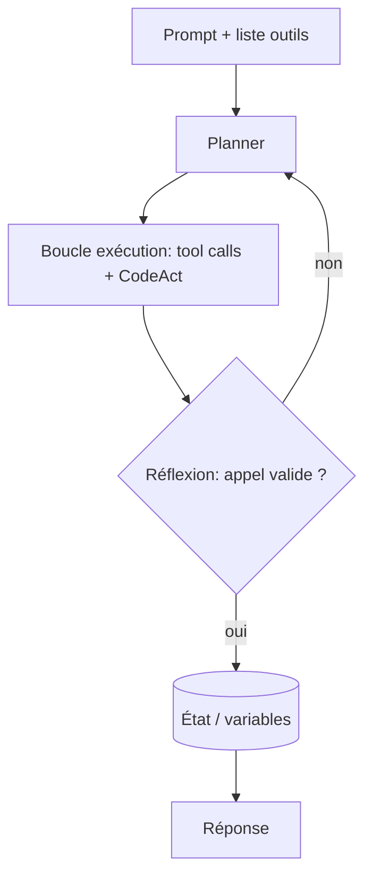
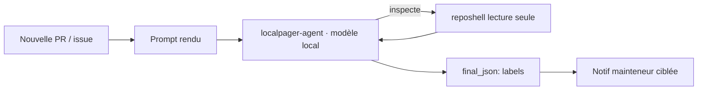

# IA — Détail du mercredi 24 juin 2026

## 1. Qwen-AgentWorld — les premiers « language world models » open pour agents

**Source :** Hugging Face Papers (Qwen) — https://huggingface.co/papers/2606.24597
**Date :** 23 juin 2026 (paper #1 du jour le 24 juin)

### Contexte

Un agent qui planifie a besoin d'anticiper : « si je lance cette commande, dans quel état sera mon environnement ? ». Aujourd'hui, il le découvre en exécutant réellement l'action, puis en lisant l'observation. C'est lent, coûteux et risqué quand l'action touche un vrai terminal ou un dépôt.

Qwen propose une autre voie : un **world model** textuel qui *simule* la réponse de l'environnement. Le papier introduit `Qwen-AgentWorld-35B-A3B` et `Qwen-AgentWorld-397B-A17B`, premiers modèles à simuler des environnements agentiques sur **7 domaines** (MCP, Search, Terminal, SWE, Android, Web, OS) via du long chain-of-thought. Poids et benchmark sont ouverts sur le Hub (`Qwen/Qwen-AgentWorld-35B-A3B`, dataset `Qwen/AgentWorldBench`).

### Comment ça marche

Un world model apprend la **dynamique de transition** : donné un état observé et une action, il prédit le prochain état. Ici l'état et l'action sont du texte (sortie terminal, appel d'outil MCP, page web), donc un LLM peut jouer ce rôle.

L'entraînement se fait en trois étapes sur plus de 10 M de trajectoires d'interaction réelles. Le **CPT** (continual pre-training) injecte la capacité générique de modélisation du monde à partir des dynamiques de transition. Le **SFT** active le raisonnement de « prédiction du prochain état ». Le **RL** affine la fidélité de simulation avec des récompenses hybrides (rubric + règles), qui notent si l'état simulé colle au réel.

Deux usages en découlent. Comme **simulateur découplé**, il génère des milliers d'environnements pour entraîner d'autres agents en RL, sans payer le coût d'environnements réels. Comme **modèle de fondation d'agent**, l'entraînement world-model sert de *warm-up* qui améliore les perfs en aval sur 7 benchmarks. Sur AgentWorldBench, le 397B marque **58,71**, devant GPT-5.4 (58,25).



### En pratique — exemple de code

Le modèle s'utilise comme un LLM de chat : tu lui donnes l'état courant plus l'action, il « joue » l'environnement et renvoie l'observation suivante.

```python
# Simuler la sortie d'une commande terminal SANS l'exécuter pour de vrai
from transformers import AutoModelForCausalLM, AutoTokenizer

tok = AutoTokenizer.from_pretrained("Qwen/Qwen-AgentWorld-35B-A3B")
model = AutoModelForCausalLM.from_pretrained(
    "Qwen/Qwen-AgentWorld-35B-A3B", torch_dtype="auto", device_map="auto")

prompt = """[DOMAIN] Terminal
[STATE] cwd=/srv/app ; git status -> branche main, 1 fichier modifié
[ACTION] git commit -am "fix: null ref"
[PREDICT] observation suivante ?"""

ids = tok(prompt, return_tensors="pt").to(model.device)
out = model.generate(**ids, max_new_tokens=256)  # CoT puis état simulé
print(tok.decode(out[0], skip_special_tokens=True))
```

### Pourquoi ça compte pour toi

Tu construis des agents qui touchent du code, des shells, des API ? Un world model te laisse faire du *dry-run* : tester un plan d'action en simulation avant de l'exécuter sur ta prod. C'est aussi un générateur d'environnements pour entraîner ou évaluer tes agents sans monter une infra de bac à sable coûteuse. Le tout en poids ouverts, donc auto-hébergeable.

### Pour aller plus loin

Variante FP8 déjà publiée par la communauté (`lovedheart/Qwen-AgentWorld-35B-A3B-FP8`). Code et recette d'entraînement : https://github.com/QwenLM/Qwen-AgentWorld

---

## 2. CUGA (IBM) — un *harness* d'agent où tu n'écris qu'outils + prompt

**Source :** Hugging Face Blog (IBM Research) — https://huggingface.co/blog/ibm-research/cuga-apps
**Date :** 23 juin 2026

### Contexte

Monter un agent, c'est surtout de la plomberie : client de modèle, adaptateurs d'outils, boucle de planification, suivi d'état, garde-fous, passage d'un agent à plusieurs. La partie intéressante — *quoi* faire faire à l'agent — arrive en dernier.

IBM inverse l'ordre avec **CUGA** (*Configurable Generalist Agent*), un harness open source installable via `pip install cuga`. Le harness prend en charge la plomberie ; toi, tu fournis seulement la **liste d'outils** et le **prompt**. Pour le prouver, IBM publie `cuga-apps` : deux douzaines d'applis mono-fichier (FastAPI) enroulant chacune un `CugaAgent`, du recommandeur de films au conseiller d'archi IBM Cloud.

### Comment ça marche

Un *framework* te donne des briques à assembler ; un *harness* te livre l'assemblage et tu le configures. CUGA planifie avant d'agir, puis exécute en mélangeant appels d'outils et code généré (**CodeAct**). Sur une tâche longue de vingt étapes, ce qui casse la plupart des agents, c'est de perdre les résultats intermédiaires et de les re-dériver faux. CUGA tient cet état et lance une **étape de réflexion** qui rattrape un mauvais appel et re-planifie.

Tu règles le compromis coût/latence par config — modes *Fast*, *Balanced*, *Accurate* — sans toucher au code. L'exécution de code tourne dans le sandbox que tu choisis (local, Docker/Podman, E2B). Parce que le harness porte la planification et la correction, un modèle open-weight plus petit suffit : les applis hébergées tournent sur `gpt-oss-120b`, pas une API frontière.



### En pratique — exemple de code

Toute l'appli tient dans un `CugaAgent` : des outils plus des instructions. Les outils MCP, OpenAPI et fonctions LangChain se branchent de la même façon.

```python
from cuga import CugaAgent
from langchain_core.tools import tool
from _mcp_bridge import load_tools

@tool
def search_ibm_catalog(query: str) -> str:
    """Cherche un service dans le catalogue IBM Cloud (le docstring = quand l'appeler)."""
    ...  # hit l'API catalogue, renvoie du JSON

def make_agent():
    web_tools = load_tools(["web"])            # outil MCP partagé, rien à héberger
    return CugaAgent(
        tools=[search_ibm_catalog, *web_tools],  # un outil à toi + le reste emprunté
        special_instructions="Cherche le catalogue avant de nommer un service ; "
                              "n'invente jamais de nom de service.")

# await make_agent().invoke("Conçois une archi pour une API à fort trafic")
```

### Pourquoi ça compte pour toi

Si tu envisages un agent côté backend, CUGA t'évite de réécrire la boucle planning/réflexion/état à chaque fois. Tu exposes tes API existantes (OpenAPI ou MCP) comme outils, tu écris un prompt en étapes ordonnées, et tu changes de provider (watsonx, Ollama, OpenAI) via une variable d'env. Bonus : un modèle local plus petit devient viable, donc tu gardes la main sur les coûts et la souveraineté.

---

## 3. Triage local de PR — Gemma et Qwen classent les issues d'OpenClaw « gratuitement »

**Source :** Hugging Face Blog — https://huggingface.co/blog/local-models-pr-triage
**Date :** 22 juin 2026

### Contexte

Le dépôt OpenClaw reçoit des centaines d'issues et PR par jour, à trier, prioriser et router vers les mainteneurs. Avec un modèle fermé (GPT-5, Opus), c'est trivial mais cela consomme du quota — et juin 2026 a rappelé qu'un modèle propriétaire peut disparaître du jour au lendemain. D'où l'idée : faire ce tri avec des **modèles open-weight locaux**, en temps réel, pour le seul coût de l'électricité.

L'auteur dispose d'un NVIDIA GB10 (128 Go de mémoire unifiée). Objectif : un système de notification quasi instantané qui ne le ping que sur les issues dont il est responsable.

### Comment ça marche

On définit un **ensemble fini de labels** (`local_models`, `self_hosted_inference`, `acp`, `agent_runtime`, `codex`, `ui_tui`…). Un modèle local classe chaque issue dans ces catégories, via des **structured outputs** (sortie JSON contrainte) — différent d'un classifieur BERT, car le modèle peut *raisonner* et même inspecter le code.

Le harness utilisé est `pi` (packagé en `localpager-agent`). L'agent reçoit titre, corps et un extrait tronqué du diff. Il peut appeler un outil shell en lecture seule, ou l'outil `final_json` pour rendre sa classification. Le piège : donner un `bash` complet à un modèle pilotant un flux à fort débit ouvre la porte à l'**injection de prompt** (une issue piégée détourne le modèle). La parade est `reposhell` : un shell bridé qui n'autorise que des opérations en lecture (`ls`, `find`, `cat`, `grep`) sur le dépôt. Le modèle croit utiliser `bash`, mais tout le reste est refusé.



### En pratique — exemple de code

`reposhell` rejette tout ce qui n'est pas en lecture seule ; le modèle peut lire le dépôt pour lever un doute, sans risque d'effet de bord.

```bash
# Session reposhell : le modèle inspecte, mais curl/écriture sont bloqués
reposhell /repo/openclaw> cat extensions/kimi-coding/package.json
{ "name": "@openclaw/kimi-provider", ... }      # -> c'est un provider Kimi
reposhell /repo/openclaw> curl localhost
reposhell policy denied command: unsupported command "curl"

# Lancement du triage sur une PR (Gemma 4 ou Qwen3.6 en local, 100s de tok/s)
localpager-agent \
  --model "qwen3.6-35b-a3b" \
  --reposhell-socket "reposhell.sock" \
  --reposhell-default-repo "openclaw" \
  -p "$(cat rendered-prompt.md)"     # -> renvoie final_json {labels: [...]}
```

Dans un cas réel, `qwen3.6-35b-a3b` partait sur le label `coding_agent_integrations` (à cause du chemin `extensions/kimi-coding`), a lu le `package.json` via `reposhell`, puis a corrigé en `inference_api` + `tool_calling`. La lecture du dépôt évite une mauvaise classification.

### Pourquoi ça compte pour toi

Tu peux remplacer un appel cloud par un modèle local sur du tri à fort volume : labellisation d'issues, routage de tickets, classification de logs. Deux leçons transposables à ton backend : contraindre la sortie en JSON pour une intégration fiable, et n'exposer à un LLM que des outils **en lecture seule** sandboxés, car toute entrée externe est une surface d'injection de prompt.
