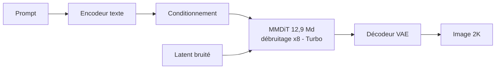

# IA — Détail du jeudi 25 juin 2026

## 1. Krea-2 (Raw + Turbo) — un text-to-image open-weight 12,9 Md, 2K en ~2 s

**Source :** Hugging Face — https://huggingface.co/krea/Krea-2-Turbo
**Date :** 18 juin 2026 (en tête du trending HF cette semaine)

### Contexte

Krea, connu pour ses outils de génération d'images, ouvre les poids de **Krea 2**, sa famille « esthétique d'abord ». Deux checkpoints sortent sur Hugging Face : **Krea-2-Raw**, la base non distillée pensée pour le fine-tuning, le post-training et les LoRA ; et **Krea-2-Turbo**, une version distillée en **8 étapes** pour l'inférence rapide. L'argument fort : du **2K natif en environ 2 secondes** sur du matériel grand public. La licence est « custom » : safeguards obligatoires, et au-delà de 50 sièges, usage entreprise payant. C'est un des rares text-to-image ouverts récents capable de rivaliser en qualité avec le propriétaire.

### Comment ça marche

L'architecture est un **diffusion transformer multimodal single-stream** : 12,9 milliards de paramètres, 28 blocs, largeur 6144. C'est un modèle de **diffusion latente** entraîné de zéro. Le pipeline part d'un encodeur de texte, projette le prompt en conditionnement, puis débruite un latent dans l'espace compressé d'un VAE, avant de décoder en pixels. La nouveauté pratique tient à la **distillation** : Raw a besoin de dizaines d'étapes de débruitage ; Turbo apprend à reproduire le même résultat en 8 étapes seulement, en imitant la trajectoire du modèle enseignant. Moins d'étapes = moins de passages forward = latence divisée, d'où les ~2 s.



### En pratique — exemple de code

Krea-2 s'utilise via `diffusers` avec `Krea2Pipeline` (installe `diffusers` depuis les sources tant que le support n'est pas dans une release). Ce snippet charge Turbo et génère une image 2K en 8 étapes.

```python
import torch
from diffusers import Krea2Pipeline

# Turbo = checkpoint distillé : peu d'étapes, rendu rapide
pipe = Krea2Pipeline.from_pretrained(
    "krea/Krea-2-Turbo", torch_dtype=torch.bfloat16
).to("cuda")

image = pipe(
    prompt="un phare basque dans la brume, lumière dorée, photo argentique",
    num_inference_steps=8,        # la distillation 8 pas, ne pas gonfler
    guidance_scale=1.0,           # Turbo distillé -> CFG bas voire désactivé
    height=2048, width=2048,
).images[0]

image.save("phare.png")
```

### Pourquoi ça compte pour toi

Si ton appli .NET ou Symfony a besoin de visuels générés (vignettes, assets marketing, placeholders), tu peux héberger Krea-2 derrière un microservice Python plutôt que d'appeler une API payante. Turbo rend la latence acceptable en synchrone. Lis la licence : au-delà de 50 sièges, c'est payant, et les safeguards anti-contenus illicites sont contractuels. Raw te sert si tu veux fine-tuner un style maison via LoRA.

### Pour aller plus loin

Le rapport technique détaille l'entraînement et la distillation : https://www.krea.ai/blog/krea-2-technical-report. La page open source compare Raw et Turbo : https://www.krea.ai/krea-2-open-source.
