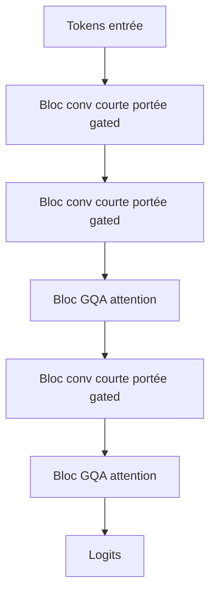
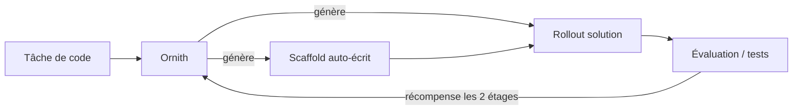

# IA — Détail du vendredi 26 juin 2026

## 1. LiquidAI LFM2.5-230M — un LLM 230M « hybride » taillé pour l'edge

**Source :** Liquid AI (blog officiel) — https://www.liquid.ai/blog/lfm2-5-230m
**Date :** 24 juin 2026

### Contexte

Faire tourner un LLM sans cloud, sur un téléphone ou un Raspberry Pi, reste un casse-tête : la mémoire et la bande passante mémoire sont limitées. Liquid AI vise précisément ce créneau. Son nouveau **LFM2.5-230M** (229,7 M de paramètres) est le plus petit de la famille, pensé pour l'**extraction de données on-device** et les agents embarqués. Annoncé avec un argument fort : il bat des modèles **4× plus gros** sur des tâches d'extraction structurée, tout en tenant dans la RAM d'un mobile. C'est une réponse directe au besoin de latence faible, de confidentialité (rien ne sort de l'appareil) et de coût nul à l'inférence.

### Comment ça marche

La famille LFM repose sur une architecture **non-Transformer**, inspirée des systèmes dynamiques à temps continu. Concrètement, LFM2 est **hybride** : il empile une majorité de blocs de **convolution courte portée « gated »** (mélange de tokens local, coût linéaire en longueur) et quelques blocs d'**attention groupée (GQA)** pour le contexte global. L'idée pédagogique : l'attention complète coûte cher (quadratique), or beaucoup de dépendances linguistiques sont locales. On confie donc le local aux convolutions, bien moins gourmandes, et on réserve l'attention aux rares besoins longue portée. Résultat : un meilleur débit que les hybrides SSM ou les Gated Delta Networks à taille égale, et une fenêtre de **32 000 tokens** — énorme pour un 230M.



Côté chiffres : **213 tok/s** en décodage sur un Galaxy S25 Ultra, **42 tok/s** sur un Raspberry Pi 5. Sur le benchmark d'extraction **CaseReportBench**, il marque **22,51** contre **13,83** pour Qwen3.5-0.8B (deux fois plus de paramètres). Multilingue sur 10 langues, dont le français.

### En pratique — exemple de code

Le modèle est exposé via `transformers` et brille quand tu lui demandes une sortie structurée (JSON) à partir d'un texte libre.

```python
# Extraction structurée on-device avec LFM2.5-230M
from transformers import AutoModelForCausalLM, AutoTokenizer

mid = "LiquidAI/LFM2.5-230M"
tok = AutoTokenizer.from_pretrained(mid)
model = AutoModelForCausalLM.from_pretrained(mid, torch_dtype="auto", device_map="auto")

msg = [{"role": "user", "content":
    "Extrais en JSON {patient, age, diagnostic} de :\n"
    "M. Durand, 67 ans, admis pour insuffisance cardiaque."}]

ids = tok.apply_chat_template(msg, add_generation_prompt=True, return_tensors="pt").to(model.device)
out = model.generate(ids, max_new_tokens=128, temperature=0.1)  # peu de créativité
print(tok.decode(out[0][ids.shape[-1]:], skip_special_tokens=True))
# -> {"patient": "M. Durand", "age": 67, "diagnostic": "insuffisance cardiaque"}
```

### Pourquoi ça compte pour toi

Tu as un pipeline qui parse des documents, des logs ou des formulaires ? Un modèle 230M tournant en local évite l'aller-retour cloud, la facture par token et l'exposition de données sensibles. Embarquable dans un poste, un conteneur léger ou une appli via GGUF/ONNX, il sert d'« extracteur » rapide en pré-traitement avant ton backend .NET. Idéal pour des tâches déterministes et cadrées.

### Pour aller plus loin

Quants GGUF et démo WebGPU disponibles (`webml-community/lfm2-webgpu-kernels`). Détails techniques : arXiv 2511.23404. Carte du modèle : https://huggingface.co/LiquidAI/LFM2.5-230M

---

## 2. DeepReinforce Ornith-1.0 — des modèles de code qui écrivent leur propre scaffold RL

**Source :** MarkTechPost — https://www.marktechpost.com/2026/06/25/deepreinforce-releases-ornith-1-0-an-open-source-coding-model-family-that-learns-its-own-rl-scaffolds/
**Date :** 25 juin 2026

### Contexte

Entraîner un modèle au **coding agentique** par renforcement (RL) suppose en général un *harness* (scaffold) écrit à la main : la tuyauterie qui découpe la tâche, orchestre les appels d'outils et cadre la génération de la solution. Ce scaffold humain est un goulot : il fige la stratégie et demande de l'ingénierie. **DeepReinforce** ouvre **Ornith-1.0**, une famille open-source (licence **MIT**) dont la promesse est d'apprendre à **écrire son propre scaffold**. Quatre tailles : 9B dense, 31B dense, 35B MoE et 397B MoE, construites sur **Gemma 4** et **Qwen 3.5**.

### Comment ça marche

Le RL classique récompense uniquement la **solution** produite par le modèle, à l'intérieur d'un harness figé. Ornith change la cible : à chaque tâche, le modèle génère **deux choses** — le **scaffold** (la stratégie d'orchestration) *et* le **rollout** de solution qui en découle. La récompense, issue de l'évaluation (tests, succès de la tâche), **remonte vers les deux étages**. Le modèle apprend donc non seulement *quoi* répondre, mais *comment s'organiser* pour répondre. C'est une forme de méta-apprentissage : l'orchestration devient une sortie entraînable, pas une contrainte externe.



Les résultats publiés sont sérieux : le flagship **397B** atteint **82,4** sur SWE-Bench Verified et **77,5** sur Terminal-Bench 2.1 ; le **9B** vise **69,4** / **43,1** sur les mêmes bancs. Le **35B MoE** (~3B actifs par token) dépasse les Qwen et Gemma de taille comparable. Tout est en poids ouverts, GGUF compris.

### En pratique — exemple de code

Le 35B MoE n'active que ~3B de paramètres par token : il tient sur un bon workstation en quantification 4 bits, via llama.cpp.

```bash
# 1) Récupérer un quant GGUF (choisis Q4_K_M pour l'équilibre VRAM/qualité)
huggingface-cli download deepreinforce-ai/Ornith-1.0-35B-GGUF \
  --include "*Q4_K_M*.gguf" --local-dir ./ornith

# 2) Serveur OpenAI-compatible : ton IDE/agent tape sur http://localhost:8080
llama-server -m ./ornith/*Q4_K_M*.gguf \
  -c 32768 --port 8080 --jinja        # --jinja = applique le template de chat agentique
```

### Pourquoi ça compte pour toi

Tu veux un agent de code **auto-hébergé** sans dépendre d'une API ? Ornith est en MIT, dispo en GGUF, et le 35B MoE tient sur une machine de dev. L'idée du scaffold auto-écrit réduit l'ingénierie de harness que tu devrais sinon maintenir toi-même. Branche-le derrière une API OpenAI-compatible et teste-le sur tes vrais tickets avant d'investir.

### Limites

Les scores sont annoncés par l'éditeur : valide-les sur ton domaine. Un 35B MoE en Q4 reste lourd à charger ; prévois la VRAM ou un offload CPU. Carte du modèle : https://huggingface.co/deepreinforce-ai/Ornith-1.0-35B
