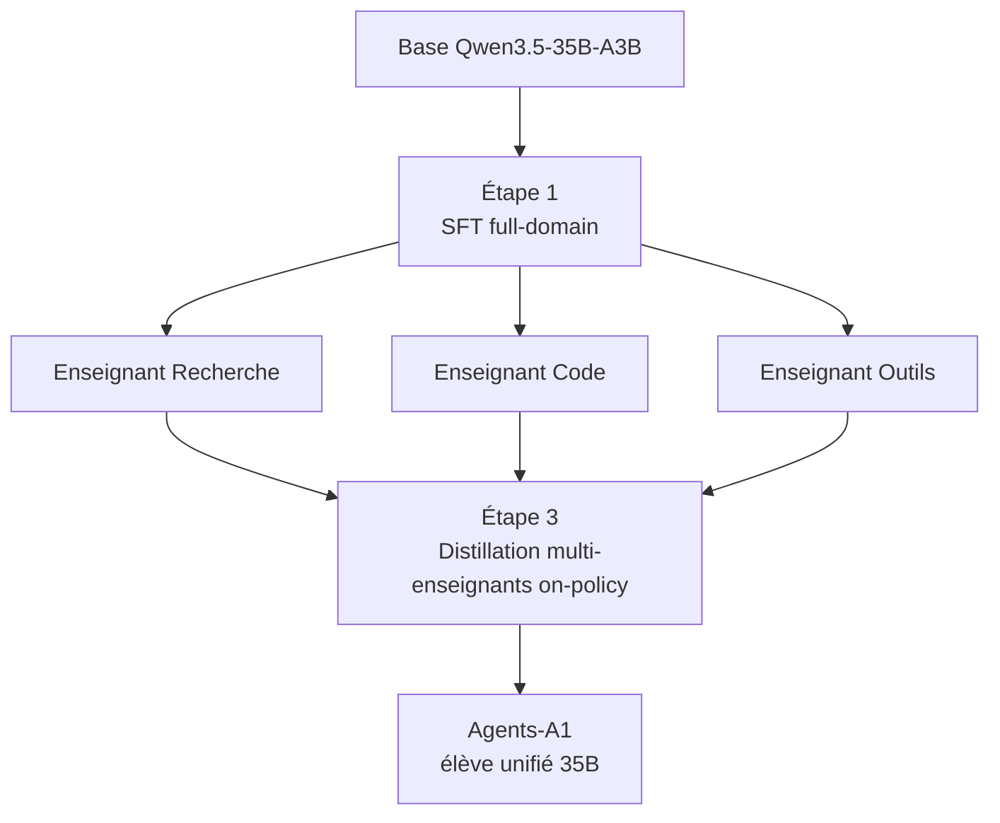

# IA — Détail du mercredi 1er juillet 2026

## 1. Agents-A1 (InternScience) — un 35B MoE agentique qui vise la performance du trillion de paramètres

**Source :** Hugging Face — https://huggingface.co/InternScience/Agents-A1
**Date :** 30 juin 2026

### Contexte

InternScience (Shanghai AI Laboratory) a publié le 30 juin **Agents-A1**, un modèle **agentique open-weight** sous licence **Apache 2.0**. Le pari, résumé par le titre du papier — *« Scaling the Horizon, Not the Parameters »* (arXiv 2606.30616) — inverse la course habituelle : au lieu d'empiler les paramètres, on entraîne un modèle relativement petit à **tenir des tâches longues** (recherche multi-étapes, ingénierie logicielle, appel d'outils).

Le résultat est un **35B MoE** (architecture `qwen3_5_moe`, base Qwen3.5-35B-A3B, ~3B de paramètres actifs par token) qui revendique du **SOTA sur GAIA (96,0) et BrowseComp (75,5)**, en rivalisant avec des systèmes frontière comme GPT-5.5, DeepSeek-V4-Pro ou Kimi-K2.6.

### Comment ça marche

Un modèle **MoE** (Mixture-of-Experts) n'active qu'une fraction de ses poids par token : un routeur choisit quelques « experts » parmi beaucoup. Ici, 35B au total mais ~3B actifs (« A3B ») — coût d'inférence d'un petit modèle, capacité d'un gros.

La vraie recette est l'entraînement en **trois étapes**. D'abord, un **SFT full-domain** aligne un comportement agentique large. Ensuite, on entraîne des **modèles enseignants spécialisés**, chacun expert d'une compétence (recherche web, code, usage d'outils). Enfin — le cœur — une **distillation multi-enseignants on-policy** fusionne tous les enseignants dans un seul élève.

*On-policy* est le mot clé : l'élève génère lui-même ses trajectoires, et chaque enseignant note/corrige les segments de son domaine. Le modèle apprend donc sur **ses propres erreurs en conditions réelles**, pas sur un corpus figé. C'est ce qui muscle la tenue des tâches longues (« l'horizon »).



### En pratique — exemple de code

Chargement via `transformers` et boucle agentique minimale avec un prompt système orienté outils :

```python
from transformers import AutoModelForCausalLM, AutoTokenizer
import torch

model_id = "InternScience/Agents-A1"  # 35B MoE, ~3B actifs, Apache-2.0
tok = AutoTokenizer.from_pretrained(model_id)
model = AutoModelForCausalLM.from_pretrained(
    model_id, torch_dtype=torch.bfloat16, device_map="auto"
)

# Le modèle est entraîné pour raisonner puis appeler des outils (tool-calling)
messages = [
    {"role": "system", "content": "Tu es un agent. Utilise les outils fournis pas à pas."},
    {"role": "user", "content": "Cherche la dernière version de PostgreSQL et résume les nouveautés."},
]
inputs = tok.apply_chat_template(messages, add_generation_prompt=True, return_tensors="pt").to(model.device)
out = model.generate(inputs, max_new_tokens=512)
print(tok.decode(out[0][inputs.shape[1]:], skip_special_tokens=True))
```

Pour de l'inférence servie, un backend type vLLM exposant une API OpenAI-compatible reste le plus simple à brancher sur ta stack.

### Pourquoi ça compte pour toi

Un 35B-A3B qui tient des workflows longs, c'est un agent que tu peux **héberger toi-même** sans cluster hors de prix. Pense triage d'issues, exploration de repo, agents d'astreinte ou recherche interne — sur tes données, sans fuite vers une API tierce. La licence Apache 2.0 autorise l'usage commercial. À tester en POC avant de confier quoi que ce soit de critique : les benchmarks agentiques flattent souvent au-delà du réel.

### Pour aller plus loin | Limites

Papier : https://huggingface.co/papers/2606.30616 · Les scores GAIA/BrowseComp restent des benchmarks ; valide sur tes propres tâches avant tout déploiement.
