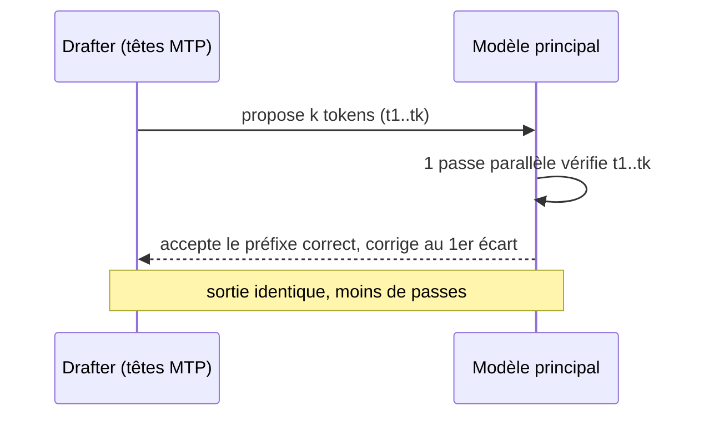
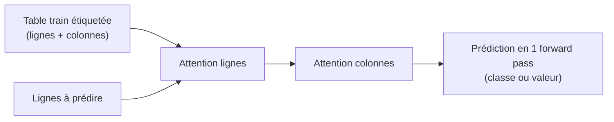
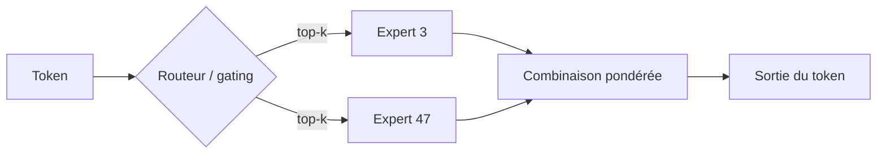

# IA — Détail du vendredi 3 juillet 2026

## 1. Ollama 0.31 — Multi-Token Prediction (MTP) : Gemma 4 jusqu'à 90 % plus rapide sur Apple Silicon

**Source :** Ollama Blog — https://ollama.com/blog/faster-gemma-4-mlx-mtp
**Date :** 1er juillet 2026

### Contexte

Ollama 0.31 active le **multi-token prediction (MTP)** par défaut. Sur Apple Silicon, la génération de Gemma 4 grimpe de près de 90 % dans les benchmarks d'agents de code. La technique est un **décodage spéculatif** intégré : au lieu de produire un token à la fois, le modèle en propose plusieurs d'un coup, puis les vérifie. Point clé : la sortie ne change pas, seul le débit augmente.

### Comment ça marche

Un LLM autorégressif classique génère token par token. Chaque token exige une passe complète (forward pass) sur des milliards de poids. C'est lent, car chaque étape recharge les mêmes matrices depuis la mémoire.

Le MTP casse ce goulot en deux temps. D'abord, un **drafter** rapide — ici des têtes de prédiction supplémentaires du modèle — propose les `k` prochains tokens à faible coût. Ensuite, le modèle principal **vérifie ces `k` tokens en une seule passe parallèle**. Il garde le plus long préfixe qu'il aurait lui-même produit, puis corrige au premier désaccord. Si le drafter voit juste souvent, tu obtiens plusieurs tokens pour le prix d'une passe.

Ollama 0.31 ajoute deux raffinements. L'**auto-tuning** ajuste `k` à l'exécution : il mesure le taux d'acceptation et le temps de vérification, puis choisit la longueur qui maximise les tokens/seconde. Côté Apple, le moteur **MLX** reçoit un nouveau kernel de matmul « small-batch » qui rend les plus grosses multiplications matricielles de Gemma 4 deux à deux fois et demie plus rapides sur un M5 Max en nvfp4.



### En pratique — exemple de code

MTP est transparent : tu ne changes rien à ton usage, tu mets juste Ollama à jour et tu tires un modèle compatible.

```bash
# Mettre à jour Ollama vers 0.31, puis récupérer Gemma 4 (12B)
ollama --version                 # doit afficher 0.31.x
ollama pull gemma4:12b           # les têtes MTP arrivent avec le modèle

# Lancer : le décodage spéculatif est actif par défaut, aucune option requise
ollama run gemma4:12b "Refactore cette méthode C# en pattern strategy"

# Servir via l'API OpenAI-compatible pour ton agent de code local
curl http://localhost:11434/v1/chat/completions \
  -d '{"model":"gemma4:12b","messages":[{"role":"user","content":"écris un test xUnit"}]}'
```

### Pourquoi ça compte pour toi

Ton agent de code local sur Mac répond nettement plus vite, sans changer une ligne ni dégrader la qualité. La boucle « prompt → diff → test » se resserre, ce qui rend l'IA locale viable pour du vrai dev. Tu gardes tout on-device : pas de fuite de code propriétaire vers un cloud. Vérifie juste que ton modèle expose des têtes MTP.

---

## 2. Google TabFM — un foundation model tabulaire zero-shot pour classification et régression

**Source :** MarkTechPost — https://www.marktechpost.com/2026/07/01/google-ai-introduces-tabfm-a-hybrid-attention-tabular-foundation-model-for-zero-shot-classification-and-regression/
**Date :** 1er juillet 2026

### Contexte

Google Research publie **TabFM**, un *foundation model* pour données **tabulaires**. Il fait de la classification et de la régression **sans entraînement dédié** : ni tuning d'hyperparamètres, ni feature engineering. Chaque prédiction sort d'une **unique passe avant**. Les poids sont sur Hugging Face (`google/tabfm-1.0.0-pytorch`) et BigQuery exposera bientôt le modèle via une commande SQL `AI.PREDICT`.

### Comment ça marche

L'idée reprend le **in-context learning** des LLM, mais appliqué aux tableaux. Tu ne ré-entraînes pas le modèle par dataset. Tu lui donnes **toute la table étiquetée** (tes exemples) plus les lignes à prédire, le tout comme un seul « prompt ». Le modèle infère la relation entre colonnes et cible à la volée.

L'architecture est une **attention hybride** : une attention *sur les lignes* (chaque exemple regarde les autres exemples, façon TabPFN) et une attention *sur les colonnes* (chaque feature regarde les autres features). C'est ce croisement qui capte les dépendances d'un tableau — corrélations, interactions — sans qu'on les code à la main. Le pré-entraînement s'est fait sur des **centaines de millions de datasets synthétiques** générés par des modèles causals structurels, ce qui apprend au réseau des « formes » de tables très variées.



### En pratique — exemple de code

L'API ressemble à scikit-learn : tu « fits » (mémorise le contexte) puis tu « predicts », sans boucle d'entraînement.

```python
# Prédiction tabulaire zero-shot avec TabFM (style scikit-learn)
from tabfm import TabFMClassifier   # paquet fourni par le repo Google
import pandas as pd

df = pd.read_csv("clients.csv")     # ex. churn: features + label
X, y = df.drop(columns=["churn"]), df["churn"]

model = TabFMClassifier.from_pretrained("google/tabfm-1.0.0-pytorch")
model.fit(X[:800], y[:800])         # "fit" = fournir le contexte, pas d'entraînement
preds = model.predict(X[800:])      # inférence en une passe, in-context
print(preds[:5])
```

### Pourquoi ça compte pour toi

Tu obtiens une **baseline solide** sur tes données tabulaires en minutes, sans pipeline ML ni GPU d'entraînement. Utile pour scorer un churn, un risque ou une catégorie directement depuis un export PostgreSQL. Et quand BigQuery exposera `AI.PREDICT`, tu appelleras le modèle **en SQL**, au plus près de la donnée. Reste vigilant : c'est du zero-shot, valide toujours contre un modèle métier avant la prod.

---

## 3. LongCat-2.0 — Meituan ouvre un MoE 1,6 T sous MIT, entraîné sur puces chinoises

**Source :** Meituan LongCat AI — https://www.longcatai.org/models/longcat-2
**Date :** 30 juin 2026

### Contexte

Meituan publie **LongCat-2.0**, un modèle **Mixture-of-Experts de 1,6 trillion de paramètres**, sous licence **MIT** permissive, avec **1 million de tokens** de contexte. Fait notable : il aurait été entraîné de bout en bout sur ~50 000 accélérateurs **Huawei Atlas-950** (sans NVIDIA). Il avait circulé anonymement sous le nom « Owl Alpha » sur OpenRouter, atteignant le top-3 avant révélation.

### Comment ça marche

Un modèle **MoE** ne fait pas passer chaque token par tous ses paramètres. Un **routeur** (gating) choisit, pour chaque token, un petit sous-ensemble d'**experts** (des sous-réseaux feed-forward). Sur 1,6 T de paramètres totaux, seule une fraction s'active par token. Résultat : une qualité de modèle géant pour un coût d'inférence proche d'un modèle bien plus petit.

Le compromis se joue à trois endroits. La **capacité** vient du nombre total d'experts. Le **coût** vient du `top-k` d'experts activés. Et l'**équilibrage** de charge évite que le routeur envoie tout vers les mêmes experts. Côté résultats, LongCat-2.0 marque **59,5 sur SWE-bench Pro**, devant GPT-5.5 (58,6), plus 70,8 sur Terminal-Bench 2.1 — un profil clairement orienté **coding agentique**.



### En pratique — exemple de code

Les poids sont ouverts, mais 1,6 T impose un serving multi-GPU (ou une API). Le plus simple : l'endpoint OpenAI-compatible.

```python
# Appeler LongCat-2.0 via une API OpenAI-compatible (ex. OpenRouter)
from openai import OpenAI

client = OpenAI(base_url="https://openrouter.ai/api/v1", api_key="sk-...")

resp = client.chat.completions.create(
    model="meituan/longcat-2.0",
    messages=[{"role": "user",
               "content": "Corrige ce bug de null-ref dans un service .NET et écris le test"}],
    max_tokens=1024,
)
print(resp.choices[0].message.content)
# Poids MIT self-hostables : meituan-longcat/LongCat-2.0 sur Hugging Face
```

### Pourquoi ça compte pour toi

Un modèle **frontier open sous MIT** que tu peux appeler à bas coût ou self-héberger si tu as le matériel. Pour de l'agentique de code, il joue dans la cour des modèles propriétaires. La licence MIT te laisse l'intégrer sans friction juridique. Attention au serving : 1,6 T réclame du multi-GPU ou de la quantisation lourde ; en pratique, tu passeras d'abord par une API.
