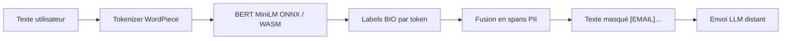

# IA — Détail du samedi 4 juillet 2026

## 1. Rampart — redaction de PII 100 % côté navigateur avec transformers.js (ONNX + MiniLM)

**Source :** Hugging Face — https://hf.co/nationaldesignstudio/rampart
**Date :** 30 juin 2026 (mise à jour)

### Contexte

`nationaldesignstudio/rampart` est un petit modèle open (**CC-BY-4.0**) qui **détecte et masque les données personnelles** (PII) dans un texte : emails, noms, téléphones, IBAN, adresses. Sa particularité : il tourne **entièrement dans le navigateur**, sans appel serveur, via **transformers.js** et **ONNX Runtime Web**. Trending sur le Hub cette semaine, il est multilingue (en, fr, de, es, it, pt, nl) et entraîné sur le jeu `ai4privacy/pii-masking-openpii-1.5m`.

Le problème qu'il résout est très concret. Avant d'envoyer un texte utilisateur à un LLM distant (support, résumé, chatbot), tu veux **retirer les PII**. Si tu fais ce nettoyage côté serveur, les données brutes ont déjà quitté le poste. Rampart déplace l'étape **avant** tout envoi réseau. Bonus : pas de latence réseau ni de coût GPU pour cette étape, et ça fonctionne même hors ligne une fois le modèle en cache.

### Comment ça marche

Sous le capot, c'est un **BERT compact** (base `MiniLM-L6-H384`, ~22 M paramètres, quantifié) qui fait de la **token-classification** (NER). Chaque token reçoit un label au schéma BIO : `B-EMAIL`, `I-EMAIL`, `B-PERSON`, `O` (hors entité). Le pipeline enchaîne quatre étapes, toutes locales :

1. **Tokenisation** WordPiece du texte.
2. **Inférence** du BERT exporté en **ONNX**, exécuté par `onnxruntime-web` en **WASM** (ou WebGPU si dispo).
3. **Agrégation** des tokens contigus d'une même entité en spans (offsets `start`/`end`).
4. **Masquage** : tu remplaces chaque span par `[EMAIL]`, `[PERSON]`, etc. — le remplacement se fait de la fin vers le début du texte pour ne pas décaler les offsets restants.

Comme tout se passe dans l'onglet, tu peux même brancher cette étape sur un `input` en temps réel, avant qu'un seul octet ne parte vers ton API.



Le poids quantifié (quelques Mo) est mis en cache par le navigateur au premier chargement. Aucune PII ne transite : le texte brut reste dans l'onglet.

### En pratique — exemple de code

Intégration minimale avec la lib `@huggingface/transformers` (v3), utilisable tel quel dans un composant Angular :

```ts
// npm i @huggingface/transformers
import { pipeline } from '@huggingface/transformers';

// 1) Charge le modèle ONNX (téléchargé + caché côté client, une seule fois)
const redactor = await pipeline('token-classification',
  'nationaldesignstudio/rampart');

// 2) Analyse un texte : renvoie [{ entity, score, word, start, end }, ...]
const text = 'Contacte Charles au 06 12 34 56 78 ou charles@exemple.fr';
const spans = await redactor(text);

// 3) Masque chaque entité détectée (de la fin vers le début pour garder les offsets)
let masked = text;
for (const s of spans.sort((a, b) => b.start - a.start)) {
  masked = masked.slice(0, s.start) + `[${s.entity.replace(/^[BI]-/, '')}]` + masked.slice(s.end);
}
// masked -> "Contacte [PERSON] au [PHONE] ou [EMAIL]"
```

### Pourquoi ça compte pour toi

Tu bâtis des fronts Angular et des back .NET soumis au RGPD. Rampart te donne une **barrière PII côté client**, avant tout appel à une API LLM tierce : minimisation des données par conception, sans serveur d'inférence à h