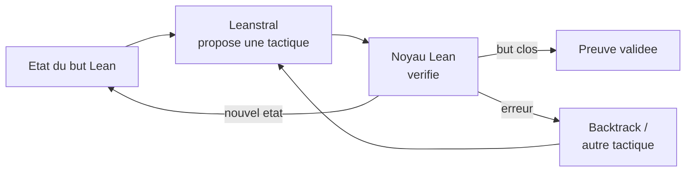

# IA — Détail du dimanche 5 juillet 2026

## 1. Leanstral 1.5 (Mistral) — un open-weight Apache 2.0 taillé pour la preuve formelle en Lean 4

**Source :** Mistral AI — https://mistral.ai/news/leanstral-1-5/
**Date :** 3 juillet 2026

### Contexte

Mistral a publié **Leanstral 1.5**, un modèle open-weight (**Apache 2.0**) spécialisé dans la **preuve formelle** avec l'assistant de preuve **Lean 4**. Architecture MoE : 119 Md de paramètres au total, ~6,5 Md actifs par token (128 experts, 4 actifs), **256k** de contexte. Les poids sont sur Hugging Face (`mistralai/Leanstral-1.5-119B-A6B`), avec un endpoint API `leanstral-1-5` gratuit dans Mistral Labs et une intégration dans Mistral Vibe. L'annonce claque : **miniF2F saturé**, **587/672** problèmes PutnamBench résolus, et — plus concret — **5 bugs inédits** trouvés dans des dépôts open source.

### Comment ça marche

Un prouveur formel ne « génère pas du texte » : il **cherche une preuve que Lean vérifie**. En Lean 4, un théorème est un **but** (un type). Une preuve est une suite de **tactics** que le **noyau** de Lean valide. Impossible d'halluciner : soit la preuve compile, soit elle échoue.

La boucle est un moteur de recherche. Le modèle voit l'**état du but**, propose une tactique (`intro`, `simp`, `induction`…), Lean l'exécute et renvoie un **nouvel état** (ou une erreur). On répète, en explorant un arbre, jusqu'à ce que tous les buts soient clos. Le compilateur Lean joue le rôle de **vérificateur** : il fournit un signal de récompense sans ambiguïté.

L'entraînement suit ce signal : mid-training, puis **SFT** sur des paires (but → tactique) issues de Mathlib, puis **RL** (variante CISPO) où la récompense = preuve trouvée et vérifiée. C'est de l'**expert iteration** : le modèle prouve, les preuves réussies redeviennent des données d'entraînement.



### En pratique — exemple de code

Deux temps : ce que le modèle produit (Lean 4), puis comment l'appeler.

```lean
-- Theoreme : l'addition sur les naturels est commutative
theorem add_comm_demo (a b : Nat) : a + b = b + a := by
  induction b with            -- tactique proposee par Leanstral
  | zero => simp              -- cas de base : a + 0 = a
  | succ n ih => simp [Nat.add_succ, ih]  -- cas inductif, reutilise l'hypothese ih
-- Si `by ...` compile, le noyau Lean a certifie la preuve. Rien a "croire".
```

```python
# Appel de l'endpoint heberge (Mistral Labs) — genere une preuve candidate
from mistralai import Mistral
client = Mistral(api_key="…")
r = client.chat.complete(
    model="leanstral-1-5",
    messages=[{"role": "user",
               "content": "Prove in Lean 4: for all n : Nat, n + 0 = n"}])
print(r.choices[0].message.content)  # a recompiler dans Lean pour verifier
```

### Pourquoi ça compte pour toi

La preuve formelle sort du labo. Concrètement : vérifier qu'une fonction critique (calcul monétaire, contrôle d'accès) respecte sa spec, ou générer des invariants. Leanstral bat Opus 4.6 sur FLTEval à 1/7 du coût, en poids ouverts : tu peux l'héberger. Ce n'est pas pour ton CRUD quotidien, mais pour les cœurs métier où un bug coûte cher, l'« abondance de preuves » devient une option réaliste.

### Pour aller plus loin

Le paradigme LLM+Lean est bien documenté : LeanDojo/ReProver (sélection de prémisses par retrieval), APOLLO (réparation de preuves générées), Seed-Prover (raisonnement lemme par lemme). Leanstral 1.5 industrialise cette lignée avec un open-weight performant et une licence permissive.
