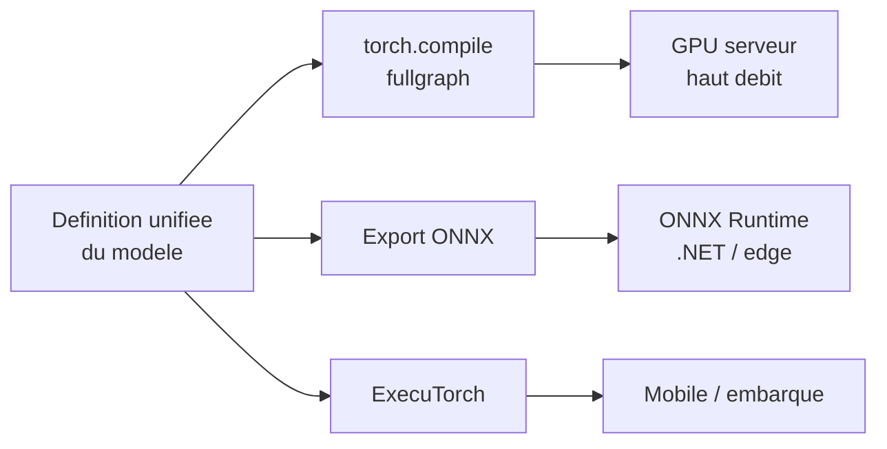
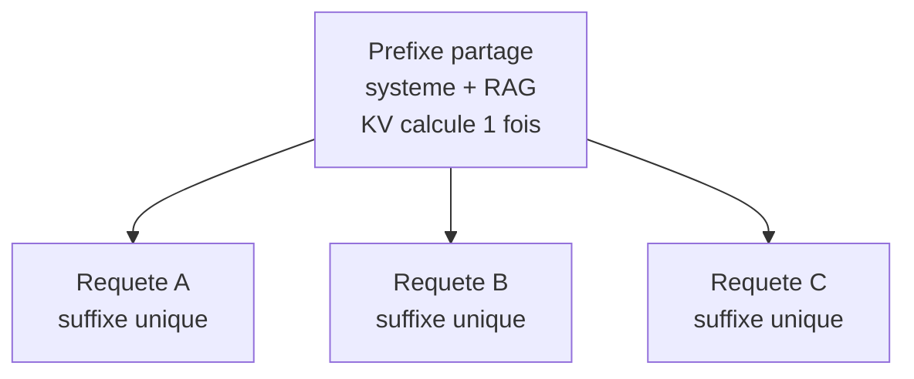

# IA — Détail du lundi 6 juillet 2026

## 1. Transformers v5.13.0 — définitions de modèle unifiées, export ONNX/ExecuTorch propre

**Source :** Hugging Face — https://github.com/huggingface/transformers/releases/tag/v5.13.0
**Date :** 3 juillet 2026

### Contexte

`transformers` v5.13.0 continue le grand chantier de la branche v5 : « des définitions de modèles simples qui font tourner tout l'écosystème ». Au-delà des nouveaux modèles ajoutés (architectures **Kimi K2.5** et **MiMo-V2-Flash**), le cœur de cette release est une série de changements internes qui **standardisent la déclaration des couches**, la **construction des masques et du cache**, et la **gestion de l'attention hybride**. Objectif concret : rendre « beaucoup de modèles proprement exportables (ONNX, `torch.export`, ExecuTorch) et compilables en *fullgraph* ». C'est de la plomberie, mais elle débloque le déploiement hors de Python.

### Comment ça marche

Historiquement, chaque modèle `transformers` avait ses petites libertés : un masque causal bricolé ici, un cache maison là, un `if` Python dans le `forward`. Résultat : `torch.compile` tombait en **graph break** (il coupe le graphe, recompile, perd le gain) et l'export ONNX produisait des graphes bancals ou échouait.

La v5 impose un **contrat commun**. Toutes les couches déclarent leurs entrées/sorties de la même façon ; le masque d'attention et le KV-cache sont construits par des utilitaires partagés, pas par du code ad hoc. Du coup le `forward` devient **traçable de bout en bout** : pas de branche dynamique qui casse le graphe.

Deux débouchés s'ouvrent alors. `torch.compile(model, fullgraph=True)` capture **un seul** graphe (zéro break) et le fusionne pour plus de débit. Et `torch.export` / l'export ONNX produisent un graphe statique portable, que tu charges ensuite dans **ONNX Runtime** (donc appelable depuis **C#/.NET**), ou dans **ExecuTorch** pour le mobile/embarqué.



### En pratique — exemple de code

Le code montre les deux sorties débloquées par les définitions unifiées : compilation fullgraph, puis export ONNX.

```python
# Transformers v5.13 : une definition de modele unifiee = export propre
import torch
from transformers import AutoModelForCausalLM

model = AutoModelForCausalLM.from_pretrained(
    "meta-llama/Llama-3.2-1B", torch_dtype=torch.bfloat16
).eval()

ids = torch.randint(0, 32000, (1, 16))

# 1) Compilation "fullgraph" : aucun graph break grace aux defs standardisees
fast = torch.compile(model, fullgraph=True)     # gains de debit notables

# 2) Export ONNX via le backend dynamo (torch.export sous le capot)
torch.onnx.export(model, (ids,), "llama.onnx", dynamo=True, opset_version=20)
# -> "llama.onnx" se charge dans ONNX Runtime, appelable depuis du C#/.NET
```

### Pourquoi ça compte pour toi

Tu n'es pas obligé de servir tes modèles en Python. Avec une définition propre, tu exportes un open-weight en ONNX et tu l'appelles depuis **ONNX Runtime en .NET**, sans réécrire le modèle ni bricoler chaque couche. Même logique pour compiler en fullgraph (débit) ou viser l'embarqué via ExecuTorch. Cette « ennuyeuse » standardisation, c'est ce qui rend un modèle HF réellement déployable dans ta stack backend.

### Pour aller plus loin

Vérifie la version d'`opset` ONNX supportée par ta cible ONNX Runtime, et teste l'export sur un petit modèle avant un gros MoE : l'attention hybride et le KV-cache dynamique restent les points les plus fragiles à l'export.

---

## 2. Moteurs d'inférence en 2026 — vLLM (PagedAttention) vs SGLang (RadixAttention)

**Source :** Red Hat Developer — https://developers.redhat.com/articles/2026/06/15/llamacpp-vs-vllm-choosing-right-local-llm-inference-engine
**Date :** 15 juin 2026

### Contexte

Si tu auto-héberges un LLM open-weight, trois moteurs comptent en 2026 : **vLLM**, **SGLang** et TensorRT-LLM. Le choix n'est pas cosmétique : selon les comparatifs, **SGLang** délivre ~29 % de débit de plus que vLLM sur H100, et **jusqu'à 6,4×** sur les charges à préfixe partagé (RAG, multi-tours). Comprendre *pourquoi* t'évite de sur-payer du GPU. La clé tient en un mot : la **gestion du KV cache**.

### Comment ça marche

Rappel : à chaque token généré, le modèle relit les **clés/valeurs (KV)** de tous les tokens précédents. Ce **KV cache** grossit avec le contexte et mange la VRAM. Toute la bataille est là.

**vLLM → PagedAttention.** Le KV cache est découpé en **pages** de taille fixe, comme la mémoire virtuelle d'un OS. Les pages n'ont pas besoin d'être contiguës : fini la fragmentation, on remplit le GPU à ~90 %. Idéal quand tes requêtes sont **toutes différentes** (batch de prompts uniques).

**SGLang → RadixAttention.** SGLang range les préfixes déjà vus dans un **arbre radix** (arbre de préfixes). Si dix requêtes partagent le même prompt système + le même contexte RAG, ce préfixe n'est **calculé qu'une fois**, puis réutilisé par toutes. Sur du RAG ou du multi-tours — où le début du prompt est identique — le gain explose.



### En pratique — exemple de code

Même modèle, deux serveurs. La différence de comportement est dans le moteur, pas dans ton code client.

```bash
# vLLM : serveur OpenAI-compatible, PagedAttention (KV en "pages" non contigues)
vllm serve deepseek-ai/DeepSeek-V4-Flash \
  --max-model-len 32768 --gpu-memory-utilization 0.90
# -> ideal pour un batch de prompts tous differents, multi-hardware

# SGLang : RadixAttention met en cache le prefixe commun (systeme + RAG)
python -m sglang.launch_server \
  --model-path deepseek-ai/DeepSeek-V4-Flash \
  --context-length 32768
# -> jusqu'a 6,4x de debit quand les requetes partagent un prefixe
```

### Pourquoi ça compte pour toi

Ton profil de charge dicte le moteur. Beaucoup de requêtes partageant un gros prompt système ou un contexte RAG identique ? **SGLang** et son RadixAttention te feront économiser des GPU. Un batch de prompts tous distincts, ou un besoin multi-hardware (TPU, Trainium) et de compatibilité maximale ? **vLLM** reste le choix sûr. Les deux exposent une API compatible OpenAI : tu changes de moteur sans toucher au client.

### Points de vigilance

Le gain RadixAttention s'effondre si tes préfixes ne se recoupent jamais (chaque requête unique). Mesure ton taux de partage de préfixe réel avant de trancher ; en cas de doute, vLLM offre le socle le plus polyvalent.
