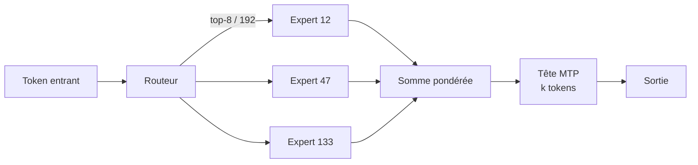
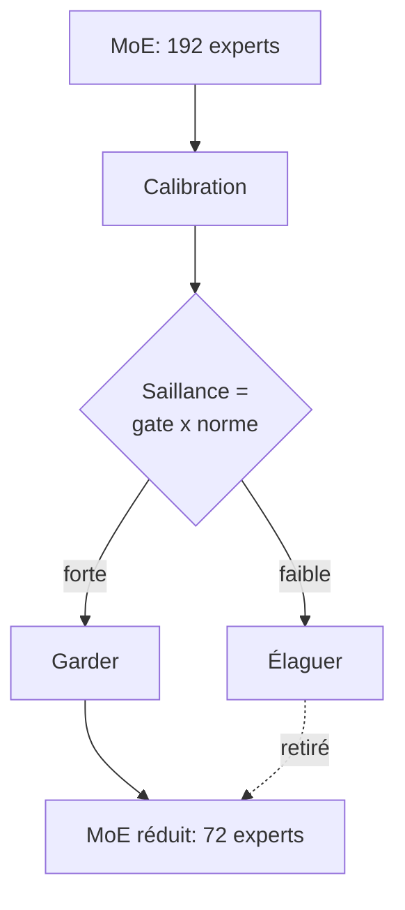

# IA — Détail du mardi 7 juillet 2026

## 1. Tencent Hy3 (Hunyuan 3) — MoE 295B-A21B open-weight, 256K de contexte, MTP intégré

**Source :** Tencent Hunyuan (carte modèle Hugging Face) — https://huggingface.co/tencent/Hy3
**Date :** 6 juillet 2026

### Contexte

Tencent avait sorti une *preview* Hy3 le 23 avril. La version stable arrive aujourd'hui : **Hy3**, un modèle **Mixture-of-Experts (MoE)** de **295 milliards de paramètres** dont **21 milliards seulement sont actifs** à chaque token. Poids ouverts en **Apache 2.0**, contexte **256K**, et deux semaines d'API gratuite sur OpenRouter pour l'essayer sans héberger. Il cible le raisonnement complexe, le code et l'agentique, avec un mode « fast/slow thinking ».

L'intérêt pour toi : un modèle frontier réellement téléchargeable, sans clause de licence piégeuse, que tu peux auto-héberger derrière ton propre gateway .NET ou Symfony.

### Comment ça marche

Un MoE remplace le gros bloc *feed-forward* dense d'un Transformer par **N experts** (ici 192) plus un **routeur**. Pour chaque token, le routeur calcule un score par expert et n'active que les **top-8**. Résultat : la capacité totale est énorme (295B de connaissances stockées), mais le coût par token reste celui d'un modèle ~21B. C'est le compromis clé du MoE : mémoire haute, calcul bas.

Hy3 ajoute une **couche MTP** (Multi-Token Prediction, 3,8 Md de params) : au lieu de prédire un seul token suivant, le modèle en propose plusieurs, vérifiés en un pas — d'où un décodage plus rapide, comme le décodage spéculatif intégré.



### En pratique — exemple de code

Servir Hy3 en OpenAI-compatible avec vLLM, puis l'appeler comme n'importe quelle API chat :

```bash
# Sert les poids BF16 sur un nœud multi-GPU (tensor-parallel = 8)
vllm serve tencent/Hy3 \
  --tensor-parallel-size 8 \
  --max-model-len 262144 \
  --served-model-name hy3
```

```python
# Client : Hy3 expose l'API OpenAI standard -> zéro SDK propriétaire
from openai import OpenAI
client = OpenAI(base_url="http://localhost:8000/v1", api_key="none")

resp = client.chat.completions.create(
    model="hy3",
    messages=[{"role": "user",
               "content": "Résume la RFC 9110 en 3 puces."}],
    max_tokens=512,
)
print(resp.choices[0].message.content)
```

### Pourquoi ça compte pour toi

Tu gagnes un modèle frontier auto-hébergeable derrière ton propre proxy, sans dépendre d'un fournisseur. L'API OpenAI-compatible se branche directement sur ton code .NET/Symfony existant. Attention au coût matériel : 295B en BF16, c'est ~590 Go de VRAM rien que pour les poids. Réserve l'auto-hébergement à un vrai besoin de souveraineté ; sinon, l'API gratuite suffit pour prototyper.

### Pour aller plus loin

GitHub officiel : https://github.com/Tencent-Hunyuan/Hy3-preview — détaille le routage 192 experts et les benchmarks agentiques.

---

## 2. REAP — élaguer les experts d'un MoE pour faire tenir Hy3 et K-EXAONE en local

**Source :** Cerebras Research — « REAP the Experts » (arXiv 2510.13999) — https://arxiv.org/abs/2510.13999
**Date :** octobre 2025 (variantes Hy3-REAP et K-EXAONE-REAP publiées le 7 juillet 2026)

### Contexte

Un MoE de 295B (Hy3) ou 236B (K-EXAONE) stocke sa capacité dans des **centaines d'experts**, mais beaucoup sont peu sollicités. **REAP** (Router-weighted Expert Activation Pruning), signé Cerebras et accepté à ICLR 2026, supprime les experts inutiles **en one-shot**, sans réentraînement. Le lendemain de la sortie de Hy3, des variantes REAP apparaissent déjà : `K-EXAONE-...-REAP-72E` (236B → 138B) et `Hy3-REAP75`. But : ramener ces géants dans une enveloppe VRAM raisonnable.

### Comment ça marche

REAP note chaque expert par une **saillance** = valeur de gate du routeur **×** norme d'activation de l'expert, moyennée sur un petit jeu de calibration (quelques centaines de séquences). Un expert souvent routé **et** qui produit une forte sortie est saillant : on le garde. Les experts à faible saillance sont **supprimés** (pas fusionnés), puis les poids du routeur sont ajustés pour ignorer les indices retirés.

Le papier tranche un débat : fusionner les experts semble séduisant, mais casse le contrôle indépendant, input-dépendant, du routeur — un « functional subspace collapse » qui introduit une erreur irréductible. Élaguer préserve mieux la qualité. Sur des architectures de 20B à 1T, à 50 % d'experts retirés, la perte reste ≤ 2 % sur les tâches de code (Qwen3-Coder-480B, Kimi-K2).



### En pratique — exemple de code

Le cœur de REAP tient en quelques lignes : scorer, trier, garder les top-k experts.

```python
import torch

def reap_keep(gate_probs, expert_out, keep_k):
    # gate_probs : [tokens, n_experts] proba du routeur
    # expert_out : [tokens, n_experts, d] sortie de chaque expert
    act_norm = expert_out.norm(dim=-1)              # norme d'activation
    saliency = (gate_probs * act_norm).mean(dim=0)  # gate x norme, moyenné
    keep = torch.topk(saliency, keep_k).indices     # experts les plus saillants
    return keep.sort().values                       # indices à conserver
```

```bash
# Récupérer une variante déjà élaguée + quantifiée 4-bit (tient en multi-GPU)
huggingface-cli download pipenetwork/Hy3-REAP75-MLX-4bit
```

### Pourquoi ça compte pour toi

REAP transforme un modèle « inservable » (590 Go) en cible réaliste : 50 % d'experts en moins ≈ moitié moins de VRAM, sans réentraîner. Combiné à du 4-bit, un 295B peut viser un serveur multi-GPU au lieu d'un cluster. Si tu déploies du LLM auto-hébergé, surveille les checkpoints REA