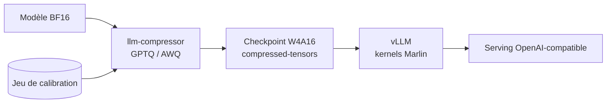
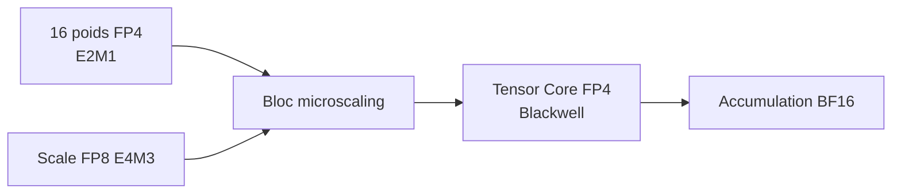
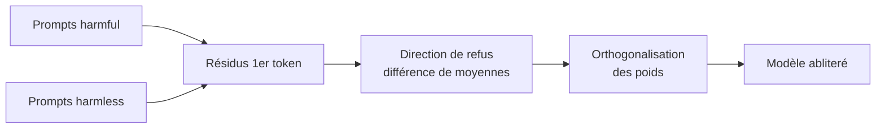

# IA — Détail du mercredi 8 juillet 2026

## 1. Servir un gros modèle en 4-bit sur un seul GPU — llm-compressor (W4A16) + vLLM

**Source :** llm-compressor (projet vLLM) — https://github.com/vllm-project/llm-compressor
**Date :** 8 juillet 2026 (vague de checkpoints W4A16 publiés sur le Hub)

### Contexte

Un modèle de 32 milliards de paramètres en BF16 pèse ~64 Go de VRAM : il te faut deux A100 80 Go rien que pour charger les poids. Or la fournée de modèles publiée ce 8 juillet (dérivés Qwen3, Leanstral…) arrive massivement en **`compressed-tensors` W4A16**, produite par `llm-compressor`. Le même 32B tombe alors autour de ~18-20 Go et tient sur **un seul GPU 24 Go**.

W4A16 signifie *weights 4-bit, activations 16-bit* : on quantize uniquement les poids (le gros du stockage), on laisse les activations en 16 bits (la qualité). C'est le compromis devenu standard pour l'auto-hébergement.

### Comment ça marche

Deux algorithmes dominent. **GPTQ** quantize couche par couche en minimisant l'erreur quadratique de sortie, guidé par une approximation de la hessienne calculée sur un petit jeu de *calibration*. **AWQ** (*Activation-aware Weight Quantization*) protège la petite fraction de canaux de poids « saillants » repérés via les activations, et quantize le reste.

Le résultat est un checkpoint au format `compressed-tensors`. **vLLM le charge nativement** et sélectionne automatiquement les kernels **Marlin** (multiplication 4-bit optimisée). Pas de conversion manuelle, pas de format propriétaire.



### En pratique — exemple de code

Quantizer un modèle en W4A16 avec la recette GPTQ :

```python
# pip install llmcompressor
from llmcompressor import oneshot
from llmcompressor.modifiers.quantization import GPTQModifier

# Recette W4A16 : poids en 4 bits, activations laissées en 16 bits
recipe = GPTQModifier(targets="Linear", scheme="W4A16", ignore=["lm_head"])

oneshot(
    model="Qwen/Qwen3-4B-Thinking-2507",
    dataset="open_platypus",          # petit corpus de calibration
    recipe=recipe,
    max_seq_length=2048,
    num_calibration_samples=256,
    output_dir="Qwen3-4B-Thinking-W4A16",
)
```

```bash
# vLLM lit compressed-tensors sans conversion, Marlin activé automatiquement
vllm serve ./Qwen3-4B-Thinking-W4A16 --max-model-len 8192
```

### Pourquoi ça compte pour toi

C'est le levier n°1 pour héberger un LLM open sans facture GPU délirante. Tu divises la VRAM par ~3,5 pour une perte de qualité souvent < 1 %. Concrètement, tu passes un modèle « deux cartes » sur une seule, ou tu sers plus de contexte et de requêtes en parallèle. Garde un checkpoint 16-bit sous la main pour comparer la qualité avant de mettre la version 4-bit en prod.

---

## 2. NVFP4 — le FP4 « matériel » de NVIDIA débarque sur les poids open

**Source :** Transformers — méthode « Four Over Six » (NVFP4) — https://huggingface.co/docs/transformers/quantization/fouroversix
**Date :** 8 juillet 2026 (ex. `Leanstral-1.5-119B-A6B-NVFP4A16` publié ce jour)

### Contexte

INT4 (GPTQ/AWQ) mappe les poids sur des **entiers**. Ça marche bien, mais les entiers gèrent mal les distributions à forte dynamique (quelques poids très grands écrasent l'échelle). **NVFP4** répond à ça : c'est le format **4-bit flottant** de NVIDIA, taillé pour les Tensor Cores **Blackwell**. Ce 8 juillet, des poids open sortent directement en NVFP4 (ex. `Leanstral-1.5-119B-A6B-NVFP4A16`), et Transformers 5 ajoute la méthode « Four Over Six » pour quantizer soi-même.

### Comment ça marche

Un poids NVFP4 est un flottant **E2M1** : 1 bit de signe, 2 d'exposant, 1 de mantisse — 16 valeurs possibles, mais réparties de façon logarithmique (fines près de zéro, larges aux extrêmes). La clé, c'est le **microscaling** : chaque bloc de 16 poids partage un **facteur d'échelle FP8** (E4M3). On capture ainsi la dynamique locale sans gaspiller des bits.

Au calcul, les Tensor Cores FP4 de Blackwell multiplient nativement ces blocs et accumulent en BF16 — d'où un débit ~2× vs FP8. « Four Over Six » (arXiv 2512.02010) ajoute une transformée de Hadamard aléatoire, un *2D block scaling* et un arrondi stochastique pour réduire encore l'erreur de quantization.



### En pratique — exemple de code

Quantizer à la volée en NVFP4 avec Transformers :

```python
# Transformers 5 : quantization NVFP4 via "Four Over Six"
from transformers import AutoModelForCausalLM, FourOverSixConfig

model = AutoModelForCausalLM.from_pretrained(
    "Qwen/Qwen3-8B",
    device_map="auto",
    quantization_config=FourOverSixConfig(),   # NVFP4 : FP4 + scale FP8 par bloc de 16
)
```

```bash
# Ou servir un checkpoint déjà en NVFP4 avec vLLM (GPU Blackwell requis pour le gain)
vllm serve kamiyugi/Leanstral-1.5-119B-A6B-NVFP4A16
```

### Pourquoi ça compte pour toi

Si ton parc bascule sur Blackwell (RTX 50, B200), NVFP4 te donne la densité mémoire du 4-bit **avec** une qualité proche du FP8 — mieux qu'INT4 sur les modèles sensibles (raisonnement, code). Le piège : le gain de débit exige le bon matériel. Sur une génération antérieure (Ampere, Hopper), reste sur W4A16 ; NVFP4 n'y déploie pas ses kernels natifs.

---

## 3. Heretic — l'abliteration automatisée qui retire les garde-fous d'un LLM open-weight

**Source :** Heretic (`heretic-llm`, PyPI) — https://pypi.org/project/heretic-llm/
**Date :** 8 juillet 2026 (vague de modèles « heretic » sur le Hub)

### Contexte

Un LLM open-weight aligné **refuse** certaines requêtes. L'« abliteration » retire ce réflexe de refus **sans réentraînement**, en éditant directement les poids. **Heretic** (paquet `heretic-llm`, PyPI, AGPL-3.0, par le développeur *p-e-w*) automatise l'opération en une commande. Ce 8 juillet, une série de modèles tagués `heretic` / `abliterated` apparaît sur le Hub. Pour toi qui évalues des modèles open pour la prod, le message est clair : l'alignement d'un modèle *open* n'est pas un contrôle de sécurité.

### Comment ça marche

Le mécanisme tient en trois temps. (1) On envoie deux lots de prompts : un « harmful », un « harmless ». (2) On calcule la **direction de refus** = différence des moyennes des résidus (sur le premier token) entre les deux lots. C'est le vecteur, dans l'espace d'activation, qui « pousse » le modèle à refuser. (3) On **orthogonalise** les matrices de poids par rapport à ce vecteur : le modèle ne peut plus l'activer, donc ne refuse plus.

L'apport de Heretic est l'automatisation. Un optimiseur **Optuna** (TPE) cherche les meilleurs paramètres d'ablation en **co-minimisant** deux objectifs : le taux de refus *et* la divergence KL vis-à-vis du modèle d'origine (pour ne pas casser ses capacités). Sur Gemma-3-12B, il atteint ~3/100 refus pour une KL de 0,16, en ~45 min sur une RTX 3090.



### En pratique — exemple de code

L'outil s'utilise sans connaître les entrailles du Transformer :

```bash
# pip install heretic-llm — une seule commande, produit un modèle + un rapport
heretic Qwen/Qwen3-4B-Instruct-2507
```

```python
# Le modèle édité se charge comme n'importe quel checkpoint Transformers
from transformers import AutoModelForCausalLM, AutoTokenizer

path = "./Qwen3-4B-Instruct-2507-heretic"
model = AutoModelForCausalLM.from_pretrained(path)
tok = AutoTokenizer.from_pretrained(path)
# Aucune barrière logicielle : le refus a été retiré des poids eux-mêmes
```

### Pourquoi ça compte pour toi

Ne compte jamais sur l'alignement d'un modèle open comme rempart de sécurité : il se retire en 45 minutes sur une carte grand public. Si tu exposes un LLM open, mets tes garde-fous **côté système** — filtrage des entrées/sorties, classifieurs de modération, politiques serveur, journalisation. Traite les poids comme du code non fiable : la sécurité est dans ton infrastructure, pas dans la « bonne volonté » du modèle.
