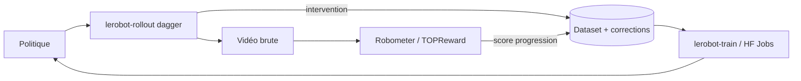
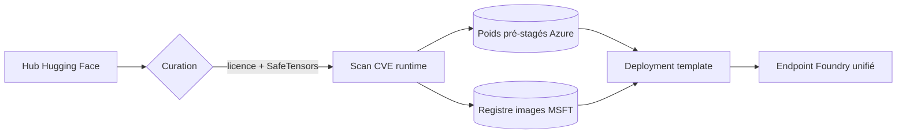

# IA — Détail du jeudi 9 juillet 2026

## 1. LeRobot v0.6.0 — reward models génériques et boucle DAgger en une commande

**Source :** Hugging Face Blog — https://huggingface.co/blog/lerobot-release-v060
**Date :** 7 juillet 2026

### Contexte

LeRobot est la bibliothèque open source de robot learning de Hugging Face : datasets, politiques (ACT, SmolVLA, diffusion), teleop, entraînement. Jusqu'ici, le maillon faible n'était ni le modèle ni la donnée, mais la **boucle**. Comment savoir qu'une politique a réussi une tâche ? En pratique : un humain regarde la vidéo. Comment corriger une politique qui dérive ? On refait une session d'enregistrement complète, on réentraîne, on croise les doigts.

La v0.6.0 attaque exactement ces deux trous. Elle introduit une **API de reward models** (`lerobot.rewards`), calquée sur l'API des politiques, et une CLI de déploiement `lerobot-rollout` qui capture les corrections humaines pendant que la politique tourne. C'est le passage de « j'entraîne un modèle » à « j'opère un flywheel ».

### Comment ça marche

**Étape 1 — le reward model.** `Robometer-4B` est bâti sur Qwen3-VL-4B et entraîné par comparaison de trajectoires sur plus d'un million de rollouts robotiques. Tu lui donnes une vidéo brute et une instruction en langage naturel ; il rend une courbe de progression par frame et un score de succès. Aucun entraînement spécifique à ta tâche. TOPReward va plus loin : **zéro poids entraîné**. Il enveloppe un VLM générique et lit la log-probabilité du token `"True"` conditionnée à la vidéo et à l'instruction. Ce scalaire *est* la récompense.

**Étape 2 — la stratégie DAgger.** Tu regardes ta politique tourner. Dès qu'elle part de travers, tu appuies sur une touche (ou une pédale USB). Le leader arm est d'abord amené à la pose du follower pour que la reprise soit sans à-coup, puis tu prends la main et enregistres la correction. Chaque frame de correction est taguée `intervention`. Le dataset résultant part directement en fine-tuning.

**Étape 3 — la boucle.** Déployer, collecter, réentraîner, redéployer. Les reward models labellisent le dataset pour du **reward-aware behavior cloning** ou pour filtrer les épisodes de mauvaise qualité.



Le reste de la release soutient cette boucle : **FSDP** via Accelerate pour entraîner des politiques plus grosses que ton GPU, **HF Jobs** pour déporter le training (`--job.target=a10g-small`), six nouveaux benchmarks de simulation unifiés sous `lerobot-eval`, et un data loading jusqu'à 2× plus rapide (décodage multi-caméra parallèle, workers persistants).

### En pratique — exemple de code

Déployer une politique en mode DAgger, avec reprise humaine au leader arm :

```bash
# La politique agit ; tu reprends la main quand elle dérive.
# Chaque frame de correction est taguée `intervention` dans le dataset.
lerobot-rollout \
    --strategy.type=dagger \
    --policy.path=${HF_USER}/my_policy \
    --robot.type=so100_follower \
    --robot.port=/dev/ttyACM0 \
    --teleop.type=so101_leader \
    --teleop.port=/dev/ttyACM1 \
    --dataset.repo_id=${HF_USER}/dagger_corrections \
    --dataset.single_task="Grasp the block"
```

Puis réentraîner dans le cloud sans GPU local — même commande, un flag de plus :

```bash
# LeRobot pousse le dataset sur le Hub, soumet le job,
# streame les logs, et repousse la politique entraînée.
lerobot-train \
  --dataset.repo_id=${HF_USER}/dagger_corrections \
  --policy.type=act \
  --policy.repo_id=${HF_USER}/my_policy_v2 \
  --job.target=a10g-small
```

### Pourquoi ça compte pour toi

Tu ne fais pas de robotique, mais le pattern est transposable tel quel à tes agents. Un **reward model générique** qui note une trace d'exécution sans entraînement dédié, c'est exactement ce qui manque à tes évals d'agents LLM. Et la stratégie DAgger — « laisse tourner, intercepte l'erreur, enregistre la correction, réentraîne » — décrit ta boucle de human-in-the-loop idéale sur un agent de support ou de triage. Le tooling arrive avant le besoin.

### Limites

Robometer est un modèle 4B multimodal : le scorer coûte cher si tu l'appliques à chaque frame. TOPReward, lui, dépend entièrement de la calibration du VLM sous-jacent — sa log-prob de `"True"` n'est pas une probabilité de succès calibrée.

---

## 2. Hugging Face models on Foundry Managed Compute — l'open-weight avec la couche opérationnelle en moins

**Source :** Hugging Face Blog (Microsoft) — https://huggingface.co/blog/microsoft/foundry-managed-compute
**Date :** 7 juillet 2026

### Contexte

Le modèle open-weight a gagné la bataille des benchmarks. Il perd encore celle de l'exploitation. Entre « ce modèle a l'air bon sur le Hub » et « ce modèle sert du trafic en prod dans mon tenant », il y a : la revue de licence, le screening sécurité des poids, le choix du runtime, le dimensionnement GPU, la construction d'image, le patch CVE, et l'endpoint derrière ton IAM et ton réseau privé.

Microsoft annonce sa réponse : une **Collection Hugging Face** curée dans le Foundry Model Catalog, déployable en un clic sur **Foundry Managed Compute** — un PaaS GPU géré. Disponible en preview le 7 juillet 2026, sur A100, H100 et MI300X.

### Comment ça marche

Le cœur, c'est un **pipeline de curation en cinq étapes** exécuté par Microsoft et Hugging Face avant qu'un modèle n'apparaisse au catalogue.

1. **Identifier** les modèles trending (signaux communauté, demandes clients).
2. **Screener** licence et sécurité. Les dépôts sont inspectés pour des patterns `trust_remote_code` et du code exécutable custom : tout modèle qui exigerait d'exécuter du Python tiers au chargement est remédié ou exclu. **SafeTensors uniquement.**
3. **Construire, scanner, signer** les images d'inférence sur les runtimes supportés (vLLM, SGLang, TensorRT-LLM, NIM, TEI, llama.cpp, `hf-serve`), puis les publier dans un registre géré par Microsoft.
4. **Pré-stager les poids** en stockage Azure, validés contre la model card. Conséquence directe : **ton déploiement n'a pas besoin d'accès sortant vers le Hub**. Tu peux déployer en réseau privé.
5. **Valider** chaque combinaison modèle × runtime × accélérateur (conformité d'API, latence, throughput, TTFT) avant publication.

L'unité de choix côté utilisateur n'est pas « le modèle », c'est le **deployment template** : un asset versionné qui fige le runtime, la famille et le nombre d'accélérateurs, la longueur de contexte et le tuning. `qwen3-32b` en expose quatre — 40K sur 1×A100 ou 1×H100, 128K sur 2×A100 ou 2×H100.



Les mises à jour de runtime et les patchs CVE sont appliqués **sans redéploiement** de ta part. La configuration du modèle et le routage restent chez toi.

### En pratique — exemple de code

Le déploiement référence un template, pas une topologie GPU :

```python
from azure.identity import DefaultAzureCredential
from azure.mgmt.cognitiveservices import CognitiveServicesManagementClient

client = CognitiveServicesManagementClient(DefaultAzureCredential(), SUBSCRIPTION_ID)

# On ne choisit ni le nombre de GPU ni les flags vLLM :
# le template les fige (runtime, accélérateur, contexte, parsers de tool-call).
deployment = client.managed_compute_deployments.begin_create_or_update(
    resource_group_name=RESOURCE_GROUP,
    account_name=ACCOUNT_NAME,
    deployment_name="qwen3-32b",
    resource={
        "sku": {"name": "GlobalManagedCompute", "capacity": 1},
        "properties": {
            "model": "azureml://registries/azure-huggingface/models/qwen--qwen3-32b/versions/1",
            "deploymentTemplate": "azureml://registries/azure-huggingface/deploymenttemplates/qwen--qwen3-32b--40k-nvidia-h100/labels/latest",
            "acceleratorType": "H100_80GB",
        },
    },
).result()
```

Le scoring passe par l'endpoint unifié, en SDK OpenAI — le champ `model` prend le nom du déploiement :

```python
from openai import OpenAI

openai_client = OpenAI(
    base_url=f"https://{ACCOUNT_NAME}.services.ai.azure.com/openai/v1",
    api_key=client.accounts.list_keys(RESOURCE_GROUP, ACCOUNT_NAME).key1,
)
completion = openai_client.chat.completions.create(
    model=deployment.name,
    messages=[{"role": "user", "content": "Quelle est la capitale de la France ?"}],
)
```

### Pourquoi ça compte pour toi

Si tu envisages un LLM open-weight dans une appli .NET ou Symfony, la question n'a jamais été « quel modèle », mais « qui patche le conteneur vLLM le mardi ». Ici, Microsoft prend le runtime, le scan CVE et le stockage des poids ; tu gardes la config et le routage. Le SDK C# est de la partie, et l'endpoint est OpenAI-compatible : tu branches `Microsoft.Extensions.AI` dessus sans code spécifique. Contrepartie : lock-in Azure et facturation GPU à l'heure.

### Points de vigilance

C'est une **preview** sur inscription. Le catalogue est un sous-ensemble curé, pas le Hub entier — le modèle que tu veux peut ne pas y être. Le « Bring Your Own Weights » pour tes variantes fine-tunées est annoncé sur la roadmap, pas livré.
