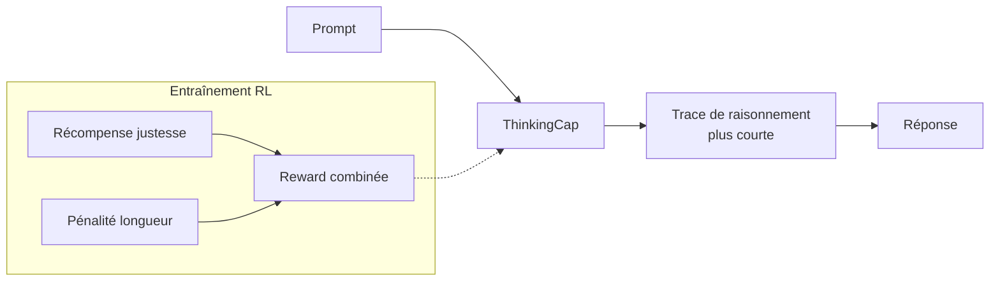
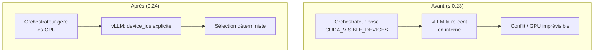

# IA — Détail du vendredi 10 juillet 2026

## 1. ThinkingCap-Qwen3.6-27B — réduire le budget de « thinking tokens » sans perdre en précision

**Source :** Hugging Face — https://huggingface.co/bottlecapai/ThinkingCap-Qwen3.6-27B
**Date :** 6 juillet 2026

### Contexte

Les modèles « raisonneurs » produisent une longue trace de réflexion (les *thinking tokens*) avant de répondre. Cette trace coûte cher : latence, tokens facturés, VRAM du cache KV. **ThinkingCap-Qwen3.6-27B** (bottlecapai) est un fine-tune de Qwen3.6-27B dont l'objectif d'entraînement récompense un **raisonnement efficace** plutôt que la seule justesse. Résultat annoncé : environ **50 % de tokens de réflexion en moins** en moyenne, et **plus de 60 %** sur les jeux les plus lourds comme GPQA-Diamond, à précision quasi identique au modèle de base.

Le problème visé : « l'*overthinking* », où le modèle brûle des centaines de tokens sur une question simple. En bonus, ThinkingCap fait chuter le **taux de troncature** (réponses coupées par la limite de tokens) de 2,9 % à 0,4 % hors domaine.

### Comment ça marche

L'idée pédagogique tient en une phrase : on **récompense la brièveté du raisonnement conditionnée à la justesse**. Pendant le post-training (typiquement du RL type GRPO), la fonction de récompense combine deux termes — la réponse est-elle correcte, et le raisonnement est-il court. Un raisonnement long ET correct rapporte moins qu'un raisonnement court ET correct ; un raisonnement court mais faux est pénalisé. Le modèle apprend donc à « s'arrêter quand il sait ».



À l'inférence, rien de spécial à activer : la sobriété est « dans les poids ». Tu peux malgré tout borner explicitement la réflexion via un budget de tokens côté serveur pour garantir un plafond.

### En pratique — servir le modèle et borner la réflexion

Le bloc montre un appel classique OpenAI-compatible (via vLLM ou Ollama), avec un plafond de tokens de réflexion.

```python
from openai import OpenAI

client = OpenAI(base_url="http://localhost:8000/v1", api_key="none")

resp = client.chat.completions.create(
    model="bottlecapai/ThinkingCap-Qwen3.6-27B",
    messages=[{"role": "user", "content": "Combien de 9 dans 99 ?"}],
    # Plafond de sécurité : le modèle est déjà sobre, mais on borne quand même
    extra_body={"thinking_token_budget": 256},
    max_tokens=512,
)
print(resp.choices[0].message.content)
```

### Pourquoi ça compte pour toi

Si tu sers un raisonneur en prod, la trace de réflexion est ta première source de coût et de latence. Un modèle qui en consomme deux fois moins, à qualité constante, réduit directement ta facture GPU et ton temps de réponse. Pour du RAG ou de l'agentique backend où chaque étape appelle le LLM, l'effet se cumule. Teste ThinkingCap face à ta baseline Qwen sur tes propres prompts avant de trancher — les gains varient selon la difficulté réelle de tes requêtes.

### Limites

Les chiffres viennent de l'éditeur du fine-tune ; valide-les sur ton domaine. Un modèle « qui réfléchit moins » peut sous-raisonner sur tes cas les plus durs — surveille la précision, pas seulement le compte de tokens.

---

## 2. vLLM 0.24.0 — MiniMax-M3, DeepEP v2 et fin du `CUDA_VISIBLE_DEVICES` interne

**Source :** GitHub — https://github.com/vllm-project/vllm/releases/tag/v0.24.0
**Date :** 28 juin 2026

### Contexte

**vLLM 0.24.0** (571 commits, 256 contributeurs) est une release dense côté serving. Au menu : support du nouveau **MiniMax-M3**, de DiffusionGemma et d'un Hierarchical Reasoning Model ; intégration de **DeepEP v2** pour le parallélisme d'experts ; un frontend Rust qui mûrit (auth par clé d'API, CORS, `/tokenize`, `/pause`). Mais le changement qui peut casser tes scripts est ailleurs : la **sélection de device**.

### Comment ça marche

Jusqu'ici, vLLM positionnait lui-même la variable d'environnement `CUDA_VISIBLE_DEVICES` pour choisir les GPU. Problème : cela entrait en conflit avec les orchestrateurs (Ray, Kubernetes, SLURM) qui la gèrent déjà, et rendait le comportement imprévisible. La 0.24 **cesse de la positionner en interne** et introduit un argument explicite **`device_ids`**. Sur ROCm, une fenêtre de dépréciation de `CUDA_VISIBLE_DEVICES` commence.



Le principe : rendre la sélection **explicite et déterministe** au lieu d'un effet de bord d'environnement. C'est un patron classique de maturation d'API — on remplace une convention implicite par un paramètre nommé.

### En pratique — migrer ta sélection de GPU (avant / après)

```bash
# Avant — on comptait sur vLLM pour lire/poser CUDA_VISIBLE_DEVICES
CUDA_VISIBLE_DEVICES=0,1 vllm serve mistralai/Leanstral-1.5-119B-A6B \
  --tensor-parallel-size 2

# Après (0.24) — sélection explicite via device_ids
vllm serve mistralai/Leanstral-1.5-119B-A6B \
  --tensor-parallel-size 2 \
  --device-ids 0,1
```

```python
# En API Python : l'argument device_ids remplace la magie d'environnement
from vllm import LLM
llm = LLM(model="MiniMaxAI/MiniMax-M3", tensor_parallel_size=2, device_ids=[0, 1])
```

### Pourquoi ça compte pour toi

Si tu sers des modèles en local ou sur un cluster, tes scripts de lancement qui exportent `CUDA_VISIBLE_DEVICES` avant `vllm serve` peuvent se comporter différemment après upgrade. Audite tes wrappers, tes Dockerfiles et tes manifests K8s, et bascule vers `device_ids`. Profites-en pour épingler Starlette ≥ 1.0.1 : la 0.24 l'impose pour corriger **CVE-2026-48710**.

### Points de vigilance

Vérifie aussi la liste des **modèles retirés** (ERNIE, Xverse, Dots1, Bamba, Mono-InternVL) et **dépréciés** (Qwen 1re génération, support Transformers v4). Si ta prod sert un de ces modèles, fige ta version de vLLM ou planifie une migration avant de monter en 0.24.
