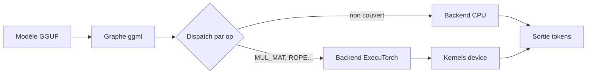

# IA — Détail du samedi 11 juillet 2026

## 1. llama.cpp — backend ExecuTorch (ET) : un nouveau chemin d'inférence on-device

**Source :** ggml-org/llama.cpp (Releases) — https://github.com/ggml-org/llama.cpp/releases
**Date :** 10 juillet 2026

### Contexte

`llama.cpp` sait déjà cibler beaucoup de matériel via ses *backends* (CPU, CUDA, Metal, Vulkan, SYCL…). Chacun implémente les opérations du graphe de calcul pour un type d'accélérateur. Le 10 juillet, un **backend ExecuTorch (ET)** initial est ajouté. ExecuTorch est la solution PyTorch pour exécuter des modèles **on-device** (mobile, edge) à partir d'un graphe exporté et de kernels optimisés. L'idée : permettre à `llama.cpp` de déléguer des opérations aux kernels ET, et donc de mutualiser l'écosystème PyTorch embarqué au lieu de tout réécrire.

### Comment ça marche

Un backend `llama.cpp` expose une interface : « voici une opération (`ggml_tensor` + type d'op), calcule-la sur mon device ». Au moment d'exécuter le graphe, le runtime parcourt les nœuds et, pour chacun, choisit le backend capable de le traiter. Ce premier jet ET fournit un lot de kernels : `MUL_MAT` (le cœur — multiplication matricielle), `ROPE` (rotary embeddings), `RMS_NORM`, `GLU`, `SOFT_MAX`, `GET_ROWS`, `CONT`, `SET_ROWS`, `MUL_MAT_ID` (pour les MoE). Les opérations non couvertes retombent sur un backend existant (CPU), le temps que la couverture grandisse.



### En pratique — exemple de code

Le backend se sélectionne au build/run comme les autres. Tu compiles avec le flag ET, puis tu forces l'usage via la variable d'environnement de device (schéma habituel de `llama.cpp`) :

```bash
# 1) Build en activant le backend ExecuTorch (nom de flag selon la PR)
cmake -B build -DGGML_ET=ON
cmake --build build --config Release -j

# 2) Inférence : les ops couvertes partent sur ET, le reste sur CPU
./build/bin/llama-cli \
  -m ./models/qwen3.6-4b-q4_k_m.gguf \
  -p "Explique la block-diffusion en 3 phrases" \
  -n 128
# Vérifie dans les logs de démarrage : "backend: ExecuTorch" listé à côté de CPU
```

### Pourquoi ça compte pour toi

Si tu embarques un LLM dans une app (mobile, kiosque, edge industriel), ce backend rapproche `llama.cpp` de l'écosystème ExecuTorch et de ses kernels device. À terme, tu vises un binaire portable qui exploite l'accélération PyTorch on-device sans dépendre d'un runtime lourd. Aujourd'hui c'est un socle : couverture d'ops partielle, à surveiller release après release.

### Limites

Backend « initial » : peu d'ops, pas encore de gains publiés, API susceptible de bouger. À tester, pas à mettre en prod.

---

## 2. Ollama 0.31.2 — flash attention sur vieux GPU NVIDIA et télémétrie coupée par défaut

**Source :** Releasebot (Ollama Release Notes) — https://releasebot.io/updates/ollama
**Date :** 8 juillet 2026

### Contexte

Ollama enrobe `llama.cpp`/MLX pour rendre l'inférence locale triviale (`ollama run`). Mais la **flash attention** — l'attention à faible empreinte mémoire, qui accélère et allège le contexte long — était réservée aux GPU récents. Beaucoup de postes tournent encore sur des cartes NVIDIA **compute capability 6.x** (Pascal : GTX 10xx, Tesla P100/P40). La 0.31.2 élargit le support matériel et ajuste quelques défauts sensibles.

### Comment ça marche

Trois changements notables. D'abord, la flash attention est **activée sur les GPU compute 6.x**, donc les cartes Pascal profitent enfin de la baisse de mémoire du KV cache et du gain de vitesse en contexte long. Ensuite, les **modèles de vision peuvent s'offloader sur l'iGPU** avec padding pour tenir dans la mémoire disponible — utile sur un portable à GPU intégré. Enfin, la **télémétrie est désactivée par défaut quand Ollama est lancé par Claude Code**, plus des correctifs : sortie structurée quand le *thinking* est coupé, durcissement de la création de modèles GGUF, chargement de modèles sur des chemins non-UTF-8.

### En pratique — exemple de code

```bash
# Sur une carte Pascal (compute 6.x), la flash attention est désormais utilisable
export OLLAMA_FLASH_ATTENTION=1

# Contexte long moins gourmand : le KV cache tient en mémoire
ollama run qwen3.6:14b --ctx-size 32768 \
  "Résume ce cahier des charges et liste les risques techniques"

# Vérifier la version installée
ollama --version   # doit afficher 0.31.2
```

### Pourquoi ça compte pour toi

Si tu prototypes en local sur une machine « pas toute jeune », tu gagnes du contexte long sans changer de carte : la flash attention sur Pascal, c'est plus de tokens en mémoire à VRAM égale. L'offload vision sur iGPU débloque les modèles multimodaux sur un simple portable. Et la télémétrie off par défaut sous Claude Code réduit ce qui sort de ton poste — bon réflexe en environnement d'entreprise.

### Points de vigilance

La flash attention sur Pascal reste plus lente que sur Ampere/Ada : c'est un déblocage, pas un miracle de perf. Bench avant de généraliser.
