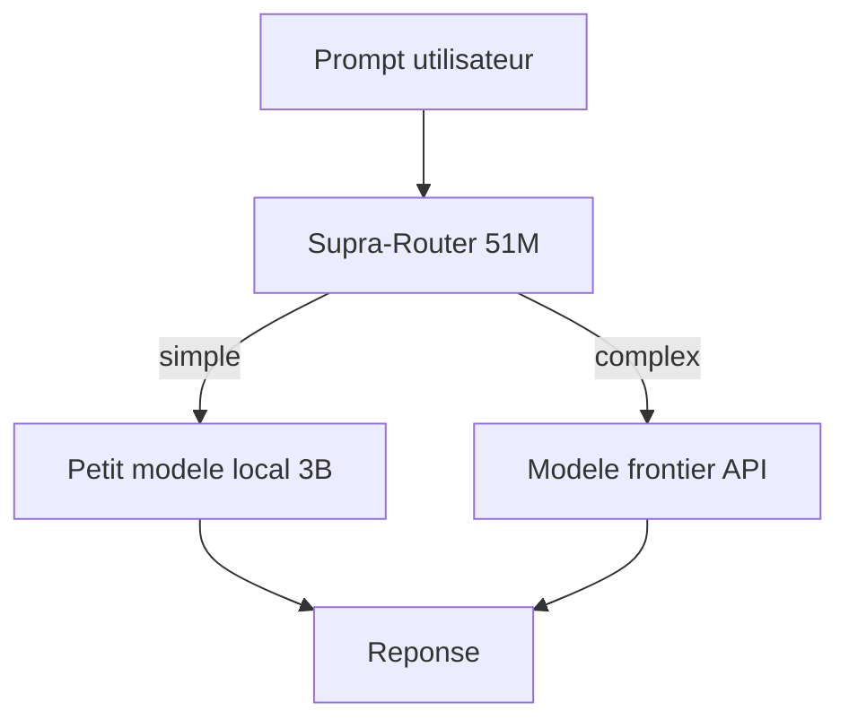
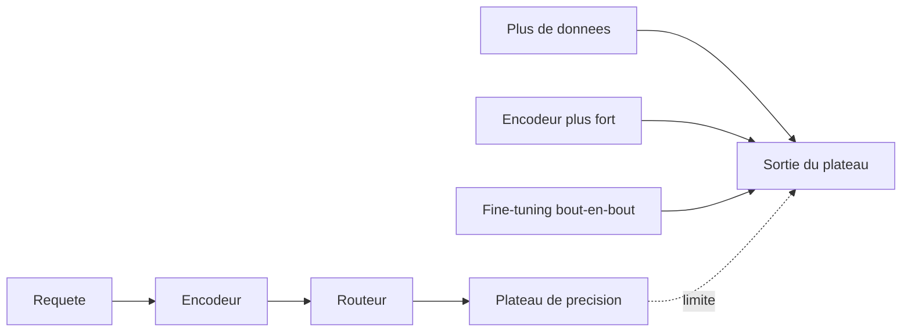

# IA — Détail du dimanche 12 juillet 2026

## 1. Supra-Router-51M — un routeur LLM de 51 M de paramètres pour aiguiller tes prompts

**Source :** Hugging Face — https://hf.co/SupraLabs/Supra-Router-51M
**Date :** 5 juillet 2026 (GGUF le 8, quantifs MLX le 10)

### Contexte

Faire tourner un modèle frontier sur chaque requête coûte cher et lent, alors qu'une grande partie des prompts (« résume ce texte », « corrige cette faute ») sont triviaux. L'idée du *model routing* : placer en amont un classifieur ultra-léger qui décide, prompt par prompt, quel modèle doit répondre — un petit modèle local pour le facile, un gros modèle ou une API pour le difficile. Supra-Router-51M est exactement ça : un modèle de 51 millions de paramètres (base `Supra-1.5-50M-Base-exp`, licence Apache-2.0), entraîné sur le `Prompt-Routing-Dataset`, dont le seul rôle est de produire cette décision d'aiguillage.

### Comment ça marche

Le routeur est un SLM (*small language model*) qui, au lieu de répondre à la question, émet une étiquette de routage. Tu lui passes le prompt utilisateur, il sort une classe (`simple`, `complex`, `code`, `math`…) ou directement l'identité du modèle cible. Ton orchestrateur lit l'étiquette et dispatche vers le backend correspondant.



Pourquoi 51 M ? Parce que la décision doit être quasi gratuite. À cette taille, le routeur tourne sur CPU ou en edge, en quelques millisecondes, sans mobiliser de GPU. Le coût du routage devient négligeable devant l'économie réalisée en évitant le gros modèle sur les prompts faciles. La disponibilité rapide en GGUF (llama.cpp / Ollama) et en MLX 4-bit (Apple Silicon) confirme cette cible « on-device » : tu embarques le routeur là où arrive la requête.

Le point clé, conceptuel : un routeur n'est utile que si les modèles en aval sont *complémentaires* — l'un bon là où l'autre est faible. S'ils se valent, router n'apporte rien. Et la qualité du routage dépend entièrement du dataset d'entraînement, qui doit refléter la distribution réelle de tes prompts.

### En pratique — exemple de code

```python
# Routeur local (llama.cpp) : classer, puis dispatcher
from llama_cpp import Llama

router = Llama(model_path="supra-router-51m.Q4_K_M.gguf", n_ctx=512)

def route(prompt: str) -> str:
    out = router(f"[ROUTE] {prompt}", max_tokens=4, temperature=0)
    return out["choices"][0]["text"].strip()      # ex. "simple" / "complex"

def answer(prompt: str):
    if route(prompt) == "simple":
        return call_local_small(prompt)           # modèle 3B local, gratuit
    return call_frontier_api(prompt)              # gros modèle payant, si besoin
```

### Pourquoi ça compte pour toi

Si tu bâtis un service LLM multi-modèles, un routeur en amont peut couper ta facture d'inférence : le tout-venant part vers un petit modèle local, et tu ne réserves le frontier qu'au difficile. À 51 M, le surcoût de décision est négligeable et tu l'héberges toi-même. Mesure d'abord la complémentarité de tes modèles — sans elle, le routeur ne sert à rien.

### Limites

Vois le sujet suivant : les routeurs plafonnent quand ils apprennent « quel modèle est globalement meilleur » plutôt que des signaux propres à chaque requête.

---

## 2. « The Routing Plateau » — pourquoi les routeurs LLM plafonnent, et comment en sortir

**Source :** Hugging Face Papers — https://hf.co/papers/2606.07587
**Date :** 27 mai 2026

### Contexte

Le routing LLM promet beaucoup, mais en pratique presque toutes les méthodes publiées atteignent des performances similaires — et médiocres face au routeur « oracle » théorique. Ce papier nomme et explique le phénomène : le *routing plateau*. Comprendre pourquoi il existe t'évite d'investir dans un routeur maison qui ne battra jamais un simple kNN.

### Comment ça marche

Le constat central : la plupart des routeurs apprennent des **tendances globales** (« le modèle B est généralement meilleur que A ») plutôt que des **signaux fins propres à la requête** (« CETTE question-ci sera mieux traitée par A »). Résultat, ils convergent tous vers la même politique sous-optimale : le plateau.

Les auteurs identifient un *predictability bottleneck* : à données et encodeur donnés, il existe une limite de ce qu'un routeur peut apprendre, quelle que soit l'architecture. Un kNN bien réglé atteint déjà cette limite ; empiler des couches ne la dépasse pas.



Trois leviers, montrés empiriquement, repoussent le plateau : (1) **plus de données** de routage réelles, (2) un **encodeur plus fort** pour représenter la requête — le goulot est souvent là —, (3) un **fine-tuning bout-en-bout** encodeur + routeur, plutôt qu'une tête posée sur des embeddings gelés.

### En pratique — exemple de code

```python
# L'esprit du papier : un kNN sur de bons embeddings est un baseline dur à battre
from sklearn.neighbors import KNeighborsClassifier

# X_train = embeddings des prompts ; y_best = meilleur modèle observé (label oracle)
router = KNeighborsClassifier(n_neighbors=15, metric="cosine").fit(X_train, y_best)

# Décision de routage pour un nouveau prompt
best_model = router.predict([embed(new_prompt)])   # compare TON routeur à ça
                                                   # avant d'investir dans du sur-mesure
```

### Pourquoi ça compte pour toi

Avant de coder un routeur maison, teste ce baseline kNN : s'il fait aussi bien, ton archi complexe ne se justifie pas. Et si tu veux vraiment progresser, investis dans l'encodeur et dans un jeu de données de routage représentatif de ton trafic — pas dans une tête de classification plus grosse. Ça t'évite des semaines de tuning pour zéro gain.
