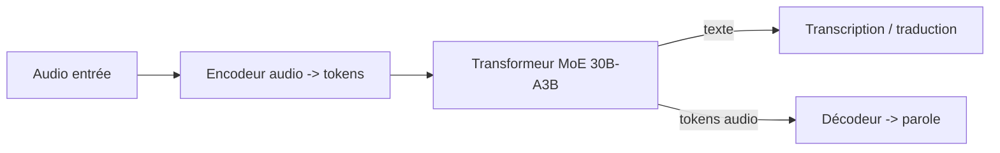
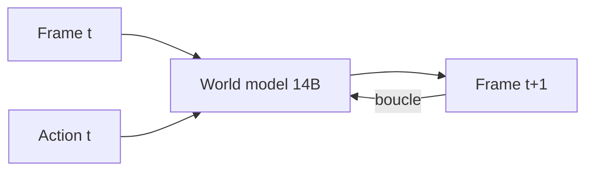

# IA — Détail du lundi 13 juillet 2026

## 1. NVIDIA Nemotron-Labs-Audex-30B-A3B — un seul modèle pour écouter, traduire et parler

**Source :** Hugging Face (nvidia/Nemotron-Labs-Audex-30B-A3B) — https://huggingface.co/nvidia/Nemotron-Labs-Audex-30B-A3B
**Date :** publié le 6 juillet 2026, en tendance cette semaine

### Contexte

Historiquement, une chaîne audio empile trois modèles distincts : un ASR (parole → texte), un LLM (raisonnement), un TTS (texte → parole). Chaque saut ajoute latence, perte d'information (prosodie, émotion, hésitations) et un point de casse. **Audex** de NVIDIA range tout dans un seul réseau : reconnaissance vocale, compréhension audio, traduction parlée, et synthèse vocale (*text-to-speech* et *text-to-audio*), plus du raisonnement, entraîné en SFT puis RL.

C'est un **MoE 30B-A3B** : 30 milliards de paramètres au total, mais seulement ~3 milliards « actifs » par token grâce au *mixture-of-experts*. Tu paies le coût mémoire d'un gros modèle, mais la vitesse d'un petit.

### Comment ça marche

Un modèle *audio-language* traite l'audio comme une langue de plus. L'onde est découpée en trames, encodée en tokens acoustiques par un encodeur audio, puis ces tokens sont concaténés aux tokens de texte dans la même fenêtre de contexte. Le transformeur raisonne indifféremment sur les deux modalités et peut *ré-émettre* des tokens audio en sortie, qu'un décodeur reconvertit en onde.



Le routeur MoE choisit, pour chaque token, un sous-ensemble d'« experts » (des blocs FFN spécialisés). D'où le « A3B » : sur 30B de poids, ~3B participent au calcul d'un token donné. Un même modèle couvre donc transcription *timestampée*, traduction vocale directe (sans passer par un texte pivot figé) et génération de voix.

### En pratique — exemple de code

Chargement et usage conceptuel via `transformers` (le modèle expose une classe custom, d'où `trust_remote_code`) :

```python
from transformers import AutoModel, AutoProcessor
import soundfile as sf

# Modèle unifié : une seule instance pour ASR + traduction + TTS
proc = AutoProcessor.from_pretrained("nvidia/Nemotron-Labs-Audex-30B-A3B", trust_remote_code=True)
model = AutoModel.from_pretrained("nvidia/Nemotron-Labs-Audex-30B-A3B",
                                  trust_remote_code=True, device_map="auto")

audio, sr = sf.read("reunion.wav")                       # audio d'entrée
inputs = proc(audio=audio, sampling_rate=sr,
              task="translate", target_lang="fr", return_tensors="pt")
out = model.generate(**inputs)                            # texte OU tokens audio selon la tâche
print(proc.decode(out[0]))                                # ex. traduction française
```

Le même objet `model` sert à transcrire, traduire ou synthétiser : tu changes le paramètre `task`, pas le pipeline.

### Pourquoi ça compte pour toi

Si tu bricoles des features vocales (support client, transcription de réunions, voice-bots) derrière tes APIs .NET, un modèle unifié réduit ta plomberie : un service d'inférence au lieu de trois, moins de latence, une facture GPU d'un 3B actif. Tu l'exposes via un endpoint interne (vLLM/Triton) et tu appelles en HTTP depuis C#. Vérifie la licence « other » de NVIDIA avant tout usage commercial.

### Limites

Modèle centré anglais (`en`), gros (30B de poids à héberger même si 3B actifs), et licence non permissive. À évaluer, pas à déployer aveuglément.

---

## 2. Les « world models » ouverts débarquent — LingBot World v2 et Giga-World-1

**Source :** Hugging Face (robbyant/lingbot-world-v2-14b-causal-fast) — https://huggingface.co/robbyant/lingbot-world-v2-14b-causal-fast
**Date :** 8 juillet 2026 (Giga-World-1 le 1er juillet)

### Contexte

Un **world model** (modèle du monde) n'est pas un LLM : c'est un réseau qui apprend à **simuler un environnement**. Tu lui donnes une image (ou une vidéo) et une action, il prédit l'image suivante. En bouclant, il « rêve » une vidéo cohérente : physique, occlusions, persistance des objets. C'est la brique qui manque aux agents pour *planifier* dans un espace visuel plutôt que textuel.

Deux sorties open-weight cette semaine : **LingBot World v2** (14B, *image-to-video*, causal/rapide, licence non commerciale CC-BY-NC-SA) et **Giga-World-1** (diffusion, Apache 2.0). Signal net : les world models quittent les labos fermés pour Hugging Face.

### Comment ça marche

Le cœur est une prédiction **auto-régressive de frames conditionnée par l'action**. À l'instant *t*, le modèle voit la frame courante et une action (déplacement, commande), et échantillonne la frame *t+1*. « Causal » signifie qu'il ne regarde que le passé — donc *streamable* en temps quasi réel, image par image, au lieu de générer un clip entier d'un coup.



Le modèle « rapide » troque un peu de qualité contre de la latence : idéal pour du contrôle interactif (jeu, robotique simulée) où il faut une frame maintenant, pas dans dix secondes.

### En pratique — exemple de code

Usage conceptuel via `diffusers` (pipeline *image-to-video*) :

```python
from diffusers import DiffusionPipeline
import torch

pipe = DiffusionPipeline.from_pretrained(
    "robbyant/lingbot-world-v2-14b-causal-fast", torch_dtype=torch.float16
).to("cuda")

frame0 = load_image("scene.png")                 # observation initiale
# On déroule le "rêve" : chaque action produit la frame suivante
video = pipe(image=frame0, actions=["move_forward"] * 24, num_frames=24).frames
export_to_video(video, "rollout.mp4")            # 24 frames simulées
```

Tu pilotes la simulation par la liste d'`actions` : le modèle génère la trajectoire visuelle correspondante.

### Pourquoi ça compte pour toi

Tu n'entraîneras pas de world model demain, mais comprendre la brique t'aide à cadrer les projets « agents » qu'on va te demander d'intégrer. La leçon d'archi : ces modèles sont *stateful* et coûteux en VRAM — si tu dois les servir, prévois du GPU dédié, du streaming (WebSocket/gRPC depuis ton backend) et pas un simple appel REST synchrone. Et surveille la licence : LingBot v2 est non commercial.

### Points de vigilance

Écosystème très jeune : peu de doc, poids volumineux, cohérence physique encore imparfaite sur les longues séquences. À explorer en veille, pas en prod.
