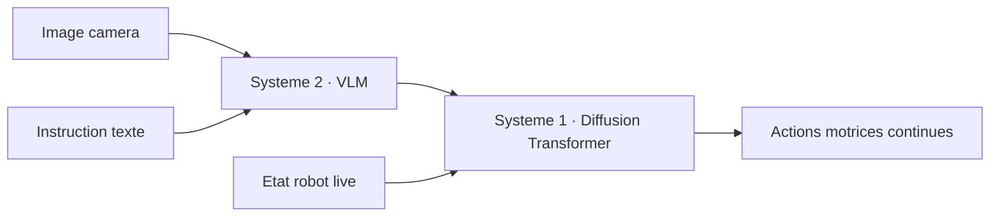
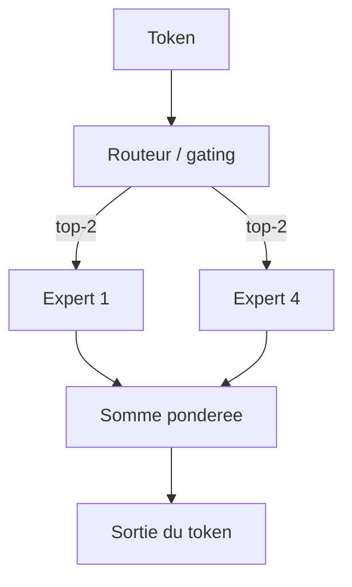

# IA — Détail du mardi 14 juillet 2026

## 1. NVIDIA Isaac GR00T N1.7 — un VLA open (Apache 2.0) qui débarque dans LeRobot

**Source :** Hugging Face Blog (NVIDIA) — https://huggingface.co/blog/nvidia/gr00t-n1-7
**Date :** juillet 2026 (intégration LeRobot)

### Contexte

Un **VLA** (Vision-Language-Action) est un modèle qui transforme une image + une instruction en langage naturel en **actions robotiques continues** (couples moteurs, trajectoires). C'est le pendant robotique des LLM : au lieu de sortir du texte, il sort des commandes de mouvement. GR00T N1.7 est la nouvelle itération open de NVIDIA — **3 milliards de paramètres**, licence **Apache 2.0**, donc utilisable commercialement — et il arrive dans **LeRobot**, la lib open de robotique de Hugging Face. Concrètement, tu récupères un workflow partagé : mêmes datasets, mêmes formats, même API d'inférence.

### Comment ça marche

GR00T N1.7 utilise une architecture **Action Cascade** à deux systèmes, qui sépare le raisonnement lent du contrôle moteur rapide :

- **Système 2 (lent)** : un backbone **Vision-Language Model** ingère les tokens d'image et l'instruction, et produit une représentation de haut niveau (« saisir la tasse rouge »).
- **Système 1 (rapide)** : un **Diffusion Transformer** prend cette sortie *plus* l'état live du robot (positions articulaires) et génère les commandes motrices précises, en temps réel.

Pourquoi un **Diffusion Transformer** pour l'action ? Comme en génération d'image, il part d'un bruit et le **débruite** itérativement — mais ici la sortie n'est pas des pixels, ce sont des trajectoires d'actions. Cette formulation gère bien le côté **multimodal** du geste (plusieurs façons valides de saisir un objet) là où une régression directe s'effondrerait sur la moyenne. Le Système 2 tourne lentement (raisonnement), le Système 1 boucle vite (contrôle) : c'est ce découplage de fréquences qui rend le tout temps-réel.



Le pré-entraînement s'appuie sur **EgoScale** : 20 854 heures de vidéo égocentrique humaine. Le constat clé — plus tu ajoutes de données égocentriques, plus la dextérité de manipulation s'améliore de façon prévisible. C'est une loi d'échelle appliquée à la robotique : la donnée humaine « à la première personne » devient un carburant générique, transférable à des morphologies de robots différentes (cross-embodiment).

### En pratique — exemple de code

Le pattern LeRobot : charger la policy, lui passer une observation, récupérer l'action (extrait illustratif de l'API LeRobot).

```python
# Inférence GR00T N1.7 via LeRobot — boucle de contrôle minimale.
from lerobot.policies import GR00TPolicy

policy = GR00TPolicy.from_pretrained("nvidia/GR00T-N1.7-3B")  # poids Apache 2.0

obs = {
    "image": camera.read(),          # frame RGB de la caméra du robot
    "state": robot.joint_positions,  # état articulaire courant
    "task": "range la tasse rouge dans le bac",
}
action = policy.select_action(obs)   # tenseur de commandes motrices continues
robot.send(action)                   # exécuté à haute fréquence dans ta boucle
```

Tu peux fine-tuner sur ton propre robot (« embodiment ») en fournissant tes épisodes au **format dataset LeRobot**.

### Pourquoi ça compte pour toi

Même sans robot, le pattern **planificateur lent + exécuteur rapide** est exactement ce que tu construis dans tes agents : un LLM qui raisonne, une couche déterministe qui exécute vite. GR00T le rend concret et Apache 2.0 sur une pile open. Si la robotique t'attire, LeRobot + GR00T est aujourd'hui le chemin le plus court entre « idée » et « bras qui bouge ».

### Pour aller plus loin | Limites

Un VLA n'est pas magique : la partie Système 1 est très sensible à la **distribution d'entraînement**, donc un robot ou une caméra hors distribution demande du fine-tuning sur tes propres épisodes. La cadence de contrôle (fréquence à laquelle tu peux échantillonner le Diffusion Transformer) dépend de ton GPU embarqué — c'est souvent le vrai facteur limitant en réel, pas la qualité du modèle. Et 3 Md de paramètres restent lourds pour de l'edge : prévois quantification et tests de sécurité avant tout déploiement physique.

---

## 2. Mistral — un open-weight MoE « fat but sparse » entre en early access

**Source :** TechTimes — https://www.techtimes.com/articles/319798/20260706/mistral-ai-targets-frontier-gap-open-weight-model-entering-july-early-access.htm
**Date :** 6 juillet 2026

### Contexte

Mistral confirme une **nouvelle famille open-weight** qui entre en **early access** partenaires (recherche, gouvernement, industrie) en juillet, avant une diffusion plus large « plus tard cet été ». Arthur Mensch la décrit comme « fat but sparse » — un **Mixture-of-Experts** à grande capacité mais faible compute actif. Paramètres exacts, benchmarks et licence précise ne sont pas encore communiqués : c'est un signal de trajectoire, pas encore des poids téléchargeables. Le sujet ici, c'est le **mécanisme MoE** qui rend cette approche possible.

### Comment ça marche

Un MoE remplace le gros bloc `feed-forward` dense par **N experts** + un **routeur**. Pour chaque token, le routeur ne sélectionne que **k experts** (souvent k=2). Résultat :

- **Paramètres totaux** énormes (« fat ») → beaucoup de connaissance stockée.
- **Paramètres actifs** faibles (« sparse ») → seuls k experts calculent, donc coût d'inférence proche d'un modèle bien plus petit.

C'est le compromis clé : tu charges *tous* les experts en VRAM, mais tu n'en *calcules* que quelques-uns par token.

Un défi central du MoE, c'est l'**équilibrage de charge** : si le routeur envoie toujours vers les deux mêmes experts, les autres ne servent à rien et le modèle « gaspille » sa capacité. On ajoute donc une **perte auxiliaire** (auxiliary loss) qui pénalise les routages déséquilibrés pendant l'entraînement, pour forcer une utilisation homogène des experts. À l'inférence, le serving distribue souvent les experts sur plusieurs GPU (**expert parallelism**) : chaque GPU héberge un sous-ensemble d'experts, et les tokens sont routés par le réseau vers le bon GPU. « Fat but sparse » décrit exactement ce régime — capacité massive répartie, compute par token minimal.



### En pratique — exemple de code

Le cœur d'un routeur MoE : un `top-k` sur les scores de gating, puis combinaison pondérée.

```python
# Routage top-k d'un MoE : seuls k experts s'activent par token.
import torch, torch.nn.functional as F

def moe_forward(x, gate, experts, k=2):
    scores = gate(x)                          # [tokens, N_experts]
    topv, topi = scores.topk(k, dim=-1)       # k meilleurs experts
    w = F.softmax(topv, dim=-1)               # poids normalisés
    out = torch.zeros_like(x)
    for slot in range(k):
        idx = topi[:, slot]                   # expert choisi pour ce slot
        for e, expert in enumerate(experts):
            mask = idx == e
            if mask.any():                    # calcule seulement les tokens routés ici
                out[mask] += w[mask, slot:slot+1] * expert(x[mask])
    return out
```

### Pourquoi ça compte pour toi

Le MoE explique pourquoi tu peux self-héberger des modèles « énormes » sans GPU de datacenter : le compute suit les **paramètres actifs**, pas le total. Mais attention au piège budget — la **VRAM** suit le total (tous les experts résident en mémoire). Quand les poids Mistral tomberont, regarde d'abord le ratio actifs/total : c'est lui qui dicte ton coût réel de service.

### Pour aller plus loin | Points de vigilance

Pour l'instant, c'est une annonce d'early access : ni poids, ni benchmarks, ni licence définitive. Traite-la comme un signal de roadmap, pas comme un modèle à intégrer aujourd'hui. Quand la version large arrivera, deux chiffres compteront pour toi : le **nombre de paramètres actifs** (ton coût compute et ta latence) et l'**empreinte VRAM totale** (le GPU minimal requis). Un MoE « fat but sparse » peut afficher un débit flatteur tout en exigeant 8 GPU juste pour tenir tous les experts en mémoire — l'un ne dit rien de l'autre.
