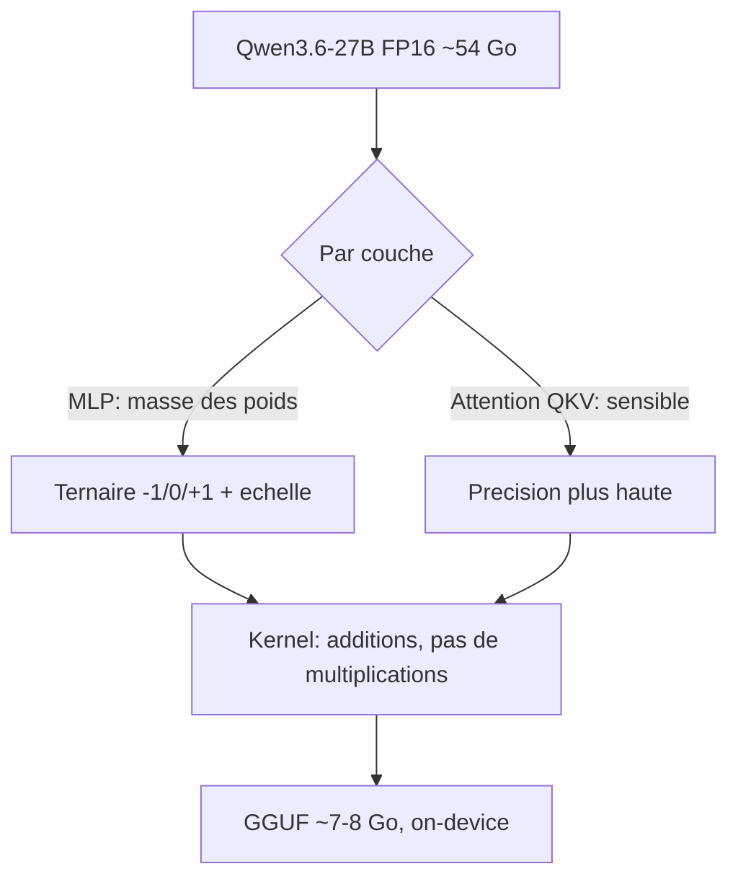
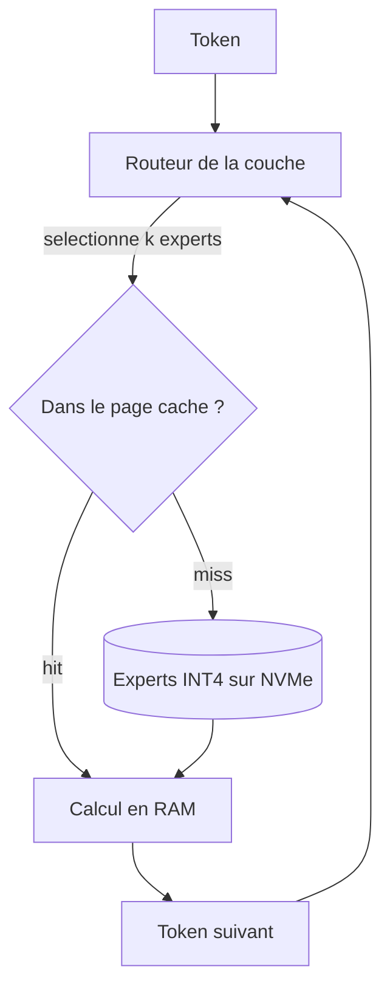

# IA — Détail du mercredi 15 juillet 2026

## 1. Bonsai-27B et Ternary-Bonsai-27B — Qwen3.6-27B en ternaire et en 1-bit

**Source :** Hugging Face Hub (prism-ml) — https://huggingface.co/prism-ml/Ternary-Bonsai-27B-gguf
**Date :** mis à jour le 14 juillet 2026

### Contexte

Un modèle de 27 milliards de paramètres en FP16 pèse environ 54 Go de poids. En Q4_K_M, le quantum de confort de llama.cpp, on tombe autour de 16 Go — ça passe sur une 4090, ça ne passe pas sur un laptop. La famille Bonsai de prism-ml attaque la marche du dessous : `Ternary-Bonsai-27B-gguf` porte les tags `ternary` et `2-bit`, `Bonsai-27B-gguf` porte carrément `1-bit`. Base commune : Qwen/Qwen3.6-27B, licence Apache 2.0.

Le signal de traction est net et un peu paradoxal. Ternary-Bonsai cumule 220 likes pour seulement 23 téléchargements — les gens regardent avant d'essayer. Le repo expose un Space de démo (`akhaliq/Ternary-Bonsai-27B`), un inference provider Together en live, et la variante 1-bit vient avec un Space `bonsai-webgpu-kernels`. Ce dernier détail est le plus parlant : quand tu écris des kernels WebGPU, ta cible n'est pas le datacenter, c'est le navigateur.

Les tags `cuda`, `metal`, `on-device` et `hybrid-attention` complètent le tableau. Ce n'est pas un simple passage à `llama-quantize`, c'est un format qui a demandé des kernels dédiés.

### Comment ça marche

La quantification classique garde des poids sur un axe continu et réduit le nombre de niveaux : INT8 en offre 256, INT4 en offre 16. La quantification ternaire fait un saut conceptuel — chaque poids ne vaut plus que **-1, 0 ou +1**, multiplié par un facteur d'échelle partagé par bloc.

L'intuition de fond : dans un réseau surparamétré, l'information tient largement dans le **signe** et la **structure de sparsité** des poids, moins dans leur magnitude exacte. Le zéro n'est pas une valeur comme les autres, c'est une décision d'élagage. Un poids ternaire dit trois choses : « contribue positivement », « contribue négativement », « ne contribue pas ».

Le gain n'est pas que mémoire. En FP16, une couche linéaire est une multiplication matricielle. En ternaire, la multiplication **disparaît** : multiplier par -1, 0 ou +1, c'est additionner, soustraire, ou ignorer. Ton produit scalaire devient une somme d'additions et de soustractions conditionnelles. C'est ça que les kernels CUDA, Metal et WebGPU exploitent — et c'est pour ça qu'un kernel générique ne suffit pas.

Théoriquement, log2(3) ≈ 1,58 bit par poids. En pratique on empaquette plusieurs poids ternaires dans un mot machine, d'où l'étiquette « 2-bit ». La variante 1-bit va plus loin : poids binaires, plus de zéro, donc plus de sparsité gratuite — et une perte de qualité mécaniquement plus forte.

Le tag `hybrid-attention` signale que tout n'est pas ternarisé. Les couches d'attention, et en particulier les projections QKV, sont bien plus sensibles à la quantification que les MLP. Un schéma hybride garde ces couches en précision plus haute et ternarise le reste, là où la masse des paramètres se trouve.



### En pratique — exemple de code

Le repo est en GGUF, donc consommable directement par llama.cpp sans conversion.

```bash
# Récupérer le poids ternaire (llama.cpp récent obligatoire : kernels dédiés)
huggingface-cli download prism-ml/Ternary-Bonsai-27B-gguf \
  --include "*.gguf" --local-dir ./bonsai

# Servir en local. Le ternaire tient là où le Q4 d'un 27B ne passait pas.
llama-server -m ./bonsai/Ternary-Bonsai-27B.gguf \
  --host 0.0.0.0 --port 8080 \
  -ngl 99 \
  -c 8192
```

Le serveur expose une API compatible OpenAI, donc côté C# tu ne changes rien à ton client habituel :

```csharp
// Client OpenAI standard pointé sur llama-server local
var client = new OpenAIClient(
    new ApiKeyCredential("no-key-needed"),
    new OpenAIClientOptions { Endpoint = new Uri("http://localhost:8080/v1") });

var chat = client.GetChatClient("bonsai-27b");
ChatCompletion reponse = await chat.CompleteChatAsync(
    [new UserChatMessage("Résume ce ticket en trois phrases.")]);

Console.WriteLine(reponse.Content[0].Text);
```

### Pourquoi ça compte pour toi

Un 27B qui tourne sur ta machine de dev change l'arbitrage build-vs-buy sur les tâches internes : triage de tickets, classification, résumé. Plus d'appel réseau, plus de coût au token, plus de données qui sortent. Teste Ternary-Bonsai avant la variante 1-bit — le ternaire garde le zéro, donc la sparsité, et dégrade bien moins. Le Space de démo te coûte zéro setup pour juger de la qualité réelle.

### Points de vigilance

Prism-ml n'est pas un laboratoire établi et aucun benchmark public n'accompagne ces repos au moment où j'écris. Le ratio 220 likes / 23 téléchargements dit exactement ça : de la curiosité, pas encore de validation terrain. La quantification extrême dégrade d'abord ce qui se voit le moins — le raisonnement multi-étapes, la fidélité au format de sortie, le tool-calling. Un modèle ternaire qui répond bien en chat peut casser sur du JSON structuré. Évalue sur *ta* tâche, pas sur une impression de conversation.

---

## 2. GLM-5.2-colibri-int4 — faire tourner un MoE frontier sur CPU par expert-streaming

**Source :** Hugging Face Hub (jlnsrk) — https://huggingface.co/jlnsrk/GLM-5.2-colibri-int4
**Date :** mis à jour le 7 juillet 2026

### Contexte

GLM-5.2 de Z.ai est actuellement l'open-weight généraliste le plus solide disponible — poids MIT, architecture `glm_moe_dsa`, près de 4 000 likes sur le repo officiel. Son problème est banal : c'est un très gros MoE, et le servir demande normalement plusieurs GPU.

`jlnsrk/GLM-5.2-colibri-int4` propose autre chose. Les tags disent tout : `int4`, `cpu`, `moe`, `expert-streaming`. Ce n'est pas une quantification de plus — c'est un changement de stratégie d'exécution. Le modèle est quantisé depuis GLM-5.2-FP8 en INT4, mais surtout il est structuré pour que les experts soient **streamés** au lieu d'être tous résidents en mémoire.

### Comment ça marche

Il faut d'abord voir pourquoi un MoE est le candidat idéal à cette approche.

Dans un Transformer dense, chaque token traverse tous les poids. Dans un MoE, chaque couche contient N experts (des MLP), et un **routeur** sélectionne les k plus pertinents pour chaque token — typiquement k=8 sur N=128. Résultat : les paramètres **actifs** par token représentent une petite fraction des paramètres **totaux**. C'est le compromis fondateur du MoE : capacité d'un très gros modèle, coût de calcul d'un petit.

Mais l'inférence classique charge quand même **tous** les experts en VRAM, parce qu'on ne sait pas à l'avance lesquels le routeur va demander. Tu paies la mémoire du modèle total pour n'utiliser le calcul que d'une fraction.

L'expert-streaming casse cette hypothèse. Les experts restent sur disque — idéalement `mmap`és, donc gérés par le page cache de l'OS. À chaque couche, le routeur décide, et seuls les k experts élus sont chargés en RAM pour le calcul. La mémoire résidente devient fonction des paramètres **actifs**, plus des paramètres totaux.

Le prix est évident : tu remplaces des accès VRAM à ~1 To/s par des accès disque. Sur NVMe, on parle de quelques Go/s. C'est deux ordres de grandeur. D'où deux propriétés à intégrer.

D'abord, c'est **viable en génération, pas en batch**. La génération autorégressive est memory-bound et traite un token à la fois : la latence est mauvaise mais tolérable. En batch, chaque requête tire des experts différents, le page cache thrashe, et tout s'effondre.

Ensuite, la **localité sauve la mise**. Le routage n'est pas aléatoire — sur une conversation donnée, les mêmes experts reviennent. Le page cache de l'OS fait naturellement son travail, et le débit effectif est bien meilleur que le pire cas théorique.

L'INT4 joue ici un rôle qu'on sous-estime : il ne sert pas qu'à réduire l'empreinte, il **divise par quatre le volume à streamer** à chaque miss. Sur un chemin limité par le disque, c'est le levier principal.



### En pratique — exemple de code

Le point critique est de ne pas laisser l'OS croire qu'il doit tout charger. On `mmap` et on laisse le page cache arbitrer.

```bash
# Le stockage EST le chemin critique : NVMe obligatoire, pas de réseau ni de HDD
huggingface-cli download jlnsrk/GLM-5.2-colibri-int4 --local-dir /nvme/glm52

# Vérifier que la RAM peut tenir les experts actifs + le KV cache
free -g

# mmap ON (défaut), mlock OFF : verrouiller la mémoire tuerait le streaming
llama-server -m /nvme/glm52/glm-5.2-colibri-int4.gguf \
  --no-mlock \
  -t $(nproc) \
  -c 4096 \
  --port 8080
```

Ce que ça change côté appelant — le même code, un compromis différent :

```python
# Avant — GLM-5.2 en FP8 : plusieurs GPU, ou une API distante et facturée
# Après — colibri INT4 : un serveur CPU + NVMe. Lent mais souverain et à coût fixe.
import openai

client = openai.OpenAI(base_url="http://localhost:8080/v1", api_key="none")

# Streamer la réponse : indispensable, la latence par token est élevée
flux = client.chat.completions.create(
    model="glm-5.2-colibri",
    messages=[{"role": "user", "content": "Explique le pattern outbox en 5 lignes."}],
    stream=True,
)
for chunk in flux:
    print(chunk.choices[0].delta.content or "", end="")
```

### Pourquoi ça compte pour toi

C'est la porte d'entrée vers un modèle frontier sans budget GPU : un serveur CPU avec beaucoup de RAM et un bon NVMe, c'est de l'infra que tu as déjà. Le cas d'usage n'est pas le temps réel — c'est le batch de nuit, l'analyse de logs, la génération de docs. Tu troques la latence contre le coût et la souveraineté des données. Si ton besoin est interactif, reste sur du GPU ou de l'API.

### Limites

C'est un repo communautaire, pas une release Z.ai — aucune garantie de fidélité aux poids officiels et pas de benchmark publié. Le passage FP8 → INT4 ajoute sa propre dégradation, non mesurée ici. Vérifie ton stockage avant de te lancer : sur un disque réseau ou un HDD, l'expert-streaming est inutilisable, pas juste lent. Et surveille le débit lecture disque en charge — c'est ton vrai indicateur, bien plus que le CPU.
