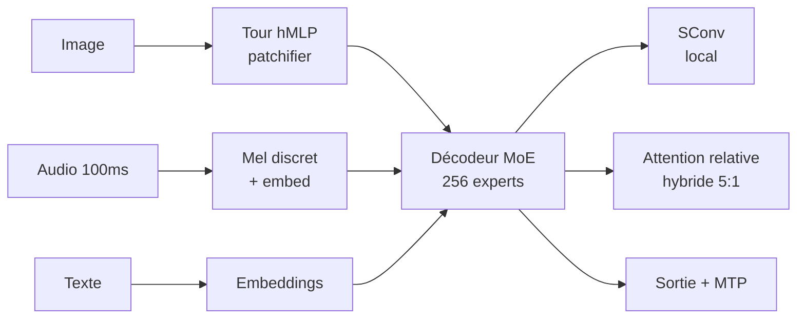

# IA — Détail du jeudi 16 juillet 2026

## 1. Inkling (Thinking Machines) — 975B MoE multimodal natif, 1 M de contexte, poids ouverts

**Source :** Hugging Face Blog — https://huggingface.co/blog/thinkingmachines-inkling
**Date :** 15 juillet 2026

### Contexte

Depuis dix-huit mois, les modèles ouverts multimodaux fonctionnent tous sur le même schéma : un LLM texte au centre, et des **encodeurs séparés** greffés autour — un CLIP ou un SigLIP pour l'image, un Whisper pour l'audio. Chaque encodeur est un modèle à part entière, entraîné séparément, puis raccordé par une couche de projection. Ça marche, mais ça produit des systèmes composites : trois modèles à charger, trois pipelines à maintenir, et un raisonnement cross-modal qui reste bancal parce que les représentations n'ont jamais été apprises ensemble.

Inkling casse ce schéma. C'est le premier modèle ouvert d'environ **1 000 milliards de paramètres** entraîné dès le départ sur 45 000 milliards de tokens de texte, images, audio **et** vidéo, avec des tours d'entrée volontairement minimalistes plutôt que des encodeurs lourds. L'objectif affiché n'est pas de battre Claude ou Gemini en benchmark brut, mais de fournir une base solide pour l'**adaptation par fine-tuning**. Les chiffres le confirment : 77,6 % sur SWE-Bench Verified, 87,2 % sur GPQA Diamond, 97,1 % sur AIME 2026 — solide, sans être frontier.

### Comment ça marche

L'architecture est un décodeur-only Mixture-of-Experts, mais quatre choix la distinguent nettement de tout ce qui traîne sur le Hub.

**1 — L'attention relative remplace RoPE.** C'est le choix le plus inhabituel. Presque tous les LLM modernes injectent la position par rotation des vecteurs query et key (RoPE). Inkling apprend la position **directement dans les logits d'attention**. Au-delà des projections Q, K et V, une **quatrième projection** produit un tenseur R : une feature relative par token et par tête. Ce tenseur est modulé par la distance entre le vecteur clé et le vecteur requête, puis propagé dans le module d'attention. La position n'est plus une transformation géométrique appliquée aux entrées, mais un signal appris. C'est ce qui rend le contexte de 1 M plausible sans les artefacts d'extrapolation habituels de RoPE.

**2 — Attention hybride 5:1.** Les couches de décodeur alternent entre attention à fenêtre glissante et attention globale, selon un ratio de cinq couches glissantes pour une globale. La dernière couche est toujours globale, pour construire des représentations riches avant la sortie. Cinq sixièmes des couches ne paient donc jamais le coût quadratique du contexte complet.

**3 — La convolution courte (`SConv`).** Une convolution 1D lit le token courant plus les `W-1` états cachés précédents, `W` étant la taille de la fenêtre glissante. L'intuition est structurante : `SConv` prend en charge les motifs **locaux**, ce qui **libère** l'attention et les experts MoE de cette tâche. Ils peuvent alors se spécialiser sur les dépendances longue portée.

**4 — Les experts partagés (« shared experts sink »).** Le routeur score à la fois les experts routés et les experts partagés. La sélection top-k retient **6 experts routés, plus 2 experts partagés toujours actifs**, sur 256 au total. Les experts partagés absorbent les connaissances générales — celles dont chaque token a besoin — ce qui évite que les 256 experts routés dupliquent tous les mêmes basiques.

Les tours multimodales sont délibérément simples. L'image passe par un **patchifier hiérarchique en MLP** : des couches linéaires successives fusionnent progressivement les pixels jusqu'à produire une embedding par patch. L'audio est découpé en chunks de 100 ms, converti en échelle mel, puis chaque chunk est **classifié dans un bin de spectrogramme mel discret** ; ces valeurs de bin sont embeddées et sommées. Pas d'encodeur audio séparé, pas de Whisper.



Côté déploiement, la note est salée : **2 To de VRAM en BF16**, **600 Go en NVFP4**. Unsloth a sorti des GGUF dynamiques 1-bit qui retiennent ~74,2 % de la précision top-1 pour 86 % de taille en moins. Le modèle expose aussi un paramètre `reasoning_effort` à sept niveaux, de `"none"` à `"max"` — les vibe-evals de Hugging Face concluent que `"medium"` offre le meilleur compromis.

### En pratique — exemple de code

Le plus court chemin passe par le pipeline `any-to-any` de `transformers` 5.14.0, sorti le jour même pour ce modèle.

```python
from transformers import AutoModelForMultimodalLM, AutoProcessor

model_id = "thinkingmachines/Inkling"          # BF16, GPU Hopper ou plus récent
# model_id = "thinkingmachines/Inkling-NVFP4"  # 600 Go au lieu de 2 To, GPU Blackwell

processor = AutoProcessor.from_pretrained(model_id)
model = AutoModelForMultimodalLM.from_pretrained(
    model_id, dtype="auto", device_map="auto",
)

# Une seule classe pour toutes les modalités : ici texte + audio
messages = [{
    "role": "user",
    "content": [
        {"type": "text",  "text": "Transcris cet enregistrement."},
        {"type": "audio", "audio": "https://example.org/extrait.mp3"},
    ],
}]

inputs = processor.apply_chat_template(
    messages, tokenize=True, add_generation_prompt=True,
    reasoning_effort="medium",   # 7 niveaux : none → max ; medium = bon compromis
    return_dict=True, return_tensors="pt",
).to(model.device)

# use_mtp=True active les drafters multi-token : sorties identiques, décodage plus rapide
out = model.generate(**inputs, max_new_tokens=512, use_mtp=True)
print(processor.decode(out[0][inputs["input_ids"].shape[-1]:]))
```

Pour tester sans cluster, la version quantifiée locale tient en une commande :

```shell
# Quant 1-bit Unsloth : ~74 % de précision top-1 conservée, 86 % plus petit
llama serve -hf unsloth/inkling-GGUF:UD-IQ1_S
# → serveur compatible OpenAI sur http://localhost:8000/v1
```

### Pourquoi ça compte pour toi

Tu ne feras pas tourner 975 Md de paramètres sur ton infra, et ce n'est pas le sujet. Ce qui te concerne : le point d'entrée est une API compatible OpenAI, donc ton client HTTP .NET ne change pas d'un caractère. Et le vrai usage, c'est la **distillation** — Inkling en modèle enseignant pour spécialiser un petit modèle on-device sur ton domaine documentaire. Regarde aussi `reasoning_effort` : c'est un levier direct sur ta facture de tokens.

### Limites

Les scores de factualité sont faibles : 43,9 % sur SimpleQA Verified, 1,0 % sur AA Omniscience. Ce modèle raisonne bien, il ne sait pas. Ne le branche pas sans RAG sur une tâche factuelle.

---

## 2. Ollama 0.32.0 — le runtime local devient un harnais d'agent

**Source :** Ollama Releases — https://github.com/ollama/ollama/releases
**Date :** 11 juillet 2026

### Contexte

Ollama s'est imposé comme le moyen le plus simple de faire tourner un LLM en local : `ollama run <modèle>`, et tu as un prompt. Le produit est resté fidèle à cette promesse pendant deux ans — un runtime, un serveur compatible OpenAI, et rien de plus. Toute la couche agentique vivait ailleurs, dans des outils tiers qui pointaient vers l'endpoint Ollama.

La 0.32.0 change la nature du produit. Taper `ollama` sans argument ne lance plus un simple prompt : ça démarre une **expérience d'agent interactive**, avec chat, code, recherche web et délégation de tâches intégrés. Ollama cesse d'être un runtime pour devenir un harnais. En parallèle, une vague de dépréciations nettoie le catalogue des modèles agentiques obsolètes.

### Comment ça marche

Trois blocs à comprendre.

**Le premier, c'est le changement de point d'entrée.** `ollama` seul ouvre l'agent. Le menu `ollama launch` a été simplifié pour ne proposer que les intégrations les plus populaires ; les autres restent accessibles via la commande complète. L'intégration « Codex App » est renommée **ChatGPT**. Un bug notable est corrigé au passage : `ollama launch claude` et les autres usages d'agent de code ne sortaient qu'**un seul token** avant de s'arrêter — c'était rédhibitoire, c'est réglé.

**Le deuxième, ce sont les dépréciations, et elles te concernent si tu as des scripts.** CodeLlama, Qwen2.5 et Qwen2.5-coder, Llama 3.x, Mistral, StarCoder et les tags de base DeepSeek-R1 déclenchent désormais un **avertissement de dépréciation** avant que `ollama launch` ne continue. L'exécution n'est pas bloquée, mais le signal est clair : ces modèles ne sont plus considérés comme viables pour de l'agentique. Si ton pipeline CI épingle `qwen2.5-coder`, tu vas voir apparaître du bruit dans tes logs — et à terme, il faudra migrer.

**Le troisième, c'est le cache de prompt, et c'est le gain de perf silencieux.** Le prompt caching a été **découplé du context shift**. Auparavant, les deux mécanismes étaient liés : dès que le contexte glissait pour faire de la place, le cache KV était invalidé plus agressivement que nécessaire. En les séparant, Ollama réutilise beaucoup mieux le cache KV entre appels successifs. Sur un agent qui renvoie le même long préfixe système à chaque tour, c'est exactement là que ça fait mal — et exactement là que ça gagne.

Le reste du lot : support des parser et renderer **Qwen3.5**, flash attention pour les vieux GPU NVIDIA, offload vision sur iGPU, inférence MLX durcie sur les couches linéaires et embedding, et états par frontière pour les kernels gated-delta des modèles récurrents.

### En pratique — exemple de code

```shell
# Avant — 0.31.x : Ollama = un runtime, l'agent vit ailleurs
ollama serve &
ollama run qwen2.5-coder            # → prompt nu ; agent = outil tiers via l'API

# Après — 0.32.0 : l'agent est dans le produit
ollama                              # → chat + code + web search + délégation

# Les anciens modèles agentiques avertissent maintenant
ollama launch qwen2.5-coder
# ⚠ deprecation warning, puis l'exécution continue
```

Et côté consommation, rien ne change : le serveur reste compatible OpenAI, donc ton code .NET est inchangé.

```csharp
// Ollama expose toujours une API compatible OpenAI sur :11434
// → aucun changement côté client malgré la bascule agentique
var client = new OpenAIClient(
    new ApiKeyCredential("ollama"),                       // clé ignorée en local
    new OpenAIClientOptions { Endpoint = new Uri("http://localhost:11434/v1") });

var chat = client.GetChatClient("qwen3.5");
var reponse = await chat.CompleteChatAsync("Résume ce log d'erreur.");
Console.WriteLine(reponse.Value.Content[0].Text);
```

### Pourquoi ça compte pour toi

Si tu utilises Ollama pour du dev local, vérifie tes scripts : le changement de point d'entrée peut surprendre en CI, et tes tags `qwen2.5-coder` ou `mistral` vont polluer les logs d'avertissements. Le gain gratuit, c'est le cache KV découplé du context shift — sur des prompts système longs et répétés, tu le sentiras sans rien changer. Ton intégration API, elle, ne bouge pas.
