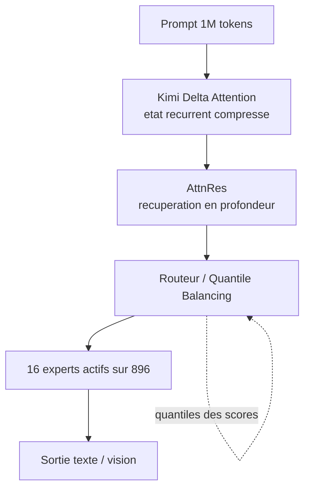

# IA — Détail du vendredi 17 juillet 2026

## 1. Kimi K3 (Moonshot AI) — 2,8 T de paramètres, Kimi Delta Attention, 1 M de contexte

**Source :** MarkTechPost — https://www.marktechpost.com/2026/07/16/moonshot-ai-releases-kimi-k3-a-2-8-trillion-parameter-open-moe-model-with-kimi-delta-attention-and-1m-context/
**Date :** 16 juillet 2026

### Contexte

Moonshot AI a publié Kimi K3 : 2,8 trillions de paramètres, vision native, fenêtre de contexte d'un million de tokens. Moonshot le présente comme le premier modèle ouvert de classe 3T. Sur neuf des douze derniers mois, les modèles Kimi ont défini la borne haute de la taille des modèles ouverts — K3 continue cette trajectoire. Les [détails techniques officiels](https://www.kimi.com/blog/kimi-k3) annoncent les poids en open source d'ici le **27 juillet 2026**.

Moonshot est direct sur le positionnement, et c'est à leur crédit : la performance globale reste **derrière** les modèles propriétaires les plus puissants. Le fait notable n'est pas un dépassement — c'est qu'un modèle dont on aura les poids atteigne ce niveau. Deux nouveautés d'architecture portent le gain : **Kimi Delta Attention** (KDA) et **Attention Residuals** (AttnRes). Elles agissent sur deux axes différents : la **longueur de séquence** et la **profondeur**.

### Comment ça marche

Reprenons les trois leviers, un par un.

**1. KDA — l'axe séquence.** L'attention classique coûte quadratiquement en longueur de contexte. À 1 M de tokens, c'est intenable en décodage. KDA est une attention **linéaire hybride** : un raffinement de Gated DeltaNet avec un *gating* plus fin, qui gère plus efficacement la mémoire récurrente finie du modèle. Traduction concrète : au lieu de re-consulter tout l'historique à chaque token, le modèle maintient un état compressé et décide, avec une granularité fine, quoi y écraser. Moonshot annonce jusqu'à **6,3× plus rapide en décodage** sur contexte du million.

**2. AttnRes — l'axe profondeur.** Un transformer empile des dizaines de blocs, chacun accumulant uniformément dans le flux résiduel. AttnRes **récupère sélectivement** des représentations à travers la profondeur au lieu de les accumuler de façon uniforme. Gain annoncé : **~25 % d'efficacité d'entraînement en plus, pour moins de 2 % de coût additionnel**.

**3. La sparsité — Stable LatentMoE.** K3 active **16 experts sur 896**. À ce niveau de sparsité, le *routing* devient le problème de premier ordre : si le routeur privilégie toujours les mêmes experts, les autres ne s'entraînent jamais. Moonshot répond avec **Quantile Balancing**, qui dérive l'allocation des experts directement des **quantiles des scores du routeur** — ça supprime les mises à jour heuristiques et un hyperparamètre d'équilibrage sensible. S'y ajoutent **Per-Head Muon** (optimisation indépendante par tête d'attention), **SiTU** et **Gated MLA**.

Ensemble : **~2,5× de meilleure efficacité de scaling** que Kimi K2.

**4. Le serving.** K3 applique la **quantization-aware training dès l'étape SFT** — le modèle apprend à vivre en basse précision au lieu de la subir. Poids en **MXFP4**, activations en **MXFP8**, pour une compatibilité matérielle large. Moonshot recommande des supernœuds de **64 accélérateurs ou plus**. Détail qui parle : KDA pose de nouveaux problèmes de **prefix caching**, et Moonshot a contribué une implémentation à **vLLM**.



### En pratique — exemple de code

```python
# Appel minimal à K3 via le SDK OpenAI (base_url Moonshot).
# Quatre regles a respecter, sinon l'API refuse ou degrade la sortie.
from openai import OpenAI
import os

client = OpenAI(api_key=os.environ["MOONSHOT_API_KEY"],
                base_url="https://api.moonshot.ai/v1")

completion = client.chat.completions.create(
    model="kimi-k3",
    reasoning_effort="max",          # seule valeur supportee ; ne PAS utiliser `thinking` (K2.x)
    messages=[{"role": "user", "content": "Resume ce repo en 5 points."}],
    max_completion_tokens=131072,    # defaut ; monte jusqu'a 1048576
    # temperature / top_p / n sont figes cote serveur -> les omettre
)
print(completion.choices[0].message.content)
```

Le tarif est **plat**, sans palier lié au contexte : **0,30 $/MTok** en cache-hit, **3,00 $/MTok** en cache-miss, **15,00 $/MTok** en sortie. Le facteur 10× entre hit et miss fait du **taux de cache** ton unique variable de coût. Moonshot rapporte plus de 90 % de cache-hit sur des charges de codage — ce qui suppose des prompts à préfixe stable.

### Pourquoi ça compte pour toi

Deux choses. D'abord le 27 juillet : des poids de classe 3T sous licence MIT modifiée, c'est un plancher de capacité que tu peux auditer et héberger. Ensuite le prefix caching : si tu bâtis un agent sur ton repo, **ordonne tes prompts avec le contexte stable en tête** — le facteur 10× hit/miss décide de ta facture, pas le modèle.

### Limites

- **Poids pas encore là** : annonce le 16 juillet, publication le 27. Aujourd'hui, c'est une API.
- **Matériel** : 64+ accélérateurs recommandés. L'auto-hébergement n'est pas une option pour un poste de dev.
- **Benchmarks à lire avec les caveats** : tous les résultats K3 utilisent `reasoning_effort=max`, et BrowseComp s'appuie sur une compaction de contexte à 300 K (sans elle, 90,4 au lieu de 91,2).

---

## 2. NVIDIA Nemotron 3 Embed — le 8B prend la première place du RTEB

**Source :** Hugging Face Blog (NVIDIA) — https://huggingface.co/blog/nvidia/nemotron-3-embed-wins-rteb
**Date :** 16 juillet 2026

### Contexte

Dans un RAG, on parle beaucoup du LLM et très peu de l'embedder. C'est une erreur de priorité. Le générateur ne peut pas répondre correctement sur des documents que le *retriever* n'a pas ramenés : une mauvaise récupération plafonne la qualité finale, quel que soit le modèle en aval. NVIDIA sort **Nemotron 3 Embed**, une collection de modèles d'embedding ouverts et utilisables commercialement, visant le RAG en production, la récupération agentique, la recherche de code et la mémoire d'agents.

Le **Nemotron-3-Embed-8B-BF16** prend la **1ʳᵉ place du RTEB avec 78,5**, et 75,5 % sur MMTEB Retrieval. Le RTEB mesure la précision de récupération sur des tâches réelles — c'est justement le point : une meilleure récupération donne aux agents un contexte plus pertinent, donc des réponses plus justes. La collection ne se limite pas au 8B : elle compte trois modèles ouverts qui couvrent la courbe précision/efficacité, avec des variantes **1B** conçues pour le déploiement à grande échelle.

### Comment ça marche

Un embedder transforme un texte en vecteur. Deux textes de sens proche donnent des vecteurs proches. Tout le RAG repose là-dessus, en deux temps.

**1. Indexation (hors ligne).** Tu découpes tes documents en *chunks*, tu passes chaque chunk dans l'embedder, tu stockes le vecteur résultant dans une base — pgvector sur PostgreSQL, par exemple. Ça se fait une fois, puis à chaque mise à jour documentaire.

**2. Requête (en ligne).** La question de l'utilisateur passe dans **le même** embedder. Tu cherches les *k* vecteurs les plus proches (cosinus ou produit scalaire), tu récupères les chunks correspondants, tu les injectes dans le prompt du LLM.

Le point à retenir : **indexation et requête doivent utiliser le même modèle**. Changer d'embedder impose une **ré-indexation complète** — les espaces vectoriels de deux modèles ne sont pas comparables. C'est ce qui rend le choix initial structurant, et c'est pourquoi un gain de RTEB se paie en coût de migration.

Nemotron 3 Embed a été évalué sur **34 langues**, dont le français, l'allemand, l'espagnol, l'arabe, le chinois et le japonais, avec des capacités **cross-lingues** : une question en français peut retrouver un document en anglais. Pour une base documentaire mixte — le cas courant en entreprise européenne — c'est l'argument décisif, bien avant le score global.

Le choix 8B vs 1B est un arbitrage explicite. Le 8B maximise la précision mais coûte plus cher par chunk indexé et par requête. Les 1B visent la production à l'échelle : latence et coût maîtrisés, précision légèrement en retrait. À toi de mesurer ce que 2 ou 3 points de RTEB valent sur *ton* corpus.

### En pratique — exemple de code

```python
# Indexation + requete avec Nemotron 3 Embed via sentence-transformers.
# Regle d'or : le meme modele sert a indexer et a interroger.
from sentence_transformers import SentenceTransformer
import numpy as np

model = SentenceTransformer("nvidia/Nemotron-3-Embed-8B-BF16", trust_remote_code=True)

# 1) Hors ligne : on vectorise les chunks (a stocker dans pgvector).
chunks = [
    "EF Core 10 introduit les filtres de requete nommes.",
    "Les unions C# 15 rendent le switch exhaustif au compilateur.",
]
doc_vecs = model.encode(chunks, normalize_embeddings=True)

# 2) En ligne : question en francais, corpus mixte -> le cross-lingue joue ici.
q_vec = model.encode(["comment rendre un switch exhaustif ?"], normalize_embeddings=True)

# Vecteurs normalises => le produit scalaire EST la similarite cosinus.
scores = np.dot(q_vec, doc_vecs.T)[0]
print(chunks[int(np.argmax(scores))])   # -> le chunk sur les unions C# 15
```

### Pourquoi ça compte pour toi

Tu as déjà `SqlVector<float>` et `VectorDistance()` en EF Core 10, ou pgvector côté PostgreSQL. La brique manquante était un embedder ouvert, multilingue et sérieux — le voilà, en 8B pour la précision, en 1B pour la production. Si ton corpus est franco-anglais, teste le cross-lingue avant tout : c'est là que tu gagnes le plus. Et budgète la ré-indexation, elle est inévitable.

### Points de vigilance

- **Ré-indexation obligatoire** si tu changes d'embedder : chiffre le coût GPU sur ton volume réel avant de t'engager.
- **Le benchmark n'est pas ton corpus** : RTEB est une moyenne sur des tâches génériques. Monte un jeu d'évaluation maison de 50 à 100 questions représentatives — c'est le seul chiffre qui compte.
- **La dimension du vecteur** pilote le coût de stockage et d'index dans pgvector. Vérifie-la avant de dimensionner ta table.

---
