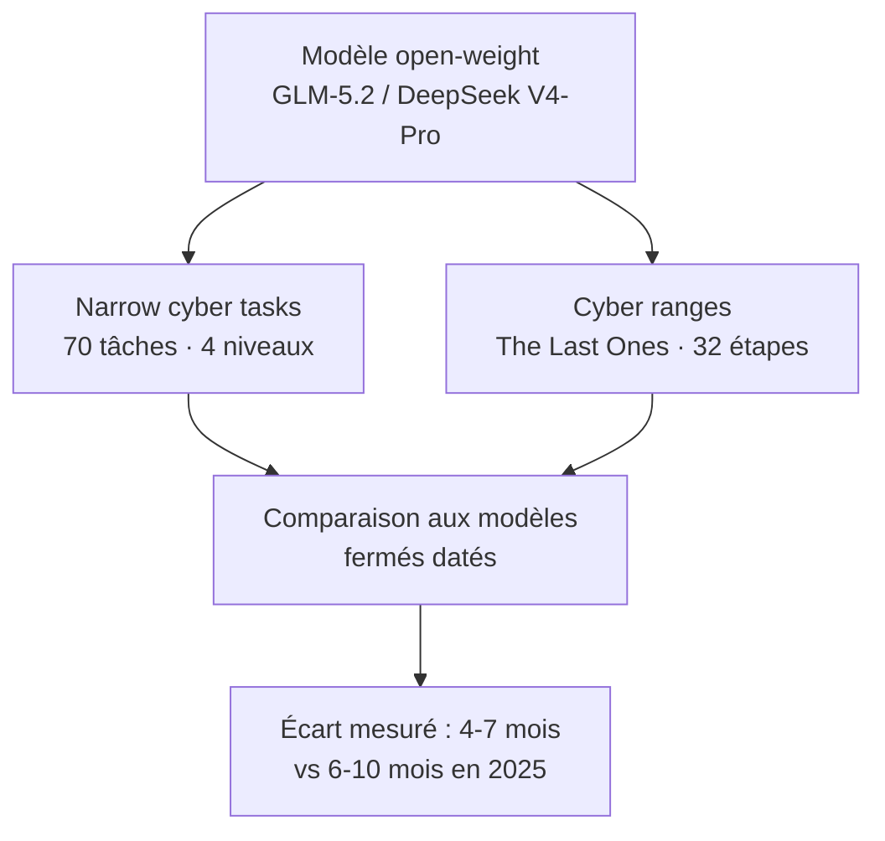

# IA — Détail du samedi 18 juillet 2026

## 1. AISI — l'écart cyber des modèles open-weight tombe à 4-7 mois (GLM-5.2, DeepSeek V4-Pro)

**Source :** AI Security Institute (AISI) — https://www.aisi.gov.uk/blog/how-far-behind-the-frontier-are-leading-open-weight-models-on-cyber
**Date :** 17 juillet 2026

### Contexte

L'AISI, organisme de recherche du gouvernement britannique (rattaché au DSIT), suit les capacités cyber des modèles de pointe depuis 2023. Le constat historique est stable : les modèles **fermés** (poids privés, accès via une API contrôlée) dominent, et les modèles **open-weight** (poids téléchargeables, exécutables et modifiables par tous) suivent avec du retard. La question vive : de combien, et cet écart se réduit-il ?

C'est la première analyse publique de l'AISI sur ce point précis. L'enjeu n'est pas académique. L'écart mesure la **fenêtre de préparation** dont disposent les défenseurs. Tant que les capacités offensives de pointe restent derrière une API surveillée, on peut détecter, filtrer, bannir. Une fois des poids équivalents publiés, ces leviers disparaissent définitivement : la fenêtre, c'est le temps d'avance pour durcir tes défenses.

### Comment ça marche

L'AISI mesure sur deux axes complémentaires. D'abord les **narrow cyber tasks** : 70 tâches (sous-ensemble d'un jeu de 96), réparties sur 4 niveaux — du « non-expert technique » à « expert » — couvrant recherche et exploitation de vulnérabilités, reverse engineering, exploitation web et cryptographie. Protocole : 5 tentatives par tâche, budget de 2,5 M tokens par tentative. Ensuite les **cyber ranges** : des réseaux simulés où le modèle doit mener une attaque **de bout en bout, en autonomie**, sur une longue chaîne d'étapes. La range « The Last Ones » compte 32 étapes, 4 sous-réseaux, ~20 hôtes ; un expert humain mettrait ~20 h. Budget : 100 M tokens par run.

Résultat clé : **GLM-5.2** (juin 2026) est le modèle open-weight le plus cyber-capable testé. Sur les tâches ciblées, il fait jeu égal avec des modèles fermés sortis **4 mois plus tôt** (Opus 4.6, GPT-5.3-Codex), et ce à tous les niveaux de difficulté. **DeepSeek V4-Pro** se compare à Opus 4.5, sorti 5 mois avant lui. Sur les cyber ranges (preuve plus faible, car moins de ranges), GLM-5.2 atteint le niveau d'Opus 4.5, publié moins de 7 mois plus tôt. Bilan global : **retard de 4 à 7 mois**, contre 6 à 10 mois mesurés en interne en 2025. L'écart se resserre.



### En pratique — exemple de code

Point saillant de l'analyse : sur open-weight, **aucun garde-fou n'est hérité**. Le monitoring, le bannissement d'utilisateur, les classifieurs d'accès exigent le contrôle de l'accès au modèle — impossible une fois les poids publics. Le refus entraîné est souvent réversible avec accès aux poids. Si tu auto-héberges, c'est donc à toi d'ajouter tes couches. Le code ci-dessous montre un garde-fou minimal côté serveur (journalisation + quota + heuristique de blocage) autour d'une inférence auto-hébergée.

```python
# Garde-fou minimal côté serveur pour un modèle open-weight auto-hébergé.
# Sur open-weight, aucun garde-fou n'est hérité : c'est à TOI de l'ajouter.
import logging, time
from collections import defaultdict

logging.basicConfig(filename="llm_audit.log", level=logging.INFO)
_hits = defaultdict(list)                       # rate-limit par utilisateur
BLOCK = ("reverse shell", "cve-", "payload msf", "exfiltrate")

def guarded_generate(user_id: str, prompt: str, model) -> str:
    now = time.time()
    _hits[user_id] = [t for t in _hits[user_id] if now - t < 60]
    if len(_hits[user_id]) >= 20:               # 20 requêtes/min max
        raise RuntimeError("rate limit dépassé")
    _hits[user_id].append(now)

    logging.info("user=%s prompt=%r", user_id, prompt)   # traçabilité = dissuasion
    if any(k in prompt.lower() for k in BLOCK):
        logging.warning("prompt bloqué user=%s", user_id)
        return "Requête refusée."
    return model.generate(prompt)               # sinon, inférence normale
```

Ce code journalise chaque appel, applique un quota par utilisateur et bloque quelques motifs sensibles avant d'atteindre le modèle.

### Pourquoi ça compte pour toi

Si tu déploies un LLM open-weight en interne (souveraineté, coût, données qui ne sortent pas), tu hérites aussi de sa surface offensive : refus contournables, aucun bannissement possible. Ajoute tes propres couches — journalisation, quotas, revue des prompts sensibles — côté serveur, là où tu gardes le contrôle. Et côté défense : la fenêtre se réduit, donc renforce tes bases (MFA, segmentation, détection) avant que ces capacités ne se banalisent.

### Pour aller plus loin

- L'AISI testera **Kimi K3** sur la même base dès la publication de ses poids (annoncée fin juillet).
- Coût d'un run de 100 M tokens sur « The Last Ones » : ~46 $ (GLM-5.2) et ~1,19 $ (DeepSeek V4-Pro), contre ~85 $ pour Opus 4.5/4.6 — l'écart de prix, lui, est déjà gigantesque.
