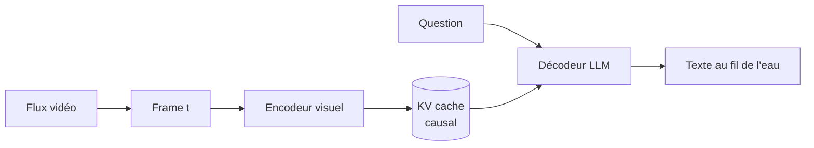

# IA — Détail du lundi 20 juillet 2026

## 1. MOSS-VL-Realtime — un modèle vision-langage open-weight taillé pour le flux vidéo temps réel

**Source :** Hugging Face — https://huggingface.co/OpenMOSS-Team/MOSS-VL-Realtime
**Date :** publié le 14 juillet 2026 (carte mise à jour le 15 juillet)

### Contexte

Week-end creux côté poids ouverts : depuis Kimi K3 (annoncé le 16 juillet, poids attendus le 27), rien de majeur. L'exception discrète mais intéressante vient de l'équipe **OpenMOSS** (Fudan) avec **MOSS-VL-Realtime** : un modèle **vision-langage de ~11,3 milliards de paramètres**, sous licence **Apache 2.0**, dédié à la compréhension **temps réel** d'images et surtout de **flux vidéo en streaming**. Là où un VLM classique avale une vidéo entière puis répond, celui-ci vise le *« regarder et commenter au fil de l'eau »*, avec une latence basse.

### Comment ça marche

La compréhension vidéo *streaming* résout un problème de coût : ré-encoder toute la vidéo à chaque nouvelle question est quadratique et intenable en direct. Les modèles temps réel comme MOSS-VL-Realtime procèdent typiquement ainsi (l'implémentation exacte est dans le dépôt) :

1. **Ingestion incrémentale** : chaque frame (ou petit lot) passe dans un encodeur visuel et devient une poignée de tokens visuels.
2. **Mémoire causale** : ces tokens s'ajoutent au **KV cache** du décodeur ; les frames passées ne sont pas recalculées, seule la nouvelle est encodée.
3. **Réponse entrelacée** : à tout instant, le modèle peut émettre du texte conditionné sur tout ce qu'il a vu **jusqu'ici**, sans attendre la fin du clip.



Le compromis clé : une **fenêtre temporelle** et une compaction du cache pour tenir en mémoire sur un flux long, au prix d'un oubli progressif des détails anciens. C'est le même arbitrage que pour le contexte long en texte, transposé au temps.

### En pratique — exemple de code

Le modèle embarque du **code personnalisé** (`trust_remote_code`), donc l'usage suit sa carte. Le squelette d'inférence ressemble à ceci :

```python
# pip install "transformers>=5" accelerate
from transformers import AutoModel, AutoProcessor
import torch

model_id = "OpenMOSS-Team/MOSS-VL-Realtime"
proc = AutoProcessor.from_pretrained(model_id, trust_remote_code=True)
model = AutoModel.from_pretrained(
    model_id, trust_remote_code=True,
    torch_dtype=torch.bfloat16, device_map="auto")

# Boucle streaming : on pousse les frames au fil de l'eau, on interroge sans tout ré-encoder
state = None
for frame in video_frames():                       # ton itérateur de frames
    inputs = proc(images=frame, return_tensors="pt").to(model.device)
    state = model.stream_step(**inputs, state=state)  # met à jour le KV cache
answer = model.generate_text("Que se passe-t-il maintenant ?", state=state)
print(answer)
```

Reporte-toi à la carte du modèle pour les noms exacts de méthodes et le pré-traitement des frames.

### Pourquoi ça compte pour toi

Un VLM temps réel de 11B ouvre des usages que tu peux héberger toi-même : modération de live, supervision d'un flux caméra, sous-titrage/alerting sur vidéo entrante, sans envoyer tes images à une API tierce. Poids Apache 2.0 = intégrable dans un service .NET/Python maison. À évaluer avant prod : latence réelle par frame et VRAM nécessaire selon ta cadence.

### Limites

Carte modèle jeune (85 likes, faible volume de retours) : benchmarks indépendants encore rares. Le *streaming* implique un oubli des détails anciens — inadapté si tu dois raisonner sur toute une vidéo longue d'un bloc.
