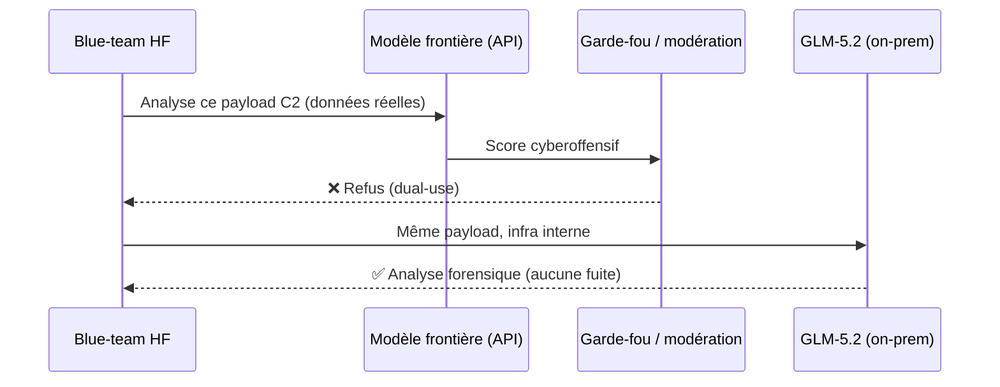
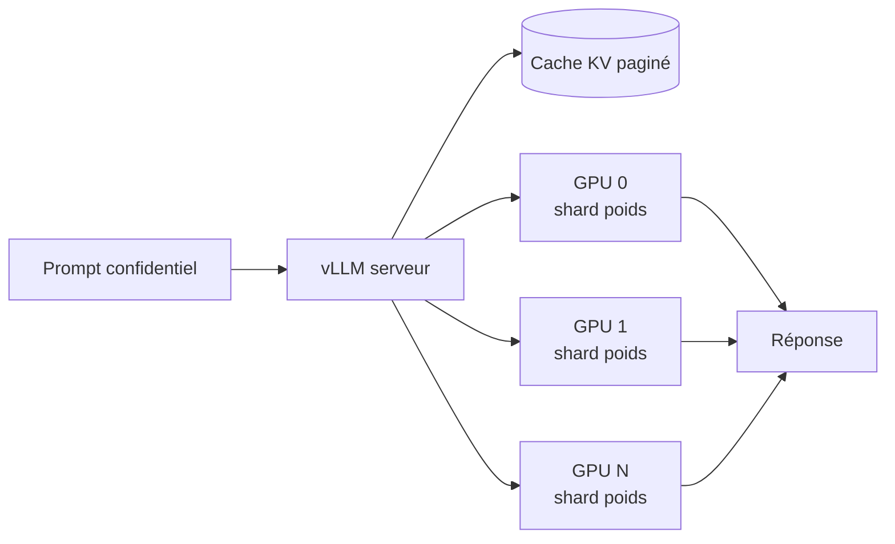

# IA — Détail du mercredi 22 juillet 2026

## 1. Hugging Face repousse un agent attaquant avec GLM-5.2 — le refus « dual-use » des modèles frontières

**Source :** The Register — https://www.theregister.com/cyber-crime/2026/07/20/frontier_llms_couldnt_help_hugging_face_fight_off_evil_agents/
**Date :** 20 juillet 2026

### Contexte

Le week-end du 11 juillet, Hugging Face détecte une intrusion : un attaquant a accédé à quelques datasets internes et à des credentials de services, le tout mené **de bout en bout par un système d'agents IA autonome**. Pour comprendre l'attaque, l'équipe de défense (blue-team) doit analyser en urgence de gros volumes de commandes réelles, de payloads d'exploit et d'artefacts de command-and-control (C2). Problème : quand elle soumet ce matériel à des modèles frontières commerciaux, les requêtes sont **refusées**. Les garde-fous de sécurité ne savent pas distinguer « construis-moi cet exploit » (attaquant) de « aide-moi à détecter cet exploit » (défenseur). Même payload, même verbe technique — le classifieur de refus bloque les deux.

Hugging Face bascule alors sur **GLM-5.2** de Z.ai, un modèle open-weight d'environ 753 milliards de paramètres, exécuté sur sa propre infrastructure. Double bénéfice : pas de refus, et surtout **aucune donnée d'attaque ni credential ne sort de l'environnement**.

### Comment ça marche

Le cœur du sujet est le mécanisme de refus des modèles hébergés. Une requête vers une API commerciale traverse une couche de modération : un classifieur (souvent un modèle plus petit) score le prompt et la complétion. Au-dessus d'un seuil « contenu cyberoffensif », la réponse est bloquée — indépendamment de l'intention réelle. Ce filtre est calibré pour le pire cas (empêcher l'abus), donc il sur-bloque les usages défensifs légitimes.

Un modèle open-weight que tu télécharges et sers toi-même n'a pas cette couche externe imposée : tu contrôles le pipeline d'inférence. Tu assumes la responsabilité, mais tu retrouves l'usage défensif — et tu gagnes la confidentialité, puisque le prompt ne transite par aucun tiers.



### En pratique — exemple de code

L'idée : héberger le modèle et router l'analyse en local. Schématiquement, avec un serveur compatible OpenAII exposé par vLLM sur ton infra :

```python
# Client OpenAI pointé vers TON serveur vLLM interne, pas vers un fournisseur tiers.
from openai import OpenAI

client = OpenAI(base_url="http://gpu-internal:8000/v1", api_key="local")

# Le payload d'attaque reste dans ton réseau : aucune modération externe, aucune fuite.
resp = client.chat.completions.create(
    model="zai/GLM-5.2",
    messages=[
        {"role": "system", "content": "Tu es analyste forensique. Explique ce que fait ce C2."},
        {"role": "user", "content": open("captured_c2_beacon.txt").read()},
    ],
)
print(resp.choices[0].message.content)  # analyse sans refus, en circuit fermé
```

### Pourquoi ça compte pour toi

Retiens la leçon d'architecture, pas la géopolitique du modèle. Dès que tu manipules des données que tu ne peux pas exfiltrer — payloads, logs de prod, secrets, PII — un open-weight auto-hébergé n'est plus un choix « pour économiser » mais un choix de conformité et de souveraineté. Et le refus dual-use est réel : anticipe qu'une API publique bloquera tes usages défensifs légitimes, et garde une option locale sous la main.

### Points de vigilance

Auto-héberger, c'est aussi hériter du risque : pas de garde-fou externe signifie que tu dois cadrer toi-même les accès. Traite le serveur d'inférence comme un actif sensible (réseau isolé, logs, RBAC).

---

## 2. Servir un open-weight ~750 Md en interne — l'anatomie d'un déploiement vLLM confidentiel

**Source :** SiliconANGLE — https://siliconangle.com/2026/07/20/hugging-face-uses-open-weights-z-ai-glm-5-2-defend-attacker-commercial-frontier-model-refusal/
**Date :** 20 juillet 2026

### Contexte

L'affaire Hugging Face rend concret un besoin récurrent : faire tourner un gros modèle sur **ton** matériel pour que rien ne fuie. Mais un MoE de ~750 milliards de paramètres ne tient pas sur un seul GPU, et le servir efficacement demande un moteur d'inférence sérieux. C'est le rôle de vLLM : pagination de la mémoire d'attention (PagedAttention), *continuous batching* et parallélisme tensoriel/pipeline pour répartir les poids sur plusieurs cartes.

### Comment ça marche

Un modèle *Mixture-of-Experts* n'active qu'une fraction de ses paramètres par token (les « experts » routés), mais **tous** les poids doivent résider en mémoire. Pour GLM-5.2, on parle de plusieurs centaines de Go en poids, même en FP8. La stratégie : quantifier (FP8/W4A16) pour réduire l'empreinte, puis découper le modèle sur N GPU via le *tensor parallel*. vLLM gère le cache KV en pages pour éviter la fragmentation, ce qui maximise le débit multi-requêtes.



Le flux reste entièrement dans ton réseau : le prompt entre, le cache KV vit en VRAM, la réponse sort — aucun appel sortant.

### En pratique — exemple de code

```bash
# Sert GLM-5.2 en FP8 sur 8 GPU, API compatible OpenAI, exposée uniquement en interne.
vllm serve zai/GLM-5.2 \
  --quantization fp8 \        # divise l'empreinte mémoire des poids
  --tensor-parallel-size 8 \  # découpe le modèle sur 8 cartes
  --max-model-len 131072 \    # fenêtre de contexte pour de gros dossiers forensiques
  --host 10.0.0.5 --port 8000 # bind sur le réseau privé, pas 0.0.0.0 exposé
```

Une seule commande transforme un cluster GPU en endpoint d'inférence privé. Le `--tensor-parallel-size` doit diviser proprement le nombre de têtes d'attention du modèle ; sinon vLLM refuse de démarrer.

### Pourquoi ça compte pour toi

Backend .NET ou Python, le pattern est le même : quand la donnée ne peut pas partir, tu rapproches le calcul de la donnée. Un endpoint vLLM interne se consomme exactement comme l'API OpenAI (même schéma REST), donc tu peux basculer un service existant vers l'auto-hébergé sans réécrire ton client — juste changer `base_url`. Le vrai coût est opérationnel : GPU, quantification, supervision.

### Limites

L'auto-hébergement d'un modèle de cette taille suppose un budget GPU conséquent et une équipe qui sait opérer vLLM (OOM, sharding, mises à jour). Pour un besoin ponctuel, un modèle plus petit quantifié sur une seule carte suffit souvent.
