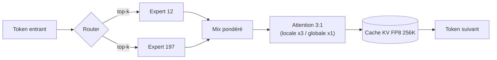

# IA — Détail du vendredi 24 juillet 2026

## 1. Laguna XS 2.1 (Poolside) — MoE 33B/3B agentique qui code au-dessus de sa catégorie

**Source :** MarkTechPost — https://www.marktechpost.com/2026/07/21/poolside-releases-laguna-s-2-1/
**Date :** 21 juillet 2026 (poids publiés le 2 juillet, carte : https://huggingface.co/poolside/Laguna-XS-2.1)

### Contexte

Poolside est un labo qui ne fait qu'une chose : des modèles de fondation pour le **code agentique** (planifier, éditer des fichiers, lancer des outils, lire des logs de test, déboguer sur des dizaines d'étapes). Laguna XS 2.1 est la version « extra-small » de leur famille : elle vise le cas où tu veux un modèle **privé, local, sur un seul GPU** plutôt qu'un géant hébergé. Le problème qu'elle attaque : les gros modèles de code sont excellents mais coûteux à servir et impossibles à garder chez toi. Poolside parie qu'un MoE compact bien conçu peut rivaliser avec des modèles 10× plus lourds sur les benchmarks de résolution de tickets (SWE-bench).

### Comment ça marche

Le cœur, c'est un **Mixture-of-Experts (MoE)**. Sur 33 milliards de paramètres au total, seuls **3 milliards s'activent par token**. Un petit réseau *router* choisit, pour chaque token, quels experts (parmi 256, répartis sur 40 couches) traitent l'information. Résultat : la mémoire d'un modèle 33B mais le coût de calcul d'un 3B.

Deux optimisations rendent le contexte de **256K tokens** tenable en local :

1. **Attention mixte fenêtre glissante + globale, ratio 3:1.** Trois couches sur quatre n'attardent leur attention que sur une fenêtre locale récente (coût linéaire) ; une couche sur quatre garde une attention globale (vue complète). Tu payes le prix quadratique de l'attention seulement 25 % du temps.
2. **Cache KV en FP8.** Les clés/valeurs mémorisées sont stockées en 8 bits flottants, divisant l'empreinte mémoire du cache — c'est ce qui fait tenir 256K tokens sur un seul GPU.

Le *gating sigmoïde par tête* affine encore quelle tête d'attention contribue, et le modèle fait du **raisonnement entrelacé** (il alterne réflexion et action au lieu de tout « penser » d'un bloc).



### En pratique — exemple de code

Servir le modèle en local avec vLLM, puis l'interroger comme une API OpenAI classique — c'est le chemin le plus direct pour le brancher dans ton agent de code.

```bash
# 1. Servir Laguna XS 2.1 en FP8 sur un seul GPU (contexte réduit ici pour la VRAM)
vllm serve poolside/Laguna-XS-2.1 \
  --kv-cache-dtype fp8 \
  --max-model-len 65536 \
  --port 8000

# 2. L'appeler comme n'importe quel endpoint compatible OpenAI
curl http://localhost:8000/v1/chat/completions \
  -H "Content-Type: application/json" \
  -d '{
    "model": "poolside/Laguna-XS-2.1",
    "messages": [{"role":"user","content":"Refactore ce repository en isolant la couche data"}]
  }'
```

### Pourquoi ça compte pour toi

Tu peux héberger un assistant de code **sur ta machine**, sans envoyer ton code C#/Angular à un tiers. Un MoE 33B/3B tient sur un GPU desktop et sert un vrai contexte long (mono-repo entier). Le combo cache KV FP8 + attention 3:1 est le pattern à connaître : c'est ce qui rend l'inférence longue-contexte abordable. Évalue-le sur ta base réelle avant d'y croire — les scores SWE-bench sont *first-party*.

### Points de vigilance

Les benchmarks (SWE-bench Multilingual 63,1 %, Verified 70,9 %) viennent de Poolside ; aucune reproduction indépendante à ce jour. La licence **OpenMDW-1.1** n'est pas une MIT/Apache classique — relis ses clauses avant un usage commercial.
