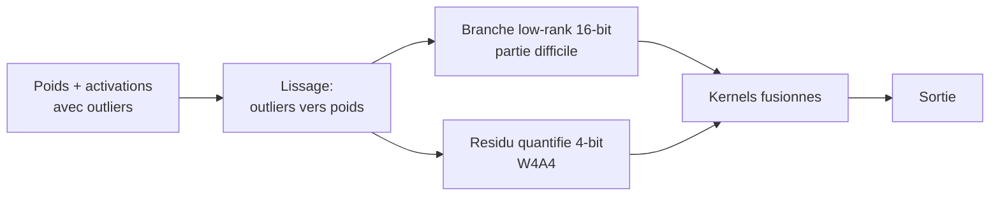
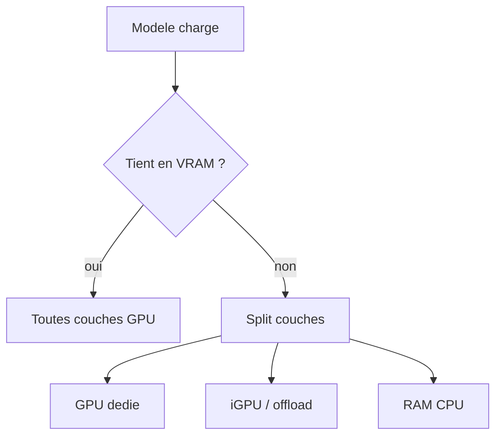

# IA — Détail du samedi 25 juillet 2026

## 1. Nunchaku Lite dans Diffusers — l'inférence 4-bit (SVDQuant) qui accélère au lieu de ralentir

**Source :** Hugging Face Blog — https://huggingface.co/blog/nunchaku-diffusers
**Date :** 23 juillet 2026

### Contexte

Un transformer de diffusion moderne (texte→image) chargé en BF16 réclame 20-30 Go de VRAM : hors de portée d'un GPU grand public. La quantization règle le problème, et `diffusers` intègre déjà plusieurs backends (bitsandbytes, GGUF, torchao, Quanto). Mais ils sont presque tous **weight-only** : ils stockent les poids en basse précision puis les **déquantifient** en 16-bit au moment du calcul. Résultat : la mémoire baisse, mais la vitesse **ne bouge pas** — voire se dégrade légèrement. SVDQuant, la méthode derrière le moteur Nunchaku, casse ce compromis. Jusqu'ici elle exigeait une lib d'inférence séparée ; c'est fini.

### Comment ça marche

SVDQuant fait tourner les couches lourdes du transformer en **W4A4** : poids **et** activations sur 4 bits. Comme le calcul se fait vraiment en 4-bit, la boucle de denoising accélère. Le défi : dans un transformer de diffusion, poids et activations contiennent de gros **outliers** qui font exploser une quantization 4-bit naïve. SVDQuant les neutralise en trois temps :

1. il **déplace les outliers d'activation dans les poids** (lissage) ;
2. il isole la partie la plus difficile de chaque matrice de poids dans une petite **branche low-rank 16-bit** ;
3. il quantifie le **résidu** restant sur 4 bits.

Nunchaku fusionne ces chemins dans des kernels dédiés pour éliminer le surcoût mémoire de la branche 16-bit. La nouveauté « Lite » : au lieu de kernels spécifiques à chaque modèle, `diffusers` **patche les `nn.Linear`** d'un pipeline standard avec des couches SVDQ/AWQ au chargement, et récupère les kernels CUDA via le package `kernels`. On perd le pic de vitesse des kernels sur-mesure, mais on garde **~30 % de speedup** et toute la réduction de VRAM.



### En pratique — exemple de code

Charger un checkpoint pré-quantifié ne demande rien de spécial : pas de compilation CUDA locale, juste `from_pretrained()`.

```python
# pip install -U diffusers transformers accelerate kernels bitsandbytes
from diffusers import ErnieImagePipeline
import torch

# Transformer Nunchaku NVFP4 + text-encoder bitsandbytes NF4
pipe = ErnieImagePipeline.from_pretrained(
    "lite-infer/ERNIE-Image-Turbo-nunchaku-lite-nvfp4_r32-bnb4-text-encoder",
    torch_dtype=torch.bfloat16,
).to("cuda")

# ~1.7 s pour un 1024x1024 sur RTX 5090, pic mémoire ~12 Go (vs ~24 Go en BF16)
image = pipe("un phare breton sous un ciel d'orage").images[0]
image.save("out.png")
```

Les kernels NVFP4 se téléchargent depuis le Hub au premier usage. NVFP4 exige un GPU Blackwell (RTX 50, RTX PRO 6000, B200) ; sur du matériel plus ancien, prends les variantes **INT4**.

### Pourquoi ça compte pour toi

Si tu déploies de la génération d'images côté serveur, tu viens de diviser la facture GPU par deux : un modèle qui exigeait un A100 40 Go tient sur une carte 16-24 Go, et il rend **plus vite**. Le checkpoint est un dépôt Diffusers ordinaire — pas de moteur d'inférence exotique à maintenir, pas de compilation. Tu intègres ça dans ton pipeline Python existant comme n'importe quel `from_pretrained()`.

---

## 2. Ollama v0.32.3 — support matériel élargi et téléchargements fiabilisés

**Source :** GitHub — https://github.com/ollama/ollama/releases/tag/v0.32.3
**Date :** 23 juillet 2026

### Contexte

Ollama est devenu le runtime local de référence pour servir des modèles ouverts sur un poste ou un petit serveur : une commande, un modèle, une API compatible OpenAI. Sa force est de **planifier automatiquement** l'inférence sur le matériel disponible — GPU dédié, iGPU, ou CPU en dernier recours. La v0.32.3 muscle ce support matériel et corrige un point d'usure : les téléchargements de modèles qui restaient bloqués avant même d'envoyer des données.

### Comment ça marche

Quand tu lances un modèle, Ollama estime la mémoire nécessaire par couche puis **répartit les couches** sur les backends disponibles. Si le modèle ne tient pas entièrement en VRAM, il en pousse une partie sur l'iGPU ou la RAM CPU (offload). La v0.32.3 améliore ce placement :

- **CUDA sur Windows ARM64** : les machines Snapdragon/ARM sous Windows accèdent enfin à l'accélération NVIDIA.
- **B200 via CUDA 12** : support des GPU datacenter Blackwell.
- **iGPU Linux moins gourmands** : conso mémoire réduite sur CUDA et ROCm intégrés — l'offload partiel devient viable sur plus de configs.
- **Modèles** : chat, *thinking* et *tool calling* pour Laguna 2.1, plus un fix d'inférence Metal et un correctif des tool calls GLM silencieusement perdus en fin de génération.



### En pratique — exemple de code

Tu forces ou observes le placement via les variables d'environnement et l'API :

```bash
# Voir comment Ollama répartit les couches (GPU vs CPU) au chargement
OLLAMA_DEBUG=1 ollama run laguna-xs:2.1 "explique un index GIN Postgres"

# Limiter le nombre de couches envoyées au GPU (utile si VRAM partagée)
OLLAMA_NUM_GPU=20 ollama serve
```

Avec `OLLAMA_DEBUG=1`, les logs indiquent combien de couches partent sur le GPU et combien restent en CPU — de quoi ajuster `OLLAMA_NUM_GPU` selon ta carte.

### Pourquoi ça compte pour toi

Si tu héberges un LLM local pour du RAG interne ou de l'assistance code, la répartition GPU/CPU décide de ton débit. La v0.32.3 rend l'offload iGPU Linux plus léger : tu peux servir un modèle un cran plus gros sur la même machine sans tomber en CPU pur. Et le fix des téléchargements bloqués supprime un point de friction récurrent en CI ou au provisioning d'un nouveau serveur.
