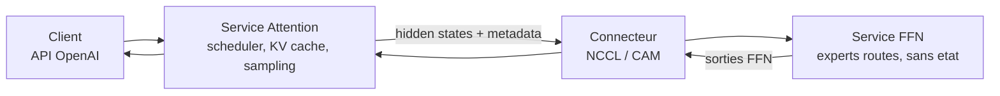

# IA — Détail du dimanche 26 juillet 2026

## 1. vLLM AFD Plugin — désagréger attention et FFN pour servir un MoE

**Source :** vLLM Blog — https://vllm.ai/blog/2026-07-23-vllm-afd-plugin
**Date :** 23 juillet 2026

### Contexte

Dans un transformer Mixture-of-Experts, chaque couche fait deux choses de nature radicalement différente. L'**attention** est *stateful* : elle dépend du KV cache, donc de l'historique de chaque requête, donc du scheduler et de la longueur de séquence. Le bloc **FFN** — les experts routés — est *stateless* : il reçoit des activations, applique quelques matrices, renvoie un résultat. Sa charge dépend du routage des tokens, pas de l'état des requêtes.

Jusqu'ici, ces deux mondes partageaient la même topologie de workers. Tu choisissais un parallélisme d'experts (EP64, par exemple) et l'attention suivait. Un seul jeu de compromis pour deux profils de charge opposés. Si ton trafic est long-contexte, l'attention sature bien avant les experts ; si tes prompts sont courts et le modèle très sparse, c'est l'inverse. Dans les deux cas, tu paies du matériel qui ne travaille pas.

### Comment ça marche

Le plugin découpe le runtime en trois briques, sans modifier le tronc vLLM — il s'accroche via l'entry point `vllm.general_plugins` et le canal `--additional-config`.

**Le service Attention** conserve tout ce qui touche à la requête : scheduler, KV cache, batching, cycle de vie du modèle, sampling. C'est lui qui expose l'API OpenAI-compatible. Un model runner fourni par le plugin injecte des métadonnées AFD dans le contexte de forward et publie l'état data-parallel, ubatch, couche et graphe vers le côté FFN.

**Le service FFN** n'a ni trafic de requêtes, ni scheduler, ni KV cache. Une boucle de fond reçoit métadonnées et activations, appelle `compute_ffn_output()` sur le wrapper de modèle, et renvoie le résultat. C'est un démon de calcul pur, qu'on peut dimensionner indépendamment.

**Le connecteur** fait la navette. À chaque couche de split, il transfère les hidden states de l'attention plus les métadonnées d'exécution, puis récupère les sorties FFN. L'interface est neutre vis-à-vis du backend : `P2pNcclAFDConnector` sur GPU NVIDIA en synchrone, `CAMP2pAFDConnector` sur NPU Ascend en synchrone, `CAMAsyncAFDConnector` sur NPU en asynchrone pour le prefill.

Le point contre-intuitif tient dans les chiffres. Sur DeepSeek V3.2 W8A8, la baseline EP64 fait 232,6 tokens/s/die à 16K d'entrée. La configuration **48A16F** (48 rangs attention, 16 rangs FFN) tombe à 220,3 — soit **−5,3 %**. La configuration **64A16F** monte à 258,9, soit **+11,3 %**. Autrement dit : désagréger ne garantit rien, c'est le **ratio attention/FFN** qui décide. À 32K d'entrée, même schéma : −10,0 % pour 48A16F, +9,0 % pour 64A16F. L'équipe en déduit que les rangs FFN gardaient de la marge de calcul, et qu'augmenter encore la part d'attention pourrait payer davantage.

Sur le chemin prefill asynchrone, l'effet est ailleurs : à 12 requêtes/seconde, le TTFT médian passe de **15,1 s à 8,0 s**, soit environ **−47 %**. Le gain vient du recouvrement — l'attention n'attend plus que les experts aient fini.



### En pratique — exemple de code

Deux services lancés séparément, reliés par le connecteur ; le client ne voit qu'une API OpenAI classique.

```bash
# Service FFN : 16 rangs experts, aucun trafic de requetes
vllm serve deepseek-ai/DeepSeek-V2-Lite \
  --additional-config '{"afd":{"role":"ffn","connector":"P2pNcclAFDConnector","ranks":16}}'

# Service Attention : 64 rangs, expose l'API OpenAI-compatible
vllm serve deepseek-ai/DeepSeek-V2-Lite \
  --additional-config '{"afd":{"role":"attention","connector":"P2pNcclAFDConnector","ranks":64}}' \
  --port 8000
```

```python
# Cote client : rien ne change, c'est du OpenAI standard
from openai import OpenAI
client = OpenAI(base_url="http://localhost:8000/v1", api_key="none")

resp = client.chat.completions.create(
    model="deepseek-ai/DeepSeek-V2-Lite",
    messages=[{"role": "user", "content": "Explique la desagregation attention/FFN."}],
)
print(resp.choices[0].message.content)
```

Les topologies exactes varient selon backend et modèle ; les recettes maintenues du dépôt font foi.

### Pourquoi ça compte pour toi

Si tu envisages d'héberger un MoE ouvert en interne, ce plugin change ton calcul de dimensionnement : tu peux ajouter des rangs d'attention sans toucher aux experts. Retiens surtout la leçon de méthode — la désagrégation seule ne donne rien, le ratio fait tout. Reste expérimental, épinglé sur vLLM 0.19.1 : à évaluer, pas à mettre en prod.

### Limites

Model runner v1 uniquement, poids complets chargés des deux côtés, graphe en mode decode seulement, exactement deux ubatches pour le Dual Batch Overlap. Les benchmarks publiés forcent un équilibrage déterministe des experts, ce qui modifie les sorties du modèle — ce sont des mesures de débit, pas de qualité.

---

## 2. Hugging Face MCP Server — un seul outil `hf_fs` et des Sandboxes

**Source :** Hugging Face Changelog — https://huggingface.co/changelog/mcp-improvements-jul-26
**Date :** 22 juillet 2026

### Contexte

Un serveur MCP paie un impôt permanent : la **définition de ses outils** occupe du contexte, à chaque tour, dans chaque conversation. Un serveur qui expose quinze outils avec leurs schémas JSON détaillés peut consommer plusieurs milliers de tokens avant même que l'assistant ait lu ta question. Sur un agent qui enchaîne les appels, ce coût se paie encore et encore.

Le serveur MCP de Hugging Face souffrait de ce travers : un outil pour chercher des modèles, un pour les datasets, un pour les Spaces, un pour les papers, un pour le filesystem des repos, etc. Chacun raisonnable isolément, l'ensemble coûteux. La refonte du 22 juillet remplace cette collection par un outil unique.

### Comment ça marche

`hf_fs` applique une idée simple : **traiter tout le Hub comme un système de fichiers**. Repos, storage buckets, documentation, papers deviennent des chemins dans un arbre unique. L'assistant navigue avec un vocabulaire qu'il maîtrise déjà — lister, lire, chercher — plutôt qu'avec une API par domaine.

Le bénéfice est double. Côté **budget**, la définition tient en un peu plus de 1 000 tokens, contre l'agrégat des outils précédents. Côté **comportement**, un modèle explore naturellement une arborescence : il liste, il descend, il lit. Ce pattern est mieux appris que « appeler `search_datasets` avec les bons filtres du premier coup ». La recherche est intégrée à l'outil, donc tu ne perds pas la capacité de trouver — tu la ramènes dans le même vocabulaire.

Les **Sandboxes** sont l'autre moitié de l'annonce, et elles répondent à un problème différent. Lire des métadonnées ne suffit pas pour analyser un dataset : il faut exécuter du code. Un Sandbox est un environnement d'exécution isolé **attaché à un bucket ou un repo**, ce qui veut dire que les données sont déjà là — pas de téléchargement, pas de transfert réseau vers ta machine. L'assistant peut y lancer une analyse exploratoire, un entraînement léger, ou construire un Space.

La conséquence pratique : le couple « navigation à bas coût + exécution proche des données » transforme l'assistant d'un lecteur de fiches en un outil qui manipule vraiment le Hub.

### En pratique — exemple de code

Déclaration du serveur côté client MCP, puis activation des Sandboxes.

```json
{
  "mcpServers": {
    "huggingface": {
      "type": "http",
      "url": "https://huggingface.co/mcp",
      "headers": {
        "Authorization": "Bearer ${HF_TOKEN}"
      }
    }
  }
}
```

```bash
# Verifier le token et ce que le serveur expose desormais
export HF_TOKEN="hf_..."
curl -s -H "Authorization: Bearer $HF_TOKEN" \
     -H "Content-Type: application/json" \
     -d '{"jsonrpc":"2.0","id":1,"method":"tools/list"}' \
     https://huggingface.co/mcp | jq '.result.tools[].name'
# Attendu : hf_fs en tete, la liste est nettement plus courte qu'avant
```

Les Sandboxes s'activent dans les réglages MCP du compte, sur https://huggingface.co/settings/mcp — ils ne sont pas actifs par défaut.

### Pourquoi ça compte pour toi

Si tu branches un agent sur plusieurs serveurs MCP, le budget de contexte devient vite ton facteur limitant. La démarche de Hugging Face — un outil générique plutôt que quinze spécialisés — est directement transposable si tu écris tes propres serveurs MCP pour tes APIs internes. Côté Sandboxes, applique la règle habituelle : un token à portée limitée, jamais ton token d'écriture principal.
