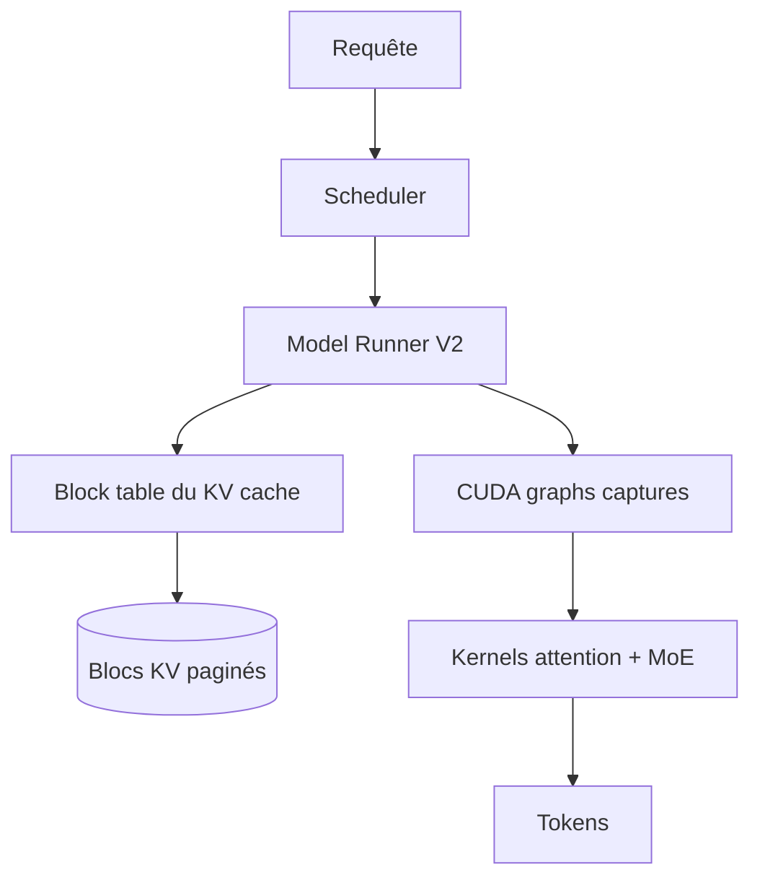
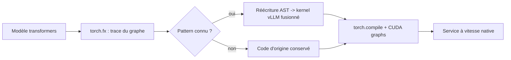

# IA — Détail du samedi 1er août 2026

## 1. vLLM v0.25.0 — Model Runner V2 par défaut et retrait du PagedAttention historique

**Source :** vLLM (GitHub Releases) — https://github.com/vllm-project/vllm/releases/tag/v0.25.0
**Date :** 11 juillet 2026

### Contexte

vLLM a bâti sa réputation sur PagedAttention : l'idée d'appliquer au KV cache la pagination mémoire des systèmes d'exploitation. Au lieu d'allouer un bloc contigu par séquence, dimensionné au pire cas, on découpe le cache en blocs de taille fixe indexés par une table. La fragmentation s'effondre, le batch effectif grimpe, le débit suit.

Le concept a essaimé partout — SGLang, TensorRT-LLM. Mais l'implémentation d'origine dans vLLM avait accumulé sept années de cas particuliers : modèles hybrides, multimodal, decoding spéculatif, chacun avec son chemin. La v0.25.0 acte le remplacement : **Model Runner V2 devient le défaut pour tous les modèles denses**, et le chemin PagedAttention historique est retiré.

### Comment ça marche

Il faut distinguer deux choses que le nom confond.

**La pagination du KV cache** reste. C'est un modèle mémoire, pas un morceau de code : blocs de taille fixe, table de blocs par séquence, partage par copy-on-write entre séquences qui partagent un préfixe. Rien de tout ça ne disparaît.

**Le model runner** est la couche qui orchestre un pas de forward : préparer les métadonnées d'attention, décider quelles séquences entrent dans le batch, appeler le kernel, gérer les graphes CUDA. C'est cette couche qui est réécrite.

Ce que MRv2 apporte, dans l'ordre d'impact pour un déploiement :

- **Prefix caching sur les hybrides Mamba.** Les modèles qui mélangent attention et state space n'avaient pas de cache de préfixe utilisable. MRv2 unifie la gestion des deux types d'état.
- **Decoding spéculatif dynamique compatible full CUDA graphs.** Auparavant, activer la spéculation forçait à retomber en mode eager sur une partie du graphe. Le nombre de tokens spéculés peut désormais varier sans casser la capture.
- **Attention bidirectionnelle sur préfixe multimodal.** Les tokens d'image d'un VLM peuvent s'attendre mutuellement, ce qui correspond à l'entraînement du modèle.
- **Embeddings temps réel et EVS** intégrés au même chemin d'exécution.



Le retrait de l'ancien chemin signifie qu'un plugin ou un modèle out-of-tree qui s'y accrochait cassera. C'est le prix d'un dépôt qui cesse de maintenir deux runners en parallèle.

### En pratique — exemple de code

```bash
# v0.25.0 : Model Runner V2 est le défaut, rien à activer.
pip install -U "vllm==0.25.0"

# Service standard : le prefix caching et les CUDA graphs sont actifs.
vllm serve Qwen/Qwen3-32B \
  --tensor-parallel-size 2 \
  --max-model-len 32768

# Decoding spéculatif dynamique, désormais compatible full CUDA graphs.
vllm serve Qwen/Qwen3-32B \
  --tensor-parallel-size 2 \
  --speculative-config '{"method":"ngram","num_speculative_tokens":5}'
```

### Pourquoi ça compte pour toi

Si tu sers un modèle open-weight en interne, la montée en 0.25 se fait sans changement de commande, et tu récupères gratuitement le prefix caching et des graphes CUDA complets sur le decoding spéculatif. Vérifie d'abord tes plugins maison : tout ce qui touchait l'ancien runner doit être testé. Épingle la version en CI plutôt que de suivre `latest`.

### Points de vigilance

Cette release retire du code public. Lis la section « removals » avant de bouger un cluster de production, surtout si tu utilises des backends d'attention custom ou du code de modèle hors dépôt.

---

## 2. Le backend `transformers` de vLLM atteint la vitesse native — `torch.fx` + réécriture d'AST

**Source :** Hugging Face Blog — https://huggingface.co/blog/native-speed-vllm-transformers-backend
**Date :** 8 juillet 2026, livré dans vLLM v0.25.0

### Contexte

`transformers` supporte plus de 450 architectures, avec une contrainte de conception forte : chaque implémentation est **auto-contenue et lisible**. C'est ce qui en fait la référence pour comprendre un modèle et le porter ailleurs — vLLM, SGLang, MLX, llama.cpp.

Le prix de cette lisibilité, c'est la vitesse. Le backend `transformers` de vLLM existait déjà : il permettait de servir n'importe quel modèle `transformers` dans le moteur vLLM en injectant l'implémentation d'attention de vLLM à l'exécution. Mais l'attention n'est qu'une dimension de la performance. Le parallélisme entre GPU, la compilation, les kernels fusionnés — tout ça restait l'apanage des portages écrits à la main. Un auteur de modèle devait donc l'intégrer deux fois : une fois dans `transformers`, une fois dans vLLM.

### Comment ça marche

La nouvelle version applique les optimisations d'inférence **dynamiquement, au chargement**, sur le code `transformers` d'origine. En trois temps.

**1. Tracing.** `torch.fx` fait de l'analyse statique sur le graphe du modèle et produit une représentation manipulable de la suite d'opérations.

**2. Reconnaissance de patterns.** Le backend cherche des motifs connus. Trois projections linéaires successives Q, K, V ? C'est un `QKVParallelLinear` de vLLM. Une boucle sur des experts MoE ? C'est le kernel d'expert parallelism. Deux linéaires en parallèle sur la même entrée ? C'est un `MergedColumnParallelLinear`.

**3. Réécriture.** Le backend manipule l'**AST** — l'arbre syntaxique du code Python — pour remplacer sur place les opérations reconnues par leurs équivalents fusionnés. Le résultat est du code Python valide, toujours compilable par `torch.compile` et capturable en CUDA graphs.



Deux effets de bord importants. La reconnaissance des blocs fusionnés permet aussi d'**inférer les plans de parallélisme** : le TP se déduit des linéaires fusionnées, le PP de la liste identifiable des blocs décodeur. Et, contrairement à une implémentation vLLM dédiée, le code `transformers` reste **utilisable en entraînement** — tu sers, tu évalues et tu fais tes rollouts de RL avec le même fichier de modèle.

Les mesures publiées comparent trois conditions strictement identiques sauf le chemin de code, sur Qwen3-4B en mono-GPU, Qwen3-32B en tensor parallel et Qwen3-235B-A22B-FP8 en data + expert parallel sur un nœud 8×H100. Le backend `transformers` égale ou dépasse le natif sur les trois.

### En pratique — exemple de code

```bash
uv pip install --upgrade vllm --torch-backend auto

# Avant — pour du natif, il fallait attendre un portage vLLM du modèle.
vllm serve Qwen/Qwen3-4B --model-impl vllm

# Après — un seul flag, le code transformers est optimisé à la volée.
vllm serve Qwen/Qwen3-4B --model-impl transformers

# Le flag compose avec tous les modes de parallélisme.
vllm serve Qwen/Qwen3-32B --model-impl transformers --tensor-parallel-size 2

vllm serve Qwen/Qwen3-235B-A22B-FP8 --model-impl transformers \
  --data-parallel-size 8 --enable-expert-parallel --max-model-len 8192
```

### Pourquoi ça compte pour toi

Le délai entre « le modèle sort » et « je peux le servir vite en interne » s'effondre. Tu n'attends plus qu'un contributeur écrive le portage vLLM. Pour un self-hosting souverain, ça change ton calendrier d'adoption : tu testes le jour de la sortie avec un seul flag, tu gardes le même code entre entraînement et service.

### Limites

Les architectures à **attention linéaire** ne sont pas encore supportées. Le code de modèle custom hébergé dans un dépôt du Hub a peu de chances de fonctionner : il n'a pas été écrit selon les conventions que le pattern matcher reconnaît. Mesure avant de conclure — le gain dépend de l'architecture.
