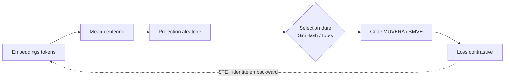
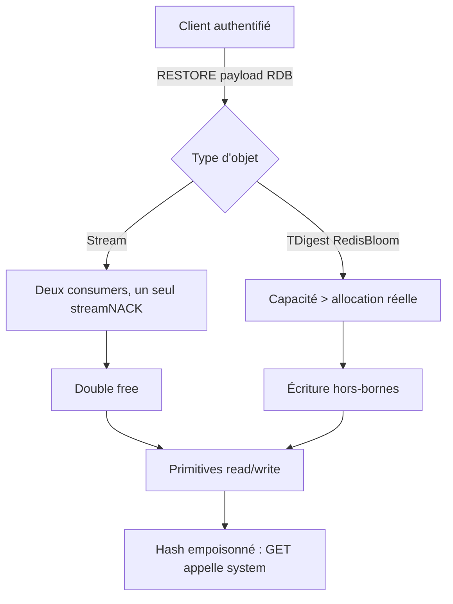

# IA — Détail du dimanche 2 août 2026

## 1. LateOn-regularized — régulariser ColBERT par Straight-Through Estimator pour débloquer MUVERA et SMVE

**Source :** Hugging Face Blog (LightOn AI) — https://huggingface.co/blog/lightonai/lateon-regularization
**Date :** 1er août 2026 (dernière mise à jour du modèle `LateOn-regularized` sur le Hub)

### Contexte

Les modèles à **interaction tardive** (ColBERT, multi-vecteurs) sont excellents en retrieval : au lieu d'un vecteur par document, ils gardent un vecteur par token et calculent un score MaxSim. Le prix est infrastructurel — il faut stocker et indexer tous les embeddings de tokens. En pratique on passe par un index **PLAID** (IVF-PQ), difficile à maintenir : dès que la distribution dérive, il faut reconstruire les centroïdes, et le CRUD devient pénible.

D'où l'intérêt de **MUVERA** (encode les multi-vecteurs en un gros vecteur dense, réutilisable dans HNSW) et **SMVE** (rotations aléatoires → sketch creux, réutilisable dans une infra de recherche sparse). Les deux évitent les centroïdes. Problème : ces méthodes marchaient sur ColBERT-v2 (2022) et s'effondraient sur les modèles récents. Un ticket ouvert sur PyLate en août 2025 a lancé l'enquête ; LightOn en publie le résultat.

### Comment ça marche

Le diagnostic tient en un chiffre. La similarité cosinus moyenne entre tokens de documents vaut **0,24 pour ColBERT-v2** et **0,95 pour LateOn**. Autrement dit, les embeddings récents ne sont pas dispersés sur l'hypersphère : ils s'entassent dans un **cône étroit**, tous orientés dans la même direction.

Or MUVERA partitionne l'espace avec des **hyperplans aléatoires** (SimHash) et SMVE garde les plus grandes projections après rotation aléatoire. Une coupe aléatoire ne sépare que ce qui est déjà séparable. Face à un cône, l'hyperplan passe presque toujours à côté : tous les tokens tombent dans le même bucket, tous les documents produisent presque le même code, et la génération de candidats devient du hasard.

Premier correctif : **centrer** les embeddings en soustrayant la direction moyenne. Ça marche bien — MUVERA passe de 2,89 à 32,66 NDCG@10 sans rerank — mais reste loin des 55,28 de PLAID. Le cône est retiré, la forme résiduelle ne se projette toujours pas proprement.

Deuxième idée, l'objectif **GOR** : pousser toutes les similarités hors-diagonale vers zéro pour rendre l'espace isotrope. En multi-vecteurs, ça se heurte à une objection de bon sens : le token « chat » *doit* rester similaire entre deux documents proches. Les essais n'ont pas convaincu.

La solution retenue : **optimiser directement la cible**. Le blocage est la discrétisation — le `sign` de SimHash et le top-k de SMVE sont constants par morceaux, donc de gradient nul presque partout. C'est exactement le problème du Quantization-Aware Training, et la parade est la même : le **Straight-Through Estimator**. On calcule le vrai code en forward, et en backward on fait *comme si* la sélection dure était l'identité. Le gradient de la loss contrastive remonte alors jusqu'aux embeddings, qui apprennent à être discriminants **après** projection.



### En pratique — exemple de code

L'astuce STE tient en une ligne de PyTorch. On garde la valeur dure en forward et le gradient de l'entrée continue en backward.

```python
import torch

def ste(hard: torch.Tensor, soft: torch.Tensor) -> torch.Tensor:
    # Forward : la valeur dure (bucket SimHash, top-k SMVE) est celle qui sort.
    # Backward : (hard - soft) est detaché -> le gradient passe comme si c'était soft.
    return soft + (hard - soft).detach()

# Centrage : on retire la direction moyenne du corpus avant toute projection.
doc = doc_embeddings - corpus_mean            # (n_tokens, dim)

codes_hard = simhash_bucket(doc @ random_planes)   # non différentiable
codes = ste(codes_hard, doc @ random_planes)       # différentiable de bout en bout

# Loss finale : on garde MaxSim comme objectif principal, STE en régularisation.
loss = (1 - alpha) * maxsim_contrastive(doc, query) \
     + alpha * projected_contrastive(codes, query_codes)
```

Point de mise en œuvre : les **éléments aléatoires sont figés** au début de l'entraînement. Les re-tirer à chaque step déstabilise l'apprentissage.

### Pourquoi ça compte pour toi

Si tu envisages du retrieval multi-vecteurs pour de la doc technique ou du code, tu allais buter sur PLAID et son coût de maintenance. Ce travail montre qu'un modèle correctement régularisé se branche sur une infra HNSW ou sparse existante — celle que tu opères déjà. Retiens aussi la leçon générale : centre tes embeddings avant toute quantification ou projection aléatoire. C'est gratuit et ça change tout.

### Le résultat contre-intuitif

Le modèle régularisé n'est **pas plus isotrope** — il l'est même légèrement moins. Ce qui bouge, c'est le **rang stable** : −21 % par document, −26 % au niveau corpus. La régularisation *concentre* l'information discriminante dans un sous-espace de faible dimension que les projections aléatoires échantillonnent correctement. Attention : une réduction naïve par PCA détruit 85 à 93 % de la qualité. Ce n'est pas la compression qui aide, c'est le fait que le modèle ait **appris quelles dimensions garder**.

---

## 2. Kimi K3 en chasseur de zero-days — Redis publie sept correctifs de sécurité

**Source :** The Hacker News — https://thehackernews.com/2026/07/kimi-k3-agents-found-redis-zero-days.html
**Date :** 24 juillet 2026 (releases Redis du 23 juillet)

### Contexte

On savait les modèles frontières capables de trouver des bugs. Ce cas-ci est différent sur deux points : le modèle est **à poids ouverts** (Kimi K3, Moonshot AI), et le résultat n'est pas un rapport théorique mais **quatre chaînes d'exploitation RCE authentifiées publiées**, contre Redis 6.2.22, 7.4.9, 8.6.4 et 8.8.0 en configuration standard.

Redis a réagi le 23 juillet avec **sept releases de sécurité**. Le détail qui pique : deux des versions ciblées, 6.2.22 et 7.4.9, étaient précisément les correctifs de mai que Redis recommandait d'installer. Elles ne contenaient pas la garde d'ownership nécessaire.

### Comment ça marche

Les deux classes de bug passent par la commande **`RESTORE`**, qui désérialise un objet RDB fourni par le client. C'est le point d'entrée : tout ce qui suit exploite la confiance accordée à des métadonnées attaquant-contrôlées.

**Chaîne 1 — Streams, use-after-free « shared-NACK ».** Un objet RDB corrompu fait pointer deux consumers sur le même enregistrement `streamNACK` (une entrée en attente d'ack). Supprimer le premier consumer libère l'objet ; le second garde un pointeur pendant. On supprime le second : un chunk, deux `free`. Le script publié transforme cette corruption en accès mémoire arbitraire, puis empoisonne une fonction de hash de la base pour qu'un simple `GET` déclenche `system()`. Cette chaîne exige aussi `EVAL` et `XGROUP`.

**Chaîne 2 — RedisBloom, écriture hors-bornes dans le loader TDigest.** Le loader allouait ses tableaux de centroïdes à partir d'une valeur de compression sérialisée, puis faisait confiance à un **champ de capacité séparé**, lui aussi contrôlé par l'attaquant, pour décider combien de nœuds charger. Petite allocation réelle + métadonnée gonflée = écriture hors-bornes. Même finalité : primitives read/write, fuite des adresses Redis et libc, `system()`. Le correctif impose que la capacité chargée corresponde à l'allocation dérivée de la compression, et borne les compteurs de nœuds.



### En pratique — exemple de code

La mitigation la plus efficace ne demande pas de redéploiement : **révoquer `RESTORE`** aux comptes qui n'en ont pas strictement besoin coupe les deux chaînes publiées.

```bash
# 1) Vérifier la version exacte de la branche déployée — pas "récemment patché".
redis-cli INFO server | grep redis_version

# 2) Interdire RESTORE (et les commandes des chaînes) au user applicatif.
#    Le tiret devant une commande la retire des permissions de l'ACL.
redis-cli ACL SETUSER app_worker on '>motdepasse' \
  '~cache:*' '+@read' '+@write' '-restore' '-eval' '-xgroup'

# 3) Contrôler le résultat : RESTORE ne doit plus apparaître.
redis-cli ACL GETUSER app_worker
```

Versions correctives : **6.2.23, 7.2.15, 7.4.10** (Streams shared-NACK) ; **8.2.8, 8.4.5, 8.6.5** (Streams + TDigest/RedisBloom) ; **8.8.1** (loaders RedisBloom et TDigest, la garde Streams étant déjà dans 8.8.0).

### Pourquoi ça compte pour toi

Si tu exposes Redis derrière une API .NET ou Symfony, ton user applicatif a probablement `+@all`. Restreins-le par ACL aujourd'hui : `RESTORE` n'a aucune raison d'être accessible à un worker de cache. Et vérifie la **version exacte de ta branche**, pas la date du dernier patch — deux des cibles étaient les correctifs de mai.

### Limites de l'information

Redis n'a attribué **ni CVE ni score CVSS** à ces deux nouvelles classes de bug, et le NVD n'en a pas d'enregistrement séparé. Tes scanners de vulnérabilités ne les verront donc pas. Les chiffres « 19 zero-days en 90 minutes » et « exploit 8.8.0 en 27 minutes » proviennent de posts X du chercheur et restent auto-déclarés : le registre public de Redis confirme les failles et les correctifs, pas le degré d'autonomie des agents.
