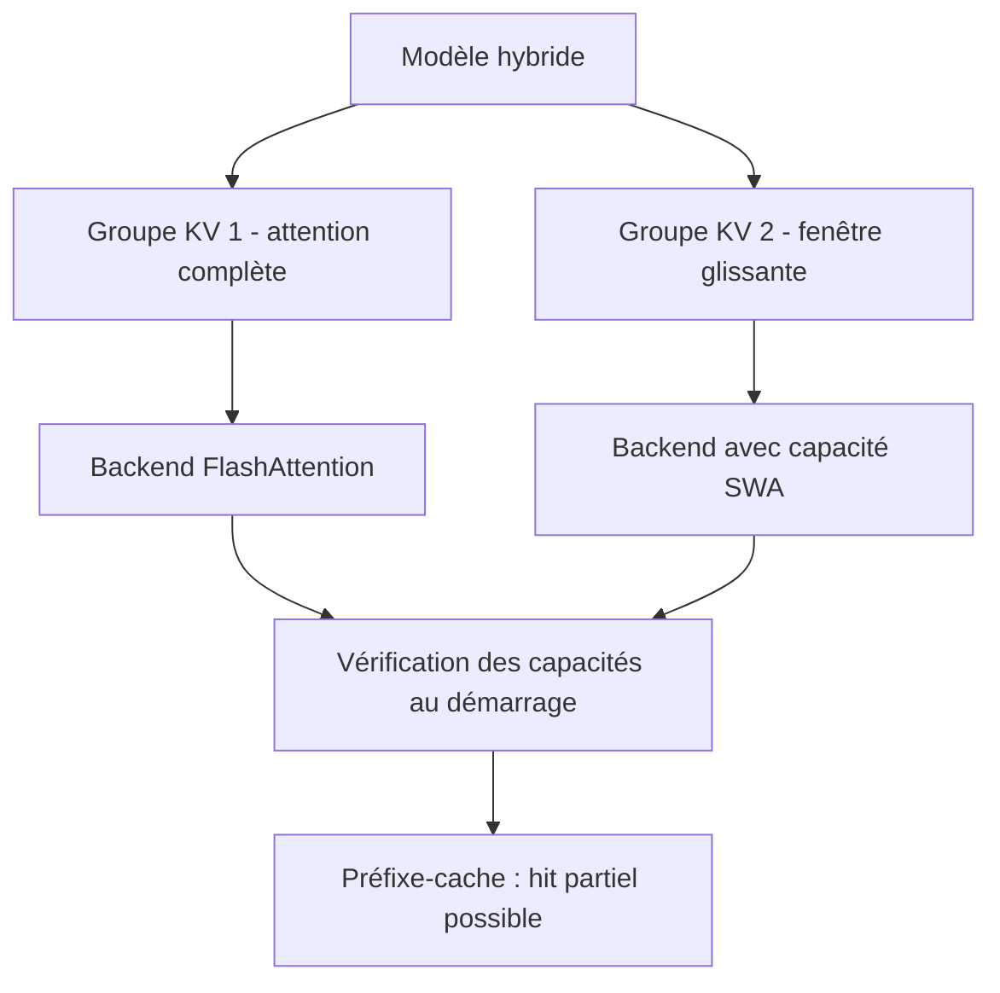

# IA — Détail du lundi 3 août 2026

## 1. vLLM v0.26.0 — un backend d'attention par groupe de KV-cache

**Source :** vLLM — https://github.com/vllm-project/vllm/releases/tag/v0.26.0
**Date :** 27 juillet 2026

### Contexte

Servir un LLM, c'est d'abord gérer un cache clé-valeur. À chaque token généré, le modèle recalcule l'attention sur tout ce qui précède ; pour éviter de tout refaire, on stocke les tenseurs K et V de chaque couche. Ce cache domine la consommation mémoire d'un serveur d'inférence, et le « backend d'attention » — FlashAttention, FlashInfer, Triton, AITER côté AMD — est le code qui lit ce cache et calcule le produit d'attention.

Historiquement, vLLM choisissait **un** backend pour tout le modèle. Ce choix tenait tant que toutes les couches se ressemblaient. Il ne tient plus. Les architectures récentes sont hybrides : elles alternent des couches à attention complète, qui voient tout le contexte, et des couches à fenêtre glissante (SWA), qui ne voient que les N derniers tokens. Gemma, Qwen, plusieurs MoE récents fonctionnent ainsi. Certaines familles ajoutent des couches à état de type Mamba, dont le « cache » n'est même pas un KV. Un backend unique doit alors couvrir le plus petit dénominateur commun, ou bien gérer chaque cas par des branches internes.

La v0.26.0 fait sauter cette contrainte de deux façons complémentaires.

### Comment ça marche

Premier changement : vLLM regroupe les couches en **groupes de KV-cache**. Un groupe rassemble les couches qui partagent la même forme de cache et la même politique — même taille de fenêtre, même dtype, même disposition mémoire. Le moteur alloue et gère un pool de blocs par groupe. À partir de cette release, le backend d'attention se sélectionne au niveau du groupe et non plus du modèle. Concrètement, les couches à attention complète peuvent tourner sur FlashAttention tandis que les couches SWA utilisent un backend spécialisé, dans la même passe forward.

Deuxième changement : le support de la fenêtre glissante devient une **capacité explicite** déclarée par le backend. Auparavant, savoir si tel backend gérait la SWA relevait d'une table codée en dur dans le moteur. Désormais le backend l'annonce, et vLLM valide la compatibilité au démarrage plutôt que de produire des résultats faux ou une erreur CUDA opaque en cours de route.

L'effet le plus visible pour un utilisateur concerne le préfixe-cache. Sur un modèle hybride, réutiliser le préfixe d'une conversation était tout ou rien : les couches SWA n'ayant qu'une fenêtre limitée, on ne savait pas décider proprement. La même release introduit le **hit partiel de préfixe-cache** pour les modèles hybrides et la rétention sélective. Traduction : dans un chat multi-tours, la partie du préfixe encore couverte par la fenêtre est réutilisée, le reste est recalculé. Le gain se voit sur le temps jusqu'au premier token.



### En pratique — exemple de code

La sélection reste pilotable par variable d'environnement pour forcer un backend, ce qui sert surtout au diagnostic :

```bash
# Servir un modèle hybride : vLLM résout un backend par groupe de KV-cache
vllm serve Qwen/Qwen3-30B-A3B \
  --max-model-len 32768 \
  --enable-prefix-caching \
  --gpu-memory-utilization 0.90

# Diagnostic : forcer un backend unique et comparer
VLLM_ATTENTION_BACKEND=FLASHINFER vllm serve Qwen/Qwen3-30B-A3B --max-model-len 32768
```

Côté Python, l'intérêt pratique est de vérifier ce que le moteur a réellement choisi avant de lancer un banc de test :

```python
from vllm import LLM, SamplingParams

llm = LLM(
    model="Qwen/Qwen3-30B-A3B",
    max_model_len=32768,
    enable_prefix_caching=True,   # hit partiel désormais possible sur modèle hybride
)

params = SamplingParams(temperature=0.2, max_tokens=256)
out = llm.generate(["Explique la différence entre SWA et attention complète."], params)
print(out[0].outputs[0].text)
```

### Pourquoi ça compte pour toi

Si tu héberges un modèle ouvert pour ton équipe, ce changement décide de deux choses : quels modèles hybrides tu peux servir sans bricolage, et si ton préfixe-cache sert vraiment. Sur un assistant interne à conversations longues, un hit partiel de préfixe-cache réduit sensiblement la latence perçue. Avant de monter en v0.26.0, relis tes lancements : un `VLLM_ATTENTION_BACKEND` figé dans un `docker-compose` neutralise précisément la sélection par groupe.

### Points de vigilance

La même release retire les modèles TeleChat, Persimmon et Fuyu, et passe à Transformers 5.13.0. Vérifie tes images figées avant de mettre à jour.

---

## 2. vLLM v0.26.0 — `head_dtype` : garder la tête de génération en fp32

**Source :** vLLM (PR #48390) — https://github.com/vllm-project/vllm/pull/48390
**Date :** intégré dans la release du 27 juillet 2026

### Contexte

Quantifier un modèle, c'est réduire la précision de ses poids : de fp16/bf16 vers 8, 4, parfois 2 bits. Le gain est double — moins de mémoire, donc un modèle plus gros sur la même carte, et moins de bande passante mémoire, donc plus de tokens par seconde. Le coût est une dégradation de qualité, généralement modeste.

Sauf que cette dégradation n'est pas répartie uniformément. La dernière couche d'un modèle génératif, le `lm_head`, projette l'état caché sur le vocabulaire entier — souvent 128 000 à 256 000 entrées. Elle produit les logits, dont on tire ensuite une distribution de probabilité par softmax. Deux raisons rendent cette couche sensible. D'abord elle est très large, donc son erreur de quantification s'accumule sur beaucoup de dimensions. Ensuite le softmax est exponentiel : un écart de quelques dixièmes entre deux logits proches bascule le token choisi. Sur du texte libre l'effet passe inaperçu ; sur du code, du JSON structuré ou du raisonnement contraint, il produit des erreurs de token discrètes mais coûteuses.

### Comment ça marche

`head_dtype` découple la précision de la tête de celle du corps du modèle. Le principe est simple à énoncer : les blocs transformeurs restent dans le dtype choisi — bf16, fp8, NVFP4, W4A16 — tandis que la matrice du `lm_head` est conservée ou reconvertie en fp32 au chargement. Le calcul de la projection finale se fait donc en pleine précision.

Le coût mémoire mérite d'être posé. Pour un vocabulaire V et une dimension cachée H, la tête pèse V × H paramètres. Avec V = 152 000 et H = 4 096, cela fait environ 622 M paramètres : 1,2 Go en bf16, 2,5 Go en fp32. Le surcoût est réel mais borné, et sans commune mesure avec la taille du corps d'un modèle de 30 B ou plus. Sur une carte 80 Go servant un modèle quantifié en 4 bits, l'arbitrage est presque toujours favorable.

Deux détails d'implémentation comptent. Le réglage a été étendu au chemin LoRA, ce qui évite une incohérence de dtype quand un adaptateur s'applique sur la tête. Et côté ROCm, une voie rapide `torch.mm` a été ajoutée pour que la projection fp32 ne devienne pas le goulot d'étranglement.

Enfin, cette release cesse d'upcaster systématiquement les logits en fp32 dans le sampler. Les deux évolutions se répondent : plutôt qu'une remontée générique et tardive de précision, tu choisis explicitement où la précision compte.

### En pratique — exemple de code

```bash
# Corps du modèle en 4 bits (W4A16), tête de génération en fp32
vllm serve RedHatAI/Qwen3-32B-quantized.w4a16 \
  --head-dtype float32 \
  --max-model-len 32768 \
  --gpu-memory-utilization 0.92
```

```python
from vllm import LLM, SamplingParams

# Comparer deux configurations sur une tâche structurée (génération de JSON)
llm = LLM(
    model="RedHatAI/Qwen3-32B-quantized.w4a16",
    head_dtype="float32",     # isole lm_head de la quantification du corps
    max_model_len=32768,
)

prompt = "Renvoie un JSON strict {\"ville\":..., \"pays\":...} pour Lyon."
params = SamplingParams(temperature=0.0, max_tokens=64)  # greedy : l'écart se voit
print(llm.generate([prompt], params)[0].outputs[0].text)
```

### Pourquoi ça compte pour toi

Si tu fais générer du JSON, du SQL ou du C# par un modèle quantifié auto-hébergé, c'est le premier réglage à tester quand la qualité décroche après quantification. Le protocole est simple : même modèle, même seed, température zéro, avec et sans `--head-dtype float32`, sur un jeu de cinquante sorties structurées que tu valides par schéma. Tu paies un à deux gigaoctets de VRAM ; tu récupères souvent la fiabilité de format qui justifiait de rester en bf16.

### Limites

Le réglage ne corrige pas une quantification trop agressive du corps du modèle. Si tes erreurs sont sémantiques et non syntaxiques, le problème est ailleurs.
