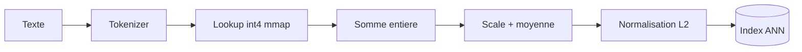
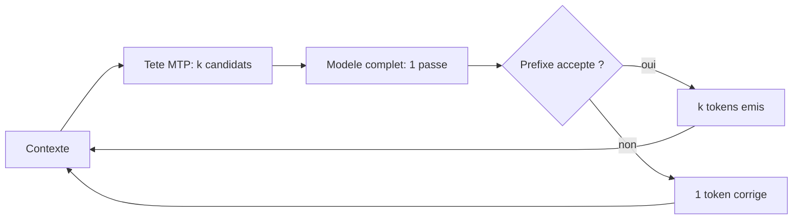

# IA — Détail du samedi 8 août 2026

## 1. Lattice — un retriever statique de 8 Mo qui embarque Wikipédia en 7 min 26 s

**Source :** Hugging Face Blog — https://huggingface.co/blog/erikkaum/lattice-blog
**Date :** 7 août 2026

### Contexte

Quand tu montes un pipeline RAG, la première étape est toujours la même : transformer chaque document en vecteur. Avec un encodeur transformer, cette étape coûte cher — GPU, temps, argent. Sur un corpus de plusieurs millions de documents, elle devient un projet à part entière.

Un modèle d'embedding **statique** contourne le problème en supprimant le transformer. Il ne reste qu'une table de lookup : un vecteur par token, moyenne, normalisation. Ni attention, ni contextualisation. GloVe et fastText ont établi l'idée au niveau du mot ; `model2vec`/potion et `static-retrieval-mrl-en-v1` l'ont poussée au niveau de la phrase. Erik Kaunismäki a repris exactement cette architecture et l'a poussée à bout : plus de données, quantification agressive, runtime Rust dédié.

### Comment ça marche

Le modèle entier est une matrice `[30 522, 1 024]` — le vocabulaire BERT-uncased en lignes, les dimensions en colonnes. La passe avant tient en trois lignes : tokenise, additionne les lignes correspondantes, divise par le nombre de tokens, normalise en L2. Le même token sélectionne toujours la même ligne ; les mots voisins ne changent jamais son vecteur. C'est la limite (pas d'ordre, pas de polysémie) et la force (débit énorme, taille minuscule).

**Entraînement.** Deux étapes : pré-entraînement contrastif sur 660 M de paires curées — huit fois le corpus du modèle de référence — puis fine-tuning sur négatifs difficiles. Le gain d'échelle est net : 0,4581 NDCG@10 sur BEIR décontaminé après l'étape 1, 0,4749 après l'étape 2, contre 0,4334 pour la référence. L'entraînement d'un modèle statique est borné par le débit de données, pas par le calcul. La solution retenue : pré-tokeniser tout le corpus dans des fichiers binaires plats (`tokens.bin` + `offsets.bin`) mappés en mémoire, avec un shuffle **par fenêtre de batch** plutôt que par ligne. Les lectures disque restent contiguës, et le débit tient 360-370 K paires/s sur quatre A100.

**Quantification.** C'est la partie la plus instructive. La simplicité du modèle en fait une cible propre : l'erreur de quantification est introduite une seule fois, il n'y a pas d'activations intermédiaires, et le mean pooling amortit une partie du bruit. Le choix décisif est l'axe de groupement.

- **Par dimension** : une échelle par colonne. Noyau d'inférence plus simple, car l'échelle sort de la somme.
- **Par ligne** : une échelle par token. Chaque token reçoit une grille adaptée à sa propre amplitude.

Pourquoi ça change tout à basse précision ? L'amplitude maximale varie d'un facteur 97,8 entre lignes, contre 3,7 entre colonnes. En int4 par dimension, un token « discret » se retrouve quantifié contre une colonne dominée par un token bien plus fort : 1 432 lignes (4,69 % du vocabulaire) tombent entièrement à zéro. Le token disparaît du modèle. En int4 par ligne, aucune ligne non nulle n'est éteinte. Résultat mesuré : `int4-row-512` pèse 7,94 Mo et score 0,4697 — identique au fp32 à la même dimension. Le `int4-dim-512` perd 0,0068.

**Inférence.** Le runtime Rust n'a jamais besoin de déquantifier chaque ligne. Comme l'échelle par dimension est partagée par tous les tokens, elle sort de la somme : `mean[d] = scale[d] / N × (Σ code[token, d] − 7N)`. La boucle chaude ne fait que dépaqueter et additionner des entiers. Sur 6 407 814 articles Wikipédia, 7 min 26 s à 9,52 M tokens/s — dont 91,7 % du temps dans la tokenisation. Le modèle n'est plus le goulot.



### En pratique — exemple de code

```python
# Le modèle fp32 suit la disposition Sentence Transformers
from sentence_transformers import SentenceTransformer

model = SentenceTransformer("erikkaum/lattice-retrieval")
embeddings = model.encode(
    ["hello world", "static embeddings are fast"],
    normalize_embeddings=True,
)
print(embeddings.shape)  # (2, 1024)
```

```bash
# Produire l'artefact de déploiement : int4 par dimension, 512 dims
git clone https://github.com/ErikKaum/lattice
cd lattice/slicer
uv run slicer slice --dim 512 --quant int4_dim --output-dir ../data/int4-dim-512

# Puis embarquer un corpus avec le runtime Rust
cd ../lattice && cargo build --release --bin embed
echo "hello world" | ./target/release/embed \
  --model ../data/int4-dim-512/model.safetensors \
  --output /tmp/embedding.bin   # matrice fp32 plate, prête pour un index ANN
```

### Pourquoi ça compte pour toi

Ce n'est pas un remplaçant de ton retriever transformer, c'est un premier étage. Si tu dois dédupliquer un corpus PostgreSQL, générer des candidats avant un reranker, ou embarquer un index dans une app, tu peux le faire sur ton poste sans GPU ni facture d'inférence. Le modèle tient dans un conteneur de quelques mégaoctets — donc aussi dans un sidecar, ou en WASM côté navigateur.

### Limites

La qualité reste celle d'un sac de vecteurs : pas d'ordre des mots, pas de polysémie. Le fine-tuning de l'étape 2 recoupe fortement BEIR, donc le score NanoBEIR absolu après étape 2 est contaminé ; c'est le BEIR décontaminé qu'il faut regarder. Enfin, plusieurs tâches décontaminées ne conservent que quelques dizaines de requêtes notées (26 pour NQ, 41 pour MSMARCO) : l'agrégat sert à comparer des modèles entre eux, pas à mesurer une qualité absolue.

---

## 2. Ollama v0.32.6 — décodage spéculatif automatique via la tête MTP sur GPU Apple

**Source :** Ollama Releases (via Releasebot) — https://github.com/ollama/ollama/releases/tag/v0.32.6
**Date :** 5 août 2026

### Contexte

Ollama fait tourner deux moteurs : llama.cpp pour le gros du parc, et MLX pour les GPU Apple. Sur Mac, le mur n'est pas le calcul brut mais la bande passante mémoire : générer un token exige de relire tous les poids actifs. C'est pour ça qu'un M2 génère lentement même quand le modèle tient confortablement en RAM unifiée.

Le décodage spéculatif attaque exactement ce mur. Cette release l'active automatiquement pour Qwen3.5 sur MLX, en exploitant la tête MTP (multi-token prediction) que le modèle embarque déjà. Pas de modèle brouillon séparé à télécharger, pas de flag à passer.

### Comment ça marche

Le décodage autorégressif classique produit un token par passe avant. Chaque passe relit les poids : coût mémoire fixe, indépendant du nombre de tokens produits. L'idée du décodage spéculatif est de deviner plusieurs tokens d'un coup, puis de les vérifier en **une seule** passe du modèle complet.

Déroulé pas à pas :

1. Un prédicteur léger propose `k` tokens candidats à partir du contexte courant. Habituellement c'est un petit modèle brouillon ; ici, c'est la tête MTP du modèle lui-même, entraînée pendant le pré-entraînement à prédire les positions `t+1`, `t+2`, etc.
2. Le modèle complet évalue la séquence `[contexte + k candidats]` en un seul passage. Le coût mémoire est celui d'**une** passe, pas de `k`.
3. On compare la distribution du modèle complet à chaque candidat, position par position, et on accepte le plus long préfixe correct.
4. Le premier token rejeté est remplacé par l'échantillonnage du modèle complet, et on repart à l'étape 1.

La propriété importante : la distribution de sortie reste mathématiquement identique au décodage classique. Ce n'est pas une approximation, c'est une réorganisation du calcul. Si le taux d'acceptation est bon, le gain de débit est net ; s'il est mauvais, on retombe sur la vitesse d'origine sans dégrader la qualité.

Deux autres changements comptent pour l'intégration. Le streaming `/v1/chat/completions` respecte enfin le format de fil OpenAI : `role` uniquement sur le premier chunk, `finish_reason` seul dans son chunk, `usage` dans un chunk séparé activé par `stream_options.include_usage`. Une réponse tronquée signale `finish_reason: "length"` au lieu de `"tool_calls"` — le genre de bug qui casse silencieusement une boucle d'agent. Enfin, `ollama run kimi-k3` propose `kimi-k3:cloud` pour les modèles publiés sans tag local par défaut, au lieu d'échouer.



### En pratique — exemple de code

```bash
# Mise à jour puis exécution : le décodage spéculatif MTP s'active seul sur MLX
ollama --version            # doit afficher 0.32.6
ollama run qwen3.5

# Modèle publié sans tag local par défaut : Ollama propose la variante cloud
ollama run kimi-k3          # -> propose kimi-k3:cloud au lieu d'échouer
```

```python
# Streaming conforme OpenAI : usage arrive dans un chunk séparé
from openai import OpenAI

client = OpenAI(base_url="http://localhost:11434/v1", api_key="ollama")
stream = client.chat.completions.create(
    model="qwen3.5",
    messages=[{"role": "user", "content": "Explique le décodage spéculatif"}],
    stream=True,
    stream_options={"include_usage": True},  # chunk final avec les compteurs
)
for chunk in stream:
    if chunk.usage:                       # dernier chunk : pas de choices
        print("tokens:", chunk.usage.total_tokens)
    elif chunk.choices[0].delta.content:
        print(chunk.choices[0].delta.content, end="")
```

### Pourquoi ça compte pour toi

Si tu prototypes un agent contre Ollama en local avant de le brancher sur une API, la conformité du format de streaming t'évite deux classes de bugs : un client OpenAI qui plante sur un `role` répété, et une boucle d'agent qui interprète une troncature comme un appel d'outil. Vérifie ta gestion de `finish_reason` avant de monter de version.

### Points de vigilance

La génération d'images expérimentale est **retirée** de cette version. Si ton workflow en dépend, reste sur 0.32.5. Le décodage spéculatif via MTP concerne le moteur MLX : sur CUDA ou ROCm, tu passes toujours par llama.cpp et un modèle brouillon explicite.
