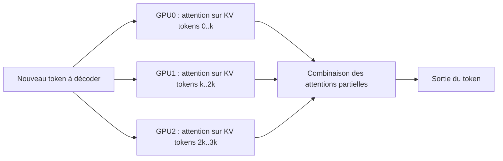

# IA — Détail du dimanche 9 août 2026

## 1. vLLM — Decode Context Parallelism (DCP) pour les contextes longs

**Source :** vLLM Blog — https://vllm.ai/blog/2026-08-07-decode-context-parallelism
**Date :** 7 août 2026

### Contexte

Un agent à long contexte (gros historique, longues traces d'outils, RAG massif) accumule un **KV-cache** énorme : c'est la mémoire où le modèle stocke les clés/valeurs de chaque token déjà vu, pour ne pas les recalculer à chaque nouveau token généré. Problème : la parallélisation classique, le **tensor parallelism (TP)**, découpe les *poids* du modèle entre GPU mais **réplique le KV-cache sur chacun**. En contexte long, ce cache dominant se retrouve dupliqué N fois — tu tapes le mur mémoire bien avant d'utiliser tout ton débit de calcul.

### Comment ça marche

DCP change l'axe de découpe. Au lieu de répliquer, il **partitionne le KV-cache le long de la dimension de séquence** : le GPU 0 détient les tokens 0…k, le GPU 1 les tokens k…2k, etc. Pendant le decode, chaque GPU calcule l'attention **sur son propre morceau** de séquence, puis les résultats partiels sont combinés (réduction) pour former la sortie du token courant. Aucune copie n'est dupliquée : la mémoire de cache est divisée par le nombre de GPU, ce qui laisse de la place pour des séquences bien plus longues ou des batchs plus gros. Résultat annoncé : **~3× de débit** sur les charges agentiques à contexte long, comparé au TP seul.



### En pratique — exemple de code

Le principe en pseudo-Python : le KV-cache est réparti par tranches de séquence, l'attention est locale puis réduite. (Illustration du concept ; la config exacte de serving est dans les release notes vLLM.)

```python
# TP standard : chaque GPU garde une COPIE complète du KV-cache -> duplication
# DCP : on découpe la séquence en tranches, une par GPU
shards = split_by_sequence(kv_cache, num_gpus)   # tokens 0..k, k..2k, ...

def decode_step(query, shards):
    # 1) chaque GPU calcule l'attention sur SA tranche uniquement
    partial = [attention(query, s) for s in shards]   # exécuté en parallèle
    # 2) on combine les résultats partiels (log-sum-exp / online softmax)
    return combine_partial_attention(partial)         # 1 token de sortie
# Mémoire de cache par GPU divisée par num_gpus -> contextes bien plus longs
```

### Pourquoi ça compte pour toi

Si tu héberges un modèle open-weight pour des agents (longs prompts système, historiques, RAG), le KV-cache — pas les poids — est souvent ton facteur limitant. DCP te laisse servir des contextes plus longs ou augmenter le batch sur le même matériel, sans acheter de GPU. Concrètement : plus de requêtes simultanées et une latence stable sur tes charges à long contexte, là où le TP seul saturait la mémoire.

---

## 2. vLLM — 25 000 tokens/s/GPU sur Qwen3.5 en serving désagrégé

**Source :** vLLM Blog — https://vllm.ai/blog/2026-08-06-qwen35-25k-tps
**Date :** 6 août 2026

### Contexte

Servir un très gros MoE comme **Qwen3.5-397B-A17B** (397 Md de paramètres, ~17 Md actifs par token) coûte cher. L'équipe vLLM montre comment atteindre **25 000 tokens/s/GPU** sur ce modèle en **NVFP4** (format 4-bit de Blackwell), sur une baie **GB200 NVL72**. L'intérêt pour toi n'est pas le chiffre brut mais la **recette** : elle éclaire les leviers qui font la différence en production.

### Comment ça marche

Le levier central est le **serving désagrégé prefill/decode (P/D)**. Le *prefill* (lecture du prompt, calcul-intensif) et le *decode* (génération token par token, mémoire-intensif) ont des profils opposés. Les mélanger sur les mêmes GPU crée des interférences. En les **séparant sur des pools distincts**, chacun tourne à son régime optimal, et le KV-cache produit par le prefill est transféré vers les GPU de decode via un canal rapide (**HMA cache transfer**). S'y ajoutent des **kernels GDN optimisés pour Blackwell**, la quantification **NVFP4** qui réduit la bande passante mémoire, et des **corrections de scheduling asynchrone** qui suppriment des bulles d'inactivité GPU.

```mermaid
flowchart LR
  P[Prompt] --> PF[Pool PREFILL<br/>calcul-intensif]
  PF -->|KV-cache via HMA| DC[Pool DECODE<br/>mémoire-intensif]
  DC --> T[Tokens générés]
  DC -->|scheduling async| DC
```



### En pratique — exemple de code

Schéma de déploiement désagrégé (illustratif) : un groupe de serveurs prefill, un groupe decode, reliés par un connecteur de KV-cache.

```bash
# Pool PREFILL (calcul-intensif) — quantification NVFP4 pour Blackwell
vllm serve Qwen/Qwen3.5-397B-A17B --quantization nvfp4 \
  --kv-transfer-config '{"role":"producer"}'   # produit le KV-cache

# Pool DECODE (mémoire-intensif) — consomme le KV-cache du prefill
vllm serve Qwen/Qwen3.5-397B-A17B --quantization nvfp4 \
  --kv-transfer-config '{"role":"consumer"}'   # reçoit via HMA
# Un routeur place chaque requête : prefill -> transfert KV -> decode
```

### Pourquoi ça compte pour toi

Même sans GB200, la leçon est transposable : sépare prefill et decode dès que ta charge mélange gros prompts et génération longue. Tu stabilises la latence inter-token et tu montes en débit sans sur-dimensionner. La quantification 4-bit (NVFP4/INT4 selon ton GPU) reste le levier le plus rentable pour tenir un gros MoE en mémoire. Garde en tête : ces chiffres viennent d'un matériel haut de gamme, calibre tes attentes sur le tien.

### Limites

Le serving désagrégé ajoute de la complexité opérationnelle (deux pools, un routeur, un canal de transfert KV) : pertinent à l'échelle, sur-dimensionné pour un petit déploiement mono-GPU.
