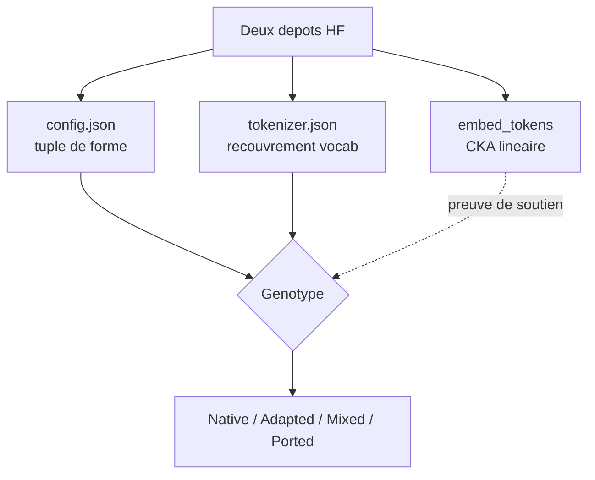

# IA — Détail du lundi 10 août 2026

## 1. Model Genome — vérifier qu'un LLM est entraîné de zéro, avec ses seuls fichiers publics

**Source :** Hugging Face Blog — https://huggingface.co/blog/mayafree/model-dna
**Date :** 8 août 2026

### Contexte

Construire un modèle sur une base open-weight (Qwen, Llama, DeepSeek, Mistral) est une pratique légitime et courante. Ce n'est pas la même chose qu'entraîner un modèle de fondation from scratch, et les annonces ne font pas toujours la distinction. Quand plusieurs laboratoires ont publié fin juillet 2026 des modèles « auto-développés » présentés comme rivaux de DeepSeek, la question a fini par sortir des cercles techniques.

Elle est pourtant décidable, objectivement, à partir de fichiers publics. L'auteur propose un pipeline reproductible en trois axes — architecture, tokenizer, poids — et l'applique au même étalon pour les modèles de neuf organisations coréennes. L'intérêt pour toi n'est pas le verdict, c'est la méthode : elle est transposable à n'importe quel couple de dépôts du Hub.

### Comment ça marche

**Axe 1 — l'architecture.** Chaque checkpoint `transformers` embarque un `config.json`. Six champs suffisent : `model_type`, `vocab_size`, `hidden_size`, `intermediate_size`, `num_hidden_layers`, et le couple `num_attention_heads` / `num_key_value_heads`. Le tuple de forme est une empreinte. Un champ identique par hasard, ça arrive ; cinq simultanément, c'est une signature. L'article mesure ainsi des correspondances exactes avec Qwen2.5-7B (3584 · 18944 · 28 · 28 · 4), Llama-3.1-8B (4096 · 14336 · 32 · 32 · 8) ou DeepSeek-V3.

**Axe 2 — le tokenizer.** L'architecture seule peut tromper. On peut copier une architecture et entraîner un vrai nouveau tokenizer, ou l'inverse. On compare donc les ensembles de vocabulaire de `tokenizer.json`. Le détail qui compte est le **dénominateur** : `min(|A|, |B|)` et non l'union. Ce choix fait scorer ~1,0 un vocabulaire réduit strictement inclus dans un plus grand — exactement le signal « découpé dans la base ». Un modèle observé collait parfaitement à l'architecture Qwen2.5-7B avec un recouvrement tokenizer de seulement 0,38 : cerveau emprunté, langue propre.

**Axe 3 — les poids.** C'est là que vivent les deux pièges.

*Piège 1 : le cosinus ligne à ligne est inutilisable.* L'idée naïve consiste à charger `embed_tokens.weight` des deux modèles et à moyenner le cosinus des lignes pour les tokens partagés. Le résultat est proche de zéro **y compris pour une filiation évidente**. La raison est l'**invariance par rotation** : l'espace latent d'un Transformer n'a pas de base privilégiée. Deux modèles peuvent encoder la même information à une rotation orthogonale près. Le cosinus ligne à ligne lit cette rotation comme une dissemblance.

*Piège 2 : le CKA aide, mais pas assez.* Le CKA linéaire (Centered Kernel Alignment) est invariant par rotation et par mise à l'échelle isotrope — c'est le bon outil pour comparer des représentations. Un modèle from-scratch score effectivement un CKA quasi nul contre sa base candidate. Mais un dérivé issu d'un pré-entraînement continué ne monte qu'à ≈ 0,25, à peine au-dessus du bruit de fond entre deux modèles non apparentés de la même famille (≈ 0,21). Un entraînement massif redessine assez les embeddings pour que le CKA perde son pouvoir discriminant du côté « dérivé ».

**Conclusion honnête de l'auteur :** l'axe poids confirme le *from-scratch* de façon fiable, mais n'est **pas** un bon détecteur de dérivation. `config` + tokenizer restent la preuve primaire.



### En pratique — exemple de code

Les trois fonctions ci-dessous constituent la méthode entière. Pointe-les sur deux dépôts du Hub.

```python
import requests, torch

def arch_fingerprint(repo):
    """Empreinte d'architecture : 6 champs suffisent à identifier la référence."""
    c = requests.get(f"https://huggingface.co/{repo}/resolve/main/config.json",
                     headers={"User-Agent": "genome/1.0"}).json()
    return {k: c.get(k) for k in
            ("model_type", "vocab_size", "hidden_size", "intermediate_size",
             "num_hidden_layers", "num_attention_heads", "num_key_value_heads")}

def tok_overlap(a, b):
    """Test de paternité du tokenizer. min() au dénominateur : un sous-ensemble strict -> 1.0"""
    def vocab(repo):
        j = requests.get(f"https://huggingface.co/{repo}/resolve/main/tokenizer.json").json()
        return set(j["model"]["vocab"].keys())     # BPE : {token: id}
    A, B = vocab(a), vocab(b)
    return len(A & B) / min(len(A), len(B))

def linear_cka(X, Y):
    """X, Y : (n, d) sur le MÊME ordre de tokens. Invariant par rotation, contrairement au cosinus."""
    X = X - X.mean(0, keepdim=True)
    Y = Y - Y.mean(0, keepdim=True)
    num = (X.T @ Y).norm() ** 2
    den = (X.T @ X).norm() * (Y.T @ Y).norm()
    return (num / den).item()
```

```python
# Usage : comparer un modèle suspect à une base candidate
print(arch_fingerprint("some/model"))              # tuple de forme
print(tok_overlap("some/model", "Qwen/Qwen3-14B")) # 1.0 = fine-tune direct ; 0.38 = tokenizer refait
# linear_cka : ≈ 0 confirme le from-scratch ; ≈ 0.25 ne prouve PAS la dérivation
```

### Pourquoi ça compte pour toi

Avant d'intégrer un modèle « souverain » dans une stack, tu peux vérifier sa lignée réelle en trois requêtes HTTP, sans télécharger les poids. C'est aussi un réflexe de conformité : la licence effective qui te contraint est celle du modèle de base, pas seulement celle affichée par le dérivé. Le tuple `config.json` et le recouvrement tokenizer te donnent la réponse en quelques secondes.

### Limites

L'outil rapporte une lignée, pas une faute — dériver d'un open-weight est légitime. Et l'axe poids reste une preuve de soutien : ne conclus jamais « dérivé » sur un CKA seul.

---

## 2. GLInt — miner les négatifs difficiles dans l'espace MaxSim, pas dans l'espace dense

**Source :** Hugging Face Blog — https://huggingface.co/blog/chungimungi/glint
**Date :** 8 août 2026

### Contexte

Un retriever dense compresse requête et document en un vecteur chacun, puis les compare. Un retriever à interaction tardive, façon ColBERT, garde plusieurs vecteurs de tokens et retarde l'interaction jusqu'au scoring. On présente d'habitude cette différence comme un avantage à l'inférence. L'article montre qu'elle compte tout autant à la **construction des données**.

Le minage de négatifs difficiles est lui-même un problème de ranking. Étant donné une requête et un document étiqueté pertinent, le mineur cherche d'autres documents trompeusement proches pour servir de négatifs. Si le mineur et l'élève ne s'accordent pas sur la notion de similarité, le mineur dépense des créneaux d'entraînement sur des exemples que l'élève trouve faciles, et rate ceux qui l'embrouillent réellement.

Le résultat final : **GLInt** atteint 57,43 de nDCG@10 moyen sur les 15 tâches BEIR, contre 57,22 pour LateOn, en partant du checkpoint non supervisé LateOn (50,11). C'est le meilleur retriever sous 300 M de paramètres de la comparaison, et le meilleur score Quora et HotPotQA sous 7 Md.

### Comment ça marche

Le score MaxSim de ColBERT s'écrit `S(q,d) = Σᵢ maxⱼ cos(qᵢ, dⱼ)` : chaque token de la requête choisit son meilleur token de document, et on somme. Cette somme sur des maxima a une conséquence géométrique lourde. Tout document récupéré fait bien correspondre *plusieurs* tokens de la requête, donc reçoit un **plancher de score substantiel**.

La mesure qui rend la chose tangible est l'étalement des scores dans un pool de candidats :

| Fonction de score | Positif | Meilleur candidat | Pire candidat | Étalement / positif |
|---|---|---|---|---|
| MaxSim | 14,83 | 14,91 | 14,71 | **0,014** (1,4 %) |
| BM25 | 5,45 | 9,30 | 4,21 | **0,935** (93,5 %) |

Tout le pool MaxSim tient dans une fenêtre de 1,4 % autour d'une base élevée. Les différences utiles sont écrasées dans une bande étroite.

C'est là que le minage *positive-aware*, popularisé par NV-Retriever, se casse. La règle rejette un candidat quand `score(requête, candidat) > seuil × score(requête, positif)`. L'intention est saine : un candidat qui score suspicieusement près du positif est peut-être lui-même pertinent, donc un **faux négatif**. L'hypothèse cachée est que le **ratio** candidat/positif est une grandeur stable.

En espace MaxSim, il ne l'est pas :

| Seuil de ratio | Négatifs conservés sur 50 |
|---|---|
| 0,95 | **0,0** |
| 0,99 | 20,7 |
| 1,02 | 50,0 |

À 0,95, le seuil tombe sous le pire candidat récupéré : tout est rejeté. À 1,02, tout survit. Trois points de pourcentage font passer la règle de « tout jeter » à « ne rien jeter ». Ce n'est pas un seuil à retuner, c'est une **statistique mal conditionnée** pour cette géométrie.

La progression d'entraînement documentée est instructive. Augmenter le jeu SFT avec des négatifs traversés n'a rien donné (50,03, sous la ligne de base). La distillation de connaissances avec un enseignant Jina et une perte mixte KL/InfoNCE sur MS MARCO seul a fait le saut à 54,58. GLInt combine ensuite la distillation et le minage géométriquement cohérent pour atteindre 57,43.

### En pratique — exemple de code

Le passage de la règle de ratio à une règle d'écart absolu, calibrée sur la dispersion réelle du pool.

```python
# AVANT — règle NV-Retriever en ratio : suppose que score(cand)/score(pos) est stable
def keep_ratio(s_cand, s_pos, threshold=0.95):
    return s_cand <= threshold * s_pos      # en MaxSim : 0.95 -> 0 négatif, 1.02 -> 50 négatifs

# APRÈS — écart absolu, calibré sur l'étalement observé du pool MaxSim
import numpy as np

def keep_margin(s_cand, s_pos, pool_scores, k=1.0):
    """Rejette un candidat trop proche du positif, en unités d'écart-type du pool.
    Robuste au plancher de score : on raisonne sur la dispersion, pas sur le niveau."""
    spread = np.std(pool_scores) or 1e-6
    return (s_pos - s_cand) / spread >= k    # k ~ 1 écart-type de marge
```

```python
# Minage en espace MaxSim avec PyLate : le mineur score comme l'élève
from pylate import models, indexes
model = models.ColBERT("lightonai/LateOn-unsupervised")
index = indexes.PLAID(index_folder="pool")          # FastPLAID pour le passage à l'échelle
# 1. récupérer un pool PROFOND : le filtrage consomme les pools superficiels
candidates = index.search(model.encode([query], is_query=True), k=200)
# 2. filtrer avec keep_margin, pas avec un ratio
```

### Pourquoi ça compte pour toi

Si tu construis un moteur de recherche interne, la leçon est transférable telle quelle : **mine tes négatifs avec la même fonction de score que celle qui servira à l'inférence**. Un seuil hérité d'un pipeline dense ne transfère pas vers une interaction tardive — il coupe tout ou rien. Vérifie toujours l'étalement de ton pool avant de fixer un seuil de filtrage.

### Pour aller plus loin

Prévois des pools de candidats profonds : le filtrage positive-aware épuise très vite un pool superficiel, et tu te retrouves avec des batches sans négatif difficile. Le modèle, les données d'entraînement et les outils (PyLate, FastPLAID) sont publiés.
