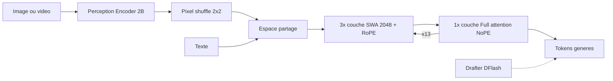
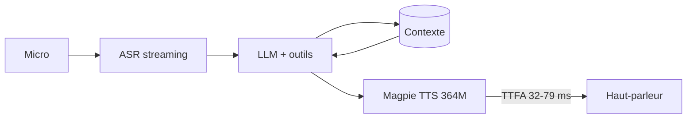
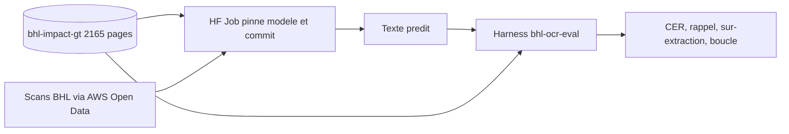

# IA — Détail du mardi 11 août 2026

## 1. Muse Glimmer 30B — Meta revient à l'open source avec une attention hybride SWA/NoPE

**Source :** Hugging Face — https://huggingface.co/blog/muse-glimmer
**Date :** 10 août 2026

### Contexte

Meta a publié hier **Muse Glimmer**, un modèle multimodal dense de **30 milliards de paramètres** sous licence **Apache 2.0**. Il est distillé de Muse, le modèle frontière maison, et explicitement taillé pour l'**agentique locale** : assistants privés, analyse de documents, codage, setups type Claw ou Hermes. Le support est livré jour 0 dans `transformers`, `llama.cpp`, `vLLM` et Inference Endpoints.

Le problème que ça vise est simple. Un agent qui lit tes tickets, tes documents internes ou ton code n'a pas vocation à envoyer tout ça chez un fournisseur tiers. Jusqu'ici, la contrepartie de l'auto-hébergement était une chute nette de capacité agentique. Muse Glimmer annonce 75,5 sur MCP Atlas et 51,2 sur SWE-Bench Pro, au-dessus de Gemma4-31B et Qwen3.6-27B sur ces deux tableaux.

### Comment ça marche

L'intérêt technique est dans le décodeur. Muse Glimmer combine trois choix qui se répondent.

**Premier choix : l'attention hybride.** Le modèle alterne trois couches à fenêtre glissante de 2 048 tokens, avec encodage positionnel rotatif (RoPE), puis une quatrième couche à attention complète **sans encodage positionnel du tout** (NoPE). Ce motif `(SWA, SWA, SWA, Full)` est répété 13 fois, soit 52 couches. Les couches SWA portent l'ordre et la distance relative, à coût mémoire linéaire. La couche Full-NoPE, elle, voit toute la séquence sans biais positionnel : c'est elle qui fait circuler l'information globale. Tu obtiens un long contexte sans payer le quadratique sur chaque couche.

**Deuxième choix : la Gated Grouped-Query Attention.** Chaque tête clé-valeur est partagée par **16 têtes de requête**. Le KV-cache est divisé par 16 — c'est ce qui rend le modèle tenable sur une seule carte, parce qu'en génération c'est le cache, pas les poids, qui explose quand le contexte s'allonge.

**Troisième choix : la normalisation Q-K.** Avant le calcul d'attention, une RMS norm est appliquée à chaque tête de requête et de clé, puis les requêtes sont multipliées par un facteur d'échelle. Ce facteur agit comme une température inverse au niveau du softmax : il fixe l'échelle cible des logits après normalisation et stabilise l'entraînement des grands modèles.

Côté vision, l'encodeur est un ViT de 2 Md de type Perception Encoder — inhabituellement gros pour un VLM. Il patchifie en 2 frames × 3 canaux × 14 × 14, puis un pixel shuffle regroupe les tokens spatiaux voisins par blocs 2×2, ce qui divise par 4 le nombre de tokens image sans jeter de canaux.



### En pratique — exemple de code

Le chargement est banal, et c'est voulu : `AutoModelForMultimodalLM` masque la multimodalité.

```py
from transformers import AutoProcessor, AutoModelForMultimodalLM

MODEL_ID = "meta-models/Muse-Glimmer-30B"

processor = AutoProcessor.from_pretrained(MODEL_ID)
# device_map="auto" place le modele sur CUDA, ROCm ou XPU sans changer le code
model = AutoModelForMultimodalLM.from_pretrained(MODEL_ID, dtype="auto", device_map="auto")

messages = [{"role": "user", "content": "Ecris une blague courte sur la RAM."}]
inputs = processor.apply_chat_template(
    messages, tokenize=True, return_dict=True, return_tensors="pt",
    add_generation_prompt=True,
    reasoning_strength="low",   # curseur de raisonnement : low / high
).to(model.device)

outputs = model.generate(**inputs)
print(processor.decode(outputs[0][inputs["input_ids"].shape[-1]:], skip_special_tokens=False))
```

Le gain de débit vient du drafter **DFlash**, un modèle de diffusion par blocs entraîné avec un bloc de 16 — un token d'ancrage plus 15 tokens proposés. Toute valeur au-dessus de 15 est écrêtée.

```bash
# Serveur llama.cpp avec decodage speculatif DFlash : sortie identique, generation plus rapide
llama serve -hf meta-models/Muse-Glimmer-30B-GGUF \
  --spec-type draft-dflash \
  --spec-draft-n-max 15      # au-dela de 15, clampe : le bloc DFlash fait 16
```

### Pourquoi ça compte pour toi

Un 30B Apache 2.0 qui code et appelle des outils change ton arbitrage build/buy. Tu peux brancher un agent sur ton dépôt .NET ou Angular sans faire sortir une ligne de code. Le KV-cache divisé par 16 rend une seule H100 suffisante en BF16, et un Q4_K_M passe sur du matériel bien plus modeste. Note le revers : 28,4 % de taux de réussite d'attaque sur Siren AgentDojo — l'injection de prompt reste ton problème.

### Points de vigilance

Le contexte annoncé dans la configuration OpenClaw de l'article est de 32 768 tokens, loin des fenêtres à 1 M des modèles frontières. Vérifie ce chiffre avant de bâtir un pipeline RAG dessus.

---

## 2. NVIDIA Magpie TTS Multilingual 357M — frame stacking et budget de latence vocale

**Source :** Hugging Face — https://huggingface.co/blog/nvidia/magpie-tts-multilingual-voice-agents
**Date :** 10 août 2026

### Contexte

NVIDIA a publié hier une nouvelle version de **Magpie TTS Multilingual**, un modèle de synthèse vocale à **364 M de paramètres**, poids ouverts sous NVIDIA Open Model License. Il couvre désormais **12 langues**, avec l'arabe standard moderne, le coréen et le portugais brésilien en nouveautés, et une voix masculine et féminine par langue via une représentation de locuteur partagée.

L'enjeu n'est pas la liste des langues, c'est l'architecture d'un agent vocal. Deux écoles s'affrontent. Le **modèle intégré** — audio en entrée, audio en sortie, un appel d'API — est simple mais opaque : tu ne peux ni affiner un maillon, ni mesurer où part la latence, ni garantir la résidence des données. L'**architecture cascadée** — ASR, LLM et TTS séparés — garde chaque couche déployable et réglable chez toi.

### Comment ça marche

Tout se joue sur une métrique : le **TTFA**, *Time to First Audio*, le délai entre le début de la génération et le premier échantillon audible. C'est le dernier maillon avant l'oreille de l'utilisateur, donc celui qu'il perçoit.

Le budget total d'une conversation naturelle tourne autour de 200 ms. Capture audio, transcription, appel LLM, récupération de contexte : tout ça consomme déjà l'essentiel. Si la synthèse prend 300 ms, l'interaction paraît lente quoi que tu fasses en amont. Magpie annonce 32 ms de TTFA sur B200 en flux unique, 47 ms sur H100, 79 ms sur A100. À 64 flux concurrents, le B200 monte à 239 ms mais délivre un débit de 320× le temps réel.

Deux astuces architecturales produisent ces chiffres, et elles ne fonctionnent qu'ensemble.

**Le frame stacking.** Le décodeur prédit **deux trames audio par pas de décodage** au lieu d'une. Le nombre d'itérations est divisé par deux, donc le temps de génération aussi.

**Le local transformer.** Pris seul, le frame stacking dégrade la qualité : générer simultanément plusieurs tokens de codebook ignore les dépendances entre eux. Un petit transformeur local modélise précisément ces dépendances et raffine l'audio produit. Il récupère la qualité que le frame stacking aurait sacrifiée. L'architecture est décrite dans *Frame-Stacked Local Transformers for Efficient Multi-Codebook Speech Generation* (ICASSP 2026).

Les gains de qualité sont mesurables : le CER français passe de 2,70 % à 1,54 %, l'espagnol de 1,14 % à 0,60 %, avec une similarité de locuteur en hausse dans les deux cas.



### En pratique — exemple de code

La configuration d'inférence recommandée est courte mais chaque paramètre pèse.

```py
# Configuration d'inference recommandee par NVIDIA pour Magpie TTS Multilingual
cfg_scale = 2.5            # guidage sans classifieur : monte-le si le modele s'ecarte du texte
temperature = 0.6          # bas = prosodie stable, haut = plus de variation naturelle
top_k = 80
apply_attention_prior = True   # aligne l'attention texte->audio, evite les sauts de mots
prior_epsilon = 0.1
```

Le raisonnement pratique est un simple budget à soustraire.

```python
# Verifier que ton pipeline vocal tient dans la fenetre conversationnelle
BUDGET_MS = 200            # au-dela, l'utilisateur percoit un blanc

asr_ms, llm_ttft_ms = 45, 90
tts_ttfa_ms = 47           # Magpie sur H100, 1 flux, mesure on-prem

total = asr_ms + llm_ttft_ms + tts_ttfa_ms
print(total, "ms ->", "OK" if total <= BUDGET_MS else "trop lent")
# 182 ms -> OK. Passe a 64 flux concurrents : TTFA 275 ms, le budget explose seul.
```

### Pourquoi ça compte pour toi

Si tu bâtis un agent vocal, mesure le TTFA avant de choisir un modèle. Un poids ouvert déployé chez toi te rend la latence serveur observable et actionnable : pas d'aller-retour vers un service managé dans le chiffre. Le point d'attention est la concurrence — le TTFA à 64 flux est cinq à six fois celui d'un flux unique. Dimensionne sur ta charge réelle, pas sur le benchmark mono-flux.

---

## 3. FineBooks — 14 modèles OCR open weights mesurés sur 2 165 pages de vérité terrain

**Source :** Hugging Face — https://huggingface.co/blog/finebooks/historical-books-ocr-leaderboard
**Date :** 10 août 2026

### Contexte

**FineBooks**, une collaboration Hugging Face / EleutherAI, publie un leaderboard qui compare **14 modèles OCR à poids ouverts** sur 2 165 pages de livres historiques transcrites à la main. La vérité terrain vient d'un projet éteint depuis quatorze ans : entre 2011 et 2012, IMPACT et BHL-Europe ont produit des transcriptions expertes de six volumes en anglais, français, allemand et latin, avec environ une erreur pour deux mille caractères.

L'enjeu dépasse la numérisation patrimoniale. Les livres du domaine public sont l'une des plus grosses sources de texte long librement réutilisable pour entraîner des modèles ouverts — mais seulement si la qualité du texte suit. Le projet Talkie a chiffré le coût : un modèle entraîné sur du texte issu d'OCR apprend à **30 % de l'efficacité** du même modèle entraîné sur des transcriptions humaines des mêmes livres.

### Comment ça marche

La métrique de base est le **CER**, *Character Error Rate* : substitutions plus suppressions plus insertions, divisé par le nombre total de caractères de la référence. Un CER de 0,024 signifie 24 erreurs pour mille caractères, soit 97,6 % de précision.

Le point pédagogique est ailleurs : **un CER seul ment**, et le leaderboard le démontre avec quatre correctifs.

- **Deux variantes de CER.** L'imprimé ancien utilise le *s long* « ſ » et des ligatures. La variante *diplomatique* compte comme erreur un modèle qui modernise « ſ » en « s » ; la variante *reading* compte cette modernisation comme correcte. Le bon choix dépend de ton usage : transcription savante fidèle, ou texte lisible.
- **Le rappel.** Combien des mots réellement présents le modèle a-t-il produits ? Un modèle peut afficher un excellent CER tout en **avalant silencieusement les notes de bas de page**.
- **La sur-extraction.** Combien de la sortie n'est pas sur la page ? Les modèles VLM hallucinent du texte sur des pages blanches ou purement illustrées.
- **Le taux de boucle.** Part des pages où le modèle s'est répété jusqu'à la limite de tokens. Ces pages sont **exclues des autres scores** — donc un taux de boucle élevé embellit mécaniquement le reste. Les deux chiffres se lisent ensemble, jamais séparément.

Les résultats, variante *reading* : dots.mocr (3 Md) à 97,6 % pour 1,94 $ les mille pages, OvisOCR2 (0,9 Md) à 96,9 % pour 0,46 $, PaddleOCR-VL-1.6 (1 Md) à 96,1 % pour 0,34 $, olmOCR-2 (8,3 Md) à 95,7 %. Le meilleur rapport précision/coût n'est pas le plus gros modèle.



### En pratique — exemple de code

Le CER se calcule en dix lignes. La distance de Levenshtein compte les trois types d'erreur d'un coup.

```python
# CER + rappel : les deux chiffres qui, ensemble, disent la verite sur un OCR
import Levenshtein

def cer(reference: str, hypothese: str) -> float:
    # distance = substitutions + suppressions + insertions
    return Levenshtein.distance(reference, hypothese) / max(len(reference), 1)

def rappel_mots(reference: str, hypothese: str) -> float:
    ref, hyp = reference.split(), set(hypothese.split())
    # detecte le modele qui "oublie" les notes de bas de page malgre un bon CER
    return sum(1 for m in ref if m in hyp) / max(len(ref), 1)

ref = "Les oiseaux de proie ſont rares."
hyp = "Les oiseaux de proie sont rares."
print(f"CER diplomatique {cer(ref, hyp):.4f}")           # 0.0312 : le s long compte comme erreur
print(f"CER reading      {cer(ref.replace('ſ','s'), hyp):.4f}")  # 0.0000
print(f"Rappel           {rappel_mots(ref, hyp):.2f}")
```

### Pourquoi ça compte pour toi

Si tu ingères des PDF scannés dans un pipeline documentaire, cette méthodologie est directement réutilisable. Constitue ta propre vérité terrain sur cinquante pages représentatives, puis mesure CER **et** rappel **et** taux de boucle. Un modèle à 1 Md à 0,34 $ les mille pages peut suffire là où tu allais payer un 8 Md. Le rappel est ce qui protège tes données métier des disparitions silencieuses.

### Limites

Le corpus ne couvre que des typographies antiqua, quatre langues européennes et des mises en page de livre. Rien n'est dit du Fraktur, des écritures non latines, du manuscrit ni du multi-colonnes.
