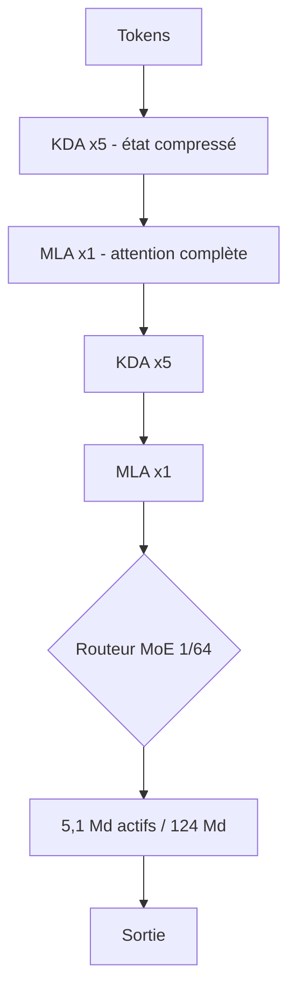

# IA — Détail du mercredi 12 août 2026

## 1. Ling-3.0-tiny — 7,9 Md de paramètres, ~1,3 Md actifs, poids MIT sur Hugging Face

**Source :** Hugging Face — https://huggingface.co/inclusionAI/Ling-3.0-tiny
**Date :** dépôt créé le 10 août 2026, mis à jour le 11 août 2026

### Contexte

`inclusionAI` est le compte Hugging Face de **Ant Bailing**, la division IA d'Ant Group. La famille Ling 3.0 s'est construite en descendant l'échelle : `Ling-3.0-flash` (124 Md de paramètres totaux) fin juillet, puis `Ling-3.0-tiny` maintenant, avec **7,89 Md de paramètres totaux** et environ **1,3 Md activés par token**.

Le contexte de marché explique le format. Sur le segment des petits modèles agentiques, la concurrence est dense : LFM2.5-2.6B de Liquid AI, les Nemotron de NVIDIA, les Qwen3.x légers. La question n'est plus « ce modèle est-il intelligent », elle est « combien de VRAM, combien de tokens par seconde, et sous quelle licence ». Ling-3.0-tiny répond **MIT** — pas de clause de territoire, pas de restriction d'usage commercial. C'est un différenciateur net face à des poids ouverts sous licences maison.

Positionnement mesuré : Artificial Analysis lui attribue **25 à son Intelligence Index**, soit la 6ᵉ place sur 56 modèles de sa classe, pour une médiane à 8. À prendre comme un ordre de grandeur, pas comme une vérité — les scores par benchmark n'étaient pas publiés.

### Comment ça marche

Le point à comprendre, c'est l'écart entre **paramètres totaux** et **paramètres actifs**, parce que c'est lui qui détermine ce que tu paies.

Un modèle dense de 8 Md fait passer chaque token par ses 8 milliards de poids. Un **Mixture-of-Experts** découpe chaque couche feed-forward en un grand nombre d'experts, et un routeur n'en sélectionne que quelques-uns par token. Ling-3.0-tiny a 7,89 Md de poids sur le disque, mais n'en traverse que ~1,3 Md à chaque token généré.

Les deux coûts se dissocient donc :

- **La VRAM** suit les paramètres **totaux**. Il faut loger les 7,89 Md — environ 16 Go en bf16, ~4-5 Go en int4. Tous les experts doivent être résidents, puisqu'on ne sait pas à l'avance lesquels le routeur choisira.
- **Le calcul** suit les paramètres **actifs**. La latence par token se rapproche de celle d'un modèle de 1-2 Md.

C'est le compromis fondamental du MoE : tu échanges de la mémoire contre de la vitesse. Sur une carte 24 Go, ce modèle laisse beaucoup de place au cache KV — utile quand on annonce **256K de contexte** et jusqu'à 32K tokens de sortie.

Deuxième mécanisme à connaître : les **deux modes de raisonnement**. Le mode *Thinking*, actif par défaut, produit des tokens de raisonnement avant la réponse. Le mode *Instant* répond directement. Ce n'est pas cosmétique : sur une tâche de classification ou d'extraction, *Thinking* peut tripler le coût en tokens sans améliorer la sortie. Sur une tâche d'outillage multi-étapes, il change tout. Le choix du mode est une décision d'architecture, pas un réglage d'ambiance.

### En pratique — exemple de code

```bash
# Récupérer les poids (MIT) — ~16 Go en bf16
hf download inclusionAI/Ling-3.0-tiny --local-dir ./ling-3.0-tiny

# Servir en OpenAI-compatible. `trust_remote_code` est requis :
# l'architecture `bailing_hybrid` n'est pas dans transformers en standard.
vllm serve ./ling-3.0-tiny \
  --trust-remote-code \
  --max-model-len 262144 \
  --gpu-memory-utilization 0.90
```

```python
# Appel depuis .NET/Python : le mode Instant coupe les tokens de raisonnement.
# Sur une extraction structurée, c'est 3 à 5x moins de tokens facturés.
import openai
client = openai.OpenAI(base_url="http://localhost:8000/v1", api_key="none")

resp = client.chat.completions.create(
    model="./ling-3.0-tiny",
    messages=[{"role": "user", "content": "Extrais le SIRET de ce texte : ..."}],
    extra_body={"chat_template_kwargs": {"thinking": False}},  # mode Instant
    max_tokens=256,
)
print(resp.choices[0].message.content)
```

### Pourquoi ça compte pour toi

Un modèle MIT de 7,9 Md qui tient sur une carte 24 Go et sert 256K de contexte, c'est une brique crédible pour du traitement de documents on-premise — celui que tu ne peux pas envoyer chez un fournisseur. Avant de l'adopter, mesure toi-même sur ton corpus : les classements d'agrégateurs ne disent rien de ton français métier. Et fixe explicitement le mode de raisonnement dans ton client, sinon tu paieras *Thinking* partout.

### Points de vigilance

`trust_remote_code` exécute du code Python du dépôt. Épingle un commit et relis-le avant de le passer en production.

---

## 2. `bailing_hybrid` — pourquoi alterner Kimi Delta Attention et MLA en 5:1

**Source :** Hugging Face — https://huggingface.co/inclusionAI/Ling-3.0-flash
**Date :** mise à jour du 6 août 2026

### Contexte

Toute la famille Ling 3.0 partage une architecture nommée `bailing_hybrid`. Elle mérite un développement propre, parce qu'elle illustre une bascule en cours dans la conception des LLM à long contexte.

L'attention softmax classique compare chaque token à tous les autres. Coût en calcul : quadratique avec la longueur de séquence. Coût en mémoire : le cache KV grandit linéairement, ce qui devient l'os quand on vise 256K tokens. L'**attention linéaire** résout le problème autrement : au lieu de garder toutes les clés et valeurs, elle maintient un **état compressé de taille fixe** qu'elle met à jour token après token. Coût linéaire, mémoire constante — mais perte d'information, parce qu'un état de taille fixe ne peut pas tout retenir.

Le pari de Ling 3.0 : ne pas choisir.

### Comment ça marche

**Étape 1 — l'alternance 5:1.** Le réseau empile cinq couches d'attention linéaire (**KDA**, Kimi Delta Attention) puis une couche d'attention complète (**MLA**, Multi-head Latent Attention), et répète le motif. Les couches KDA font le gros du travail à coût linéaire. La couche MLA, une sur six, réintroduit une comparaison globale exacte et « recale » la représentation avant que la dérive de l'état compressé ne s'accumule.

**Étape 2 — l'hybride est natif.** C'est le point qu'Ant met en avant : l'alternance est en place **dès le premier token de pré-entraînement**. La différence est réelle. Beaucoup de modèles hybrides sont obtenus en convertissant après coup un modèle dense entraîné en attention complète ; le réseau doit alors s'adapter à une contrainte qu'il n'a jamais vue. Ici, les couches linéaires ont appris à compresser en sachant qu'une couche MLA viendrait corriger.

**Étape 3 — le gating diagonal de KDA.** KDA raffine la **règle Delta** de mise à jour d'état. Dans une attention linéaire à règle Delta, chaque nouveau token écrase partiellement l'état existant. Le gating diagonal fin ajoute un contrôle **par dimension** : le modèle décide, canal par canal, ce qu'il conserve et ce qu'il remplace. En pratique, cela protège les informations rares — un identifiant, un nom de fonction, une clause contractuelle — que la version sans gating dilue au fil d'un long document.

**Étape 4 — la sparsité MoE.** Par-dessus, chaque couche feed-forward est un MoE **1/64 sparse**. Sur `flash` : 124 Md de paramètres totaux, 5,1 Md activés par token. Les deux axes d'économie — attention linéaire et experts creux — se composent.

Ant vise explicitement les charges agentiques, et cite SWE-Bench Pro, SWE-Bench Multilingual, Tau3-banking, MCP-Atlas et SkillsBench. Cohérent : un agent qui lit un dépôt entier est exactement le profil où le cache KV explose.



### En pratique — exemple de code

```python
# Charger l'architecture hybride : elle vit dans le dépôt, pas dans transformers.
from transformers import AutoModelForCausalLM, AutoConfig

cfg = AutoConfig.from_pretrained("inclusionAI/Ling-3.0-flash", trust_remote_code=True)
print(cfg.model_type)          # 'bailing_hybrid'
print(cfg.num_hidden_layers)   # profondeur totale ; le motif KDA/MLA suit un cycle de 6

model = AutoModelForCausalLM.from_pretrained(
    "inclusionAI/Ling-3.0-flash",
    trust_remote_code=True,
    dtype="bfloat16",
    device_map="auto",         # 124 Md en bf16 -> multi-GPU obligatoire
)
```

```bash
# En production, préfère une variante quantifiée : le coût est dominé
# par la VRAM des experts, pas par le calcul.
vllm serve inclusionAI/Ling-3.0-flash-fp8 --trust-remote-code --max-model-len 262144
```

### Pourquoi ça compte pour toi

Retiens la règle de dimensionnement, pas le nom du modèle. Sur un hybride MoE, tu dimensionnes la **VRAM sur les paramètres totaux** et la **latence sur les paramètres actifs** — deux budgets indépendants. Et sur du long contexte, le poste dominant devient le cache KV, que l'attention linéaire réduit. Si tu évalues un serveur d'inférence interne, mesure ces deux courbes séparément avant de choisir ta carte.

### Limites

Les gains de l'attention linéaire dépendent de la tâche. Sur du rappel exact très profond dans un contexte long, une architecture entièrement attentionnelle reste souvent devant. Teste sur ton cas.
