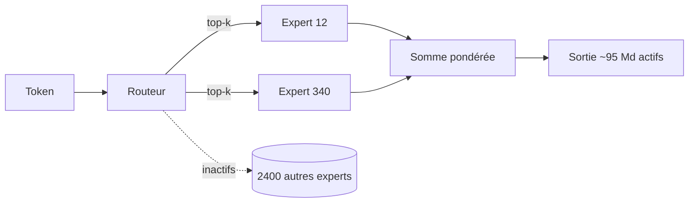
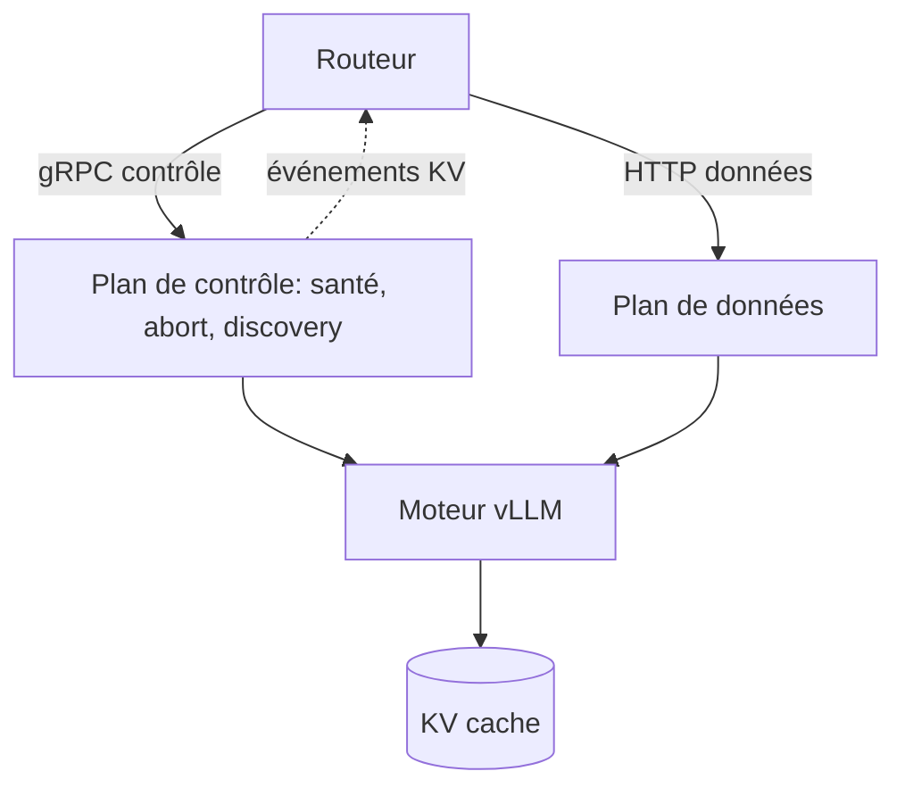

# IA — Détail du vendredi 14 août 2026

## 1. Qwen3.8-2.4T-A95B — le premier Qwen-Max en poids ouverts, avec une licence maison

**Source :** Hugging Face — Qwen/Qwen3.8-2.4T-A95B — https://huggingface.co/Qwen/Qwen3.8-2.4T-A95B
**Date :** 12 août 2026

### Contexte

Alibaba a toujours découpé sa gamme Qwen en deux. D'un côté les modèles ouverts, sous Apache 2.0, généreux mais jamais au sommet. De l'autre les modèles **Max**, réservés à l'API, qui portent le meilleur de la maison. Cette frontière vient de bouger : `Qwen3.8-2.4T-A95B` est le premier modèle de classe Max dont les poids sont téléchargeables.

Le nom encode l'architecture. **2.4T** : 2 400 milliards de paramètres au total. **A95B** : environ 95 milliards de paramètres *actifs* par token. C'est un Mixture-of-Experts très creux — le ratio actif/total tourne autour de 4 %. Une build FP8 est publiée en parallèle, et des quantisations GGUF communautaires ont suivi dans la journée.

Deux nuances sont apparues aussitôt et ont dominé la discussion sur la page du modèle. D'abord, les poids ne sont **pas** l'équivalent de l'API : la version téléchargeable est text-only, sans la vision ni le contexte 1 M que le service propose. Ensuite, la licence n'est pas Apache 2.0 : la carte du modèle référence une licence nommée `qwen3.8-max`, rédigée pour cette release.

### Comment ça marche

Comprendre pourquoi « 2,4 T » ne veut pas dire « il faut 2,4 T de VRAM de calcul » demande de dérouler le MoE creux.

**Le bloc dense classique** applique le même FFN à tous les tokens. Coût de calcul et empreinte mémoire évoluent ensemble.

**Le bloc MoE** remplace ce FFN unique par N experts, plus un *routeur* : un petit réseau linéaire qui, pour chaque token, produit un score par expert et n'en retient que les k meilleurs. Seuls ces k experts calculent. Le token est traité par une fraction du réseau.

**Conséquence en deux temps.** Le **calcul** est proportionnel aux paramètres actifs — ici ~95 Md, soit le coût d'un gros modèle dense, pas d'un modèle de 2,4 T. La **mémoire**, elle, reste proportionnelle au total : tous les experts doivent être résidents ou accessibles, car on ne sait pas à l'avance lesquels seront sollicités. C'est le compromis fondamental du MoE : on achète de la capacité avec de la mémoire, pas avec du temps de calcul.

**D'où le FP8.** À 2,4 T de paramètres, un poids sur deux octets demanderait ~4,8 To. En FP8, on tombe autour de 2,4 To — encore hors de portée d'une machine unique, d'où le déploiement en rack multi-GPU avec parallélisme d'experts.

Le fait que le raisonnement ne soit pas désactivable a un effet direct sur ton budget : chaque réponse consomme des tokens de réflexion que tu paies en latence et en KV-cache, même sur une requête triviale.



### En pratique — exemple de code

Le premier réflexe n'est pas de télécharger 2,4 To de poids : c'est de lire la licence, puis de dimensionner.

```bash
# 1) Récupérer la licence seule avant tout téléchargement de poids.
hf download Qwen/Qwen3.8-2.4T-A95B LICENSE --local-dir ./qwen-licence
sed -n '1,80p' ./qwen-licence/LICENSE   # chercher : usage commercial, redistribution, seuils

# 2) Inspecter la config sans tirer les shards (quelques Ko).
hf download Qwen/Qwen3.8-2.4T-A95B config.json --local-dir ./qwen-cfg
python - <<'PY'
import json
c = json.load(open('./qwen-cfg/config.json'))
# Ce qui pilote ton dimensionnement : nombre d'experts et experts activés par token.
for k in ('num_experts', 'num_experts_per_tok', 'hidden_size', 'num_hidden_layers'):
    print(k, '=', c.get(k))
PY
```

Servir la build FP8 suppose un parallélisme d'experts, pas un simple `tensor_parallel_size` :

```bash
# Parallélisme de tenseurs ET d'experts : sans -dp, le routage sature un seul rang.
vllm serve Qwen/Qwen3.8-2.4T-A95B-FP8 \
  --tensor-parallel-size 8 \
  --data-parallel-size 8 \
  --enable-expert-parallel \
  --max-model-len 32768   # le 1M de l'API n'est pas dans les poids ouverts
```

### Pourquoi ça compte pour toi

Pratiquement, tu ne serviras pas ce modèle toi-même — il demande un rack, pas un serveur. Ce qui te concerne, c'est la licence : `qwen3.8-max` n'est pas Apache 2.0, donc tu ne peux pas présumer des droits acquis sur les Qwen précédents. Si un fournisseur t'expose ce modèle en API, demande-lui sous quel régime. Et vérifie que ton besoin ne suppose ni vision ni contexte 1 M : ces capacités restent hors des poids.

### Points de vigilance

L'écart entre le modèle annoncé et le modèle publié est le vrai enseignement. « Poids ouverts » ne signifie plus « le modèle que vous testez via l'API ». Compare systématiquement la carte du modèle et la doc de l'API avant de bâtir un benchmark interne — sinon tu mesures deux artefacts différents en croyant comparer un déploiement local à un service managé.

---

## 2. vLLM v0.27.0 et v0.27.1 — Kimi K3 en une release, et un plan de contrôle gRPC en Rust

**Source :** GitHub — vllm-project/vllm Release v0.27.0 — https://github.com/vllm-project/vllm/releases/tag/v0.27.0
**Date :** 9 août 2026 (v0.27.0), 11 août 2026 (v0.27.1)

### Contexte

vLLM a longtemps été un serveur d'inférence Python avec des noyaux CUDA. Les releases récentes racontent une autre histoire : le projet devient une **plateforme de service**, avec un chemin de données en Rust et une couche de contrôle séparée. La `v0.27.0` cristallise ce virage avec 561 commits de 242 contributeurs.

Le fait marquant produit, c'est le support de **Kimi K3** livré d'un bloc : fichiers de modèle, noyaux d'attention, frontends Python *et* Rust, support DeepGEMM, fusion AR, sharding optionnel des experts partagés. Historiquement, le support d'un nouveau modèle frontière arrivait par morceaux sur trois releases, avec des semaines de performances dégradées entre-temps. Ici tout atterrit ensemble.

Le fait marquant infrastructure, c'est le **plan de contrôle gRPC** du frontend Rust.

### Comment ça marche

La distinction plan de données / plan de contrôle est empruntée au réseau, et c'est elle qu'il faut comprendre.

**Le plan de données**, c'est le chemin d'une requête : prompt entrant, préremplissage, décodage token par token, réponse streamée. Il est optimisé pour le débit et supporte mal les interruptions.

**Le plan de contrôle**, c'est tout le reste : est-ce que ce serveur est en bonne santé ? Quels modèles sert-il ? Annule cette requête. Où sont les événements de KV-cache ?

Tant que les deux passent par la même API HTTP, ils se gênent. Un `/health` qui attend derrière une file de décodage saturée répond lentement, et ton orchestrateur conclut à tort que le pod est mort — puis le tue, ce qui aggrave la congestion. C'est la boucle de rétroaction classique des déploiements sous charge.

Le plan de contrôle gRPC sépare les deux. Les points notables :

**Santé consciente du moteur.** Le contrôle interroge l'état réel du moteur d'inférence, pas seulement la vivacité du processus HTTP. Un moteur saturé mais sain se distingue d'un moteur bloqué.

**Contrôle d'abandon.** Annuler une génération devient une opération de contrôle explicite, au lieu de dépendre de la fermeture d'un flux HTTP. Ce sont des GPU-secondes récupérées quand un utilisateur ferme son onglet.

**Découverte.** Serveurs, modèles et sources d'événements KV sont énumérables. C'est ce qui rend possible un routeur qui place une requête sur l'instance qui a déjà le préfixe en cache, plutôt qu'au hasard.

Côté matériel, `sm_107` (NVIDIA Rubin) et `gfx1250` (ROCm) sont activés en amont : le code compile pour ces cibles avant que le silicium ne soit largement disponible.



### En pratique — exemple de code

Démarrer un serveur avec le plan de contrôle exposé, puis l'interroger.

```bash
# v0.27.x : le port de contrôle gRPC est distinct du port HTTP de service.
vllm serve Qwen/Qwen3.5-32B \
  --port 8000 \
  --grpc-control-port 50051 \
  --enable-prefix-caching
```

Une sonde de vivacité qui interroge le moteur, et non le serveur HTTP :

```yaml
# Avant — /health HTTP : répond lentement sous charge, le pod est tué à tort.
livenessProbe:
  httpGet: { path: /health, port: 8000 }
  failureThreshold: 3

# Après — sonde gRPC sur le plan de contrôle : la file de décodage
# saturée ne bloque plus la réponse de santé.
livenessProbe:
  grpc: { port: 50051 }
  failureThreshold: 3
  periodSeconds: 10
```

### Pourquoi ça compte pour toi

Si tu héberges un modèle derrière une API .NET, ce sont tes sondes Kubernetes qui gagnent le plus. Tu arrêtes de tuer des pods sains sous charge, et tu récupères du GPU en annulant proprement les requêtes abandonnées par le client — donc en propageant ton `CancellationToken` jusqu'à l'abort vLLM. Passe tes probes en gRPC avant d'ajuster quoi que ce soit d'autre : c'est le correctif à effet immédiat.

### Limites

Le frontend Rust et son plan de contrôle sont récents, et `v0.27.1` corrige déjà `v0.27.0` deux jours après. Sur un déploiement de production, garde ton chemin HTTP en secours et bascule les sondes progressivement. L'activation `sm_107` / `gfx1250` est de l'anticipation matérielle : elle ne dit rien des performances réelles sur ces cibles.
