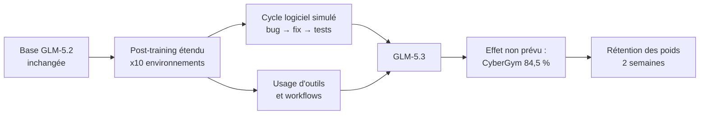
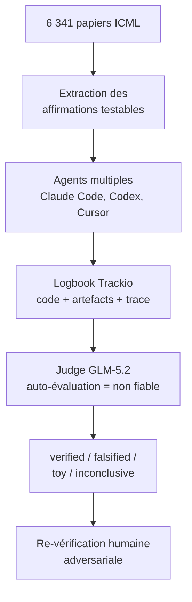

# IA — Détail du samedi 15 août 2026

## 1. GLM-5.3 (Z.ai) — 743 Md, même base que GLM-5.2, poids retenus deux semaines

**Source :** The New Stack — https://thenewstack.io/glm-5-3-post-training-coding/
**Date :** 14 août 2026

### Contexte

Depuis deux ans, la course aux modèles se lit surtout en nombre de paramètres. GLM-5.3 raconte autre chose. Z.ai déclare avoir réutilisé **le modèle de base de GLM-5.2 sans le réentraîner**, et avoir obtenu tous ses gains par un post-training massivement étendu. Le modèle est annoncé à 743 milliards de paramètres, avec une amélioration de l'ordre de 50 % en codage sur les évaluations internes.

Deuxième fait notable : les poids ne sortent pas le jour de l'annonce. Z.ai les publiera après environ deux semaines de durcissement et de tests de sûreté. C'est la première rétention explicite pour ce motif dans la série GLM, et elle est directement liée à la capacité cyber du modèle, qui a progressé plus vite que l'éditeur ne l'anticipait à mesure que l'entraînement montait en échelle.

### Comment ça marche

Il faut distinguer deux budgets de calcul. Le **pré-entraînement** apprend au modèle la structure générale du langage et du code sur un corpus brut. Le **post-training** l'apprend à *se comporter* : suivre des instructions, utiliser des outils, mener une tâche à terme. Historiquement, on gonflait le premier et on saupoudrait le second.

Z.ai a inversé la répartition. Concrètement, l'éditeur dit avoir exposé le modèle à **dix fois plus d'environnements de tâches long-horizon**, en élargissant son accès aux outils et aux workflows d'ingénierie. Un environnement long-horizon n'est pas un jeu de questions-réponses : c'est une boucle où le modèle observe, agit, reçoit un retour et recommence, sur des dizaines ou des centaines d'étapes. Certaines tâches d'entraînement simulaient le cycle logiciel complet — identifier un bug, rédiger un correctif, écrire le code, lancer les tests, livrer — pour un volume de travail que Z.ai compare à plusieurs jours d'un ingénieur senior.

Pourquoi ça marche ? Parce que la compétence agentique n'est pas un savoir, c'est une politique. Elle s'apprend là où il y a un signal de récompense vérifiable : les tests passent ou non. Le modèle de base contient déjà la connaissance du langage ; le post-training lui apprend quand s'arrêter, quand relancer un test, quand abandonner une piste. Concentrer le calcul sur les environnements où le modèle travaille réellement rend chaque token d'entraînement beaucoup plus informatif qu'un token de corpus générique.

L'effet secondaire est la cyber. En CyberGym, GLM-5.3 marque 84,5 % contre 77,2 % pour GLM-5.2 — devant Mythos 5 (83,8 %) et GPT-5.6 Sol (83,6 %). Z.ai précise que la force est concentrée sur le **début** de la chaîne : revue de code source et vérification de vulnérabilité. Fabriquer un exploit fiable, prouver l'atteignabilité en production, corriger sans régression restent des problèmes distincts.



### En pratique — exemple de code

GLM-5.3 est déjà utilisable via le GLM Coding Plan sur des endpoints compatibles Anthropic et OpenAI. Le piège de migration est documenté : les appels du Coding Plan vers GLM-5.2 ou GLM-5.1 sont **redirigés automatiquement** vers GLM-5.3.

```bash
# Endpoint compatible OpenAI. Le tag [1m] active la fenêtre de 1 M de tokens.
curl https://api.z.ai/v1/chat/completions \
  -H "Authorization: Bearer $ZAI_KEY" \
  -H "Content-Type: application/json" \
  -d '{
    "model": "glm-5.3[1m]",
    "reasoning_effort": "high",
    "messages": [{"role":"user","content":"Analyse ce repo et corrige le test rouge."}]
  }' | jq '.model'   # <-- vérifie TOUJOURS le model ID réellement servi
```

```python
# Piège A/B : viser GLM-5.2 sur le Coding Plan ne garantit pas de l'obtenir.
resp = client.chat.completions.create(model="glm-5.2", messages=msgs)
assert resp.model.startswith("glm-5.2"), (
    f"Redirigé vers {resp.model} — ton A/B compare deux fois le même modèle."
)
```

### Pourquoi ça compte pour toi

Si tu benchmarkes des modèles de code pour ton équipe, la redirection silencieuse du Coding Plan invalide tes comparaisons. Logge systématiquement le `model` retourné, pas celui demandé. Et attends les poids avant toute décision d'infrastructure : les scores publiés portent sur des dépôts choisis par l'éditeur, pas sur ta base de code C#/Angular.

### Limites

`max` est l'effort de raisonnement par défaut et coûte cher en latence comme en tokens. Le tarif API par token n'est pas encore publié. Enfin, entre « poids ouverts annoncés » et « poids exécutables », le délai est devenu un motif récurrent dans l'écosystème.

---

## 2. Qwen3.8-27B (Alibaba) — un dense de 27 Md qui tourne sur ta machine

**Source :** The New Stack — https://thenewstack.io/qwen38-27b-local-inference/
**Date :** 14 août 2026

### Contexte

Le pari inverse de GLM-5.3. Là où Z.ai empile 743 milliards de paramètres derrière une API, Alibaba sort un **dense de 27 milliards** téléchargeable, avec des scores annoncés dans la même ligue qu'Opus 4.6 en réglage Max — le modèle qui était état de l'art il y a six mois. Sur plusieurs tests de computer use, de codage et de travail de connaissance, Alibaba le donne même devant.

Le modèle embarque en plus des capacités vision, images et vidéo comprises. À cette taille, c'est rare, et c'est ce qui en fait une option crédible pour un usage local sur un Mac bien équipé.

### Comment ça marche

Le point à comprendre est le budget mémoire, parce que c'est lui qui décide si le modèle tourne chez toi ou pas. Trois postes s'additionnent.

**Les poids.** Le dépôt non quantisé pèse 55,6 Go. C'est la taille brute avant tout le reste. La quantisation divise ce poids : en 8 bits tu tombes autour de la moitié, en 4 bits autour du quart. Mais Alibaba précise que ses benchmarks décrivent le **checkpoint original**, pas les versions quantisées que la plupart des gens feront tourner. Le compromis qualité existe toujours ; il n'est simplement pas mesuré dans les chiffres affichés.

**Le runtime.** L'exécutable, les buffers d'activation, les tampons de travail — quelques gigaoctets incompressibles.

**Le cache KV.** C'est le poste qui explose et que tout le monde sous-estime. À chaque token généré, le modèle stocke les clés et valeurs d'attention de toute la séquence. La consommation croît **linéairement avec la longueur du prompt**. Le modèle supporte 262 000 tokens de contexte par défaut, extensible à 1 million via la méthode YaRN. Mais supporter n'est pas pouvoir utiliser : remplir cette fenêtre sur un poste de travail demande souvent plus de mémoire que les poids eux-mêmes.

Dernier point d'architecture : c'est un **dense**, pas un mixture-of-experts. Chaque token active la totalité des 27 milliards de paramètres. Un MoE de taille comparable n'en activerait qu'une fraction et générerait plus vite. Alibaba n'a pas encore publié de variante MoE dans cette génération, alors qu'il l'avait fait pour Qwen 3.6-35B. La vitesse de génération reste donc le point faible.

### En pratique — exemple de code

Le calcul de faisabilité avant le téléchargement de 55 Go :

```python
# Budget mémoire approximatif, en Go. À faire AVANT de télécharger.
params_md   = 27          # milliards de paramètres
bits        = 4           # quantisation visée
ctx_tokens  = 32_000      # contexte réellement utilisé, pas le maximum

poids   = params_md * (bits / 8)              # ≈ 13,5 Go en 4 bits
runtime = 3                                    # buffers + exécutable
# Cache KV : croît linéairement avec le contexte. Ordre de grandeur, pas exact.
kv      = ctx_tokens * 0.00015 * (bits / 8) * 8

print(f"poids={poids:.1f} runtime={runtime} kv≈{kv:.1f} → total≈{poids+runtime+kv:.1f} Go")
# Compare au résultat à ta RAM unifiée disponible, pas à la RAM totale.
```

```bash
# Vérifier le compromis quantisation sur TA tâche, pas sur les benchmarks vendeur.
# Même prompt, deux quantisations, comparaison manuelle des sorties.
ollama run qwen3.8:27b-q8_0  < prompt.txt > out_q8.txt
ollama run qwen3.8:27b-q4_K_M < prompt.txt > out_q4.txt
diff <(head -40 out_q8.txt) <(head -40 out_q4.txt)
```

### Pourquoi ça compte pour toi

Un modèle vision-code de ce niveau en local change ce que tu peux faire sur du code client sans le sortir de ton réseau : revue, génération de tests, analyse de captures d'écran. Mais dimensionne d'abord ton cache KV — c'est lui qui te bloquera, pas les poids. Et refais les mesures sur ta quantisation réelle : les scores publiés ne la couvrent pas.

### Limites

Des retours précoces signalent une tendance à la sur-réflexion, qui coûte des tokens et de la latence sans gain. Pour l'agentique, le harnais compte souvent autant que le modèle. Enfin, sur DeepSWE, 42,2 points restent en retrait du frontier et de GLM-5.3.

---

## 3. ICML 2026 — 2 226 papiers reproduits par des agents, 23 % avec une affirmation falsifiée

**Source :** Hugging Face — https://huggingface.co/blog/icml-2026-open-reproductions
**Date :** 13 août 2026

### Contexte

ICML 2026 a reçu 23 918 soumissions et accepté 6 352 papiers, soit environ le double de l'année précédente. La capacité de revue, elle, n'a pas doublé : ce sont des bénévoles. Hugging Face cite la revue d'un papier accepté en spotlight où le relecteur écrit noir sur blanc qu'il n'a pas vérifié les preuves attentivement.

L'idée du hackathon est que la technologie qui produit ce flot peut aussi aider à l'absorber. Du 15 juillet au 2 août, 1 221 participants ont amené leur propre agent de code pour tenter de reproduire les papiers, affirmation par affirmation.

### Comment ça marche

Le protocole est le vrai apport, et il est transposable à n'importe quel audit automatisé — y compris le tien.

**Étape 1 : décomposer en cibles vérifiables.** Les 6 341 papiers acceptés ont été indexés et leurs affirmations scientifiques extraites une par une. Un agent ne part pas d'un PDF de 40 pages mais d'une assertion concrète et testable. C'est la condition pour obtenir un verdict exploitable.

**Étape 2 : diversifier les exécutants.** Claude Code, Codex, Cursor, `orx` — pas un seul harnais, mais tous. Plusieurs personnes reproduisant le même papier étaient encouragées. La redondance est le mécanisme qui révèle les désaccords.

**Étape 3 : rendre l'audit auditable.** Chaque run produit un logbook Trackio : le compte rendu, le code exécuté, les artefacts, et optionnellement la trace complète de l'agent. 6 816 logbooks, 274 traces d'agent publiées, 2 962 jobs cloud lancés.

**Étape 4 : juger avec un modèle explicitement méfiant.** Un « Logbook Judge » tournant sur un modèle open-weights (GLM-5.2) relit chaque logbook et rend un verdict par affirmation — `verified`, `falsified`, `toy`, `inconclusive`. Instruction clé : traiter l'auto-évaluation de chaque logbook comme **non fiable**.

Les résultats : 51 % des papiers examinés ont au moins une affirmation vérifiée, dont 266 entièrement reproduits. 23 % ont au moins une affirmation falsifiée ou contestée, dont 49 où rien n'a pu être vérifié. Et 242 papiers où des équipes indépendantes ont abouti à des verdicts **opposés** sur les mêmes affirmations.



### En pratique — exemple de code

La leçon la plus transposable est celle du papier « Attention's forward pass and Frank-Wolfe ». Trois équipes ont trouvé des contre-exemples apparaissant à t = 224, ~3 800 et 6 416 pas. Tous les autres avaient « vérifié » la propriété — parce que leurs vérifications s'arrêtaient trop tôt.

```python
# Avant — vérification à horizon fixe : conclut "vérifié" sans le savoir.
for t in range(100):
    state = step(state)
assert invariant(state)      # passe, et ne prouve rien

# Après — balayage d'horizon en échelle log, et arrêt au PREMIER contre-exemple.
for t in range(1, 10_000):
    state = step(state)
    if not invariant(state):
        raise AssertionError(f"Invariant violé à t={t}")   # t=224 ici
    if t & (t - 1) == 0:                # log aux puissances de 2
        print(f"t={t} ok")
```

Le contre-exemple le plus propre était formulé en arithmétique rationnelle exacte — donc sans ambiguïté flottante à laquelle se raccrocher. Les auteurs ont confirmé le jour même.

### Pourquoi ça compte pour toi

Deux réflexes à importer dans tes tests. D'abord, un invariant vérifié à horizon fixe n'est pas vérifié : balaie l'horizon en échelle log. Ensuite, un agent qui s'auto-évalue est un juge et partie — sépare l'exécution du verdict, comme le Logbook Judge. Enfin, méfie-toi de tes propres falsifications : une « méthode 2× plus lente » s'est révélée être une comparaison par-trajectoire contre par-lot-de-50.

### Pour aller plus loin

Le constat sur le rôle humain vaut au-delà de la recherche. Les résultats les plus fiables venaient des workflows où un humain pilotait : repointer l'agent, questionner une hypothèse, arrêter une expérience dont la prémisse était fausse avant d'y brûler une semaine de calcul.
