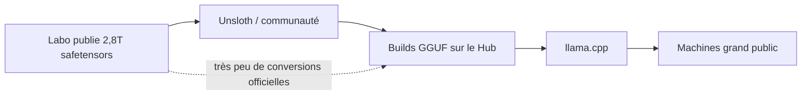
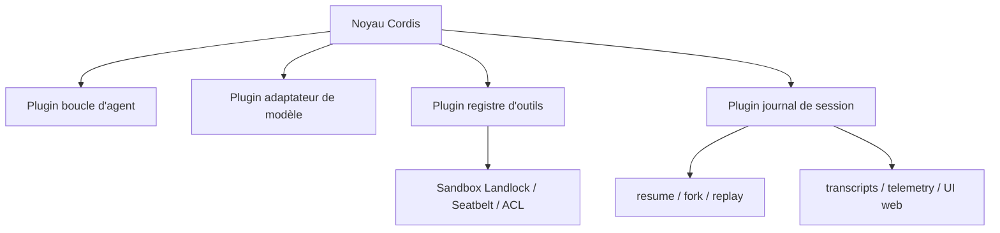

# IA — Détail du dimanche 16 août 2026

## 1. State of Open Models, été 2026 — ce que les chiffres du Hub contredisent

**Source :** Hugging Face — https://huggingface.co/blog/state-of-open-models-summer-2026
**Date :** 14 août 2026

### Contexte

Hugging Face publie deux fois par an un état des lieux de son Hub, données à l'appui. Le rapport d'été couvre janvier à août 2026. Le décor : 2,96 millions de dépôts de modèles publics (contre 2,43 en janvier), 1 million de datasets, 1,44 million de Spaces. La distribution reste extrême — 85,6 % des modèles ont moins de 200 téléchargements à vie, et 1,5 % des dépôts concentrent 99,2 % des téléchargements. Tout le reste se lit dans cette forme.

L'intérêt du rapport, pour toi, n'est pas le classement. C'est qu'il casse trois raccourcis que tu entends en réunion.

### Comment ça marche

**Premier raccourci : « les gros modèles sont ceux qu'on utilise ».** Faux, et de loin. Parmi les modèles déclarant un nombre de paramètres, ceux sous 1 Md prennent 83 % des téléchargements de tous les temps ; tout ce qui dépasse 100 Md en prend 1 %. Sur les seuls téléchargements 2026, 3 % du volume va au-dessus de 70 Md. Raison prosaïque : les petits modèles sont les seuls à tourner sur le matériel que les développeurs possèdent réellement.

**Deuxième raccourci : likes et téléchargements mesurent la même chose.** Hugging Face a croisé le top 25 par téléchargements de l'année et le top 25 par likes. **Un seul dépôt apparaît dans les deux listes.** `all-MiniLM-L6-v2` a été tiré 1,55 milliard de fois en sept mois pour 5 156 likes ; Kimi-K3 est tiré environ soixante fois par like reçu. Un like dit qu'une sortie compte. Un téléchargement dit qu'un modèle est câblé dans un pipeline qui tourne à l'heure. Les likes lisent l'enthousiasme, les téléchargements la dépendance.

**Troisième raccourci : les licences se resserrent à mesure que les modèles grossissent.** Là encore, l'inverse. Sur 178 sorties chinoises au-dessus de 20 Md cette année, 59 % sont en Apache 2.0, 22 % en MIT, et **aucune** ne porte de restriction non commerciale. DeepSeek et Z.ai livrent des modèles de 700 Md à 1,65 T sous simple MIT. Côté américain, dans la même tranche, seuls 29 % sont Apache ou MIT, 41 % relèvent de termes maison et 30 % ne déclarent rien.

Le chemin de distribution explique le paradoxe entre « frontier-first » et « les petits gagnent ». Un labo peut publier 2,8 T de paramètres sans jamais sortir de petit modèle, parce que la couche de quantification communautaire rend l'objet exécutable en quelques jours.



C'est bien là que se situe la croissance : les dépôts déclarant la bibliothèque `gguf` ont bondi de 464 %, `lerobot` de 194 %, `mlx` d'Apple de 148 %, contre 16 % pour `transformers` et 21 % pour `diffusers`. La couche qui décide **où** un modèle peut physiquement tourner grossit trois à sept fois plus vite que la couche de modélisation.

Enfin, la nouveauté méthodologique : le dataset `agent-usage`, publié en juillet, enregistre le jeton `agent/<nom>` que les agents de code envoient au Hub. Claude Code menait juillet à 44,4 %, après 67,8 % en avril et 6,4 % en mai, pendant que Codex montait de 10,4 % à 20,8 %. Près d'un quart du trafic agent de juillet venait de harnais non encore identifiés — contre 59,8 % en mai.

### En pratique — exemple de code

La leçon actionnable : ne juge pas un modèle sur ses likes, regarde ce que la communauté en fait. Ces deux appels te donnent l'ordre de grandeur avant de choisir un socle à fine-tuner.

```bash
# Combien de builds GGUF existent pour la famille visée ?
# Un chiffre élevé = quelqu'un a déjà résolu ton problème de déploiement local.
hf api "models?search=Qwen3&filter=gguf&limit=1&full=false" | jq 'length'

# Téléchargements récents plutôt que cumulés : évite de créditer l'ancienneté.
hf api "models/Qwen/Qwen3.8-27B-FP8" | jq '{downloads, likes, lastModified}'
```

Le rapport note d'ailleurs que sur 28 531 conversions GGUF de modèles Qwen, Qwen n'en a publié que 54. Les poids que tu exécutes ne sont presque jamais ceux que le labo a testés.

### Pourquoi ça compte pour toi

Quand tu arbitres un socle open-weight pour un service .NET ou Python, prends les téléchargements récents et le nombre de dérivés, pas les likes. Vérifie aussi qui a produit le GGUF que tu vas charger : la conversion est rarement officielle. Et si tu tries par licence, sache que la taille du modèle ne prédit plus rien — un 1,65 T sous MIT existe, un 8 B sous termes maison aussi.

---

## 2. DeepSeek Harness — un runtime d'agents où la boucle elle-même est un plugin

**Source :** The New Stack — https://thenewstack.io/deepseek-harness-open-source-plugins/
**Date :** 13 août 2026

### Contexte

DeepSeek a ouvert jeudi le DeepSeek Harness, un runtime d'agents pour développeurs. Le projet est en Node.js, sous licence MIT, disponible en developer preview sur GitHub. L'accueil a été brutal : plus de 33 000 étoiles en quelques heures, et un écosystème de plugins communautaires déjà actif sous le topic `dsh-plugin`.

Le marché des harnais d'agents est jeune et sans titulaire — le rapport Hugging Face du même week-end montre des parts de trafic qui bougent de moitié en un mois. Un runtime ouvert et vraiment modulaire arrive donc à un moment où personne n'a envie de se verrouiller.

### Comment ça marche

La phrase de l'équipe est « everything is a plugin », et elle est à prendre au pied de la lettre. L'adaptateur de modèle est un plugin. Le registre d'outils est un plugin. Le journal de session est un plugin. **La boucle d'agent elle-même est un plugin.** La documentation résume la conséquence : il n'y a « pas de cœur privilégié à patcher », donc étendre le harnais consiste à monter un plugin à côté des autres, pas à forker.

L'architecture repose sur Cordis, un méta-framework de composabilité présenté par trois chercheurs de l'université de Pékin et de DeepSeek. Derrière le vocabulaire, l'idée est simple : une composition dynamique où l'on ajoute et retire des composants sans casser le reste, chaque composant sachant déclarer ses dépendances.



Le harnais livre quatre presets. **Standard** donne l'agent de code complet : outils système de fichiers, accès shell, recherche web, sous-agents, mode plan. **Minimal** réduit à deux outils, `bash` et `str_replace_editor`. **Code** change la façon dont les outils atteignent le modèle : au lieu d'exposer des function calls individuelles, il génère un SDK TypeScript et laisse le modèle écrire un programme contre ce SDK — une séquence qui prendrait cinq allers-retours tient en un seul appel. **Creator** hérite de Standard et ajoute inspection runtime, expérimentation de plugins et guides d'écriture de presets.

Le second choix structurant est le journal de session **append-only**. Tout ce qui atteint une requête au modèle doit être reconstructible depuis ce journal. L'historique de conversation cesse d'être un détail d'implémentation : `resume`, `fork`, `replay`, transcripts, télémétrie et UI web dérivent tous du même flux d'événements. Corollaire discipliné : ajouter un nouveau type d'entrée visible du modèle oblige à ajouter un nouvel événement de session.

Le sandboxing est strict, comme il doit l'être pour un agent qui exécute du shell. Le backend local enveloppe les sous-processus dans Landlock sur Linux — via un addon Node écrit par DeepSeek —, Seatbelt sur macOS, ou un runner à jeton restreint par ACL sur Windows.

### En pratique — exemple de code

Le mode `Minimal` est le bon point d'entrée pour évaluer le harnais sans lui donner ton réseau ni ta clé cloud.

```bash
# Récupérer la preview (MIT) et l'installer localement
git clone https://github.com/deepseek-ai/deepseek-harness
cd deepseek-harness && npm install

# Preset Minimal : uniquement bash + str_replace_editor,
# donc surface d'attaque réduite pour un premier essai.
npx dsh --preset minimal --workdir ./sandbox-demo

# Le journal étant append-only, tout run est rejouable a posteriori
npx dsh replay --session <session-id>
```

Si l'évaluation est concluante, `--preset code` est celui qui change vraiment l'économie de tokens : le modèle écrit un programme TypeScript contre le SDK généré au lieu d'enchaîner les appels d'outils.

### Pourquoi ça compte pour toi

Deux idées sont directement transposables à ton archi backend, même sans adopter le harnais. D'abord, le journal append-only comme source unique : c'est de l'event sourcing appliqué aux conversations, et ça te donne resume et audit gratuitement. Ensuite, le mode Code — remplacer N appels d'outils par un programme unique contre un SDK typé, c'est le même gain qu'une procédure stockée face à N allers-retours SQL.

### Limites

Le projet est en developer preview. Les 33 000 étoiles mesurent l'attention, pas la maturité — exactement la distinction que le rapport Hugging Face du même week-end documente chiffres en main.
