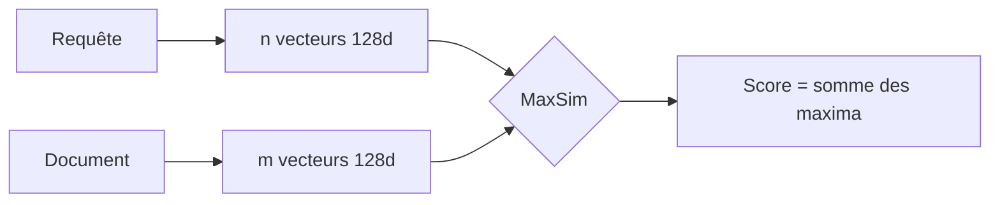
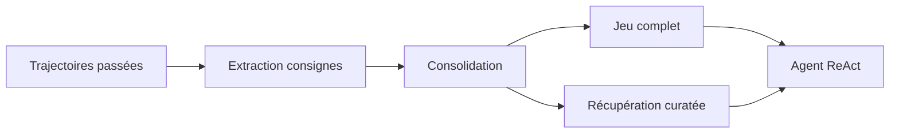

# IA — Détail du mercredi 19 août 2026

## 1. Sentence Transformers v6.0 — `MultiVectorEncoder` et le scoring MaxSim

**Source :** Hugging Face Blog — https://huggingface.co/blog/multi-vector-encoder
**Date :** 18 août 2026

### Contexte

Un modèle d'embedding dense lit un texte et rend un seul vecteur de taille fixe. Tout ce que le modèle a remarqué doit tenir dans ces 384, 768 ou 1024 nombres, et la similarité se réduit à un produit scalaire entre deux résumés. Ça marche remarquablement bien, mais la compression est lossy d'une manière précise : une entité rare, un identifiant exact ou une clause cruciale au milieu d'un long passage se disputent la même place.

L'approche multi-vecteurs — dite aussi *late interaction* ou ColBERT, d'après le papier de 2020 — refuse cette compression. Jusqu'ici, l'écosystème Python la servait via des bibliothèques dédiées : **PyLate**, construite par LightOn au-dessus de Sentence Transformers précisément parce que celle-ci ne gérait que le dense et le sparse, et `colpali-engine` pour le visuel. Avec la **v6.0**, Sentence Transformers absorbe ce quatrième type de modèle nativement, sous le nom `MultiVectorEncoder`.

### Comment ça marche

Le mécanisme se déroule en quatre étapes.

**1. Encodage.** Le transformer produit ses embeddings de token comme d'habitude. Au lieu de les pooler en un vecteur, une couche `Dense` projette **chaque** embedding vers une petite dimension — classiquement 128 — et les garde tous. Un document de 9 tokens devient une matrice 9×128, pas un vecteur.

**2. Masquage.** Un module `MultiVectorMask` décide quels tokens comptent au scoring : la plupart des checkpoints excluent la ponctuation via une *skiplist*. Les vecteurs sont ensuite L2-normalisés.

**3. Asymétrie requête / document.** Requêtes et documents passent par des préfixes différents (`[unused0]` / `[unused1]` sur ColBERTv2, `[Q] ` / `[D] ` sur GTE-ModernColBERT), des plafonds de longueur différents, et des masques différents. D'où deux méthodes distinctes, `encode_query()` et `encode_document()`.

**4. Scoring par MaxSim.** Pour chaque token de la requête, on prend sa similarité maximale contre n'importe quel token du document, puis on somme ces maxima. Comme les embeddings sont normalisés, chaque produit scalaire est un cosinus dans `[-1, 1]`, donc le score total vit dans `[-n_tokens_requête, n_tokens_requête]`. Lis l'opérateur comme un **alignement souple** : chaque token de la requête pointe vers le token du document qui l'explique le mieux.

L'alignement n'a rien de lexical, puisque les embeddings sont contextualisés. Avec `lightonai/mLateOn`, encoder « Where do penguins live? » contre « Penguins inhabit Antarctica. » fait matcher `live` sur `inhabit` à **0,94** — deux mots sans une lettre en commun.



Le prix à payer est l'index. Encoder 4 874 passages de Natural Questions avec `lightonai/LateOn` produit **608 414** vecteurs, soit 124,8 par passage en moyenne, et **311,5 Mo** en float32 — contre **7,5 Mo** pour un index dense `all-MiniLM-L6-v2`, soit environ **42×**. La compression rattrape beaucoup : les mêmes vecteurs tiennent en **92 Mo** dans un index fast-plaid, PLAID stockant un identifiant de centroïde plus un résidu quantifié au lieu du vecteur.

### En pratique — exemple de code

Chargement et scoring, sur une installation standard :

```python
from sentence_transformers import MultiVectorEncoder

# Un seul constructeur pour trois formats de checkpoint historiques.
model = MultiVectorEncoder("lightonai/mLateOn")           # natif / PyLate
# model = MultiVectorEncoder("colbert-ir/colbertv2.0")    # Stanford-NLP ColBERT

queries   = ["What is the capital of France?"]
documents = ["Paris is the capital of France.",
             "Berlin is the capital and largest city of Germany."]

# Asymétrique : préfixes, plafonds et masques diffèrent entre les deux appels.
q = model.encode_query(queries)
d = model.encode_document(documents, batch_size=64)

print(q[0].shape)                  # (10, 128) — n vecteurs, pas 1
print(d[0].shape, d[1].shape)      # (10, 128) (19, 128) — longueurs variables
scores = model.similarity(q, d)    # matrice MaxSim toutes paires
```

Le piège de configuration à vérifier avant d'indexer quoi que ce soit :

```python
print(model)   # affiche document_length, query_expansion, skiplist_words...
# LateOn plafonne à 300 tokens : un passage de 662 tokens ressort à 273 vecteurs.
# Le reste du passage n'atteint JAMAIS l'index. Découpe tes chunks en conséquence.
```

### Pourquoi ça compte pour toi

Si tu maintiens un RAG sur PostgreSQL avec `pgvector`, la question n'est plus « dense ou pas » mais « où je paie ». Le multi-vecteurs gagne sur les requêtes multi-critères, les identifiants exacts et le hors-domaine — précisément là où ton index dense te déçoit. Il coûte ~42× en stockage brut, ~12× compressé. Mesure d'abord sur ton corpus, et vérifie `document_length` contre la taille réelle de tes chunks avant tout benchmark.

### Points de vigilance

La v6.0 exige `transformers` v5.x, `torch` 2.2+ et `huggingface-hub` v1.x : si tu épingles plus bas, planifie la montée avant. Les checkpoints de la famille ColPali (recherche documentaire visuelle) restent l'exception — ils arrivent au format propre de `colpali-engine`, qui ne porte aucune information exploitable par Sentence Transformers, et chacun nécessite l'ajout d'une petite configuration dans son dépôt.

---

## 2. ALTK-Evolve (IBM Research) — la mémoire agentique est une dose, pas un interrupteur

**Source :** Hugging Face Blog — https://huggingface.co/blog/ibm-research/altk-evolve-hmm
**Date :** 18 août 2026

### Contexte

Donner de la mémoire à un agent semble trivial : tu distilles les leçons de son travail passé, tu les remets dans le contexte, et plus d'expérience devrait signifier de meilleures performances. Sauf que ça ne marche pas comme ça. IBM Research a passé **ALTK-Evolve** sur huit modèles, d'un dense de 30 milliards de paramètres jusqu'à des systèmes propriétaires de pointe, et en tire une formule nette : *la mémoire agentique n'est pas une fonctionnalité qu'on active, c'est une dose qu'on calibre au modèle.*

Précision de vocabulaire, importante : « mémoire » ici ne veut pas dire rejouer une transcription passée. Il s'agit d'un **jeu de consignes** — stratégies qui ont marché, erreurs à éviter, cas limites — distillé des trajectoires antérieures de l'agent lui-même. Aucun poids n'est mis à jour, ce qui rend la méthode portable entre modèles et bon marché à adopter.

### Comment ça marche

La boucle comporte quatre étapes. L'agent tente des tâches et produit des trajectoires. ALTK-Evolve extrait des consignes comportementales de ses runs, réussis **et** ratés. Il consolide ces consignes en un jeu réutilisable. Au moment de l'inférence, l'agent reçoit soit le jeu complet, soit une sélection pertinente pour la tâche.

Deux configurations sont comparées, à partir du **même** jeu de consignes miné une seule fois sur le split d'entraînement d'AppWorld — ce qui change n'est que la livraison :

| Configuration | Contenu du contexte |
|---|---|
| Baseline | Aucune mémoire |
| Jeu complet | Toutes les consignes, réinjectées à chaque étape ReAct |
| Récupération curatée | Un noyau fixe haute confiance + quelques consignes récupérées par tâche |

L'évaluation porte sur AppWorld : 585 tâches multi-étapes sur 9 applications simulées, notées en **TGC** (part des tâches complétées) et **SGC**, métrique plus stricte où un scénario ne passe que si **toutes** ses variantes réussissent.



Trois régimes ressortent. Les **modèles forts avec de la marge** veulent tout : DeepSeek-V3.2 (671 Md MoE) gagne **+9,5 pt** de TGC avec le jeu complet. Les **modèles plus faibles se noient** dans un jeu volumineux : gpt-oss-120b (117 Md MoE) gagne **+16,1 pt** avec la récupération curatée, alors que le jeu complet rapporte moins *et* coûte environ 50 % de tokens en plus. Les **modèles saturés** ne bougent pas : GLM-5 (745 Md MoE) affiche 0,0 de delta. Les auteurs insistent : « saturé » décrit ce qu'ils observent, pas une cause démontrée — plafond déjà atteint, consignes hors sujet, ou mauvaise application, ils ne tranchent pas.

Le SGC bouge en général plus que le TGC : DeepSeek passe de 64,3 à 80,4, soit **+16,1 pt**, contre +9,5 pt de TGC. C'est logique — de bonnes consignes aident surtout à passer *toutes* les variantes d'un scénario, pas le cas moyen. Et l'effet ne disparaît pas au sommet : GPT-5.5 et Claude Opus 4.6, tous deux près du plafond en TGC, gagnent encore **+7,2** et **+7,1 pt** de SGC.

### En pratique — exemple de code

Le résultat de coût le plus actionnable : la récupération curatée peut être à la fois la plus précise et la moins chère. Sur gpt-oss-120b, le jeu complet coûte **+51 %** de tokens (110 K → 166 K par tâche) ; la récupération curatée n'en coûte que **+5 %** (110 K → 116 K) pour un meilleur score. Le levier de production, c'est le **cache de prompt** — d'où l'importance de garder le préfixe stable :

```python
# Le préfixe statique est identique à CHAQUE étape ReAct -> cacheable.
# Le suffixe variable change par tâche -> non cacheable.
messages = [
    {"role": "system", "content": SYSTEM_PROMPT},          # stable
    {"role": "system", "content": CORE_GUIDELINES},        # stable -> cache
    {"role": "system", "content": retrieve(task, k=5)},    # variable
    {"role": "user",   "content": task.prompt},
]
# Anti-pattern : intercaler la partie variable AVANT le noyau
# invalide le cache et fait payer plein tarif les consignes stables.
```

### Pourquoi ça compte pour toi

Si tu construis un agent interne, ne pars pas du principe que plus de contexte égale mieux. Mesure les trois configurations sur ton propre jeu de tâches avant d'industrialiser. Range tes blocs de prompt du plus stable au plus variable pour que le cache travaille. Et surveille une métrique stricte type SGC, pas seulement un taux de réussite moyen : c'est là que se voit la fiabilité.

### Limites

Les résultats portent sur AppWorld uniquement — un benchmark rigoureux, mais un seul. La récupération actuelle classe les consignes par similarité cosinus, et les auteurs reconnaissent que ça ne prédit pas bien lesquelles aident réellement ; un sélecteur entraîné sur le signal de résultat est annoncé comme suite. L'effet de la taille de fenêtre de contexte n'a pas été isolé expérimentalement. Le code de la bibliothèque est disponible sur https://github.com/AgentToolkit/altk-evolve et le rapport technique complet sur https://arxiv.org/abs/2603.10600.
