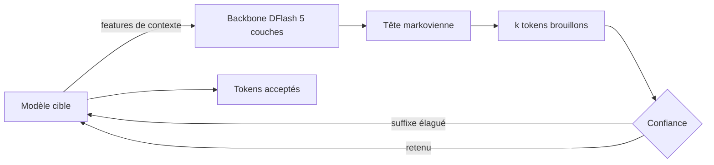
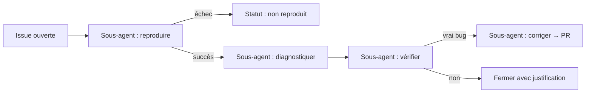

# IA — Détail du vendredi 21 août 2026

## 1. LFM2.5-DSpark — 300 M de paramètres de brouillon pour 3,2× de débit

**Source :** Hugging Face — https://huggingface.co/blog/LiquidAI/lfm25-dspark
**Date :** 20 août 2026

### Contexte

La phase de décodage d'un LLM est **memory-bound**, pas compute-bound. Pour produire un seul token, le GPU doit streamer l'intégralité des poids de la DRAM vers la SRAM. Le calcul lui-même est ridicule à côté du transfert. Résultat : ton H100 passe l'essentiel de son temps à attendre la mémoire.

Le décodage spéculatif exploite cette asymétrie. Un modèle brouillon léger propose plusieurs tokens candidats d'un coup, puis le modèle cible les vérifie **tous en une seule passe avant**. Le coût de chargement des poids est amorti sur k tokens au lieu d'un seul.

Liquid AI publie les checkpoints **DSpark** pour trois modèles de la famille LFM2.5 : `LFM2.5-1.2B-Instruct`, `LFM2.5-2.6B` et `LFM2.5-8B-A1B`. Chaque drafter pèse environ 300 M de paramètres.

### Comment ça marche

DSpark combine trois composants, et c'est l'assemblage qui fait la différence avec EAGLE-3.

**Un — le backbone parallèle façon DFlash.** Le drafter est conditionné sur les *features de contexte* du modèle cible (ses états cachés), pas seulement sur les tokens émis. Il produit les états cachés de tous les tokens brouillons en **une seule passe avant**. Ici, cinq couches attention-only et un bloc de 9.

**Deux — la tête séquentielle légère.** Un backbone purement parallèle ignore la dépendance entre tokens voisins : le token brouillon en position 7 ne « sait » pas ce qu'a proposé le token 6. DSpark ajoute une petite tête modélisée comme une **chaîne de Markov** entre tokens adjacents. Coût : 33 à 65 M de paramètres. Gain : le taux d'acceptation ne s'effondre plus sur les positions tardives.

**Trois — le vérificateur à confiance ordonnancée.** Une tête de confiance prédit la probabilité de survie de chaque token brouillon. Si le suffixe est peu probable, il est élagué **avant** la vérification, parce que vérifier coûterait plus cher que ce qu'on économise.

La qualité, elle, ne bouge pas. En décodage greedy, un token brouillon n'est accepté que s'il correspond à la distribution du modèle cible ; en cas de rejet, le token du modèle cible prend sa place. La séquence émise est **identique au greedy de base par construction** — pass@1 et exact match inchangés.



Les chiffres : sur H100 en BF16, moyenne de 2,67× pour le 2.6B (323 → 864 tok/s), pic à 3,18× sur MATH500 pour le 8B-A1B. Sur MacBook M4 Max en FP16 GGUF, 2,27× pour le 2.6B. Sur les scénarios multi-outils, la latence d'appel de fonction baisse de 57 % en moyenne pour le 2.6B.

Le point faible est instructif : le 8B-A1B, un MoE, n'obtient que +18 % en moyenne sur Metal malgré le meilleur taux d'acceptation (6,95/10). Vérifier k tokens active **plus d'experts** qu'un simple pas de décodage, donc plus de trafic mémoire — exactement ce que la spéculation cherchait à éviter.

### En pratique — exemple de code

Deux runtimes, deux façons d'attacher le drafter au modèle cible :

```bash
# SGLang sur GPU — le block size est lu depuis le config.json du drafter
python -m sglang.launch_server \
  --model-path LiquidAI/LFM2.5-2.6B \
  --speculative-algorithm DSPARK \
  --speculative-draft-model-path LiquidAI/LFM2.5-2.6B-DSpark \
  --speculative-draft-attention-backend flashinfer \
  --disable-radix-cache --mem-fraction-static 0.75 --port 30000
# Baseline = la même commande sans les trois flags --speculative-*
```

```bash
# llama.cpp sur Metal — -md pointe le GGUF du drafter, n-max borné par le block size
llama-server -m LFM2.5-2.6B-F16.gguf \
  -md LFM2.5-2.6B-DSpark-F16.gguf \
  --spec-type draft-dspark --spec-draft-n-max 10 --spec-draft-n-min 0 \
  -fa on -ngl 99
# Chaque réponse expose draft_n / draft_n_accepted dans son bloc timings
```

### Pourquoi ça compte pour toi

Si tu embarques un petit modèle local pour de l'appel d'outils — classification, extraction structurée, routage — tu divises la latence par deux pour environ 300 Mo de plus en mémoire, sans changer une seule sortie. Surveille `draft_n_accepted / draft_n` en production : c'est ta métrique de rentabilité. Si elle chute sous ~4/10 sur ton trafic réel, la spéculation te coûte plus qu'elle ne rapporte.

### Limites

L'écart entre datasets est important : sur le 1.2B, l'accélération varie de 52 % selon la distribution du texte (1,66× sur MT-Bench contre 2,56× sur MATH500). Le code et les maths, très prévisibles, se spéculent bien ; le dialogue ouvert beaucoup moins. Mesure sur ton propre trafic avant de conclure.

---

## 2. Astro × Cloudflare — l'usine à agents qui a supprimé 85 % des issues, et Flue

**Source :** InfoQ — https://www.infoq.com/news/2026/08/cloudflare-astro-ai-agents/
**Date :** 21 août 2026

### Contexte

Un dépôt open source populaire accumule les issues moins vite qu'il ne peut les traiter, et le goulot n'est pas la correction : c'est la **vérification**. Reproduire un bug rapporté par un inconnu, sur une version qu'on n'a pas, avec une configuration qu'on ne connaît pas, prend l'essentiel du temps de mainteneur. Astro traînait ce backlog depuis cinq ans.

Cloudflare et les mainteneurs d'Astro publient le retour d'expérience d'une automatisation qui a fait baisser de **85 %** le nombre d'issues ouvertes, avec un objectif affiché de zéro. Deux briques en sortent, open source : `triagebot-action` et le framework **Flue**.

### Comment ça marche

Le principe : ne pas demander à un agent unique de « traiter une issue », mais découper le travail en étapes vérifiables, chacune exécutée par un **sous-agent isolé** dans un sandbox, le tout piloté par GitHub Actions.

L'ouverture d'une issue déclenche un pipeline en quatre étapes.

**Reproduire.** Un sous-agent monte un sandbox à la version indiquée, applique la configuration décrite et tente de rejouer le scénario. C'est l'étape qui coûte cher à un humain et qui parallélise bien.

**Diagnostiquer.** Si la reproduction réussit, un second sous-agent remonte à la cause racine dans le code, avec le dépôt et la trace d'exécution en contexte.

**Vérifier.** Étape charnière et souvent oubliée : est-ce vraiment un bug, ou un usage incorrect, un doublon, un comportement documenté ? C'est ici que se joue la majorité de la réduction du backlog.

**Corriger.** Le dernier sous-agent tente un correctif et ouvre une pull request. Un humain valide — l'agent ne merge pas.

L'isolation entre étapes est le vrai choix d'architecture. Chaque sous-agent reçoit un contexte borné et rend un artefact typé. Une reproduction ratée s'arrête là et remonte un statut, au lieu de contaminer une chaîne de raisonnement de cinquante tours.

Le modèle d'orchestration a été extrait en **Flue**, un framework de workflows d'agents durables. Sa proposition : tu **déclares le contexte** d'un agent — modèle, skills, sandbox, instructions — au lieu d'écrire la boucle d'orchestration à la main.



### En pratique — exemple de code

Le workflow GitHub Actions qui branche le triage sur l'ouverture d'une issue :

```yaml
# .github/workflows/triage.yml — chaque étape tourne en sandbox isolé
name: Issue triage
on:
  issues:
    types: [opened, reopened]

permissions:
  issues: write          # commenter et labelliser
  contents: read         # pas d'écriture directe sur le dépôt
  pull-requests: write   # ouvrir la PR de correctif

jobs:
  triage:
    runs-on: ubuntu-latest
    steps:
      - uses: actions/checkout@v5
      - uses: withastro/triagebot-action@v1
        with:
          # Pipeline : reproduce -> diagnose -> verify -> fix
          stages: reproduce,diagnose,verify,fix
          # Un correctif proposé passe toujours par une PR relue
          auto-merge: false
```

Le point à retenir dans ce YAML n'est pas l'action mais le bloc `permissions` : `contents: read`. L'agent ne peut pas pousser sur une branche du dépôt, il ne peut qu'ouvrir une PR. La revue humaine reste le point de contrôle.

### Pourquoi ça compte pour toi

Le pattern est transposable à ton backlog interne. Découpe en étapes courtes et vérifiables, un sous-agent par étape avec un contexte borné, un artefact typé en sortie. Applique le même principe à un bug report Jira ou à un ticket de support. Et copie la contrainte de permissions : `contents: read`, PR obligatoire. Un agent qui propose se relit ; un agent qui merge ne se relit pas.

### Points de vigilance

Le chiffre de 85 % mesure des issues **fermées**, pas des bugs corrigés — une grande part vient de l'étape « vérifier » qui écarte doublons et usages incorrects. C'est un gain réel de charge de mainteneur, pas une preuve que des agents corrigent 85 % des bugs. Ne transpose pas la métrique telle quelle dans une promesse interne.
