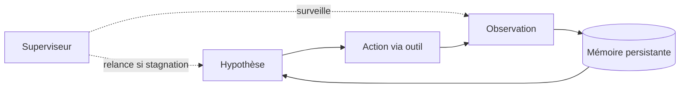

# IA — Détail du samedi 22 août 2026

## 1. Benchmark optimization en ASR — trois sondes pour mesurer le « benchmaxxing »

**Source :** Hugging Face — https://huggingface.co/blog/asr-benchmark-optimization
**Date :** 21 août 2026

### Contexte

Les benchmarks publics de reconnaissance vocale sont ouverts, reproductibles et massivement utilisés. C'est leur force, et c'est aussi leur faille : un modèle peut améliorer son score parce qu'il a appris des motifs spécifiques au test, pas parce qu'il transcrit mieux. Le phénomène a un nom — benchmark optimization, ou « benchmaxxing » — mais restait difficile à mesurer en ASR.

Hume AI et Hugging Face publient une méthodologie qui le quantifie sur 11 modèles open source largement déployés, dont `openai/whisper-large-v3`, `nvidia/parakeet-tdt-0.6b-v2`, `mistralai/Voxtral-Mini-3B-2507` et `Qwen/Qwen3-ASR-0.6B-hf`. Le résultat est inconfortable : les modèles qui affichent le meilleur WER sont aussi ceux qui reproduisent le plus les erreurs des transcripts de référence.

### Comment ça marche

Trois sondes, chacune isolant un mécanisme différent.

**Sonde 1 — désaccord avec la référence.** VoxPopuli contient beaucoup d'erreurs de transcription. Les auteurs constituent un ensemble de modèles à faible PER (phoneme error rate) pour repérer les clips où tous les modèles de l'ensemble contredisent unanimement la référence, puis valident un échantillon par annotation humaine. Sur un clip, l'audio dit clairement « Thank you, Mr. President » ; la référence omet « Thank you ». Six modèles sur onze reproduisent l'omission. Détail révélateur : ceux qui omettent la formule reproduisent aussi la ponctuation du benchmark, en écrivant « Mr » sans point.

**Sonde 2 — récupération d'entités masquées.** On efface physiquement des nombres de l'audio. Le nombre n'est plus là ; aucun modèle ne devrait en produire un. Certains restituent quand même le nombre exact de la référence — y compris une année arbitraire comme 2011 — dans 30 à 40 % des exemples sur LibriSpeech.

**Sonde 3 — bascule orthographique.** Deux graphies homophones, « any one » / « anyone » ou « Mr. » / « Mister ». Un modèle cohérent devrait avoir un switch rate de 0 % ; un modèle qui tire au hasard, 50 %. Plusieurs atteignent ~90 %, c'est-à-dire qu'ils devinent quel dataset les interroge et adoptent sa convention.

**La localisation.** Pour prouver que ce sont bien des indices acoustiques, les auteurs rejouent le même contenu en clone vocal et en enregistrements parlementaires postérieurs au cutoff. Le comportement s'effondre : sur le clone « ep-fresh », un seul modèle sur onze omet encore la formule. Ajouter de l'audio VoxPopuli autour d'un échantillon synthétique produit l'effet inverse.

### En pratique — exemple de code

Le principe est reproductible sur tes propres modèles : compare la sortie sur un clip du benchmark et sur le même contenu resynthétisé.

```python
# Sonde « désaccord avec la référence » réduite à son minimum.
from transformers import pipeline

asr = pipeline("automatic-speech-recognition", model="openai/whisper-large-v3")

REF = "Mr President, I have another complaint about this procedure."
# 1287_real.wav = clip VoxPopuli d'origine ; 1287_clone_ep_fresh.wav = même phrase,
# voix d'un parlementaire enregistré APRÈS le cutoff d'entraînement.
for clip in ["1287_real.wav", "1287_clone_ep_fresh.wav"]:
    out = asr(clip)["text"]
    # Le drapeau : la formule de politesse est audible dans les deux fichiers.
    print(clip, "| suit l'audio:", "thank you" in out.lower(), "|", out[:60])

# Si le modèle dit "Thank you" sur le clone mais pas sur l'original,
# il ne transcrit pas : il reconnaît le benchmark.
```

### Pourquoi ça compte pour toi

Si tu choisis un modèle de transcription pour un produit, le WER d'un leaderboard public ne suffit plus. Constitue un jeu de test maison, enregistré après la sortie du modèle, avec tes propres locuteurs et ton propre bruit. C'est vrai au-delà de l'ASR : dès qu'un benchmark est public depuis longtemps, son score mesure en partie l'exposition au test. Le held-out que tu contrôles est la seule métrique qui engage.

### Pour aller plus loin

Un onglet « Benchmark fitting » a été ajouté à l'Open ASR Leaderboard, avec les scripts sur GitHub et les sorties de modèles non normalisées. Le rapport complet est publié sous la référence 2608.19936.

---

## 2. NVIDIA AVO — 100 % sur ARC-AGI-3 en changeant le harnais, pas le modèle

**Source :** The New Stack — https://thenewstack.io/nvidia-avo-arcagi3-benchmark/
**Date :** 21 août 2026

### Contexte

NVIDIA avait présenté AVO — Agentic Variation Operators — en mars 2026, sur des tâches d'ingénierie logicielle et d'optimisation de kernels GPU. L'équipe vient de détailler l'architecture et de l'appliquer à ARC-AGI-3, un benchmark de raisonnement où l'agent découvre un environnement interactif inconnu, infère l'effet des actions disponibles et doit atteindre l'objectif efficacement.

Le chiffre qui a fait le tour : ARC Prize avait mesuré Claude Opus 5 seul à 30,2 % sur le set public en juillet. Le même modèle, exécuté dans le système AVO complet, atteint 100,00 RHAE sur les 25 environnements, tous les 183 niveaux terminés. Cinq ingénieurs NVIDIA signent, menés par Terry Chen.

### Comment ça marche

AVO remplace ce que l'équipe appelle « l'étape de variation prédéfinie » des systèmes de recherche évolutionnaire classiques. Dans un algorithme évolutionnaire ordinaire, la génération du candidat suivant est une règle fixe — mutation, croisement. Ici, c'est un agent qui décide : quoi inspecter, quoi modifier, quoi tester, quoi committer.

La boucle se décompose en sept étapes, identiques que l'on optimise un kernel CUDA ou qu'on explore un jeu : construire des hypothèses à partir d'indices incomplets, agir via une interface externe, observer les conséquences, préserver l'état utile, réviser son modèle du problème, récupérer d'une hypothèse fausse, continuer sur un horizon long.

Deux mécanismes rendent cette boucle tenable au-delà d'une fenêtre de contexte.

**La mémoire persistante** conserve les implémentations passées, les résultats d'évaluation, les sorties de compilateur et de profileur, et le raisonnement accumulé. L'agent reprend depuis l'état courant au lieu de reconstruire la recherche à chaque invocation. C'est ce qui distingue « progresser » de « recommencer ».

**Le superviseur** est un module logiciel, pas un humain. Il surveille la trajectoire globale de la recherche et intervient quand la progression stagne — typiquement quand l'agent tourne en rond sur une hypothèse fausse qu'il ne remet pas en cause tout seul.

Le point que l'équipe souligne n'est pas le score, c'est le transfert : la même architecture passe de l'optimisation de kernels GPU (feedback = compilateurs, tests, profileurs) à un environnement interactif (feedback = transitions d'état). Les interfaces diffèrent, la boucle est la même.



### En pratique — exemple de code

La leçon transposable tient en deux points : persister l'état entre invocations, et détecter la stagnation depuis l'extérieur de la boucle.

```python
# Squelette d'une boucle agentique à mémoire + superviseur.
state = memory.load(task_id)           # reprend là où on s'est arrêté
stalled = 0

while not state.done and state.steps < BUDGET:
    hypothesis = model.propose(state.summary(), state.evidence[-K:])
    result = tools.run(hypothesis)     # compile, teste, ou agit dans l'environnement
    state.record(hypothesis, result)   # l'évidence survit à la fenêtre de contexte
    memory.save(task_id, state)        # persistance : le crash ne coûte pas la recherche

    # Superviseur : pas un humain, une règle sur la trajectoire globale.
    stalled = stalled + 1 if not result.improved else 0
    if stalled >= 3:
        state.invalidate_branch()      # abandonne l'hypothèse, repart d'un ancêtre
        stalled = 0
```

### Pourquoi ça compte pour toi

Quand un agent de code te déçoit sur une tâche longue, ton premier réflexe ne devrait pas être de changer de modèle. Regarde ce que tu persistes entre les tours, ce que tu lui donnes comme feedback exécutable, et si quelque chose détecte qu'il tourne en rond. Le delta 30 % → 100 % ici vient entièrement de ces trois choses. C'est de l'ingénierie système, pas de la magie de modèle.

### Limites

Résultats sur le set public d'ARC-AGI-3 uniquement, pas sur les sets semi-privé ou privé. NVIDIA a aussi apparié AVO avec GPT-5.6 Sol sur un sous-ensemble difficile : Sol atteint les niveaux plus vite en temps réel, Opus consomme moins d'actions d'environnement. La comparaison systématique reste à faire.

---

## 3. SWE-Bench ProMax — le refactoring à grande échelle, angle mort des benchmarks d'agents

**Source :** The New Stack — https://thenewstack.io/ai-agents-refactoring-benchmarks/
**Date :** 21 août 2026

### Contexte

Les benchmarks d'agents de code saturent. Une partie du problème est la fuite de solutions dans les jeux d'entraînement ; une autre est la qualité des instances elles-mêmes. Un audit cité par les auteurs conclut que près de 60 % des instances non résolues de SWE-bench Verified contiennent des tests défectueux — trop étroits, trop larges, ou simplement faux.

Des chercheurs de Shanghai Jiao Tong University, Peking University et Douyin Group publient SWE-Bench ProMax pour attaquer le problème par le contenu : un benchmark de refactoring multilingue de 170 instances issues de vrais commits, sur sept langages — Python, Java, TypeScript, Go, C, C++, Rust. Le meilleur modèle plafonne à 41,2 % de resolve rate.

### Comment ça marche

**Pourquoi le refactoring est le bon test.** Shane Warden (ActiveState) le formule bien : le refactoring strict exige zéro tolérance à l'erreur, zéro changement de comportement, et une réversibilité complète. Un patch de bug peut être approximativement bon et passer les tests. Un refactoring approximativement bon est un bug silencieux réparti sur douze fichiers.

**La curation en plusieurs passes.** Les auteurs ont réécrit les descriptions d'issue pour les rendre précises, revu manuellement les suites de tests pour retirer les tests trop étroits ou trop larges, et filtré les tâches à complexité insuffisante ou à portée mono-fichier. Le critère de sélection est explicite : les instances doivent avoir une portée cross-file réelle.

**Pourquoi les agents échouent.** L'hypothèse implicite de beaucoup d'outils est que le code est de la prose : si tu mets tout dans une grande fenêtre de contexte et que tu demandes un diff multi-fichiers, le modèle comprendra. Warden conteste la prémisse — « la proximité de tokens ne garantit pas la compréhension structurelle ». Un renommage de symbole n'est pas une recherche-remplacement textuelle : il faut résoudre la portée, les shadowing, les réexports, les usages via réflexion. Vojtěch Pavlík (SUSE) résume l'état de l'art : aucun LLM ne lit un gros dépôt et ne le « comprend » d'un seul tenant.

### En pratique — exemple de code

Le contraste tient en un exemple minimal : ce que le texte suggère, ce que la structure impose.

```python
# Avant — le refactoring demandé : renommer Config.timeout -> Config.timeout_s
class Config:
    timeout = 30

def connect(cfg): return open_socket(t=cfg.timeout)

# Piège 1 : accès dynamique, invisible pour une recherche textuelle sur ".timeout"
value = getattr(cfg, "time" + "out")

# Piège 2 : homonyme sans rapport dans un autre module — ne doit PAS être touché
class HttpClient:
    timeout = 5          # rien à voir avec Config
```

```bash
# Après — la bonne approche : outillage structurel d'abord, LLM ensuite.
# 1) Le renommage sûr passe par l'AST, pas par le texte.
python -m libcst.tool codemod rename.RenameCommand \
  --old "myapp.config.Config.timeout" --new "myapp.config.Config.timeout_s"

# 2) On laisse au modèle ce que l'outil ne sait pas faire : les accès dynamiques.
rg -n 'getattr\(|__getattr__|globals\(\)\[' src/   # candidats à revue manuelle

# 3) Le filet : les tests doivent prouver l'invariance du comportement.
pytest -q && git diff --stat
```

### Pourquoi ça compte pour toi

Le message est directement actionnable sur tes migrations .NET ou Angular : ne délègue pas un renommage cross-projet à un agent en mode prompt libre. Donne-lui d'abord l'outil structurel — refactoring Roslyn, `ng generate`, codemod ts-morph — et réserve-lui les cas que l'outil rate. Et exige une suite de tests qui prouve l'invariance avant d'accepter le diff, pas après.

### Points de vigilance

170 instances, c'est petit ; les intervalles de confiance sont larges. Le benchmark est neuf, donc non contaminé — cet avantage s'érodera. Sa vraie valeur est d'être non saturé : un score qui plafonne à 41 % laisse de la place pour mesurer un progrès réel.
