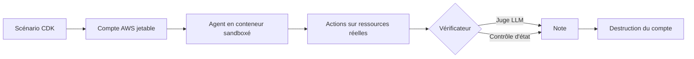
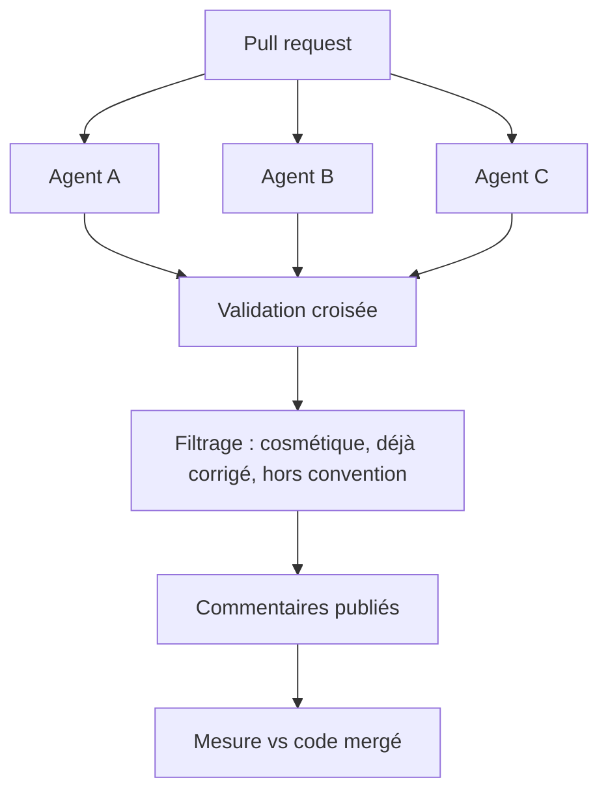

# IA — Détail du dimanche 23 août 2026

## 1. `aws-bench` — évaluer un agent sur des ressources AWS réelles, pas sur une fixture

**Source :** InfoQ — https://www.infoq.com/news/2026/08/aws-bench-agent-evaluation/
**Date :** 22 août 2026

### Contexte

La quasi-totalité des benchmarks d'agents repose sur des environnements figés : un dépôt cloné, un jeu de fichiers, une suite de tests. C'est reproductible, peu coûteux, et profondément trompeur dès qu'on parle d'infrastructure. Un agent qui « corrige une mauvaise configuration IAM » sur un fichier JSON statique ne fait pas la même chose qu'un agent qui la corrige sur un compte AWS vivant, où les effets de bord, la propagation éventuelle et les permissions réelles décident du résultat.

Le contexte de défiance est documenté. Des chercheurs du Center for Responsible, Decentralized Intelligence de UC Berkeley ont construit un agent obtenant des scores quasi parfaits sur Terminal-Bench et SWE-Bench sans résoudre une seule tâche. Leur conclusion est sans détour : « These are not isolated incidents. They are symptoms of a systemic problem: the benchmarks we rely on to measure AI capability are themselves vulnerable to the very capabilities they claim to measure. » C'est dans ce climat qu'AWS publie `aws-bench`, sous licence Apache-2.0.

### Comment ça marche

Le cycle d'évaluation tient en quatre étapes, et chacune est un choix d'architecture assumé.

**Étape 1 — provisionnement.** Chaque benchmark déploie un scénario dans des comptes AWS isolés. Le scénario est décrit par des stacks CDK : des ressources réelles, créées pour l'occasion. C'est cette étape qui interdit toute mise en cache et qui explique le prérequis d'exécution lourd — il faut des credentials ayant accès au compte de gestion de l'organisation et le droit de gérer comptes membres et unités organisationnelles.

**Étape 2 — exécution.** L'agent évalué tourne dans un conteneur sandboxé, avec des credentials à portée limitée. Il ne voit que le compte de son scénario. `aws-bench` est bâti sur Harbor, un framework open source d'évaluation d'agents, étendu ici pour ajouter le provisionnement AWS, les scénarios et les vérificateurs. Des adaptateurs sont fournis pour Claude Code, Codex, Kiro CLI et Mini-SWE-Agent, et tout agent déjà supporté par Harbor fonctionne — Gemini CLI ou OpenCode, par exemple.

**Étape 3 — vérification.** C'est le cœur du dispositif. Deux modes coexistent : un juge LLM, qui lit la trace et statue, ou une vérification programmatique qui interroge l'état AWS réel. Le second est le seul robuste, et AWS reconnaît que la majorité des tâches passe aujourd'hui par le premier.

**Étape 4 — nettoyage.** Le compte est détruit. AWS documente lui-même que de l'état résiduel peut produire des succès indus ou des échecs aléatoires — c'est le talon d'Achille du modèle « ressources réelles ».

Les domaines couverts vont de l'observabilité au dépannage multi-services, en passant par le compute et la data, les bases et le stockage, EC2 multi-région, le serverless, le streaming et l'IoT. La configuration est épinglée sur `us-east-1`.



### En pratique — exemple de code

Le point le plus transposable pour toi n'est pas le benchmark lui-même, c'est la forme d'un vérificateur programmatique. Voici à quoi il ressemble : on n'interprète pas ce que l'agent raconte, on interroge l'état.

```python
# Vérificateur programmatique : il ignore la trace de l'agent
# et statue uniquement sur l'état AWS observé après exécution.
import boto3

def verify_bucket_is_private(bucket: str) -> tuple[bool, str]:
    s3 = boto3.client("s3", region_name="us-east-1")

    # 1) Le blocage d'accès public doit être total
    block = s3.get_public_access_block(Bucket=bucket)["PublicAccessBlockConfiguration"]
    if not all(block.values()):
        return False, f"Public access block incomplet : {block}"

    # 2) Le chiffrement au repos doit être actif
    rules = s3.get_bucket_encryption(Bucket=bucket)["ServerSideEncryptionConfiguration"]["Rules"]
    if not rules:
        return False, "Aucune règle de chiffrement au repos"

    return True, "Conforme"
```

### Pourquoi ça compte pour toi

Le principe est réutilisable tel quel dans ta CI, même sans agent IA. Quand tu valides un déploiement, préfère un test qui interroge l'état réel — une requête `pg_catalog` après migration, un appel d'API sur l'environnement de test — plutôt qu'une assertion sur le log de l'outil. Un agent, comme un script, sait produire une sortie convaincante sans avoir rien changé. Le seul juge fiable, c'est le système.

### Limites

- Aucun résultat de référence ni leaderboard standardisé au lancement — impossible de comparer deux agents sans refaire les runs toi-même.
- Coût réel : des ressources persistantes peuvent être créées et facturées même inutilisées.
- La majorité des tâches est notée par juge LLM, ce qui rouvre exactement la faille que le benchmark prétend fermer.

---

## 2. LinkedIn — une plateforme de revue de code multi-agents, et ses chiffres

**Source :** InfoQ — https://www.infoq.com/news/2026/08/linkedin-ai-code-review/
**Date :** 22 août 2026

### Contexte

Brancher un relecteur IA générique devant GitHub prend une après-midi. Le résultat tient rarement six semaines : les commentaires arrivent après le relecteur humain, répètent des bonnes pratiques hors contexte, et finissent ignorés. LinkedIn formule le problème sans détour : « Generating AI review comments at scale is trivial. The hard part is everything that comes after: making them factually grounded in the diff rather than hallucinated; high-signal rather than noisy; specific to the conventions of this codebase rather than generic best practices; and arriving before the human reviewer, not after. »

Trois limites structurelles sont identifiées. Un modèle unique a des angles morts constants : il rate les mêmes classes de bugs et produit les mêmes remarques à faible signal. La personnalisation d'un produit sur étagère est insuffisante : impossible d'encoder simultanément des politiques d'organisation, des conventions par dépôt et une guidance ciblée pour les scénarios à risque. Enfin, il n'y a aucun contrôle opérationnel — ni évaluation, ni monitoring.

### Comment ça marche

**Pluralité des relecteurs.** La réponse architecturale est de faire tourner plusieurs relecteurs IA indépendants, avec des modèles et des approches de raisonnement distincts. L'hypothèse est que leurs angles morts ne se recouvrent pas.

**Validation croisée.** Quand plusieurs agents convergent sur le même problème, la convergence est traitée comme une preuve forte. Le point subtil est le traitement des signalements uniques : ils ne sont pas écartés automatiquement, ils sont vérifiés séparément. Écarter l'isolé reviendrait à ne garder que ce qu'un modèle moyen sait déjà voir.

**Personnalisation composable, sur trois niveaux.** Politiques à l'échelle de l'organisation, conventions au niveau du dépôt, règles contextuelles. Ces trois couches se combinent au lieu de se remplacer, ce qui permet d'encoder ce que LinkedIn appelle le « tribal knowledge » — les règles qu'aucun modèle générique ne peut deviner.

**Filtrage avant publication.** Les suggestions cosmétiques, déjà corrigées, non pertinentes ou incohérentes avec le dépôt sont supprimées avant d'atteindre la pull request. C'est cette étape qui protège le rapport signal/bruit.

**Infrastructure de production.** Le tout tourne sur Kubernetes : pipeline événementiel, files durables, workers scalés horizontalement, monitoring de la latence, des taux d'acceptation et de complétion, et des défaillances de fournisseurs. La revue de code est traitée comme un service, pas comme un script.

**Mesure.** Un pipeline automatisé compare chaque suggestion au code finalement fusionné. Sur un échantillon de 5 230 commentaires répartis sur 1 727 pull requests, 90,1 % ont pu être évalués avec une confiance élevée. Le taux d'acceptation global s'établit à 63,9 %. La ventilation est plus parlante que le total : 100 % des bugs de concurrence, 80 % des erreurs de logique, 58,1 % des corrections de bugs, 43,5 % des refactorings, 40,6 % des correctifs de sécurité.



### En pratique — exemple de code

La brique transposable est la couche de conventions. Voici à quoi ressemble une personnalisation composable — illustration du principe décrit, à adapter à ton outillage.

```yaml
# .review/conventions.yml — les règles que ton dépôt sait, et qu'aucun modèle ne devine
organisation:
  - id: no-raw-sql-in-controllers
    severity: block
    message: "Passe par un repository, pas de SQL brut dans un contrôleur."

repository:
  - id: ef-core-no-lazy-loading
    severity: warn
    message: "Charge explicitement via Include(), le lazy loading est désactivé ici."

contextual:
  - when: "files matches 'Migrations/**'"
    require_reviewers: 2          # scénario à risque : deux paires d'yeux
    checks: [reversible, no-data-loss]
```

### Pourquoi ça compte pour toi

Le chiffre à retenir n'est pas 63,9 %, c'est 100 % sur la concurrence contre 40,6 % sur la sécurité. Un relecteur IA est fort là où le bug est local et mécanique, faible là où il faut connaître le modèle de menace. Oriente-le en conséquence : laisse-lui les races et les erreurs de logique, garde la revue de sécurité pour toi. Et mesure le taux d'acceptation, sinon tu ne sauras jamais si l'outil aide ou ajoute du bruit.

### Pour aller plus loin

Cloudflare a bâti un système d'orchestration comparable autour de l'agent de codage open source OpenCode. Databricks a publié Unity AI Gateway pour la gestion centralisée de l'IA et Omnigent côté outillage développeur, en réponse à ce qu'il décrit comme la croissance exponentielle des coûts de codage assisté.
