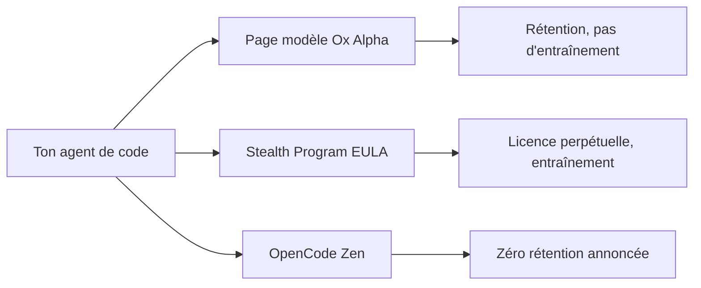
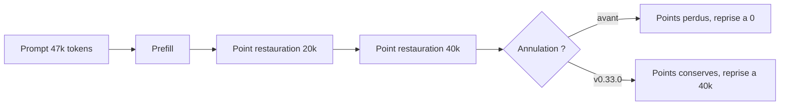

# IA — Détail du mardi 25 août 2026

## 1. Ox Alpha — fingerprinter un endpoint anonyme, et lire les termes de la route

**Source :** The New Stack (Janakiram MSV) — https://thenewstack.io/ox-alpha-privacy-terms/
**Date :** 24 août 2026

### Contexte

Le 20 août, un fournisseur anonyme a listé sur OpenRouter un modèle nommé `stealth/ox-alpha` : fenêtre de contexte de 1 048 576 tokens, prix d'entrée et de sortie à zéro pendant une préversion. OpenCode, l'agent terminal open source, l'a intégré le jour même en annonçant une capacité de 100 000 milliards de tokens par jour. Aucune entreprise ne l'a revendiqué depuis.

La communauté s'est jetée sur la question de l'identité. C'est un réflexe compréhensible mais mal orienté. Le point pratique, quand tu pousses un dépôt privé dans un agent de code, n'est pas de savoir quel checkpoint tourne derrière : c'est de savoir **quelle entité juridique reçoit la requête et sous quels termes**. Ce second sujet n'a presque pas été examiné.

### Comment ça marche

Deux mécanismes se superposent ici, et il faut les comprendre séparément.

**Le fingerprinting d'endpoint.** Un développeur connu sous le pseudo `unclecode`, auteur du crawler Crawl4AI, a publié `modelprint`. L'outil envoie une série de sondes d'infrastructure — comportement du tokenizer, gestion des paramètres inhabituels, forme des erreurs, traitement des entrées audio, consommation de tokens sur une entrée vidéo — puis compare les réponses à une base de modèles connus. Sur Ox Alpha, six sondes sur neuf s'alignent avec GLM-5.3.

L'auteur est prudent sur la portée du résultat, et c'est la leçon méthodologique : une empreinte identique établit une **infrastructure partagée**, pas une identité de modèle. Un même laboratoire peut servir deux checkpoints différents depuis la même pile de serving. Historiquement, seuls les canaux de première main ont tranché : OpenRouter a nommé Quasar Alpha et Optimus Alpha comme des tests de GPT-4.1 sur son propre blog, Xiaomi a confirmé Hunter Alpha comme un build MiMo précoce.

**La route détermine les termes.** C'est le point réellement opérationnel. La page du modèle Ox Alpha indique que le fournisseur retient prompts et complétions mais ne les utilise pas pour l'entraînement. Les conditions du Stealth Program d'OpenRouter, qui régissent tout autre usage, accordent une licence décrite comme irrévocable et perpétuelle, et prévoient l'usage du contenu soumis pour l'entraînement et l'amélioration. OpenCode annonce de son côté une politique zéro-rétention et sans entraînement pour ses fournisseurs Zen — mais sa liste publiée d'exceptions ne mentionne pas Ox Alpha.

Trois chemins, trois attentes de confidentialité matériellement différentes, pour le même nom de modèle.



### En pratique — exemple de code

Le principe d'une sonde de fingerprinting est plus simple qu'il n'y paraît : on mesure une caractéristique d'infrastructure, pas une réponse de contenu.

```bash
# Sonde de tokenizer : le même texte, on compare le comptage de tokens en entrée
# entre l'endpoint anonyme et un modèle de référence connu.
for MODEL in "stealth/ox-alpha" "z-ai/glm-5.3"; do
  curl -s https://openrouter.ai/api/v1/chat/completions \
    -H "Authorization: Bearer $OPENROUTER_API_KEY" \
    -H "Content-Type: application/json" \
    -d "{\"model\":\"$MODEL\",
         \"messages\":[{\"role\":\"user\",\"content\":\"probe\"}],
         \"max_tokens\":1}" \
  | jq -r "\"$MODEL -> prompt_tokens=\(.usage.prompt_tokens)\""
done
# Un écart constant de quelques tokens trahit un wrapper de prompt identique.
# Ça prouve une pile de serving commune, PAS l'identité du checkpoint.
```

Le garde-fou côté client tient en une règle : refuser par défaut tout modèle non attribué sur les dépôts privés.

```python
# Liste blanche explicite : un nom de modèle inconnu ne passe pas
ALLOWED = {"anthropic/claude-opus-5", "openai/gpt-5.6-terra"}

def route(model: str, payload_is_private: bool) -> str:
    if payload_is_private and model not in ALLOWED:
        raise PermissionError(f"{model} non approuvé pour du code privé")
    return model
```

### Pourquoi ça compte pour toi

Si tu branches un agent sur ton dépôt, le nom du modèle ne te dit rien des termes appliqués. Vérifie la route, pas l'étiquette. Ajoute une liste blanche côté client plutôt que de faire confiance à la config de l'agent. Et note que la gratuité d'une préversion se paie souvent en licence sur le contenu soumis : contenu de dépôt, logs de tests, sorties d'environnement, captures d'écran.

### Points de vigilance

Le score viral de 80 % sur DeepSWE portait sur 10 tâches, et son auteur l'a lui-même signalé. Un run reproductible de 113 tâches publié ensuite sur GitHub en résout 66, soit 58,4 %, après 20 heures de travail agentique. Ox Alpha n'apparaît pas au classement officiel DeepSWE. La préversion gratuite était attendue jusque vers le 27 août.

---

## 2. Ollama v0.33.0 — des points de restauration de prefill fiables par construction

**Source :** Ollama (notes de version v0.33.0) — https://github.com/ollama/ollama/releases/tag/v0.33.0-rc2
**Date :** 22 août 2026

### Contexte

Quand tu envoies un prompt à un moteur d'inférence, la phase de **prefill** traite tous les tokens d'entrée pour construire le cache clé-valeur (KV cache). Sur un agent de code avec un contexte de 47 000 tokens, c'est la partie coûteuse : plusieurs secondes de GPU avant que le premier token de réponse ne sorte.

D'où l'intérêt des **points de restauration** : le moteur mémorise des états intermédiaires du cache. Si la requête suivante partage un préfixe avec la précédente, il reprend au dernier point commun au lieu de tout recalculer. C'est exactement le comportement dont dépendent les agents, qui rejouent en boucle un contexte quasi identique.

Ollama v0.33.0, publié le 22 août, corrige deux bugs qui rendaient ce mécanisme mensonger.

### Comment ça marche

Premier bug : l'**annulation**. Les clients agentiques annulent souvent un prefill long, parce que l'utilisateur relance, parce qu'un timeout se déclenche, parce qu'un sous-agent est tué. Avant ce correctif, un prefill annulé pouvait jeter les points de restauration qu'il avait pourtant franchis. La reprise repartait alors de zéro. Désormais, un prefill annulé **conserve chaque point franchi** : la nouvelle tentative reprend là où la précédente s'était arrêtée.

Deuxième bug, plus subtil : les prefills **repris** enregistraient parfois des points de restauration qui ne couvraient pas réellement ce qu'ils prétendaient couvrir. Sur les modèles à couches récurrentes, où l'état n'est pas réductible à un simple préfixe de cache KV, une requête qui matchait 46 000 tokens sur 47 000 se retrouvait à retraiter la totalité. Les notes de version parlent de points « fiables par construction » : l'invariant est maintenant garanti à l'écriture du point, pas espéré à la lecture.

Troisième correctif, qui vise directement les agents : Ollama désactive le message système « tokens left » de Claude Code. Ce message, un simple compteur, était placé **en tête de prompt**. Or le cache de préfixe repose sur l'égalité des tokens depuis le début de la séquence. Un compteur qui change à chaque tour, positionné au début, invalide donc l'intégralité du cache à chaque requête. Cas d'école de la préfixe-sensibilité : ce qui varie doit aller à la fin.



### En pratique — exemple de code

La leçon transposable, quel que soit ton moteur : garde le préfixe stable et pousse le volatile en fin de prompt.

```python
# Avant — le compteur en tête change à chaque tour : cache KV invalidé
messages = [
    {"role": "system", "content": f"Tokens left: {remaining}"},  # volatile, en tête
    {"role": "system", "content": SYSTEM_PROMPT},                # stable
    {"role": "user",   "content": repo_context + question},
]

# Après — le préfixe stable ne bouge jamais, le volatile passe en queue
messages = [
    {"role": "system", "content": SYSTEM_PROMPT},                # stable, réutilisé
    {"role": "user",   "content": repo_context},                 # stable entre tours
    {"role": "user",   "content": f"{question}\n[budget: {remaining}]"},  # volatile
]
```

Vérifier que la mise à jour est bien en place :

```bash
ollama --version              # attendu : 0.33.0 ou supérieur
ollama ps                     # contexte chargé et occupation mémoire par modèle
```

### Pourquoi ça compte pour toi

Si tu fais tourner un agent local sur un gros contexte de dépôt, ce correctif change ton temps de première réponse à chaque itération, pas seulement au démarrage. Et la règle du préfixe stable s'applique partout : dans tes appels à une API distante avec cache de prompt, un horodatage ou un compteur en tête de système annule la remise. Range tes variables en fin de message.

### Pour aller plus loin

La même release ajoute une intégration Claude Desktop — activation par modèle depuis la barre de menus — et une vue « Apps » pour gérer les intégrations. Le lanceur DeepSeek Harness bascule sur `npx` quand l'installation npm globale échoue.
