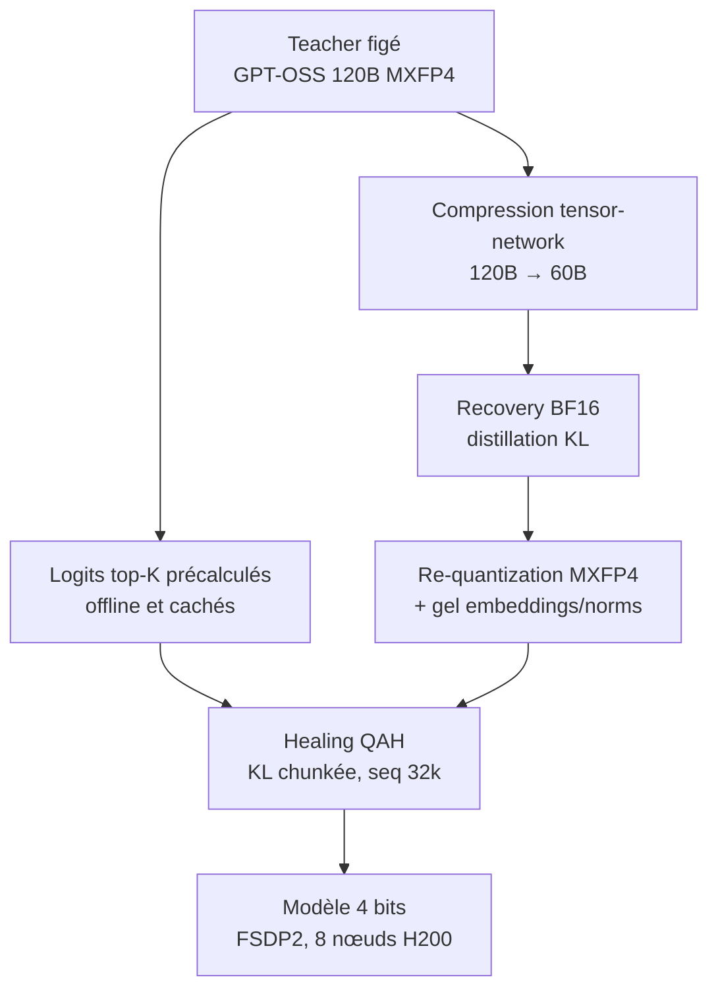
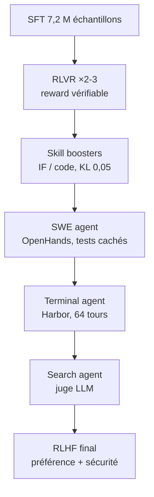
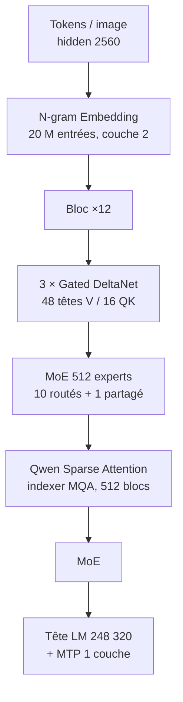

# IA — Détail du samedi 29 août 2026

## 1. Quantization-Aware Healing — un GPT-OSS 60B en MXFP4 qui bat son propre checkpoint bfloat16

**Source :** Hugging Face Blog (Multiverse Computing) — https://huggingface.co/blog/MultiverseComputingCAI/quantization-aware-healing
**Date :** 25 août 2026

### Contexte

Le pipeline standard de déploiement efficace fait deux choses successives. D'abord une compression structurelle : on retire des couches, des têtes, des neurones. Ensuite une quantization en 4 bits. Les deux dégradent systématiquement le raisonnement, les mathématiques et la génération de code, donc on ajoute une troisième étape de récupération, appelée *healing*. gpt-oss, la famille Nemotron de NVIDIA et Hypernova 60B reposent tous sur ce schéma « compress-then-heal ».

La recette dominante pour cette récupération est le QAT — quantization-aware training. On insère des opérateurs de fausse quantization dans le forward et on refait tout le post-training sur une loss de tâche. C'est coûteux et instable. L'alternative, le QAD, distille un teacher full-precision figé dans le student quantifié via une divergence KL sur les logits. Elle suppose toutefois qu'il existe une version bf16 **du même modèle**.

Après compression structurelle, cette hypothèse tombe. Le seul teacher candidat est le checkpoint bf16 récupéré, qui est lui-même une approximation dégradée. Distiller depuis lui plafonne mécaniquement le student à son niveau. QAH lève ce plafond en distillant directement depuis le modèle original, pré-compression.

### Comment ça marche

Le renversement conceptuel tient en une phrase : la quantization n'est plus un post-traitement lossy appliqué après le healing, c'est **une seconde passe complète de distillation** contre le teacher original — de la supervision que le checkpoint bf16 n'avait jamais reçue.



Teacher et student ne partagent même pas l'architecture : full-size contre moitié, BF16 contre MXFP4. Ce n'est pas un problème, parce que la distribution de sortie d'un teacher est agnostique à l'architecture. Le student ne voit jamais de hard labels, uniquement la distribution du teacher, appariée par KL sur les logits.

L'obstacle est mémoire. Une implémentation directe matérialise le log-softmax `[B, L, V]` et son graphe d'autograd, soit un coût en `O(BLV)` — prohibitif à 32k de contexte avec un vocabulaire de l'ordre de 2×10⁵. La parade est double : les logits top-K du teacher sont **précalculés offline et cachés une seule fois** au lieu d'être recalculés à chaque step, et la loss KL est fusionnée puis accumulée bloc par bloc le long de la séquence. Le pic mémoire devient linéaire en longueur de séquence au lieu d'être proportionnel au vocabulaire, tout en restant bit-identique à la loss dense.

Le masking se fait en deux phases : une fenêtre de stabilité attention-mask-only, puis un assistant-focused masking pour le gros de l'entraînement. Les données mélangent NVIDIA Nemotron et SmolTalk 2. Le run publié tourne sur **8 nœuds de GPU H200 en FSDP2**, séquence 32k, batch global 64, learning rate 5×10⁻⁶, 400 steps, embeddings et layer norms gelés.

Les résultats du 60B MXFP4 face au 60B BF16 récupéré : victoire sur 7 benchmarks sur 9. AA-LCR 42,7 contre 35,3, soit **+7,4 points**. AIME 2025 76,3 contre 70,7. Aider 40,9 contre 38,2. GPQA Diamond 67,4 contre 65,7. Les deux défaites sont marginales : MMLU-Pro −0,2 et SciCode −1,4. Face au teacher 120B lui-même, le 60B **dépasse** sur LiveCodeBench (66,5 contre 66,0) à moitié moins de paramètres.

Le point le plus intéressant est la comparaison avec le QAT sur le 9B. Les pics sont quasi identiques — 54,9 pour QAH, 54,6 pour QAT — mais QAH atteint le sien en **~100 steps contre ~700**, puis reste à deux points de son pic jusqu'à 1 200 steps. Le QAT, lui, s'effondre après son pic et perd environ 19 points. Pas d'early stopping à régler, donc.

### En pratique — exemple de code

Aucun code officiel n'accompagne la publication. Le bloc ci-dessous **reconstitue** l'objectif décrit dans le papier avec les hyperparamètres exacts qui y figurent — maquette pédagogique, pas code upstream.

```python
# Boucle QAH — reconstruction d'après le papier (aucun repo officiel publié).
import torch, torch.nn.functional as F

# 1) Logits top-K du teacher NON COMPRESSÉ (GPT-OSS 120B), précalculés OFFLINE et
#    cachés une seule fois -> jamais recalculés pendant le healing. C'est LE gain mémoire.
#    batch["t_topk_idx"] / batch["t_topk_logit"] : [B, L, K]

def chunked_kl(student, batch, chunk=2048):        # accumulation bloc par bloc le long de L
    total, L = 0.0, batch["input_ids"].size(1)     # L = 32_768 dans le run publié
    for s in range(0, L, chunk):                   # jamais de tenseur [B, L, V] complet
        h = student(batch["input_ids"][:, s:s+chunk]).logits          # [B, chunk, V]
        p = F.log_softmax(h.gather(-1, batch["t_topk_idx"][:, s:s+chunk]), dim=-1)
        q = F.log_softmax(batch["t_topk_logit"][:, s:s+chunk], dim=-1)
        m = batch["assistant_mask"][:, s:s+chunk]  # assistant-focused masking (phase 2)
        total = total + (q.exp() * (q - p)).sum(-1).mul(m).sum()
    return total / batch["assistant_mask"].sum()   # KL PURE : aucun hard label

# 2) Geler les sous-modules sensibles à la quantization. Les dégeler produit des
#    checkpoints PIRES que le MXFP4 non soigné, surtout à learning rate élevé.
for n, p in student.named_parameters():
    if any(k in n for k in ("embed", "norm")):
        p.requires_grad_(False)

# 3) Config du run publié : FSDP2, 8 nœuds H200, seq 32k, batch global 64, 400 steps.
opt = torch.optim.AdamW([p for p in student.parameters() if p.requires_grad], lr=5e-6)
```

### Pourquoi ça compte pour toi

Si tu déploies un LLM auto-hébergé, la question « 4 bits ou pas » change de nature : ce n'est plus un arbitrage qualité/coût mais une étape d'entraînement à part entière. Le prérequis est net — il faut encore posséder le teacher non compressé et pouvoir précalculer ses logits. Inapplicable si tu pars d'un modèle compressé fourni par un tiers.

### Points de vigilance

- **Le backend distribué est un hyperparamètre.** Sur le student 120B, aucune configuration DeepSpeed ZeRO-3 ne dépasse 65,15 sur GPQA Diamond sur tout un balayage, contre 73,74 pour FSDP2 — **8,6 points d'écart**, sans diagnostic établi.
- Dégeler layer norms et projections d'embedding pendant la quantization produit des checkpoints pires que le MXFP4 non soigné.
- L'écart résiduel le plus large face au teacher 120B reste AA-LCR (42,7 contre 50,0) : la capacité perdue en contexte extrême est la plus dure à récupérer.
- Le résultat 20B → 9B a été produit pour un déploiement client interne, détails retenus. Un seul des deux réglages end-to-end est pleinement documenté.

---

## 2. IBM Granite 4.2 — 3B / 8B / 30B en Apache 2.0, et un pipeline RL agentique entièrement documenté

**Source :** Hugging Face Blog (IBM Granite) — https://huggingface.co/blog/ibm-granite/granite-4-2
**Date :** 25 août 2026

### Contexte

Les Granite précédents étaient de bons modèles d'instruction-following. Granite 4.2 est la première famille IBM de LLMs denses, decoder-only, explicitement orientés raisonnement. Trois tailles — 3B, 8B, 30B — partagent la même conception architecturale et le même pipeline : pré-entraînement from scratch, SFT, puis RL multi-étapes, chacune à son échelle.

Chaque modèle dispose d'un switch thinking / non-thinking, d'un mode `low_effort` qui dépense un budget de raisonnement court sur les questions faciles, et du tool calling natif. Tout est publié sous **Apache 2.0** — ce qui, comparé à la licence maison de Qwen traitée plus bas, n'est pas un détail.

La différence capacitaire entre tailles se joue au post-training. Les 8B et 30B passent en plus par un bloc d'*agentic RL* qui leur apprend à appeler des outils, éditer et exécuter du code, piloter un terminal et chercher sur le web dans de vrais environnements. Servis via un endpoint compatible OpenAI, ils émettent des tool calls au format function-calling standard et se branchent sur les harnesses agentiques sans glue.

### Comment ça marche

L'architecture est classique et bien documentée : transformer dense decoder-only, GQA à 40 têtes d'attention et 8 têtes KV, RoPE avec θ = 10 000 000, MLP SwiGLU, RMSNorm, embeddings entrée/sortie non liés, bfloat16, 131 072 tokens de contexte pour les trois tailles. Le 30B se distingue par ses **64 couches** et son MLP hidden de 32 768.

Le pré-entraînement couvre environ **15 000 milliards de tokens** en cinq phases : deux phases fondationnelles, deux phases de mid-training avec annealing progressif vers des données de meilleure qualité, une cinquième phase long-contexte qui étend la fenêtre à 512K.

Le SFT porte sur ~7,2 millions d'échantillons, répartis 31,6 % agentique / 68,4 % non-agentique. Le corpus agentique est dominé par le SWE (69 %), devant le tool calling (12,1 %) et le terminal (8,0 %). Deux détails de qualité méritent d'être notés : GPT-OSS-120B et Gemma 4 servent de juges LLM pour éliminer les échantillons faibles ou aux interactions d'outils invalides, et la déduplication se fait par hash SHA-256 sur la combinaison `tools` + `messages`.

Le RL est une **chaîne d'étapes indépendantes**, chacune warm-startée depuis le checkpoint précédent, toutes en GRPO asynchrone.



L'asynchronisme est assumé jusqu'au bout : générateurs et trainer ne se bloquent jamais, un pool de workers remplit un buffer partagé, le trainer consomme un batch, prend un step d'optimizer et re-streame les poids sans mettre les workers en pause. Une trajectoire peut donc être cousue à partir de deux versions de policy adjacentes. Le garde-fou est mince — une limite d'un seul update de retard — et le mismatch résiduel est absorbé par *truncated importance sampling*, le ratio de log-probabilités train/génération étant clampé à un plafond fixe. Les avantages sont group-relative avec baseline leave-one-out, ce qui supprime le réseau de valeur.

Le point le plus instructif du billet est le **schedule KL, qui suit le type de reward**. Là où la récompense est objective et vérifiable — RLVR, SWE 2 — la pénalité KL tombe à 0 : exploration libre. Là où l'objectif est la préférence, la sécurité ou la greffe d'une compétence étroite — RLHF, code booster — elle monte à 0,05 pour rester proche de la référence. C'est une heuristique directement réutilisable.

Scores 3B / 8B / 30B : SWE-Bench Verified NA / 47,67 / 57,00 · Terminal-Bench 2.1 NA / 20,56 / 29,24 · AIME25 78,33 / 86,67 / 89,17 · GPQA 54,80 / 64,14 / 66,41 · MMLU-Pro 67,84 / 74,04 / 77,60 · RULER 128K 55,30 / 71,41 / 81,38.

### En pratique — exemple de code

```python
import torch
from transformers import AutoModelForCausalLM, AutoTokenizer

model_path = "ibm-granite/granite-4.2-3b"
tokenizer = AutoTokenizer.from_pretrained(model_path)
model = AutoModelForCausalLM.from_pretrained(model_path, device_map="cuda",
                                             torch_dtype=torch.bfloat16).eval()

messages = [{"role": "user", "content": "What is 2 + 2?"}]

# 3 régimes exclusifs, pilotés par le chat template :
#   enable_thinking=True                    -> chain-of-thought complète
#   enable_thinking=False                   -> <think></think> vide, réponse directe
#   enable_thinking=True, low_effort=True   -> budget de raisonnement court (ci-dessous)
text = tokenizer.apply_chat_template(messages, tokenize=False, add_generation_prompt=True,
                                     enable_thinking=True, low_effort=True)
inputs = tokenizer(text, return_tensors="pt").to(model.device)

out = model.generate(**inputs, max_new_tokens=4096, temperature=1.0, top_p=0.95, do_sample=True)
print(tokenizer.decode(out[0][inputs.input_ids.shape[-1]:], skip_special_tokens=False))
# -> <think>\nSimple answer.\n</think>\n2 + 2 = 4.<|im_end|>

# En multi-tours, le thinking des messages précédents est STRIPPÉ par défaut pour
# économiser du contexte. Pour conserver l'historique complet de raisonnement :
text_full = tokenizer.apply_chat_template(messages, tokenize=False, add_generation_prompt=True,
                                          enable_thinking=True, truncate_history_thinking=False)
```

### Pourquoi ça compte pour toi

Apache 2.0 et trois tailles, dont une qui tourne sur une machine raisonnable : c'est le candidat par défaut si tu veux un modèle d'outillage interne sans dépendre d'une API. Le mode `low_effort` est la vraie nouveauté à tester — il te laisse arbitrer coût et profondeur par appel, sans changer de modèle.

### Points de vigilance

- **Le 3B ne passe pas par le bloc agentique.** Ses colonnes SWE-Bench, Terminal-Bench et GDPval sont NA. Ne l'attends pas sur des tâches agentiques longues.
- MMLU-ProX lite au 3B : **27,78** contre 61,06 au 8B. Décrochage anormalement large sur le multilingue, à creuser avant tout déploiement non anglophone.
- IFBench régresse du 8B (79,33) au 30B (77,17) : la progression n'est pas monotone partout.
- Les quantifications NVFP4 et MXFP4 sont calibrées par GPTQ sur seulement 2K échantillons à un contexte max de 2K — très court pour des modèles annoncés à 131K. Le FP8 est lui sans calibration.
- Le pipeline RL est réplicable en théorie (NeMo-RL et NeMo-Gym sont open source), mais suppose un cluster GB200 NVL72 et une flotte d'environnements live.

---

## 3. Qwen3.8-Flash-Next — 125B de paramètres, 6B activés, et la préversion ouverte de l'architecture Qwen4

**Source :** Hugging Face — https://huggingface.co/Qwen/Qwen3.8-Flash-Next
**Date :** dépôt mis à jour le 27 août 2026

### Contexte

Qwen pose le problème en une phrase : la frontière pousse vers toujours plus de paramètres et de contexte, et la question n'est plus combien on peut scaler mais avec quelle efficacité. Qwen3.8-Flash-Next est présenté explicitement comme une **préversion expérimentale de l'architecture qui sous-tendra Qwen4**, et comme la première release en poids ouverts sous cette architecture.

C'est un modèle causal multimodal, vision encoder inclus, de 125 milliards de paramètres dont **6 milliards activés par token**, auxquels s'ajoutent 51 milliards de n-gram embedding et 4 milliards de MTP. Le README distingue clairement ces poids ouverts de Qwen3.8-Flash, la version managée sur Qwen Cloud avec 1M de contexte par défaut.

Un point à traiter avant tout le reste : ce n'est **pas** Apache 2.0, mais une licence maison `qwen-community-1.0`. À lire avant tout usage commercial.

### Comment ça marche

Le layout est hybride : 48 couches organisées en **12 blocs de (3 × Gated DeltaNet → MoE, puis 1 × Qwen Sparse Attention → MoE)**. Trois couches d'attention linéaire pour une couche d'attention sparse.



**Qwen Sparse Attention** est la nouveauté centrale. Elle remplace le Gated Attention de la génération précédente et opère **au niveau micro-bloc plutôt qu'en sélectionnant des tokens individuels**, ce qui coupe fortement la latence en long contexte — le gain critique à mesure que les charges agentiques dominent l'usage réel. L'indexer qui décide quels blocs lire est un MQA à 4 têtes de query et 1 shared key head, avec un budget de 512 blocs ou 2048 tokens.

Le MoE est extrême : **512 experts, 10 routés plus 1 partagé**, dimension intermédiaire d'expert 640. C'est ce ratio qui produit les 6B activés sur 125B.

Le **Gated Residual** module les flux résiduels élargis par une read gate élément-par-élément data-dependent et une write gate scalaire par branche — 4 branches, rang de bottleneck 320. Objectif : plus d'expressivité entre couches sans sacrifier la stabilité d'entraînement.

Le **N-gram Embedding** mérite qu'on s'y arrête. Les embeddings offrent un axe de scaling paramétrique qui demande moins de calcul et se prête mieux à l'offloading que le MoE. Une table de 20 millions d'entrées, indexée par bigrammes et trigrammes, est consultée à la couche 2, pour 51 milliards de paramètres. Elle peut être offloadée en mémoire hôte et recouverte par du prefetching asynchrone — le point clé pour les accélérateurs contraints en mémoire.

Côté recette d'entraînement, deux choix notables : Muon et AdamW sont appliqués à des catégories de poids distinctes, et le warm-up de batch size est supprimé — on démarre directement à la taille cible, ce qui réduit le nombre total de steps d'optimizer et supporte des learning rates plus élevés.

Le contexte est de 262 144 tokens nativement, extensible à 1 000 000 via YaRN. Le mode thinking est actif par défaut, avec `reasoning_effort` à trois niveaux (`xhigh`, `medium`, `low`). Le *preserved thinking* conserve par défaut les blocs de raisonnement de tous les messages historiques, ce qui réduit le raisonnement redondant et surtout **améliore le taux de hit du KV cache**.

### En pratique — exemple de code

```bash
# Extension du contexte 262 144 -> 1 000 000 tokens via YaRN, en surchargeant la config HF
# au lancement de vLLM. factor=4.0 car 262144 × 4 = 1 048 576.
VLLM_ALLOW_LONG_MAX_MODEL_LEN=1 vllm serve Qwen/Qwen3.8-Flash-Next \
  --hf-overrides '{"text_config": {"rope_parameters": {"mrope_interleaved": true,
     "mrope_section": [11, 11, 10], "rope_type": "yarn", "rope_theta": 10000000,
     "partial_rotary_factor": 0.25, "factor": 4.0,
     "original_max_position_embeddings": 262144}}}' \
  --max-model-len 1000000
```

```python
from openai import OpenAI            # OPENAI_BASE_URL="http://localhost:8000/v1"
client = OpenAI()                    # OPENAI_API_KEY="EMPTY"

completion = client.chat.completions.create(
    model="Qwen/Qwen3.8-Flash-Next",
    messages=[{"role": "user", "content": "Write a Python function to merge two sorted lists."}],
    extra_body={"chat_template_kwargs": {
        "enable_thinking": True,     # actif par défaut
        "preserve_thinking": True,   # garde le thinking de TOUT l'historique -> meilleur hit KV
    }},
    reasoning_effort="xhigh",        # défaut ; niveaux : xhigh, medium, low
    stream=True, stream_options={"include_usage": True},
)
for chunk in completion:             # le raisonnement arrive dans delta.reasoning_content,
    if not chunk.choices:            # la réponse dans delta.content
        continue
    d = chunk.choices[0].delta
    print(getattr(d, "reasoning_content", None) or d.content or "", end="", flush=True)
```

### Pourquoi ça compte pour toi

Le pattern à retenir dépasse ce modèle : l'efficacité vient désormais du **layout** (attention sparse par blocs, MoE ultra-creux, embeddings offloadables), pas du nombre de paramètres. Si tu dimensionnes une infra d'inférence, regarde le budget activé et l'offloadabilité, pas le compte total. Et vérifie la licence avant d'aller plus loin.

### Points de vigilance

- **Licence `qwen-community-1.0`**, pas Apache 2.0. Champ `license: other` sur le Hub.
- Modèle explicitement expérimental : attends-toi à des changements cassants.
- Les 51B de n-gram embedding ne réduisent pas l'empreinte disque : ils s'ajoutent aux 125B. Le gain est en compute, et il dépend de ta capacité réelle à offloader.
- **YaRN statique** : tous les frameworks open source notables appliquent un facteur constant quelle que soit l'entrée, ce qui peut dégrader les textes courts. Ne modifie `rope_parameters` que si tu as réellement besoin du long contexte.
- Le README avertit que baisser le `reasoning_effort` **ne réduit pas forcément la durée totale** en tâches agentiques multi-tours : réponses plus rapides par tour, mais analyse insuffisante, donc plus de retries.
- Benchmarks auto-rapportés, avec plusieurs cellules non renseignées chez les concurrents. Le rapport technique est un PDF sur GitHub, pas un papier relu.
