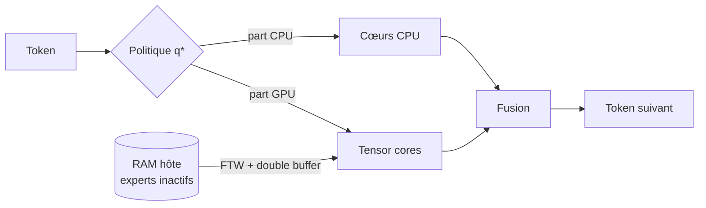
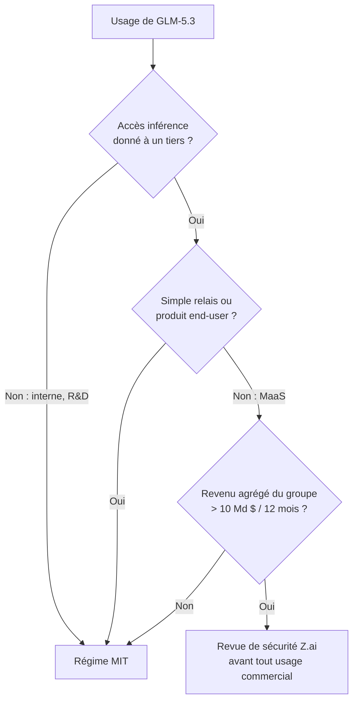

# IA — Détail du dimanche 30 août 2026

## 1. FreeToken — la politique q\* fait tourner un MoE de 753 Md sur un GPU de workstation

**Source :** InfoQ — https://www.infoq.com/news/2026/08/freetoken-local-inference/
**Date :** 29 août 2026

### Contexte

Un modèle Mixture-of-Experts ne calcule qu'une fraction de ses paramètres par token. C'est ce qui rend un modèle de 753 Md économiquement viable : seuls ~40 Md sont actifs. Mais cette sparsité crée un problème d'un autre ordre. Pour **décoder** un token, il faut router à travers l'ensemble des experts, et donc pouvoir accéder aux centaines de milliards de poids inactifs à n'importe quel moment.

En datacenter, ce n'est pas un souci : NVLink offre assez de bande passante pour masquer le transfert d'experts. Sur une machine grand public, le PCIe plafonne entre 16 et 64 Go/s, et la latence de la RAM hôte s'ajoute. Les runtimes edge existants — Ollama, llama.cpp — appliquent un **offloading statique** : les poids inactifs restent en RAM système et sont streamés vers le GPU **de façon synchrone** quand un expert s'active. Résultat : à chaque cache miss, l'exécution **stalle** en attendant le transfert.

FreeToken, publié par UC Berkeley et le MIT avec Matei Zaharia, Ion Stoica, Song Han et Kurt Keutzer parmi les auteurs, change le cadre de pensée. Une machine personnelle n'est plus un nœud de datacenter dégradé, c'est un **tissu de calcul hétérogène élastique** à orchestrer.

### Comment ça marche

**Étape un — remplacer l'offloading rigide par un co-ordonnancement.** Plutôt que d'arrêter le GPU pendant un cache miss, FreeToken **découpe le calcul d'un token entre les cœurs CPU et les tensor cores du GPU**. Le ratio n'est pas fixé à l'avance : il est calculé en fonction du débit d'interconnexion **mesuré en temps réel**. C'est la politique baptisée **q\***, qui produit une répartition optimale sous forme close, couche par couche. Là où KTransformers applique des règles statiques de répartition CPU/GPU, FreeToken recalcule à chaque couche.

**Étape deux — faire disparaître le coût du transfert.** Un format de poids dédié, le **fast weight format (FTW)**, et un **double buffering pleine couche** permettent au streaming PCIe de recouvrir **entièrement** le calcul de la couche active. Pendant que le GPU calcule la couche *n*, les poids de la couche *n+1* traversent le bus.

**Étape trois — arbitrer la VRAM à chaud.** Un gestionnaire de mémoire élastique réalloue dynamiquement la VRAM entre les entrées de KV cache et les emplacements d'experts résidents, **sans recharger le modèle**.

**Étape quatre — survivre aux agents.** Les assistants de code et les agents autonomes ont un profil d'exécution particulier : le contexte est constamment modifié — reformulation de prompt, réponses d'appels d'outils, blocs de raisonnement insérés au milieu. Les moteurs classiques jettent le KV cache linéaire dès que le préfixe mute, et recalculent toute la séquence. FreeToken intègre un **checkpointing par ancres sémantiques** : il cache les états d'attention intermédiaires et les activations récurrentes aux frontières logiques de tâche. Quand un agent édite un argument d'outil ou injecte une sortie d'exécution, FreeToken réutilise les états de sous-séquence au lieu d'invalider tout le cache.



### En pratique — exemple de code

FreeToken s'installe et se lance en CLI, avec le même geste qu'Ollama mais un placement mémoire piloté par la politique q\*.

```bash
# Installation depuis le dépôt du projet
git clone https://github.com/FlashML-org/FreeToken && cd FreeToken
pip install -e .

# Sert un MoE frontier sur une machine grand public :
# --host-mem borne la RAM utilisée pour les experts inactifs,
# --qstar active le co-ordonnancement CPU/GPU adaptatif au débit PCIe.
freetoken serve Qwen/Qwen3.6-35B \
  --device cuda:0 --host-mem 64G --qstar auto \
  --semantic-checkpoints on        # réutilise le KV cache quand un agent édite le contexte
```

Le comparatif que donne le papier situe FreeToken par rapport à l'existant :

```text
Runtime            Stratégie                              Écart mesuré vs FreeToken
-----------------  -------------------------------------  --------------------------
Ollama, llama.cpp  GGUF + offloading par couche, statique  décode 3-4x, prefill 6-30x
vLLM, SGLang       PagedAttention, batching continu        conçus pour NVLink
KTransformers      règles CPU/GPU statiques                pas de recalcul par couche
```

### Pourquoi ça compte pour toi

Si tu envisages un assistant de code auto-hébergé pour éviter la facture d'API et garder ton code chez toi, le plancher matériel vient de baisser d'un cran sérieux. Une RTX 4060 de 8 Go suffit pour un 35B utilisable. Le checkpointing sémantique est le vrai différenciateur en usage agentique : c'est lui qui évite de repayer le prefill à chaque itération de ton agent sur un même fichier.

### Points de vigilance

Les chiffres viennent du papier et de ses auteurs. Les débats sur Hacker News et LocalLLaMA portent sur un point précis : les calculs en forme close de q\* reflètent-ils vraiment la latence de dispatch CPU, la contention mémoire et la résidence variable des experts sous charge agentique concurrente ? Les comparaisons avec un llama.cpp finement réglé à la main sont également contestées. Le support matériel est limité aux NVIDIA RTX 30, 40 et 50 sous Linux et Windows. Papier : `arXiv:2608.16157`.

---

## 2. GLM-5.3 — 753 Md de poids ouverts, et la fin du MIT chez Z.ai

**Source :** Hugging Face (zai-org/GLM-5.3) — https://huggingface.co/zai-org/GLM-5.3
**Date :** 28 août 2026

### Contexte

Z.ai a lancé GLM-5.3 le 14 août sur son API et son GLM Coding Plan, en **retenant les poids** environ deux semaines pour « safety evaluation and hardening » — la capacité cyber du modèle ayant progressé plus vite que prévu. Le 26 août, la variante **GLM-5.3-Flash** (320B-A18B, multimodale native, précédemment testée anonymement sous le nom « Ox Alpha ») sortait **sous MIT**. Le 28 août, les poids du flagship arrivent enfin sur Hugging Face, commit initial `7cda819`, littéralement intitulé « Initial commit 0828 ».

Le changement qui compte n'est pas dans les benchmarks. GLM-5, GLM-5.1 et GLM-5.2 étaient tous en **MIT**. GLM-5.3 est publié sous une licence maison, taguée `license: glm-5.3`, métadonnée `license: other`.

### Comment ça marche

**L'architecture d'abord.** `GlmMoeDsaForCausalLM`, type `glm_moe_dsa` : un MoE combiné à une attention sparse de style DeepSeek. **753,33 Md de paramètres au total**, ~40 Md actifs par token. 78 couches, dont les 3 premières denses (`first_k_dense_replace: 3`) et 75 en MoE, plus une couche MTP. Le routage sélectionne **8 experts parmi 256**, avec 1 expert partagé, un scoring sigmoïde et la méthode `noaux_tc`. L'attention est de type MLA : `q_lora_rank` 2048, `kv_lora_rank` 512, 64 têtes. Un indexeur sparse (`index_topk: 2048`, `index_n_heads: 32`) alterne des motifs `full` et `shared` selon les couches. **Contexte : 1 048 576 tokens**, sortie max annoncée à 128 K.

Le repo principal est **quantifié FP8 nativement** — `fmt: e4m3`, `weight_block_size: [128,128]`, scaling d'activation dynamique — soit **756 Go répartis sur 141 shards safetensors** d'environ 5,36 Go. Les modules sensibles restent en BF16 ou F32 : `lm_head`, `embed_tokens`, tous les layernorms, les gates MoE et les projections d'indexeur. Un repo `GLM-5.3-BF16` séparé donne la pleine précision.

**Maintenant la licence.** Le préambule reprend l'esprit du MIT : droits illimités d'utiliser, copier, modifier, fusionner, publier, distribuer, sous-licencier et vendre, plus le droit explicite de déployer, fine-tuner et créer des œuvres dérivées. Le « Software » inclut nommément les poids, les paramètres, les fichiers de configuration, le code d'inférence et d'entraînement et la documentation.

Le §1 ajoute une clause de conformité légale. Le **§2** est le seul vrai verrou, en deux temps. D'abord une définition : le « **Model as a Service** » consiste à donner à un tiers un accès à l'inférence ou au fine-tuning d'une manière qui lui laisse un « contrôle significatif sur les entrées, les paramètres ou les données d'entraînement ». Deux exclusions explicites : les **produits end-user** où les capacités sont embarquées dans des fonctionnalités précises, et le **simple relais** de requêtes vers des modèles hébergés ailleurs. Ensuite le déclencheur : si le licencié **ou une de ses affiliées** opère du MaaS **et** que le **revenu agrégé du groupe dépasse 10 Md $ sur toute période de 12 mois consécutifs**, alors il doit **passer la revue de sécurité de Z.ai avant tout usage commercial**. Périmètre et méthode « raisonnablement déterminés par Z.AI » — donc unilatéralement.

Ce que la licence **ne** contient **pas** vaut d'être dit : aucune clause de distillation, aucune obligation d'attribution UI, aucune restriction de champ d'usage, aucune restriction géographique, pas de fichier `USE_POLICY.md`. C'est **MIT + conformité légale + un verrou anti-hyperscaler**.



### En pratique — exemple de code

Avant de télécharger 756 Go, la première chose à faire est de lire la licence et le config programmatiquement :

```python
from huggingface_hub import hf_hub_download
import json

# 1. Vérifier l'architecture et le contexte réels (et non les rumeurs pré-release)
cfg = json.load(open(hf_hub_download("zai-org/GLM-5.3", "config.json")))
print(cfg["model_type"])                  # glm_moe_dsa
print(cfg["max_position_embeddings"])     # 1048576  -> 1 M de contexte
print(cfg["n_routed_experts"], cfg["num_experts_per_tok"])   # 256, 8
print(cfg["quantization_config"]["fmt"])  # e4m3  -> FP8 natif

# 2. Lire la clause qui décide si tu es concerné
lic = open(hf_hub_download("zai-org/GLM-5.3", "LICENSE")).read()
print([l for l in lic.splitlines() if "10 billion" in l or "security review" in l])
```

Côté service, le contrôle du raisonnement se fait par paramètre — pense à activer `clear_thinking` en usage chat, il est à `false` par défaut :

```bash
# reasoning_effort ∈ {low, high, max}, défaut : max
vllm serve zai-org/GLM-5.3 --tensor-parallel-size 8 \
  --max-model-len 262144 \
  --override-generation-config '{"reasoning_effort":"high","clear_thinking":true}'
```

### Pourquoi ça compte pour toi

Pour un usage interne — R&D, fine-tuning, distillation, quantification, redistribution — tu n'es soumis à rien de plus que sous MIT. Le §2 ne se déclenche que si tu **revends l'inférence** et que ton groupe pèse plus de 10 Md $. Le piège juridique à connaître : le seuil porte sur le **revenu agrégé du groupe**, pas sur celui attribuable à GLM-5.3, et le terme « affiliate » n'est pas défini dans le texte.

### Pour aller plus loin

Chaque lab bride une population différente. **Kimi K3** (Moonshot, 27 juillet) déclenche dès **20 M $** de revenu agrégé, et impose « Kimi K3 » en évidence dans l'UI au-delà de 100 M MAU. **MiniMax** est le plus strict : non commercial par défaut. La **Llama Community License** bride à 700 M MAU et ignore le revenu. Z.ai a donc le **seuil le plus haut et la contrepartie la plus légère**. Côté déploiement, le FP8 tient sur un nœud 8× H200 (1 128 Go de HBM, ~375 Go restants pour le KV cache) ; le BF16 exige deux nœuds H200 ou un nœud 8× B300. Vingt-quatre quantifications communautaires existent déjà, et le support Ascend NPU passe par vLLM-Ascend, xLLM et SGLang. Note enfin que **GLM-5.3-Flash reste en MIT** : la restriction ne frappe que le flagship.
