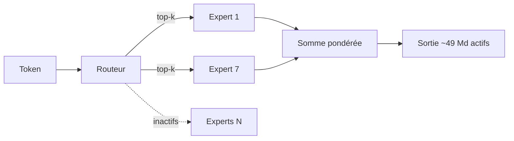
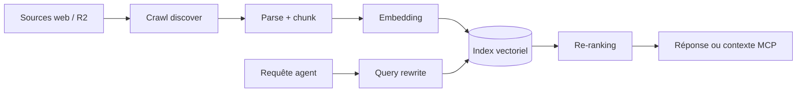
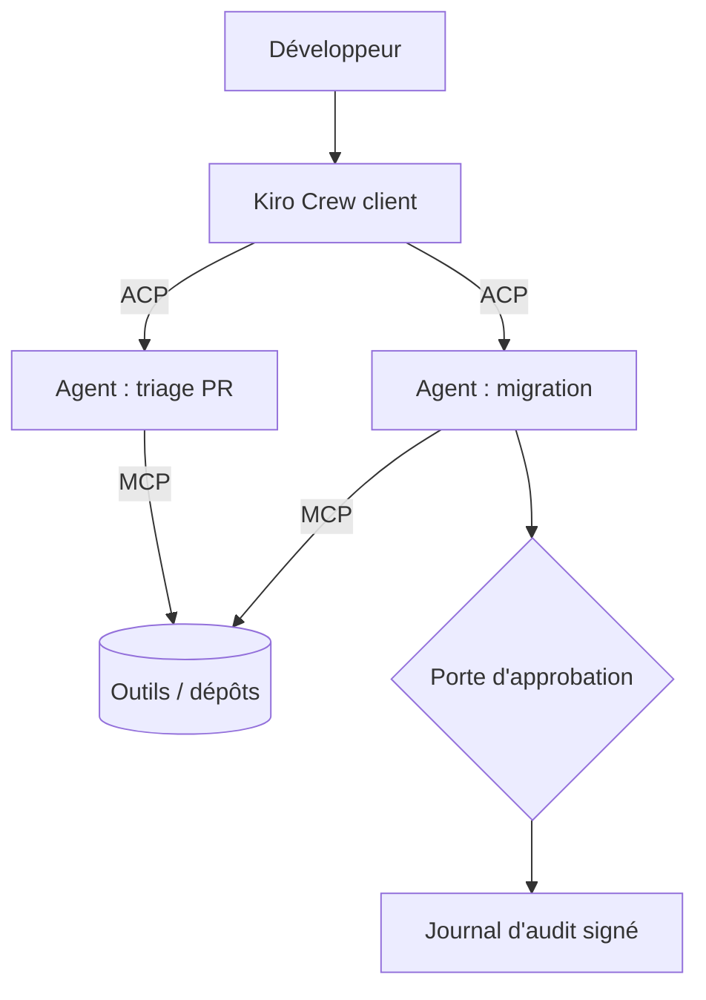

# IA — Détail du lundi 31 août 2026

## 1. Tencent Hy4 preview — 770 Md de paramètres, 49 Md actifs, contexte au-delà du million

**Source :** TechNode — https://technode.com/2026/08/28/tencent-open-sources-hy4-preview-with-770b-parameters-and-a-1m-token-context/
**Date :** 28 août 2026

### Contexte

Tencent Hunyuan a publié et ouvert les poids de **Hy4 preview** le 28 août. C'est sa troisième sortie majeure en six mois, et elle arrive dans une fenêtre déjà chargée : GLM-5.3 de Z.ai, Kimi K3, Qwen3.8-Flash-Next. Le positionnement affiché est la **productivité** — code, bureautique, analyse de données, développement de jeux, recherche scientifique.

Les chiffres structurants : **770 milliards de paramètres au total, 49 milliards activés par token, et une fenêtre de contexte dépassant le million**. Le modèle est accessible via WorkBuddy, CodeBuddy, Yuanbao et ima, et par API chez Tencent Cloud TokenHub et OpenRouter, à 0,834 $ le million de tokens d'entrée et 2,501 $ en sortie. La page de recherche officielle est sur https://hy.tencent.ai/research/hy4-preview.

### Comment ça marche

Le ratio 49/770 est le vrai sujet. Il vaut **6,4 %** : pour chaque token généré, moins d'un quinzième des poids participe au calcul. C'est la mécanique d'un **Mixture-of-Experts**.

Déroulons-la. Dans un transformeur dense, chaque token traverse la totalité des couches feed-forward. Dans un MoE, cette couche est remplacée par N « experts » — des blocs feed-forward indépendants — précédés d'un **routeur**. Le routeur est un petit réseau qui score chaque expert pour le token courant, puis n'en active que les `top-k` meilleurs. Les sorties retenues sont pondérées par ces scores et sommées.

Deux conséquences pratiques, souvent confondues :

- **La VRAM suit les paramètres totaux.** Tous les experts doivent être adressables, même inactifs. À 770 Md, cela reste un modèle de datacenter, ou de cluster fortement quantifié.
- **Le calcul suit les paramètres actifs.** Le coût en FLOPs par token est celui d'un modèle d'environ 49 Md. D'où une latence bien meilleure que ce que le chiffre de 770 Md laisserait croire.

C'est exactement le compromis que l'écosystème a adopté partout : payer en mémoire pour ne pas payer en latence.

Côté évaluation, la prudence s'impose. Le seul chiffre publié vient d'une **évaluation interne à l'aveugle** menée par Tencent : 163 experts, 203 tâches d'ingénierie, moyenne de 2,99/4 contre 2,92 pour GLM-5.3 et 2,94 pour Kimi K3. L'écart est de l'ordre du bruit, et le juge est aussi l'auteur. Tencent indique par ailleurs que le modèle a aidé à optimiser ses propres systèmes d'entraînement et d'inférence, avec **+31,8 % de débit de bout en bout** contre une baseline non détaillée.



### En pratique — exemple de code

Un appel OpenAI-compatible via OpenRouter, avec le calcul de coût que tu feras de toute façon avant d'industrialiser.

```python
# pip install openai
from openai import OpenAI

client = OpenAI(base_url="https://openrouter.ai/api/v1", api_key="...")

resp = client.chat.completions.create(
    model="tencent/hy4-preview",
    messages=[{"role": "user", "content": "Refactore ce repository EF Core..."}],
    max_tokens=2000,
)

u = resp.usage
# Tarif annoncé : 0,834 $ / M tokens entrée, 2,501 $ / M tokens sortie
cout = u.prompt_tokens / 1e6 * 0.834 + u.completion_tokens / 1e6 * 2.501
print(f"{u.prompt_tokens} in + {u.completion_tokens} out = {cout:.4f} $")

# Ordre de grandeur à retenir : un contexte de 500 k tokens coûte ~0,42 $
# à l'entrée. Le contexte long n'est pas gratuit, il est juste possible.
```

### Pourquoi ça compte pour toi

Le contexte au-delà du million change ce que tu peux poser en entrée : une solution .NET entière, un schéma PostgreSQL avec ses migrations, un module Symfony complet. Avant d'y croire, mesure. Le ratio d'activation te dit que la latence sera correcte ; il ne dit rien de la qualité au-delà de 200 k tokens. Et l'évaluation disponible reste interne à Tencent — traite-la comme une annonce, pas comme une mesure.

---

## 2. Cloudflare AI Search — le pipeline RAG entier derrière une commande, exposé en MCP

**Source :** InfoQ — https://www.infoq.com/news/2026/08/cloudflare-ai-search/
**Date :** 30 août 2026

### Contexte

Monter une recherche sémantique demande d'assembler une demi-douzaine de briques : un crawler, un parseur, un modèle d'embedding, une base vectorielle, une API de recherche, souvent un re-ranker. Cloudflare vendait déjà chacune séparément — Workers AI, AI Gateway, Vectorize, R2, Browser Run. **AI Search** les recompose en un service unique et prend en charge le pipeline de bout en bout ([annonce](https://blog.cloudflare.com/ai-search-easier/)).

L'objectif affiché est explicite : donner à un agent **son propre moteur de recherche** sur des données maison. Le service est en bêta gratuite.

### Comment ça marche

Le pipeline complet, étape par étape, est celui que tu écrirais à la main.

**Ingestion.** Un crawler parcourt les sources. Nouveauté de cette version : le mode `discover`. Auparavant chaque site indexé devait publier un sitemap ; le crawler découvre désormais les pages seul.

**Parsing et découpage.** Les documents — structurés ou non — sont convertis en texte puis découpés en fragments de taille exploitable par le modèle d'embedding.

**Embedding et indexation.** Chaque fragment devient un vecteur, stocké dans l'index. C'est ce qui permet de retrouver un passage par proximité sémantique plutôt que par correspondance de mots.

**Requête.** À l'interrogation, la question peut être réécrite (query rewriting), vectorisée, comparée à l'index, puis les résultats sont **re-classés** par un modèle de re-ranking avant d'être renvoyés — ou passés à un modèle de génération.

Deux choix d'architecture méritent attention.

Le premier est le **corpus unifié**. Cloudflare a indexé sa propre API et sa documentation développeur, mais aussi Astro, Vite, Hono et Replicate. Une requête unique peut donc répondre en croisant plusieurs sources, au lieu d'interroger chacune séparément. Un endpoint public unique interroge plusieurs instances ou sites à la fois.

Le second est l'**exposition**. Deux voies : un Worker qui encapsule la recherche — l'option recommandée — ou des endpoints publics `/mcp` et `/search`, **sans authentification ni déploiement**, partageables tels quels. Le `/mcp` signifie qu'un agent branche l'index comme un outil, sans code de colle.

Le modèle tarifaire suit la même logique de séparation : embedding et re-ranking gratuits avec les modèles par défaut ou une sélection du catalogue Workers AI ; **génération de réponse et réécriture de requête facturées** à l'usage du modèle.



### En pratique — exemple de code

Création de l'instance en une commande, puis consommation depuis un Worker.

```bash
# Crawl, ingestion, embedding et indexation en une seule commande
npx wrangler ai-search create cloudflare-community \
  --namespace dev-stack \
  --source https://community.cloudflare.com \
  --type web-crawler \
  --parse-type discover      # découverte des pages sans sitemap
```

```typescript
// Worker : la recherche reste derrière ton authentification
export default {
  async fetch(req: Request, env: Env) {
    const q = new URL(req.url).searchParams.get("q") ?? "";
    if (!isAuthorized(req)) return new Response("nope", { status: 401 });

    // Le binding évite d'exposer /search publiquement
    const res = await env.AI_SEARCH.search({ query: q, topK: 8 });
    return Response.json(res.results);
  },
};
```

### Pourquoi ça compte pour toi

Si tu envisages du RAG sur ta doc interne ou ton référentiel produit, ceci supprime l'essentiel du travail d'infrastructure. Mais lis la ligne « sans authentification » avant de t'enthousiasmer : un endpoint `/search` public sur un corpus interne est une fuite de données déguisée en fonctionnalité. Passe par un Worker, mets ton auth devant, et vérifie ce que coûte la réécriture de requête à ton volume.

---

## 3. AWS Kiro Crew — orchestrer des agents asynchrones via Agent Client Protocol

**Source :** InfoQ — https://www.infoq.com/news/2026/08/kiro-crew-coding-agents/
**Date :** 30 août 2026

### Contexte

Amazon a publié **Kiro Crew** en open source sous Apache 2.0, disponible sur macOS, Linux et Windows ([annonce](https://kiro.dev/blog/introducing-kiro-crew/)). L'outil vient de l'interne : développé sous le nom **MeshClaw**, il aurait été adopté par plus de 39 000 développeurs Amazon et 500 contributeurs en six mois, sans mandat hiérarchique.

Le besoin décrit par ses auteurs est banal et parlant : lancer une tâche, partir, revenir sur quelque chose qui vaut une revue — et faire tourner plusieurs tâches à la fois plutôt que de surveiller un prompt après l'autre.

### Comment ça marche

Kiro Crew se comprend mieux avec une distinction de protocoles souvent confondue.

**MCP relie un agent à des outils.** C'est le protocole que tu connais : un serveur expose des fonctions, l'agent les appelle.

**ACP — Agent Client Protocol — relie un client à des agents.** C'est le protocole d'orchestration que Kiro Crew utilise pour piloter plusieurs agents et récupérer leur activité en direct. Le dépôt de référence est https://github.com/zed-industries/agent-client-protocol.

Cette séparation explique la vue **Activity**. Pour chaque agent, elle affiche le plan, les appels d'outils, les **portes d'approbation** et les résultats au fil de l'eau. Sans un protocole côté client, tu n'aurais qu'un log en fin de course.

Autour de cette boucle, quatre mécanismes de persistance : une **mémoire partagée** entre sessions, des **skills réutilisables**, des **jobs planifiés**, et des agents **concurrents** capables de déléguer à des sous-agents. Les usages cités sont l'investigation d'incident, le tri de tickets, les migrations et la surveillance de PR.

La partie la plus intéressante pour un dev senior est la **défense en profondeur**, annoncée dès le premier jour : sandbox au niveau OS, **commandes refusées par défaut**, blocage de motifs suspects, validation d'entrée, blocage de chemins sensibles, expurgation des identifiants, et **journal d'audit signé** de chaque action. La formule des auteurs vaut d'être notée : beaucoup d'agents sont open source, peu arrivent avec ce garde-corps.

L'outil tourne sur le Kiro CLI et réutilise les configurations `.kiro` existantes — steering files, skills, agents personnalisés — plus des intégrations Slack, Telegram et WeCom. Réserve remontée par la communauté : Crew consomme des tokens **nettement plus vite** que le CLI seul.



### En pratique — exemple de code

Le principe « refusé par défaut » transposé à ton propre wrapper d'agent — ce n'est pas le code de Kiro Crew, c'est la règle qu'il applique, écrite en clair.

```bash
#!/usr/bin/env bash
# Politique deny-by-default : seule la liste explicite passe.
set -euo pipefail

ALLOWED='^(git (status|diff|log)|dotnet (build|test)|npm (ci|run test))\b'
DENIED_PATHS='(^|/)(\.env|\.ssh|\.aws|id_rsa)'

cmd="$1"
[[ "$cmd" =~ $DENIED_PATHS ]] && { echo "chemin sensible refusé"; exit 1; }
[[ "$cmd" =~ $ALLOWED ]]      || { echo "hors allowlist -> approbation humaine"; exit 2; }

# Journal d'audit : horodaté, append-only, signé hors de portée de l'agent
printf '%s\t%s\n' "$(date -Is)" "$cmd" >> /var/log/agent-audit.log
eval "$cmd"
```

### Pourquoi ça compte pour toi

Si tu commences à faire tourner des agents sans supervision continue, deux points sont à copier tout de suite : **refus par défaut** plutôt qu'autorisation par défaut, et **journal d'audit signé**, hors de portée de l'agent lui-même. Le reste — mémoire partagée, jobs planifiés — se rattrape. Une trace d'exécution manquante, non. Et surveille la facture : le parallélisme multiplie les tokens autant que le débit.
