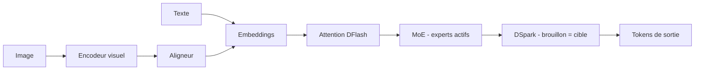

# IA — Détail du mardi 1er septembre 2026

## 1. DeepSeek-V4-Flash-Vision-Exp — poids MIT, et la tokenisation d'image comme variable de coût

**Source :** Hugging Face — https://huggingface.co/deepseek-ai/DeepSeek-V4-Flash-Vision-Exp
**Date :** 1er septembre 2026 (dépôt de poids ; annonce du modèle le 21 août)

### Contexte

DeepSeek n'avait jamais publié de modèle acceptant des images. V4-Flash-Vision-Exp change ça : c'est le premier multimodal de la famille V4, construit **par-dessus** l'architecture V4-Flash existante — on lui a greffé des modules visuels puis poursuivi l'entraînement, plutôt que de repartir de zéro. Le dépôt Hugging Face est passé public cette nuit, sous licence MIT, avec le tokenizer, la référence d'encodage de prompt et une implémentation d'inférence PyTorch minimale.

Le positionnement est explicite : compréhension de documents et de graphiques, question-réponse visuelle, agents multimodaux. Autrement dit, le traitement de factures, de captures d'écran et de PDF — pas la génération d'images.

### Comment ça marche

La chaîne d'inférence enchaîne cinq blocs, tous couverts par le code de référence du dépôt.

**L'encodeur visuel** transforme l'image en une séquence de patches, puis un **aligneur** projette ces patches dans l'espace d'embedding du modèle de langage. C'est là que se joue le coût : DeepSeek compte environ **500 tokens de prompt par image**, contre environ 1 150 pour Gemini 3.7 Flash sur les mêmes images. La différence n'est pas anecdotique — sur un lot de factures, elle se voit directement sur la facture d'API.

**L'attention DFlash** et le **MoE** constituent le corps du modèle : seuls quelques experts s'activent par token, ce qui garde le coût de calcul très en dessous du nombre total de paramètres. Les **Hyper-Connections** stabilisent la profondeur.

**DSpark** est le point le plus intéressant côté serving. C'est du décodage spéculatif, mais **le brouillon et la cible viennent du même checkpoint** : tu ne charges pas un second modèle. Concrètement, avec SGLang tu actives `--speculative-algorithm DSPARK` et tu ne passes surtout pas de `--speculative-draft-model-path`.

Sur les benchmarks publiés, l'ajout de la vision ne dégrade pas le texte : Terminal Bench 2.1 monte de 82,7 à 83,9, DeepSWE de 54,4 à 59,3. Côté multimodal, ApexBench passe de 26,2 (V4-Flash-0731 ignorait les images) à 36,5, contre 39,4 pour Opus 4.8. Sur Agents' Last Exam, DeepSeek passe devant : 27,3 contre 25,7.

Le revers est la latence. Un test comparatif de The New Stack sur neuf questions visuelles donne une exactitude identique aux deux modèles, mais 16,8 s de moyenne pour DeepSeek contre 7,2 s pour Gemini — avec des pointes à 30 s dues à un long raisonnement interne facturé en tokens de sortie.



### En pratique — exemple de code

Servir le modèle avec SGLang, puis l'interroger comme une API OpenAI.

```bash
# 4 GPU en tensor parallel ; DSpark s'appuie sur le checkpoint principal,
# donc PAS de --speculative-draft-model-path.
sglang serve \
  --model-path deepseek-ai/DeepSeek-V4-Flash-Vision-Exp \
  --tp 4 \
  --speculative-algorithm DSPARK \
  --mem-fraction-static 0.85 \
  --port 30000
```

```python
# Client OpenAI standard : le serveur SGLang expose /v1/chat/completions.
from openai import OpenAI
client = OpenAI(base_url="http://localhost:30000/v1", api_key="none")

resp = client.chat.completions.create(
    model="deepseek-ai/DeepSeek-V4-Flash-Vision-Exp",
    messages=[{"role": "user", "content": [
        {"type": "text", "text": "Liste les lignes de cette facture et le total."},
        {"type": "image_url", "image_url": {"url": "data:image/png;base64,..."}},
    ]}],
    temperature=1.0, top_p=0.95,  # réglages recommandés par le model card
)
print(resp.usage.prompt_tokens)  # ~500 tokens pour l'image : à surveiller en lot
```

### Pourquoi ça compte pour toi

Si tu traites des documents en lot — factures fournisseurs, PV, exports scannés —, ce modèle fait le travail à un tiers du coût d'un Gemini Flash, et tu peux l'héberger toi-même sous MIT. La contrepartie est la latence : réserve-le aux traitements asynchrones. Pour un écran où l'utilisateur attend, la variance de 8 à 30 secondes te coûtera plus cher que l'économie de tokens.

### Points de vigilance

Le suffixe `Exp` signale un modèle expérimental : ni l'API ni les poids ne sont contractuels. Le tarif public double aux heures ouvrées en semaine — les comparaisons de coût faites le week-end sont le meilleur cas, pas le cas moyen.

---

## 2. « Does On-Policy Distillation Really Distill? » — le professeur ne sert presque à rien

**Source :** Hugging Face Papers (arXiv 2608.31046, Purdue University) — https://huggingface.co/papers/2608.31046
**Date :** 31 août 2026

### Contexte

Pour améliorer un petit modèle de raisonnement, deux écoles s'opposent. Le RL à récompense vérifiable (RLVR) note la trajectoire entière : signal fiable, mais très épars — un seul scalaire pour des centaines de tokens. La distillation on-policy (OPD) promet mieux : l'élève génère la trajectoire, le professeur la note **token par token**, et la supervision devient dense.

Le problème logique est là depuis le début, et personne ne l'avait quantifié. Le professeur note des trajectoires produites par l'élève, donc **hors de sa propre distribution**. Rien ne garantit que ses scores soient fiables sur ce terrain-là. Deux chercheurs de Purdue ont mesuré.

### Comment ça marche

L'analyse se déroule en trois temps, et chacun démonte une brique.

**Premier temps : mesurer le bruit.** Ils quantifient la fiabilité de la supervision du professeur pendant l'entraînement. Résultat : le bruit est substantiel — et sa prévalence **augmente avec la taille du professeur**. Un professeur plus gros produit une supervision plus bruitée sur les trajectoires de l'élève, exactement l'inverse de l'intuition qui pousse à prendre le plus gros modèle disponible.

**Deuxième temps : tester si ça compte.** Ils entraînent l'élève avec et sans la supervision bruitée. Les deux convergent vers des performances comparables. L'élève est donc **insensible** au bruit du professeur — ce qui, retourné, signifie que le signal du professeur n'est pas ce qui le fait progresser.

**Troisième temps : trouver le vrai moteur.** L'apprentissage se concentre sur les tokens à **faible log-probabilité** — la queue de distribution. Test décisif : remplacer les avantages fournis par le professeur par un **avantage négatif fixe unique** donne les mêmes performances. Il ne reste rien du professeur. L'OPD fonctionne essentiellement en supprimant les tokens de queue, ce qui ne demande aucun professeur.

**La méthode qui en découle.** OPSA (On-Policy Self-Adaptation) supprime le professeur et module l'avantage négatif selon l'**entropie** de la position : là où le modèle hésite, le signal est fort ; la masse de probabilité retirée à la queue est redistribuée uniformément entre les tokens de tête. Face à Qwen3-1.7B de base, OPSA gagne 35,41 points d'Avg@32 sur AIME24 (+263 % en relatif) et plus que double le Pass@32 sur les trois benchmarks. Face à l'OPD classique, +16,77 points d'Avg@32.

### En pratique — exemple de code

Le cœur de la méthode tient en quelques lignes : l'avantage ne vient plus d'un professeur.

```python
import torch

def opsa_advantage(logits: torch.Tensor, beta: float = 1.0) -> torch.Tensor:
    """Avantage négatif adaptatif à l'entropie, sans aucun professeur.
    logits : (batch, seq, vocab) produits par l'élève sur sa propre trajectoire."""
    logp = torch.log_softmax(logits, dim=-1)
    p = logp.exp()

    # Entropie par position : élevée = le modèle hésite = signal d'apprentissage fort.
    H = -(p * logp).sum(-1)                       # (batch, seq)
    H_norm = H / torch.log(torch.tensor(p.size(-1), dtype=H.dtype))  # dans [0, 1]

    # Avantage négatif : on pénalise la queue proportionnellement à l'hésitation.
    # Avant (OPD) : advantage = teacher_logp - student_logp  -> nécessite un professeur.
    # Après (OPSA) : purement interne, aucun forward de professeur à payer.
    return -beta * H_norm
```

Tu supprimes ainsi tout le coût d'inférence du professeur — souvent la moitié du budget GPU d'une boucle d'OPD.

### Pourquoi ça compte pour toi

Si tu envisages de spécialiser un petit modèle sur ton domaine, ce papier te fait économiser l'étape la plus chère. Pas de gros professeur à héberger, pas de forward supplémentaire par token. Et si un fournisseur te vend une « distillation depuis un modèle frontier », demande la comparaison contre une baseline sans professeur — c'est désormais la question qui tue.

### Limites

Les résultats portent sur du raisonnement mathématique avec des modèles de petite taille (Qwen3-1.7B au cœur des expériences). Rien ne dit que la conclusion tient pour transférer une compétence que l'élève ne possède pas du tout — ici, on affûte une capacité latente, on ne l'implante pas.

---

## 3. NoRA — stabiliser LoRA en normalisant la projection descendante

**Source :** Hugging Face Papers (arXiv 2608.31036) — https://huggingface.co/papers/2608.31036
**Date :** 31 août 2026

### Contexte

LoRA est devenu l'outil par défaut du fine-tuning à budget contraint : au lieu de mettre à jour une matrice de poids `W` de taille `d×k`, tu apprends deux petites matrices `A` (descendante, `r×k`) et `B` (montante, `d×r`) avec `r` très petit, et tu appliques `W + BA`. Des millions de paramètres deviennent des milliers.

Une convention est universelle et rarement interrogée : **`B` est initialisée à zéro**, pour que l'adaptateur soit neutre au premier pas. Les auteurs partent de cette convention et en tirent une conséquence que personne n'avait exploitée.

### Comment ça marche

**L'observation.** Si `B = 0` au départ, alors le produit `BA` est nul, et le gradient qui traverse l'adaptateur au tout début dépend entièrement de `A`. La dynamique d'optimisation précoce de LoRA est donc **gouvernée par la seule projection descendante**. Or `A` est initialisée aléatoirement, sans contrainte sur sa norme : selon le tirage, l'échelle du gradient initial varie fortement. C'est une source de variance qu'on attribue d'habitude au learning rate ou à la seed.

**La correction.** NoRA normalise les matrices de projection descendante pendant l'entraînement. L'échelle initiale cesse de dépendre du tirage, et la trajectoire d'optimisation devient reproductible d'une exécution à l'autre.

**La variante économique.** Les auteurs montrent que la même normalisation appliquée **uniquement à l'initialisation** améliore déjà LoRA standard, sans avoir à renormaliser à chaque pas. Tu obtiens l'essentiel du bénéfice pour trois lignes de code et zéro coût récurrent.

**Ce que ça donne.** Sur pré-entraînement, SFT et RL, NoRA accélère la convergence, améliore les performances finales, stabilise l'entraînement et atténue l'oubli catastrophique. Aucun paramètre entraînable supplémentaire, aucun calcul à l'inférence : après fusion, l'adaptateur est identique à un LoRA classique.

### En pratique — exemple de code

La variante « normalisation à l'initialisation » s'ajoute à un modèle PEFT existant en une passe.

```python
import torch
from peft import LoraConfig, get_peft_model

model = get_peft_model(base_model, LoraConfig(r=16, lora_alpha=32,
                                              target_modules=["q_proj", "v_proj"]))

# Avant — LoRA standard : A tirée aléatoirement, norme non contrôlée.
#   -> l'échelle du gradient initial dépend de la seed.

# Après — NoRA (variante init-only) : on normalise A ligne par ligne.
with torch.no_grad():
    for name, p in model.named_parameters():
        if "lora_A" in name:                     # B reste à zéro, on n'y touche pas
            p.div_(p.norm(dim=-1, keepdim=True).clamp_min(1e-6))

# Rien d'autre à changer : entraînement, sauvegarde et fusion restent identiques.
```

### Pourquoi ça compte pour toi

Si tu fine-tunes un modèle sur ton corpus métier, tu as sans doute déjà relancé un run parce que la loss partait mal. Cette variance a une cause identifiée et une correction gratuite. Commence par la variante init-only : trois lignes, aucun risque, et le format d'adaptateur ne change pas — tu peux comparer directement avec tes runs précédents.

### Pour aller plus loin

Le dépôt de référence est publié (`github.com/Joluck/NoRA`) mais reste très jeune. Vérifie sur ton propre jeu de validation avant d'en faire une règle d'équipe.
