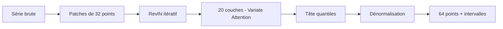
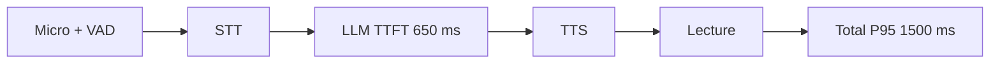
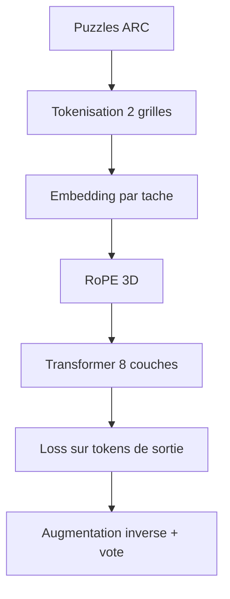

# IA — Détail du mercredi 2 septembre 2026

## 1. TimesFM 3.0 (PyTorch) — un modèle de fondation pour la prévision de séries temporelles

**Source :** Hugging Face — https://huggingface.co/google/timesfm-3.0-pytorch
**Date :** 1er septembre 2026

### Contexte

La prévision de séries temporelles est restée longtemps à l'écart de la vague des modèles de fondation. La pratique dominante consiste à entraîner un modèle par série : ARIMA, Prophet, ou un gradient boosting sur des features calendaires. Cette approche marche, mais elle coûte cher en maintenance. Chaque nouvelle métrique demande un nouvel entraînement, un nouveau réglage, une nouvelle surveillance de dérive.

TimesFM est la réponse de Google Research à ce problème. L'idée est simple : pré-entraîner un décodeur sur un corpus massif et hétérogène de séries, puis l'utiliser en **zero-shot** sur des séries jamais vues. La version 3.0 publie les poids et configurations PyTorch officiels. Le corpus de pré-entraînement mélange GiftEvalPretrain, les vues de pages Wikipédia jusqu'à novembre 2023, le top des requêtes Google Trends jusqu'à fin 2022, et des données synthétiques.

Un point à vérifier avant tout prototype : la licence est la **TimesFM Non-Commercial License v1.0**. Ce n'est ni Apache 2.0 ni MIT. Pour un usage produit, c'est bloquant en l'état.

### Comment ça marche

Le modèle fait 330,7 M de paramètres répartis sur 20 couches transformer, en dimension 1280 avec 16 têtes. L'architecture est décrite comme un *Stacked Mixing Transformer* avec *Variate Attention* et *CPM Iterative RevIN*. Déroulons le pipeline pas à pas.

**Étape 1 — le patching.** La série n'est pas tokenisée point par point. Elle est découpée en patches de **32 points de contexte**. Chaque patch devient un token. C'est le même principe que les patches d'image dans un Vision Transformer. L'intérêt est mécanique : une fenêtre de 512 points devient 16 tokens au lieu de 512, et le coût quadratique de l'attention s'effondre.

**Étape 2 — la normalisation réversible.** Deux séries peuvent avoir la même forme mais des échelles séparées par trois ordres de grandeur. RevIN (*Reversible Instance Normalization*) normalise chaque instance en entrée, puis réapplique la statistique inverse en sortie. La variante « CPM Iterative » répète l'opération à plusieurs étages du réseau. Le modèle apprend donc des formes, pas des amplitudes.

**Étape 3 — l'attention.** L'attention temporelle est causale, comme dans un LLM. La *Variate Attention* ajoute un axe : sur une série multivariée, chaque variable peut regarder les autres. C'est ce qui permet au modèle de capter qu'un pic de trafic précède un pic de latence.

**Étape 4 — la tête de sortie.** Le modèle produit **64 points d'horizon d'un coup**, et pas un point à la fois. Chaque point sort sous forme de plusieurs quantiles, la médiane étant à l'index 4. Tu obtiens donc un intervalle de prédiction natif, sans bootstrap ni ensemble.



### En pratique — exemple de code

Prévoir la charge d'une API sur les 64 prochains points, sans entraînement préalable.

```python
import numpy as np
import timesfm

# Chargement des poids PyTorch officiels (330 M de paramètres)
model = timesfm.TimesFm.from_pretrained("google/timesfm-3.0-pytorch")

# Une série par ligne : ici 512 points de QPS agrégés à la minute.
# Aucune normalisation manuelle : RevIN s'en charge en interne.
serie_qps = np.load("qps_last_512_minutes.npy")

point_forecast, quantile_forecast = model.forecast(
    inputs=[serie_qps],
    freq=[0],           # 0 = haute fréquence (minute, heure)
    horizon_len=64,     # aligné sur le patch d'horizon natif du modèle
)

mediane = quantile_forecast[0][:, 4]   # index 4 = médiane
p90 = quantile_forecast[0][:, 8]       # quantile haut : dimensionne ton autoscaling

print(f"QPS médian à H+64 : {mediane[-1]:.0f} | pire cas P90 : {p90[-1]:.0f}")
```

### Pourquoi ça compte pour toi

Tu as des séries partout : QPS, latence P99, taille de file, connexions PostgreSQL, remplissage de disque. Jusqu'ici, prévoir demandait un modèle par métrique. Ici tu appelles une fonction. Les quantiles te donnent directement une borne haute pour dimensionner ton autoscaling, et un seuil d'anomalie honnête : une valeur au-dessus du P90 prédit mérite une alerte. Vérifie la licence avant d'aller en production.

### Points de vigilance

Le corpus s'arrête fin 2023 pour Wikipédia et fin 2022 pour Google Trends. Le modèle n'a donc aucune notion des régimes récents. Sur des séries à saisonnalité inhabituelle ou à ruptures fréquentes, compare systématiquement à une baseline naïve avant de conclure.

---

## 2. PhoneLLM Alpha 1 (Pipecat) — un MoE de 30B conçu autour d'un budget de latence

**Source :** Hugging Face — https://huggingface.co/pipecat-ai/phonellm-alpha-1
**Date :** 30 août 2026

### Contexte

Les agents vocaux échouent sur deux points que les benchmarks classiques ne mesurent pas. Le premier est la latence. Un humain tolère mal plus de 1,5 seconde de silence dans une conversation téléphonique. Le second est la fiabilité des appels d'outils. Un modèle qui répond « c'est réservé » sans avoir appelé l'API de réservation produit un incident client, pas une erreur de benchmark.

L'équipe Pipecat, chez Daily, publie PhoneLLM Alpha 1 pour attaquer ces deux points. C'est un fine-tune full-parameter de **NVIDIA Nemotron 3 Nano 30B-A3B**, entraîné avec NeMo. L'architecture est un mixture-of-experts hybride Mamba-Transformer : **30 milliards de paramètres au total, 3,5 milliards actifs**, contexte de 262 144 tokens. La licence est **BSD 2-Clause**, sans restriction commerciale.

Ils publient en parallèle **PhoneBench v1**, un benchmark qui mesure la justesse, mais aussi la latence et le coût par minute. L'annonce clé : PhoneLLM se situe au niveau de GPT 5.6 Terra sur ce benchmark, avec 94 % de coût en moins et 1 300 ms de time-to-first-token P95 en moins.

### Comment ça marche

Le raisonnement de conception part du budget, pas du modèle. Une conversation vocale réussie tient dans **1 500 ms de voice-to-voice au P95**. Ce budget se partage entre capture audio, transport WebRTC, transcription, inférence LLM, synthèse vocale et lecture. Une fois les autres postes servis, il reste environ **650 ms de time-to-first-token** pour le LLM.

Deux décisions découlent directement de ce chiffre.

**Décision 1 — le MoE.** Avec 3,5 milliards de paramètres actifs sur 30 milliards, le coût par token décodé correspond à un petit modèle, tandis que la capacité de mémorisation reste celle d'un gros. C'est ce qui rend le TTFT compatible avec le budget.

**Décision 2 — pas de thinking.** Les modèles frontier récents sont optimisés avec les tokens de raisonnement activés. Ces tokens s'accumulent avant la première réponse audible. Le TTFT P95 de GPT 5.6 Terra en mode rapide tourne autour de 1 900 ms, soit déjà plus que le budget total. PhoneLLM est donc entraîné à appeler le bon outil au bon moment **sans thinking**, avec `temperature=0`.

**La mesure.** Évaluer un agent vocal est subjectif : style de parole, pertinence, choix d'outil. PhoneBench utilise un panel de juges LLM calibrés sur des labels humains, qui comparent les actions à des références de qualité. Il note le style téléphonique, la justesse des appels d'outils, la cohérence entre le dire et le faire, l'ancrage factuel, la discipline d'authentification et d'escalade. Les scénarios et prompts du benchmark sont tenus à l'écart des données d'entraînement.

**La quantification.** Le tableau NVFP4 apprend quelque chose de transposable. Poids NVFP4 avec cache KV en BF16 : 72,019, soit −0,037 par rapport au BF16 pur. Poids NVFP4 avec cache KV en FP8 : 71,512, soit −0,543. Quantifier les poids est presque gratuit ; quantifier le cache KV coûte quinze fois plus cher en qualité.



### En pratique — exemple de code

Servir le modèle avec vLLM, puis l'appeler avec un outil, en désactivant explicitement le raisonnement.

```bash
# Le thinking reste désactivé côté requête ; trust_remote_code est requis
# par l'architecture nemotron_h (hybride Mamba-Transformer).
vllm serve pipecat-ai/phonellm-alpha-1 \
  --trust-remote-code \
  --max-model-len 32768 \
  --enable-auto-tool-choice \
  --tool-call-parser nemotron
```

```csharp
// Appel depuis .NET via l'API OpenAI-compatible exposée par vLLM.
var client = new ChatClient("pipecat-ai/phonellm-alpha-1", new ApiKeyCredential("EMPTY"),
    new OpenAIClientOptions { Endpoint = new Uri("http://localhost:8000/v1") });

var options = new ChatCompletionOptions
{
    Temperature = 0f,                     // recommandation officielle du modèle
    Tools = { reserverTableTool },        // l'outil doit vraiment être appelé
};

// Mesure ce qui compte : le délai jusqu'au PREMIER token, pas la durée totale.
var chrono = Stopwatch.StartNew();
await foreach (var maj in client.CompleteChatStreamingAsync(messages, options))
{
    if (chrono.IsRunning) { Console.WriteLine($"TTFT : {chrono.ElapsedMilliseconds} ms"); chrono.Stop(); }
}
```

### Pourquoi ça compte pour toi

Si tu branches un agent vocal sur ton back-office, ton SLA n'est pas le débit mais le TTFT. Vise 650 ms côté LLM et instrumente-le comme une métrique de production, pas comme une curiosité. Retiens aussi la leçon de quantification : quantifie tes poids, laisse ton cache KV en BF16. Enfin, la licence BSD-2 te laisse héberger le modèle chez toi, ce qui règle la question des données d'appel.

---

## 3. mdlARC — 44 % sur ARC-AGI-1 pour 67 cents, sans récursion

**Source :** Mithil Vakde — https://mvakde.github.io/blog/44-on-arc-1/
**Date :** 1er septembre 2026

### Contexte

ARC-AGI est un benchmark de méta-apprentissage. Chaque puzzle expose quelques paires grille d'entrée / grille de sortie, et il faut déduire la règle pour compléter une paire de test. Chaque puzzle a sa propre règle. Le jeu compte environ mille puzzles, ce qui en fait un test d'**efficacité en échantillons** plutôt qu'un test de connaissances.

Mithil Vakde publie un troisième billet de sa série. Il entraîne un petit transformer **depuis l'initialisation, au moment du test**, pendant 1 h 30 sur une seule RTX 5090. Coût total, entraînement et inférence complète compris : **67 cents**. Score : 44 % sur l'évaluation publique ARC-1, et 7 % sur ARC-2. Cela égale TRM et HRM, deux architectures récursives, sans aucune récursion. Le code est ouvert sous `mvakde/mdlARC`.

### Comment ça marche

L'approche est du **test-time training** : le modèle n'existe pas avant l'évaluation, il est fabriqué pendant.

**Étape 1 — tokenisation.** Chaque paire entrée/sortie devient une séquence de tokens. Une séquence contient donc deux grilles 2D.

**Étape 2 — identité de tâche.** Chaque puzzle reçoit un embedding additif appris. C'est ce qui autorise l'apprentissage croisé : le modèle voit tous les puzzles, mais sait lequel il traite.

**Étape 3 — positions.** Les positions sont apprises via des embeddings **RoPE 3D**, adaptés à la structure « deux grilles bidimensionnelles dans une séquence ».

**Étape 4 — augmentation et vote.** Les séquences sont augmentées par permutations de couleurs et transformations diédrales. À l'inférence, l'entrée de test est augmentée, la transformation inverse est appliquée aux sorties, et les deux sorties les plus fréquentes sont soumises.

**Étape 5 — la loss.** Changement clé de cette version : la perte ne porte plus que sur les **tokens de sortie**. L'approche devient supervisée, et le score passe de 40 % à 44 %. Détail contre-intuitif signalé par l'auteur : la perte de test est pire, mais le score est meilleur. Optimiser la validation loss sur un petit jeu peut donc mal corréler avec la performance réelle.

Les ablations sont le vrai enseignement. Passer du RoPE 3D au RoPE 1D fait tomber le score à 24 %. Retirer l'embedding par tâche : 24 % également. Entraîner un modèle par tâche, sans partage, à la manière de CompressARC : 18 %. Autrement dit, **la représentation pèse plus lourd que l'architecture**.

Côté coût, les gains viennent de quatre décisions : moins d'augmentations, remplacement d'AdamW par NorMuon, flash-attention en mode varlen à l'entraînement, et noyaux flex-attention à l'inférence.



### En pratique — exemple de code

Le cœur du changement de cette version tient dans le masque de perte. Voici l'idée, réduite à l'essentiel.

```python
import torch
import torch.nn.functional as F

# logits : [B, S, V] — sortie du transformer
# labels : [B, S]    — tokens cibles
# is_output : [B, S] — True sur les tokens appartenant à la grille de SORTIE

def loss_supervisee(logits, labels, is_output):
    # Avant : la perte portait sur TOUS les tokens (style modèle de langue).
    #   return F.cross_entropy(logits[:, :-1].flatten(0, 1), labels[:, 1:].flatten())

    # Après : on ignore les tokens d'entrée. Le modèle ne dépense plus
    # de capacité à reconstruire une grille qu'on lui donne déjà. 40 % -> 44 %.
    cible = labels[:, 1:].clone()
    cible[~is_output[:, 1:]] = -100          # -100 = ignoré par cross_entropy
    return F.cross_entropy(
        logits[:, :-1].flatten(0, 1), cible.flatten(), ignore_index=-100
    )
```

### Pourquoi ça compte pour toi

Deux enseignements transposables. D'abord, quand tu adaptes un modèle à ton domaine, soigne d'abord l'encodage de tes données avant de grossir le réseau : ici, la représentation vaut vingt points. Ensuite, entraîner un modèle spécialisé au moment de l'usage coûte moins d'un dollar sur une carte grand public. Ce n'est plus un budget de laboratoire.

### Limites

Le résultat porte sur l'évaluation publique, dont les réponses circulent en ligne — mais le modèle part de zéro, donc sans contamination. L'auteur reconnaît deux critiques valides : l'entraînement simultané sur toutes les tâches de test amortit le coût de façon avantageuse, et le recours aux augmentations reste une béquille qu'il aimerait supprimer.
