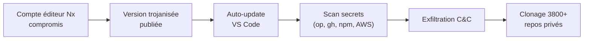
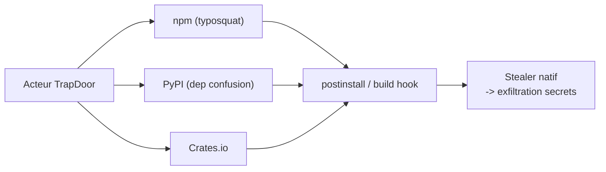
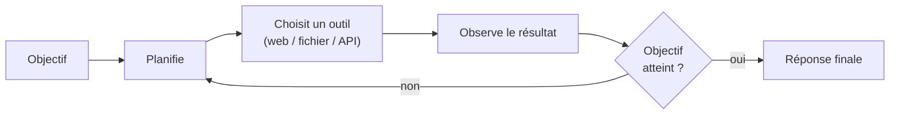
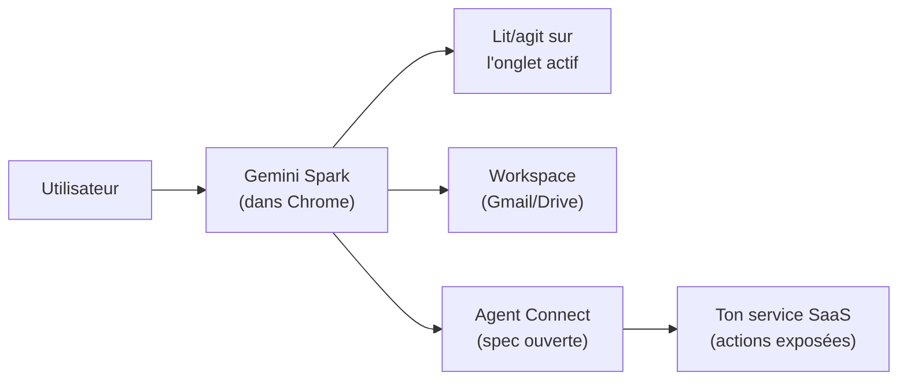

# Tech Overview — Détail du mercredi 27 mai 2026

## 1. GitHub compromis via une fausse extension Nx Console

**Source :** The Hacker News — https://thehackernews.com/2026/05/github-internal-repositories-breached.html
**Date :** 18 mai 2026

### Contexte

Nx est un système de build monorepo très utilisé dans l'écosystème JS/TS (Angular, React, Node.js). Son extension VS Code « Nx Console » totalise plusieurs millions d'installations. Le **18 mai 2026**, un attaquant a publié une version trojanisée de l'extension sur le VS Code Marketplace en compromettant le compte développeur Nx.

L'extension n'est restée live que **18 minutes** avant détection et retrait. Mais la mise à jour automatique, activée par défaut, a suffi à la propager sur des millions de machines. Au total, **3 800+ repos GitHub internes** ont été exfiltrés via les tokens volés sur les postes d'employés Microsoft / GitHub.

### Comment ça marche

La chaîne d'attaque est une escalade en trois temps. D'abord, le compte éditeur Nx est compromis (vol de credential publishing). Ensuite, un payload trojanisé est embarqué dans une nouvelle version de l'extension, poussée au Marketplace. Enfin, l'auto-update tire la version piégée sur chaque poste sans action utilisateur.

Une fois active, l'extension hérite des **privilèges du user** : accès complet au filesystem, aux variables d'environnement, aux sockets. Le script malveillant scanne alors un panier de secrets bien précis, puis exfiltre vers un C&C. Les tokens GitHub volés servent ensuite à cloner les repos privés accessibles.



Le panier ciblé : coffres **1Password** déverrouillés (CLI `op`), config **Claude Code**, tokens **npm** (`~/.npmrc`), tokens **GitHub** (`~/.config/gh/hosts.yml`), credentials **AWS** (`~/.aws/credentials`, `AWS_*`).

### En pratique — exemple de code

Détection puis réponse défensive — vérifie si l'extension a été mise à jour pendant la fenêtre d'attaque, puis durcis VS Code.

```bash
# 1. Quelle version de Nx Console est installée ? Date de mise à jour ?
code --list-extensions --show-versions | grep -i nrwl
ls -la --time-style=full-iso ~/.vscode/extensions/ | grep -i nx-console

# 2. La fenêtre dangereuse : 16h00-16h18 UTC le 18 mai 2026.
#    Si l'install/maj tombe dedans, considère TOUS tes credentials compromis :
#    rotation GitHub PAT, npm token, AWS keys, clés API LLM + reset 1Password.

# 3. Durcissement : couper l'auto-update des extensions
#    settings.json -> "extensions.autoUpdate": false
echo '{ "extensions.autoUpdate": false }'   # à fusionner dans settings.json
```

```json
// settings.json — désactive l'auto-update des extensions VS Code
{
  "extensions.autoUpdate": false,
  "extensions.autoCheckUpdates": false
}
```

### Pourquoi ça compte pour toi

Si tu as mis à jour Nx Console le 18 mai entre 16h00 et 16h18 UTC, considère tous tes credentials machine compromis : rote tout immédiatement et audite ton security log GitHub. Plus largement, tes extensions IDE tournent avec tes privilèges et lisent tout ton environnement. Coupe l'auto-update sur tes postes, exige un déverrouillage biométrique par accès au password manager, et isole tes credentials dans des Dev Containers.

### Points de vigilance

L'auto-update amplifie toute compromission : 18 minutes suffisent à infecter des millions de machines. Surveille les release notes des extensions critiques avant de mettre à jour, et préfère un déverrouillage court (Touch ID / Face ID par accès) à un coffre déverrouillé toute la session.

---

## 2. TrapDoor — Campagne supply-chain cross-écosystème

**Source :** The Hacker News — https://thehackernews.com/
**Date :** 22 mai 2026

### Contexte

Les attaques supply-chain sur les registres de packages (npm, PyPI, Crates.io, RubyGems) sont devenues banales depuis 2021 — `node-ipc`, typosquatting de `colors.js`, etc. La nouveauté avec **TrapDoor**, c'est la **coordination cross-écosystème** : un même acteur orchestre simultanément des publications malveillantes sur npm, PyPI et Crates.io.

Cette maturité opérationnelle suggère un groupe organisé, probablement un APT ou un acteur étatique. Au 22 mai : **34 packages malveillants** identifiés, totalisant **384 versions** publiées sur les trois registres entre fin avril et mi-mai.

### Comment ça marche

Deux vecteurs d'amorçage se combinent. Le **typosquatting** publie des noms qui ressemblent à des packages populaires (faute de frappe, tiret déplacé). La **dependency confusion** publie des noms de packages internes connus d'entreprises ciblées, en pariant qu'un résolveur mal configuré ira chercher la version publique plutôt que privée.

Une fois résolu et installé, le package exécute sa charge utile via les hooks d'installation (`postinstall` npm, `setup.py` PyPI, build script Cargo). Le stealer est écrit dans le langage natif de chaque écosystème, ce qui le rend discret. Il moissonne variables d'environnement, fichiers de config et tokens, puis exfiltre.



### En pratique — exemple de code

Ferme la porte côté CI : vérifie les signatures de provenance et bloque l'exécution des scripts d'install.

```bash
# Vérifie la provenance Sigstore des packages installés (npm provenance)
npm audit signatures

# Installe sans exécuter les hooks postinstall (neutralise le vecteur d'exec)
npm ci --ignore-scripts

# Bloque la dependency confusion : épingle le registre de ton scope privé
#   .npmrc :  @moncorp:registry=https://registry.interne.example/
npm config get @moncorp:registry
```

```yaml
# .github/workflows : minimise la portée et fige les versions
jobs:
  build:
    permissions:
      contents: read          # pas d'écriture par défaut
    steps:
      - run: npm ci --ignore-scripts   # lockfile committé + pas de hooks
```

### Pourquoi ça compte pour toi

Si tu fais `npm install` / `pip install` / `cargo add` sans audit sur des packages récents ou obscurs, le risque est réel. Active `npm audit signatures` en CI, committe tes lockfiles, et passe tes installs en `--ignore-scripts`. Mets un proxy de registry (Artifactory, Verdaccio) devant tes runners pour filtrer le nouveau. Et si tu publies de l'open source, signe tes releases — c'est gratuit et ça protège tes utilisateurs.

### Tendance de fond

Les efforts de signature (npm provenance via Sigstore, PEP 740 sur PyPI) progressent mais l'adoption reste lente. La dependency confusion exploite encore trop souvent une mauvaise config de résolution de scope privé. Vérifie explicitement ton `@scope:registry` sur chaque projet.

---

## 3. OpenAI GPT-5.4 — 1M tokens et agent autonome

**Source :** OpenAI / crescendo.ai — https://www.crescendo.ai/news/latest-ai-news-and-updates
**Date :** Mai 2026

### Contexte

OpenAI a sorti GPT-5 en août 2025, puis une cadence soutenue : GPT-5.1 (octobre), 5.2 (décembre), 5.3 (mars 2026). GPT-5.4 (mai 2026) est une montée incrémentale, mais avec deux changements substantiels.

D'abord, l'extension du contexte à **1M tokens** (contre 200k pour GPT-5.3). Ensuite, un saut sur les capacités agentiques : **75 % sur OSWorld-V** — un benchmark où l'agent accomplit des tâches dans un OS (ouvrir des apps, manipuler des fichiers, naviguer le web) — dépassant pour la première fois la baseline humaine de 72,4 %.

### Comment ça marche

Le mode « autonomous workflow » via l'Assistants API repose sur une boucle agentique classique. Tu fixes un objectif. Le modèle planifie, choisit un outil (navigation, fichier, appel API), observe le résultat, et itère jusqu'à complétion. Le contexte 1M permet de garder l'historique de la trajectoire sans tronquer.

Le piège connu reste le **lost-in-the-middle** : sur un contexte très long, le recall au milieu se dégrade. D'où la recommandation de coupler avec du **RAG** plutôt que tout pousser dans le prompt — tu récupères les passages pertinents au lieu de noyer le modèle.



### En pratique — exemple de code

Garde-fou minimal côté backend : un agent autonome ne doit jamais déclencher une action critique sans validation explicite.

```ts
// Guardrail : intercepte les actions sensibles avant exécution par l'agent
const CRITICAL = new Set(["send_email", "charge_card", "delete_file"]);

async function runToolCall(name: string, args: unknown) {
  if (CRITICAL.has(name)) {
    // Action irréversible -> exige une confirmation humaine (human-in-the-loop)
    const approved = await requestHumanApproval(name, args);
    if (!approved) throw new Error(`Action ${name} refusée par l'opérateur`);
  }
  return executeTool(name, args); // exécution réelle seulement après contrôle
}
```

### Pourquoi ça compte pour toi

Si tu construis des agents en prod, benchmarke GPT-5.4 contre Claude Opus 4.6 et Gemini Spark sur ton cas réel : les écarts sont serrés. Pour un assistant conversationnel, le choix se joue surtout sur pricing et latence. Et plus ton agent est autonome, plus la surface de prompt injection grandit : pose des guardrails sur les actions irréversibles (emails, transactions, écritures fichiers).

### Limites et nuances

Le coût explose si tu exploites réellement 1M tokens : plusieurs dollars par requête possible. Le long contexte excelle en retrieval ciblé mais perd en cohérence quand l'agent doit raisonner sur l'intégralité. Combine avec RAG plutôt que du prompt-stuffing.

---

## 4. Google I/O 2026 — Gemini Spark et l'« Agentic Web »

**Source :** Google I/O / TechCrunch
**Date :** Mai 2026

### Contexte

Google I/O 2026 a été dominé par la vision de Sundar Pichai sur l'« **Agentic Web** » : un web où l'utilisateur ne navigue plus les sites directement mais via un agent qui agit pour lui. Vision concurrente d'OpenAI (Operator) et d'Anthropic (Computer Use), mais avec un levier décisif : Google contrôle Chrome (~65 % du desktop).

La brique centrale est **Gemini Spark**, agent intégré nativement à Chrome et Workspace, doublé d'**Agent Connect**, une spec ouverte que les sites implémentent pour exposer des actions à l'agent — concurrent direct du MCP d'Anthropic.

### Comment ça marche

Gemini Spark tourne en arrière-plan dans le navigateur. Il lit le DOM de l'onglet actif, comprend la page, et peut agir dessus : résumer, traduire, remplir un formulaire. Côté Workspace (Gmail, Drive, Calendar), il accède aux données sans demander une permission à chaque action.

Pour les services tiers, **Agent Connect** inverse le modèle : au lieu de scraper la page, le site déclare ses actions disponibles via une spec. L'agent invoque ces actions de façon structurée. Le problème de sécurité émerge ici : comment distinguer un humain d'un agent agissant en son nom, quand le CAPTCHA classique devient inopérant ?



### En pratique — exemple de code

Côté backend, pour l'Agentic Web tu structures tes données pour être actionnable, et tu durcis l'auth des actions sensibles.

```json
// Schema.org : rends ta page lisible/actionnable par un agent (AEO)
{
  "@context": "https://schema.org",
  "@type": "Product",
  "name": "Plan Pro",
  "offers": { "@type": "Offer", "price": "29.00", "priceCurrency": "EUR" },
  "potentialAction": {
    "@type": "BuyAction",
    "target": "https://api.example.com/checkout"  // endpoint clair pour l'agent
  }
}
```

```bash
# Action sensible déclenchée par un agent -> exige une re-auth forte côté serveur
#   pas de CAPTCHA (inopérant) ; step-up auth (WebAuthn / passkey) sur l'endpoint
curl -X POST https://api.example.com/checkout \
  -H "Authorization: Bearer $USER_TOKEN" \
  -H "X-Step-Up-Assertion: $WEBAUTHN_ASSERTION"   # preuve de présence utilisateur
```

### Pourquoi ça compte pour toi

Si tu construis du web ou du SaaS, l'Agentic Web va redéfinir la couche d'interaction sur 18 mois. Tes funnels marketing perdent de la valeur ; tes API et données structurées (Schema.org) en gagnent. Nouveau territoire : l'AEO (Agent Engine Optimization). Et surtout, protège tes actions sensibles par du step-up auth (WebAuthn) plutôt que par un CAPTCHA, désormais contourné par l'agent.

### Vigilance

Risque de verrouillage : Google contrôle Chrome, Workspace et l'agent. Tes sites pourraient devenir de simples sources de données pour Gemini, sans engagement utilisateur direct. Côté confidentialité, un agent qui voit tout ce que tu fais dans le navigateur est une surface de monitoring inédite, et les garanties annoncées restent vagues.
