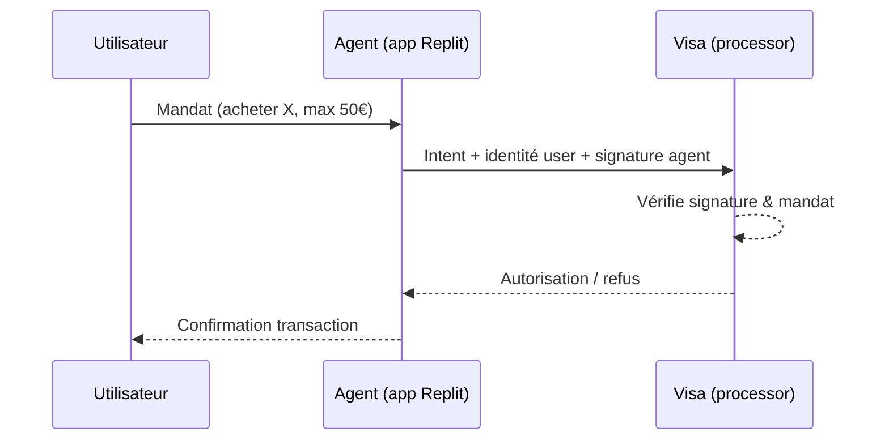
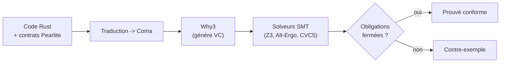
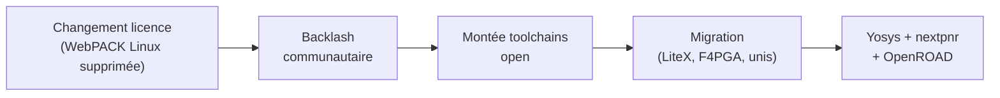
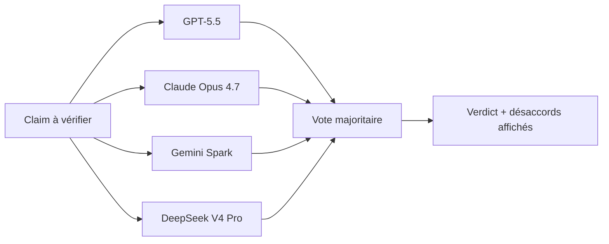

# Tech Overview — Détail du jeudi 28 mai 2026

## 1. Visa investit dans Replit — paiements agentiques natifs pour devs

**Source :** TechCrunch / PR Newswire — https://techcrunch.com/2026/05/28/visa-invests-in-replit-to-power-agentic-payments-for-developers/
**Date :** 28 mai 2026

### Contexte

Visa pousse depuis fin 2025 sa stratégie « **Agentic Ready** » : permettre à des agents IA d'initier et valider des transactions au nom de leur utilisateur. Deux briques techniques portent cette vision — **Visa Intelligent Commerce** (suite d'APIs paiement orientées AI) et le **Trusted Agent Protocol** (spec ouverte d'identification d'agents).

Annoncée aujourd'hui, l'intégration officielle dans **Replit** (IDE cloud + plateforme de déploiement) place ces capacités au cœur du workflow de millions de développeurs. En parallèle, Replit ouvre des contrats jusqu'à **200 000 $ sans contact commercial** et lance un Solution Partner Program (Accenture, Slalom, Hexaware).

### Comment ça marche

Le Trusted Agent Protocol est l'équivalent d'« OAuth pour agents » côté paiement. Quand un agent veut transacter, il ne se contente pas d'envoyer un numéro de carte. Il présente au processor un **triplet signé** : son identité d'agent, l'identité de l'utilisateur mandant, et l'intent (montant, marchand, contrainte).

Le processor (Visa) vérifie la signature, valide que l'agent est bien mandaté par cet utilisateur, et autorise — ou refuse — selon les règles. Visa Intelligent Commerce expose ces appels en API, ce qui évite l'onboarding marchand classique : un dev Replit branche le paiement directement dans son app ou son agent.



### En pratique — exemple de code

Schéma conceptuel d'un appel agentique : l'intent porte une **contrainte de dépense** vérifiable côté serveur, pas un blanc-seing.

```ts
// Requête d'autorisation via un Trusted Agent Protocol (modèle conceptuel)
interface AgentPaymentIntent {
  agentId: string;        // identité de l'agent mandaté
  userRef: string;        // identité de l'utilisateur mandant
  amount: number;         // montant exact (pas de marge ouverte)
  currency: "EUR";
  merchant: string;
  signature: string;      // signature de l'agent sur l'ensemble de l'intent
}

async function authorize(intent: AgentPaymentIntent) {
  // Le processor revalide la contrainte côté serveur (jamais confiance au client)
  if (intent.amount > await getUserCeiling(intent.userRef))
    throw new Error("Dépassement du plafond mandaté par l'utilisateur");
  return visaIntelligentCommerce.authorize(intent);
}
```

### Pourquoi ça compte pour toi

Si tu construis un produit avec une couche agent qui doit transacter (marketplace, assistant shopping, réservation), le Trusted Agent Protocol va probablement devenir un standard de fait — Visa pèse 60 %+ du marché carte mondial. Teste-le en POC tôt. Et note le signal de fond : le « vibe coding » devient enterprise-grade, les plateformes type Replit captent un budget IT significatif.

### Points de vigilance

Aucune fee structure publiée sur les transactions via Trusted Agent Protocol — un surcoût à volume tuerait l'usage. Concurrence sérieuse sur le protocole (Stripe, Mastercard, Agent Identity du W3C) : risque de fragmentation comme sur l'identité décentralisée (DID). Ne te lock-in pas trop tôt sur une seule spec.

---

## 2. Creusot — Prouver formellement que ton code Rust est correct

**Source :** GitHub — https://github.com/creusot-rs/creusot
**Date :** En tête de Hacker News le 28 mai 2026

### Contexte

**Creusot** est un **vérificateur déductif pour Rust** : il prouve qu'un programme respecte sa spécification formelle (pas de panic, pas d'overflow, comportements définis). Hébergé par Inria, le projet atteint la version **0.10.0** en février 2026 et fait l'actu après son passage en tête de Hacker News (28 mai).

Présenté à **POPL 2026** en janvier sous forme de tutoriel pratique, Creusot s'inscrit dans la même trajectoire que Verus (Microsoft) et Aeneas (Inria) : rendre la vérification formelle accessible à des dev « normaux ».

### Comment ça marche

Le flux de preuve est une traduction en cascade. Tu annotes ton code Rust avec des **contrats** : `#[requires(...)]` (précondition), `#[ensures(...)]` (postcondition), invariants de boucle. Ces prédicats s'écrivent en **Pearlite**, un DSL inspiré de la syntaxe Rust.

Creusot traduit ensuite ton code annoté vers **Coma**, un langage intermédiaire de la plateforme **Why3**. Why3 génère alors les **obligations de preuve** (verification conditions) et les décharge sur des solveurs **SMT** : Z3, Alt-Ergo, CVC4/5. Si tous les solveurs ferment les obligations, ta fonction est prouvée conforme à son contrat.



### En pratique — exemple de code

Exemple de contrat : on prouve qu'une fonction renvoie bien le max, sans tests ni fuzzing.

```rust
// Contrat Creusot : la postcondition est PROUVÉE, pas testée
use creusot_contracts::*;

#[ensures(result >= a && result >= b)]     // result domine les deux entrées
#[ensures(result == a || result == b)]     // et vaut l'une d'elles
fn max(a: i32, b: i32) -> i32 {
    if a >= b { a } else { b }
}
// `cargo creusot` décharge les obligations via Why3 + SMT.
// Aucune exécution : la garantie tient pour toutes les valeurs possibles.
```

### Pourquoi ça compte pour toi

Tu ne fais pas de Rust au quotidien, mais c'est un cas concret d'outillage de vérification formelle devenu utilisable sans bac+8 en méthodes formelles. Pour du code critique (parsers binaires, crypto, drivers), il offre une garantie qui dépasse tests + fuzzing. Tendance de fond : memory safety et preuves légères convergent. À suivre si tu maintiens une lib Rust en production utilisée par d'autres.

### Limites

Courbe d'apprentissage réelle : annoter en Pearlite demande une formation (tutos POPL 2026 en accès libre). Couverture Rust partielle : `async` est en travaux, les macros complexes posent problème. Le projet recommande de cibler des modules « cœur » bien isolés, pas tout le codebase.

---

## 3. AMD revient sur la licence Vivado sur Linux — colère développeurs

**Source :** It's FOSS — https://itsfoss.com/news/amd-vivado-bait-and-switch-on-linux-users/
**Date :** 28 mai 2026

### Contexte

**Vivado** est l'outillage de design FPGA d'AMD (hérité de Xilinx). Historiquement gratuit en « WebPACK Edition » sur Linux et Windows, c'est l'outil de référence pour les hobbyistes, l'enseignement et les petites entreprises. AMD a annoncé cette semaine un **changement de licence** qui supprime la version gratuite Linux, ne laissant que des éditions payantes ou la Windows Edition gratuite.

La justification AMD : « simplification du portfolio » et concentration enterprise. Le backlash est massif (Hacker News, Reddit FPGA, EEVblog) et plusieurs universités abandonnent l'enseignement basé sur Vivado.

### Comment ça marche

L'épisode illustre un pattern récurrent en 2025-2026 : le pivot vendor-controlled. Un éditeur restreint l'édition gratuite/open au bénéfice du commercial. La conséquence est mécanique et reproductible — on l'a vu sur Redis, Elastic, HashiCorp (avant OpenTofu), MongoDB.

Le cycle se déroule en quatre temps. (1) L'éditeur change la licence. (2) La communauté perd confiance et se mobilise. (3) Des forks ou alternatives sous gouvernance neutre émergent ou montent en puissance. (4) Une migration progressive s'amorce vers la toolchain open. Ici, la cible est la chaîne **Yosys → nextpnr → OpenROAD**, 100 % open.



### En pratique — exemple de code

Le flow de synthèse FPGA 100 % open, pour les générations supportées (Lattice, certains Xilinx Series-7).

```bash
# Synthèse + place-and-route 100% open (exemple Lattice ECP5)
yosys -p "synth_ecp5 -json design.json" design.v          # synthèse logique
nextpnr-ecp5 --json design.json \
  --lpf board.lpf --textcfg design.config                 # placement/routage
ecppack design.config design.bit                          # bitstream final
# Aucune licence vendor requise ; pipeline reproductible en CI.
```

### Pourquoi ça compte pour toi

Si tu ne touches pas au FPGA, c'est tangentiel. Mais le pattern te concerne directement pour tes choix de stack : un outil vendor-controlled peut basculer en payant du jour au lendemain. Privilégie les outils sous gouvernance fondation (CNCF, Apache, Eclipse) plutôt que mono-éditeur. À chaque pivot licence, la facture est la même : fragmentation, forks, perte de confiance long terme.

### À retenir

La roadmap open (OpenROAD, Yosys, nextpnr) couvre déjà la plupart des FPGA Lattice et certains Xilinx Series-7 anciens. Pas encore au niveau d'AMD UltraScale+ ou Versal côté support hardware, mais la trajectoire est claire et s'accélère à chaque épisode de ce type.

---

## 4. Disagreement among frontier LLMs on real-world fact-checks

**Source :** Lenz Research — https://lenz.io/research/llm-disagreement
**Date :** 28 mai 2026

### Contexte

Étude publiée ce matin sur Hacker News mesurant la **divergence entre frontier LLMs** (GPT-5.5, Claude Opus 4.7, Gemini Spark, DeepSeek V4 Pro) sur du fact-checking d'affirmations réelles. Méthodologie : **1 200 claims** tirées de Snopes, PolitiFact et FactCheck.org, posées aux 4 modèles avec des prompts identiques.

Mesure du taux d'accord sur le verdict (vrai / faux / nuancé). Résultat clé : sur les claims « sensibles » (politique, climat, vaccins), les modèles divergent sur **~37 %** des verdicts ; sur les claims factuelles pures, le désaccord tombe à **~9 %**.

### Comment ça marche

Le levier actionnable de l'étude est le **best-of-N + vote majoritaire**. Au lieu d'interroger un seul modèle, tu poses la même claim à 3-5 modèles en parallèle, puis tu agrèges par majorité. Sur les claims sensibles, ce schéma gagne **8 points d'accuracy** contre le ground-truth humain, pour un coût compute multiplié.

Chaque modèle a un biais propre : Claude Opus 4.7 plus prudent (« partiellement vrai »), GPT-5.5 plus tranché, Gemini Spark sourcé mais conclusions parfois divergentes, DeepSeek V4 Pro le plus polarisé en géopolitique. Aucun modèle n'a d'avantage statistiquement significatif seul — d'où l'intérêt de l'agrégation.



### En pratique — exemple de code

Orchestration best-of-N : on agrège ET on remonte le désaccord à l'utilisateur plutôt qu'un verdict autoritaire.

```ts
// Best-of-N fact-checking : majorité + transparence des divergences
async function factCheck(claim: string) {
  const verdicts = await Promise.all(
    MODELS.map(m => m.judge(claim))          // 4 modèles en parallèle
  );
  const tally = countBy(verdicts, v => v.label); // true / false / mixed
  const majority = maxBy(Object.entries(tally), ([, n]) => n)![0];

  return {
    verdict: majority,
    agreement: tally[majority] / verdicts.length,
    dissent: verdicts.filter(v => v.label !== majority), // à afficher à l'humain
  };
}
```

### Pourquoi ça compte pour toi

Si tu construis un produit où un LLM évalue ou vérifie de l'info (modération, due diligence, assistant journalistique), deux enseignements actionnables. Le best-of-N + vote majoritaire bat le single-model de 8 points sur les claims sensibles : lance 3-5 modèles et agrège. Et affiche les désaccords plutôt qu'un verdict autoritaire — c'est plus honnête, moins risqué, meilleur pour l'engagement.

### Limites de l'étude

Échantillon biaisé : claims de fact-checkers anglophones occidentaux, dont le ground-truth peut lui-même être biaisé. Une réplication multilingue est annoncée pour l'automne. L'étude ne quantifie pas le surcoût latence/$ du best-of-N : pour une app temps réel, le tradeoff peut basculer.
